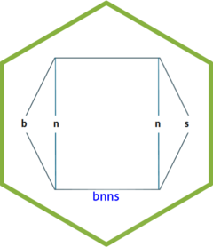
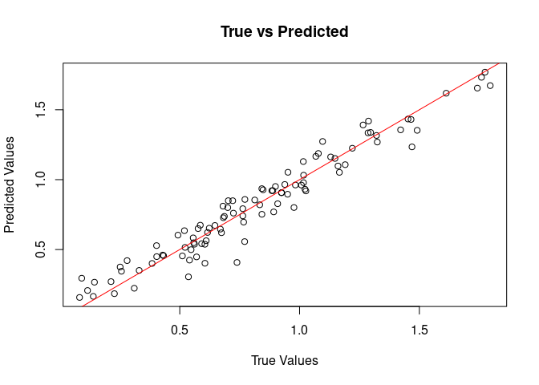

<!-- README.md is generated from README.Rmd. Please edit that file -->

# bnns: Bayesian Neural Networks for Regression and Classification

<a href="https://swarnendu-stat.github.io/bnns/"></a>

<!-- badges: start -->

[](https://lifecycle.r-lib.org/articles/stages.html#experimental)
[](https://app.codecov.io/gh/swarnendu-stat/bnns)
[](https://github.com/swarnendu-stat/bnns/actions/workflows/R-CMD-check.yaml)
<!-- badges: end -->

The `bnns` package provides tools to fit Bayesian Neural Networks (BNNs)
for regression and classification problems. It is designed to be
flexible, supporting various network architectures, activation
functions, and output types, making it suitable for both simple and
complex data analysis tasks.

## Features

- Support for multi-layer neural networks with customizable
  architecture.
- Choice of activation functions (e.g., sigmoid, ReLU, tanh).
- Outputs for regression (continuous response) and classification
  (binary and multiclass).
- Bayesian inference, providing posterior distributions for predictions
  and parameters.
- Applications in domains such as clinical trials, predictive modeling,
  and more.

## Installation

To install the `bnns` package from GitHub, use the following:

``` r
# Install devtools if not already installed
if (!requireNamespace("devtools", quietly = TRUE)) {
  install.packages("devtools")
}

# Install bnns
devtools::install_github("swarnendu-stat/bnns")
#> Using GitHub PAT from the git credential store.
#> Downloading GitHub repo swarnendu-stat/bnns@HEAD
#> 
#> ── R CMD build ─────────────────────────────────────────────────────────────────
#> * checking for file ‘/tmp/RtmpBqeKhD/remotes366521debc36/swarnendu-stat-bnns-c1b906d/DESCRIPTION’ ... OK
#> * preparing ‘bnns’:
#> * checking DESCRIPTION meta-information ... OK
#> * checking for LF line-endings in source and make files and shell scripts
#> * checking for empty or unneeded directories
#> * building ‘bnns_0.0.0.9000.tar.gz’
#> Installing package into '/tmp/Rtmpezcmqo/temp_libpathb437cdfdbe9'
#> (as 'lib' is unspecified)
```

## Getting Started

### 1. Simulate Data

Below is an example of how to simulate data for regression:

``` r
set.seed(123)
df <- data.frame(x1 = runif(10), x2 = runif(10), y = rnorm(10))
```

### 2. Fit a BNN Model

To fit a Bayesian Neural Network:

``` r
library(bnns)

model <- bnns(y ~ -1 + x1 + x2,
  data = df, L = 2, nodes = c(10, 8), act_fn = c(2, 3), out_act_fn = 1,
  iter = 1e2, warmup = 5e1, chains = 1, seed = 123
)
#> 
#> TRANSLATING MODEL '' FROM Stan CODE TO C++ CODE NOW.
#> OS: x86_64, linux-gnu; rstan: 2.32.6; Rcpp: 1.0.13.1; inline: 0.3.20 
#>  >> setting environment variables: 
#> PKG_LIBS =  '/home/antpc/R/x86_64-pc-linux-gnu-library/4.4/rstan/lib//libStanServices.a' -L'/home/antpc/R/x86_64-pc-linux-gnu-library/4.4/StanHeaders/lib/' -lStanHeaders -L'/home/antpc/R/x86_64-pc-linux-gnu-library/4.4/RcppParallel/lib/' -ltbb 
#> PKG_CPPFLAGS =   -I"/home/antpc/R/x86_64-pc-linux-gnu-library/4.4/Rcpp/include/"  -I"/home/antpc/R/x86_64-pc-linux-gnu-library/4.4/RcppEigen/include/"  -I"/home/antpc/R/x86_64-pc-linux-gnu-library/4.4/RcppEigen/include/unsupported"  -I"/home/antpc/R/x86_64-pc-linux-gnu-library/4.4/BH/include" -I"/home/antpc/R/x86_64-pc-linux-gnu-library/4.4/StanHeaders/include/src/"  -I"/home/antpc/R/x86_64-pc-linux-gnu-library/4.4/StanHeaders/include/"  -I"/home/antpc/R/x86_64-pc-linux-gnu-library/4.4/RcppParallel/include/"  -I"/home/antpc/R/x86_64-pc-linux-gnu-library/4.4/rstan/include" -DEIGEN_NO_DEBUG  -DBOOST_DISABLE_ASSERTS  -DBOOST_PENDING_INTEGER_LOG2_HPP  -DSTAN_THREADS  -DUSE_STANC3 -DSTRICT_R_HEADERS  -DBOOST_PHOENIX_NO_VARIADIC_EXPRESSION  -D_HAS_AUTO_PTR_ETC=0  -include '/home/antpc/R/x86_64-pc-linux-gnu-library/4.4/StanHeaders/include/stan/math/prim/fun/Eigen.hpp'  -D_REENTRANT -DRCPP_PARALLEL_USE_TBB=1 
#>  >> Program source :
#> 
#>    1 : 
#>    2 : // includes from the plugin
#>    3 : // [[Rcpp::plugins(cpp14)]]
#>    4 : 
#>    5 : 
#>    6 : // user includes
#>    7 : #include <Rcpp.h>
#>    8 : using namespace Rcpp;
#>    9 : #ifndef MODELS_HPP
#>   10 : #define MODELS_HPP
#>   11 : #define STAN__SERVICES__COMMAND_HPP
#>   12 : #include <rstan/rstaninc.hpp>
#>   13 : #ifndef USE_STANC3
#>   14 : #define USE_STANC3
#>   15 : #endif
#>   16 : // Code generated by stanc v2.32.2
#>   17 : #include <stan/model/model_header.hpp>
#>   18 : namespace model366565dff4f1__namespace {
#>   19 : using stan::model::model_base_crtp;
#>   20 : using namespace stan::math;
#>   21 : stan::math::profile_map profiles__;
#>   22 : static constexpr std::array<const char*, 66> locations_array__ =
#>   23 :   {" (found before start of program)",
#>   24 :   " (in 'anon_model', line 11, column 2 to column 25)",
#>   25 :   " (in 'anon_model', line 12, column 2 to column 22)",
#>   26 :   " (in 'anon_model', line 13, column 2 to column 32)",
#>   27 :   " (in 'anon_model', line 14, column 2 to column 22)",
#>   28 :   " (in 'anon_model', line 15, column 2 to column 25)",
#>   29 :   " (in 'anon_model', line 16, column 2 to column 13)",
#>   30 :   " (in 'anon_model', line 17, column 2 to column 22)",
#>   31 :   " (in 'anon_model', line 20, column 2 to column 25)",
#>   32 :   " (in 'anon_model', line 21, column 2 to column 25)",
#>   33 :   " (in 'anon_model', line 22, column 2 to column 25)",
#>   34 :   " (in 'anon_model', line 23, column 2 to column 25)",
#>   35 :   " (in 'anon_model', line 24, column 2 to column 18)",
#>   36 :   " (in 'anon_model', line 25, column 2 to column 35)",
#>   37 :   " (in 'anon_model', line 29, column 7 to column 49)",
#>   38 :   " (in 'anon_model', line 28, column 27 to column 49)",
#>   39 :   " (in 'anon_model', line 28, column 7 to line 29, column 49)",
#>   40 :   " (in 'anon_model', line 27, column 27 to column 46)",
#>   41 :   " (in 'anon_model', line 27, column 7 to line 29, column 49)",
#>   42 :   " (in 'anon_model', line 26, column 22 to column 36)",
#>   43 :   " (in 'anon_model', line 26, column 2 to line 29, column 49)",
#>   44 :   " (in 'anon_model', line 30, column 2 to column 36)",
#>   45 :   " (in 'anon_model', line 34, column 7 to column 49)",
#>   46 :   " (in 'anon_model', line 33, column 27 to column 49)",
#>   47 :   " (in 'anon_model', line 33, column 7 to line 34, column 49)",
#>   48 :   " (in 'anon_model', line 32, column 27 to column 46)",
#>   49 :   " (in 'anon_model', line 32, column 7 to line 34, column 49)",
#>   50 :   " (in 'anon_model', line 31, column 22 to column 36)",
#>   51 :   " (in 'anon_model', line 31, column 2 to line 34, column 49)",
#>   52 :   " (in 'anon_model', line 35, column 2 to column 29)",
#>   53 :   " (in 'anon_model', line 38, column 2 to column 45)",
#>   54 :   " (in 'anon_model', line 39, column 2 to column 34)",
#>   55 :   " (in 'anon_model', line 40, column 2 to column 45)",
#>   56 :   " (in 'anon_model', line 41, column 2 to column 34)",
#>   57 :   " (in 'anon_model', line 42, column 2 to column 37)",
#>   58 :   " (in 'anon_model', line 43, column 2 to column 37)",
#>   59 :   " (in 'anon_model', line 44, column 2 to column 37)",
#>   60 :   " (in 'anon_model', line 45, column 2 to column 27)",
#>   61 :   " (in 'anon_model', line 2, column 2 to column 17)",
#>   62 :   " (in 'anon_model', line 3, column 2 to column 17)",
#>   63 :   " (in 'anon_model', line 4, column 2 to column 17)",
#>   64 :   " (in 'anon_model', line 5, column 21 to column 22)",
#>   65 :   " (in 'anon_model', line 5, column 2 to column 24)",
#>   66 :   " (in 'anon_model', line 6, column 9 to column 10)",
#>   67 :   " (in 'anon_model', line 6, column 12 to column 13)",
#>   68 :   " (in 'anon_model', line 6, column 2 to column 17)",
#>   69 :   " (in 'anon_model', line 7, column 9 to column 10)",
#>   70 :   " (in 'anon_model', line 7, column 2 to column 14)",
#>   71 :   " (in 'anon_model', line 8, column 22 to column 23)",
#>   72 :   " (in 'anon_model', line 8, column 2 to column 25)",
#>   73 :   " (in 'anon_model', line 11, column 9 to column 10)",
#>   74 :   " (in 'anon_model', line 11, column 12 to column 20)",
#>   75 :   " (in 'anon_model', line 12, column 9 to column 17)",
#>   76 :   " (in 'anon_model', line 13, column 9 to column 17)",
#>   77 :   " (in 'anon_model', line 13, column 19 to column 27)",
#>   78 :   " (in 'anon_model', line 14, column 9 to column 17)",
#>   79 :   " (in 'anon_model', line 15, column 9 to column 17)",
#>   80 :   " (in 'anon_model', line 20, column 9 to column 10)",
#>   81 :   " (in 'anon_model', line 20, column 12 to column 20)",
#>   82 :   " (in 'anon_model', line 21, column 9 to column 10)",
#>   83 :   " (in 'anon_model', line 21, column 12 to column 20)",
#>   84 :   " (in 'anon_model', line 22, column 9 to column 10)",
#>   85 :   " (in 'anon_model', line 22, column 12 to column 20)",
#>   86 :   " (in 'anon_model', line 23, column 9 to column 10)",
#>   87 :   " (in 'anon_model', line 23, column 12 to column 20)",
#>   88 :   " (in 'anon_model', line 24, column 9 to column 10)"};
#>   89 : class model366565dff4f1_ final : public model_base_crtp<model366565dff4f1_> {
#>   90 : private:
#>   91 :   int n;
#>   92 :   int m;
#>   93 :   int L;
#>   94 :   std::vector<int> nodes;
#>   95 :   Eigen::Matrix<double,-1,-1> X_data__;
#>   96 :   Eigen::Matrix<double,-1,1> y_data__;
#>   97 :   std::vector<int> act_fn;
#>   98 :   int w1_2dim__;
#>   99 :   int b1_1dim__;
#>  100 :   int w2_1dim__;
#>  101 :   int w2_2dim__;
#>  102 :   int b2_1dim__;
#>  103 :   int w_out_1dim__;
#>  104 :   int z1_2dim__;
#>  105 :   int a1_2dim__;
#>  106 :   int z2_2dim__;
#>  107 :   int a2_2dim__;
#>  108 :   Eigen::Map<Eigen::Matrix<double,-1,-1>> X{nullptr, 0, 0};
#>  109 :   Eigen::Map<Eigen::Matrix<double,-1,1>> y{nullptr, 0};
#>  110 : public:
#>  111 :   ~model366565dff4f1_() {}
#>  112 :   model366565dff4f1_(stan::io::var_context& context__, unsigned int
#>  113 :                      random_seed__ = 0, std::ostream* pstream__ = nullptr)
#>  114 :       : model_base_crtp(0) {
#>  115 :     int current_statement__ = 0;
#>  116 :     using local_scalar_t__ = double;
#>  117 :     boost::ecuyer1988 base_rng__ =
#>  118 :       stan::services::util::create_rng(random_seed__, 0);
#>  119 :     // suppress unused var warning
#>  120 :     (void) base_rng__;
#>  121 :     static constexpr const char* function__ =
#>  122 :       "model366565dff4f1__namespace::model366565dff4f1_";
#>  123 :     // suppress unused var warning
#>  124 :     (void) function__;
#>  125 :     local_scalar_t__ DUMMY_VAR__(std::numeric_limits<double>::quiet_NaN());
#>  126 :     // suppress unused var warning
#>  127 :     (void) DUMMY_VAR__;
#>  128 :     try {
#>  129 :       int pos__ = std::numeric_limits<int>::min();
#>  130 :       pos__ = 1;
#>  131 :       current_statement__ = 38;
#>  132 :       context__.validate_dims("data initialization", "n", "int",
#>  133 :         std::vector<size_t>{});
#>  134 :       n = std::numeric_limits<int>::min();
#>  135 :       current_statement__ = 38;
#>  136 :       n = context__.vals_i("n")[(1 - 1)];
#>  137 :       current_statement__ = 38;
#>  138 :       stan::math::check_greater_or_equal(function__, "n", n, 1);
#>  139 :       current_statement__ = 39;
#>  140 :       context__.validate_dims("data initialization", "m", "int",
#>  141 :         std::vector<size_t>{});
#>  142 :       m = std::numeric_limits<int>::min();
#>  143 :       current_statement__ = 39;
#>  144 :       m = context__.vals_i("m")[(1 - 1)];
#>  145 :       current_statement__ = 39;
#>  146 :       stan::math::check_greater_or_equal(function__, "m", m, 1);
#>  147 :       current_statement__ = 40;
#>  148 :       context__.validate_dims("data initialization", "L", "int",
#>  149 :         std::vector<size_t>{});
#>  150 :       L = std::numeric_limits<int>::min();
#>  151 :       current_statement__ = 40;
#>  152 :       L = context__.vals_i("L")[(1 - 1)];
#>  153 :       current_statement__ = 40;
#>  154 :       stan::math::check_greater_or_equal(function__, "L", L, 1);
#>  155 :       current_statement__ = 41;
#>  156 :       stan::math::validate_non_negative_index("nodes", "L", L);
#>  157 :       current_statement__ = 42;
#>  158 :       context__.validate_dims("data initialization", "nodes", "int",
#>  159 :         std::vector<size_t>{static_cast<size_t>(L)});
#>  160 :       nodes = std::vector<int>(L, std::numeric_limits<int>::min());
#>  161 :       current_statement__ = 42;
#>  162 :       nodes = context__.vals_i("nodes");
#>  163 :       current_statement__ = 42;
#>  164 :       stan::math::check_greater_or_equal(function__, "nodes", nodes, 1);
#>  165 :       current_statement__ = 43;
#>  166 :       stan::math::validate_non_negative_index("X", "n", n);
#>  167 :       current_statement__ = 44;
#>  168 :       stan::math::validate_non_negative_index("X", "m", m);
#>  169 :       current_statement__ = 45;
#>  170 :       context__.validate_dims("data initialization", "X", "double",
#>  171 :         std::vector<size_t>{static_cast<size_t>(n), static_cast<size_t>(m)});
#>  172 :       X_data__ = Eigen::Matrix<double,-1,-1>::Constant(n, m,
#>  173 :                    std::numeric_limits<double>::quiet_NaN());
#>  174 :       new (&X) Eigen::Map<Eigen::Matrix<double,-1,-1>>(X_data__.data(), n, m);
#>  175 :       {
#>  176 :         std::vector<local_scalar_t__> X_flat__;
#>  177 :         current_statement__ = 45;
#>  178 :         X_flat__ = context__.vals_r("X");
#>  179 :         current_statement__ = 45;
#>  180 :         pos__ = 1;
#>  181 :         current_statement__ = 45;
#>  182 :         for (int sym1__ = 1; sym1__ <= m; ++sym1__) {
#>  183 :           current_statement__ = 45;
#>  184 :           for (int sym2__ = 1; sym2__ <= n; ++sym2__) {
#>  185 :             current_statement__ = 45;
#>  186 :             stan::model::assign(X, X_flat__[(pos__ - 1)],
#>  187 :               "assigning variable X", stan::model::index_uni(sym2__),
#>  188 :               stan::model::index_uni(sym1__));
#>  189 :             current_statement__ = 45;
#>  190 :             pos__ = (pos__ + 1);
#>  191 :           }
#>  192 :         }
#>  193 :       }
#>  194 :       current_statement__ = 46;
#>  195 :       stan::math::validate_non_negative_index("y", "n", n);
#>  196 :       current_statement__ = 47;
#>  197 :       context__.validate_dims("data initialization", "y", "double",
#>  198 :         std::vector<size_t>{static_cast<size_t>(n)});
#>  199 :       y_data__ = Eigen::Matrix<double,-1,1>::Constant(n,
#>  200 :                    std::numeric_limits<double>::quiet_NaN());
#>  201 :       new (&y) Eigen::Map<Eigen::Matrix<double,-1,1>>(y_data__.data(), n);
#>  202 :       {
#>  203 :         std::vector<local_scalar_t__> y_flat__;
#>  204 :         current_statement__ = 47;
#>  205 :         y_flat__ = context__.vals_r("y");
#>  206 :         current_statement__ = 47;
#>  207 :         pos__ = 1;
#>  208 :         current_statement__ = 47;
#>  209 :         for (int sym1__ = 1; sym1__ <= n; ++sym1__) {
#>  210 :           current_statement__ = 47;
#>  211 :           stan::model::assign(y, y_flat__[(pos__ - 1)],
#>  212 :             "assigning variable y", stan::model::index_uni(sym1__));
#>  213 :           current_statement__ = 47;
#>  214 :           pos__ = (pos__ + 1);
#>  215 :         }
#>  216 :       }
#>  217 :       current_statement__ = 48;
#>  218 :       stan::math::validate_non_negative_index("act_fn", "L", L);
#>  219 :       current_statement__ = 49;
#>  220 :       context__.validate_dims("data initialization", "act_fn", "int",
#>  221 :         std::vector<size_t>{static_cast<size_t>(L)});
#>  222 :       act_fn = std::vector<int>(L, std::numeric_limits<int>::min());
#>  223 :       current_statement__ = 49;
#>  224 :       act_fn = context__.vals_i("act_fn");
#>  225 :       current_statement__ = 49;
#>  226 :       stan::math::check_greater_or_equal(function__, "act_fn", act_fn, 1);
#>  227 :       current_statement__ = 50;
#>  228 :       stan::math::validate_non_negative_index("w1", "m", m);
#>  229 :       current_statement__ = 51;
#>  230 :       w1_2dim__ = std::numeric_limits<int>::min();
#>  231 :       current_statement__ = 51;
#>  232 :       w1_2dim__ = stan::model::rvalue(nodes, "nodes",
#>  233 :                     stan::model::index_uni(1));
#>  234 :       current_statement__ = 51;
#>  235 :       stan::math::validate_non_negative_index("w1", "nodes[1]", w1_2dim__);
#>  236 :       current_statement__ = 52;
#>  237 :       b1_1dim__ = std::numeric_limits<int>::min();
#>  238 :       current_statement__ = 52;
#>  239 :       b1_1dim__ = stan::model::rvalue(nodes, "nodes",
#>  240 :                     stan::model::index_uni(1));
#>  241 :       current_statement__ = 52;
#>  242 :       stan::math::validate_non_negative_index("b1", "nodes[1]", b1_1dim__);
#>  243 :       current_statement__ = 53;
#>  244 :       w2_1dim__ = std::numeric_limits<int>::min();
#>  245 :       current_statement__ = 53;
#>  246 :       w2_1dim__ = stan::model::rvalue(nodes, "nodes",
#>  247 :                     stan::model::index_uni(1));
#>  248 :       current_statement__ = 53;
#>  249 :       stan::math::validate_non_negative_index("w2", "nodes[1]", w2_1dim__);
#>  250 :       current_statement__ = 54;
#>  251 :       w2_2dim__ = std::numeric_limits<int>::min();
#>  252 :       current_statement__ = 54;
#>  253 :       w2_2dim__ = stan::model::rvalue(nodes, "nodes",
#>  254 :                     stan::model::index_uni(2));
#>  255 :       current_statement__ = 54;
#>  256 :       stan::math::validate_non_negative_index("w2", "nodes[2]", w2_2dim__);
#>  257 :       current_statement__ = 55;
#>  258 :       b2_1dim__ = std::numeric_limits<int>::min();
#>  259 :       current_statement__ = 55;
#>  260 :       b2_1dim__ = stan::model::rvalue(nodes, "nodes",
#>  261 :                     stan::model::index_uni(2));
#>  262 :       current_statement__ = 55;
#>  263 :       stan::math::validate_non_negative_index("b2", "nodes[2]", b2_1dim__);
#>  264 :       current_statement__ = 56;
#>  265 :       w_out_1dim__ = std::numeric_limits<int>::min();
#>  266 :       current_statement__ = 56;
#>  267 :       w_out_1dim__ = stan::model::rvalue(nodes, "nodes",
#>  268 :                        stan::model::index_uni(L));
#>  269 :       current_statement__ = 56;
#>  270 :       stan::math::validate_non_negative_index("w_out", "nodes[L]",
#>  271 :         w_out_1dim__);
#>  272 :       current_statement__ = 57;
#>  273 :       stan::math::validate_non_negative_index("z1", "n", n);
#>  274 :       current_statement__ = 58;
#>  275 :       z1_2dim__ = std::numeric_limits<int>::min();
#>  276 :       current_statement__ = 58;
#>  277 :       z1_2dim__ = stan::model::rvalue(nodes, "nodes",
#>  278 :                     stan::model::index_uni(1));
#>  279 :       current_statement__ = 58;
#>  280 :       stan::math::validate_non_negative_index("z1", "nodes[1]", z1_2dim__);
#>  281 :       current_statement__ = 59;
#>  282 :       stan::math::validate_non_negative_index("a1", "n", n);
#>  283 :       current_statement__ = 60;
#>  284 :       a1_2dim__ = std::numeric_limits<int>::min();
#>  285 :       current_statement__ = 60;
#>  286 :       a1_2dim__ = stan::model::rvalue(nodes, "nodes",
#>  287 :                     stan::model::index_uni(1));
#>  288 :       current_statement__ = 60;
#>  289 :       stan::math::validate_non_negative_index("a1", "nodes[1]", a1_2dim__);
#>  290 :       current_statement__ = 61;
#>  291 :       stan::math::validate_non_negative_index("z2", "n", n);
#>  292 :       current_statement__ = 62;
#>  293 :       z2_2dim__ = std::numeric_limits<int>::min();
#>  294 :       current_statement__ = 62;
#>  295 :       z2_2dim__ = stan::model::rvalue(nodes, "nodes",
#>  296 :                     stan::model::index_uni(2));
#>  297 :       current_statement__ = 62;
#>  298 :       stan::math::validate_non_negative_index("z2", "nodes[2]", z2_2dim__);
#>  299 :       current_statement__ = 63;
#>  300 :       stan::math::validate_non_negative_index("a2", "n", n);
#>  301 :       current_statement__ = 64;
#>  302 :       a2_2dim__ = std::numeric_limits<int>::min();
#>  303 :       current_statement__ = 64;
#>  304 :       a2_2dim__ = stan::model::rvalue(nodes, "nodes",
#>  305 :                     stan::model::index_uni(2));
#>  306 :       current_statement__ = 64;
#>  307 :       stan::math::validate_non_negative_index("a2", "nodes[2]", a2_2dim__);
#>  308 :       current_statement__ = 65;
#>  309 :       stan::math::validate_non_negative_index("y_hat", "n", n);
#>  310 :     } catch (const std::exception& e) {
#>  311 :       stan::lang::rethrow_located(e, locations_array__[current_statement__]);
#>  312 :     }
#>  313 :     num_params_r__ = (m * w1_2dim__) + b1_1dim__ + (w2_1dim__ * w2_2dim__) +
#>  314 :       b2_1dim__ + w_out_1dim__ + 1 + 1;
#>  315 :   }
#>  316 :   inline std::string model_name() const final {
#>  317 :     return "model366565dff4f1_";
#>  318 :   }
#>  319 :   inline std::vector<std::string> model_compile_info() const noexcept {
#>  320 :     return std::vector<std::string>{"stanc_version = stanc3 v2.32.2",
#>  321 :              "stancflags = --"};
#>  322 :   }
#>  323 :   template <bool propto__, bool jacobian__, typename VecR, typename VecI,
#>  324 :             stan::require_vector_like_t<VecR>* = nullptr,
#>  325 :             stan::require_vector_like_vt<std::is_integral, VecI>* = nullptr>
#>  326 :   inline stan::scalar_type_t<VecR>
#>  327 :   log_prob_impl(VecR& params_r__, VecI& params_i__, std::ostream*
#>  328 :                 pstream__ = nullptr) const {
#>  329 :     using T__ = stan::scalar_type_t<VecR>;
#>  330 :     using local_scalar_t__ = T__;
#>  331 :     T__ lp__(0.0);
#>  332 :     stan::math::accumulator<T__> lp_accum__;
#>  333 :     stan::io::deserializer<local_scalar_t__> in__(params_r__, params_i__);
#>  334 :     int current_statement__ = 0;
#>  335 :     local_scalar_t__ DUMMY_VAR__(std::numeric_limits<double>::quiet_NaN());
#>  336 :     // suppress unused var warning
#>  337 :     (void) DUMMY_VAR__;
#>  338 :     static constexpr const char* function__ =
#>  339 :       "model366565dff4f1__namespace::log_prob";
#>  340 :     // suppress unused var warning
#>  341 :     (void) function__;
#>  342 :     try {
#>  343 :       Eigen::Matrix<local_scalar_t__,-1,-1> w1 =
#>  344 :         Eigen::Matrix<local_scalar_t__,-1,-1>::Constant(m, w1_2dim__,
#>  345 :           DUMMY_VAR__);
#>  346 :       current_statement__ = 1;
#>  347 :       w1 = in__.template read<Eigen::Matrix<local_scalar_t__,-1,-1>>(m,
#>  348 :              w1_2dim__);
#>  349 :       Eigen::Matrix<local_scalar_t__,-1,1> b1 =
#>  350 :         Eigen::Matrix<local_scalar_t__,-1,1>::Constant(b1_1dim__,
#>  351 :           DUMMY_VAR__);
#>  352 :       current_statement__ = 2;
#>  353 :       b1 = in__.template read<
#>  354 :              Eigen::Matrix<local_scalar_t__,-1,1>>(b1_1dim__);
#>  355 :       Eigen::Matrix<local_scalar_t__,-1,-1> w2 =
#>  356 :         Eigen::Matrix<local_scalar_t__,-1,-1>::Constant(w2_1dim__, w2_2dim__,
#>  357 :           DUMMY_VAR__);
#>  358 :       current_statement__ = 3;
#>  359 :       w2 = in__.template read<
#>  360 :              Eigen::Matrix<local_scalar_t__,-1,-1>>(w2_1dim__, w2_2dim__);
#>  361 :       Eigen::Matrix<local_scalar_t__,-1,1> b2 =
#>  362 :         Eigen::Matrix<local_scalar_t__,-1,1>::Constant(b2_1dim__,
#>  363 :           DUMMY_VAR__);
#>  364 :       current_statement__ = 4;
#>  365 :       b2 = in__.template read<
#>  366 :              Eigen::Matrix<local_scalar_t__,-1,1>>(b2_1dim__);
#>  367 :       Eigen::Matrix<local_scalar_t__,-1,1> w_out =
#>  368 :         Eigen::Matrix<local_scalar_t__,-1,1>::Constant(w_out_1dim__,
#>  369 :           DUMMY_VAR__);
#>  370 :       current_statement__ = 5;
#>  371 :       w_out = in__.template read<
#>  372 :                 Eigen::Matrix<local_scalar_t__,-1,1>>(w_out_1dim__);
#>  373 :       local_scalar_t__ b_out = DUMMY_VAR__;
#>  374 :       current_statement__ = 6;
#>  375 :       b_out = in__.template read<local_scalar_t__>();
#>  376 :       local_scalar_t__ sigma = DUMMY_VAR__;
#>  377 :       current_statement__ = 7;
#>  378 :       sigma = in__.template read_constrain_lb<local_scalar_t__,
#>  379 :                 jacobian__>(0, lp__);
#>  380 :       Eigen::Matrix<local_scalar_t__,-1,-1> z1 =
#>  381 :         Eigen::Matrix<local_scalar_t__,-1,-1>::Constant(n, z1_2dim__,
#>  382 :           DUMMY_VAR__);
#>  383 :       Eigen::Matrix<local_scalar_t__,-1,-1> a1 =
#>  384 :         Eigen::Matrix<local_scalar_t__,-1,-1>::Constant(n, a1_2dim__,
#>  385 :           DUMMY_VAR__);
#>  386 :       Eigen::Matrix<local_scalar_t__,-1,-1> z2 =
#>  387 :         Eigen::Matrix<local_scalar_t__,-1,-1>::Constant(n, z2_2dim__,
#>  388 :           DUMMY_VAR__);
#>  389 :       Eigen::Matrix<local_scalar_t__,-1,-1> a2 =
#>  390 :         Eigen::Matrix<local_scalar_t__,-1,-1>::Constant(n, a2_2dim__,
#>  391 :           DUMMY_VAR__);
#>  392 :       Eigen::Matrix<local_scalar_t__,-1,1> y_hat =
#>  393 :         Eigen::Matrix<local_scalar_t__,-1,1>::Constant(n, DUMMY_VAR__);
#>  394 :       current_statement__ = 13;
#>  395 :       stan::model::assign(z1,
#>  396 :         stan::math::add(stan::math::multiply(X, w1),
#>  397 :           stan::math::rep_matrix(stan::math::transpose(b1), n)),
#>  398 :         "assigning variable z1");
#>  399 :       current_statement__ = 20;
#>  400 :       if (stan::math::logical_eq(
#>  401 :             stan::model::rvalue(act_fn, "act_fn", stan::model::index_uni(1)),
#>  402 :             1)) {
#>  403 :         current_statement__ = 19;
#>  404 :         stan::model::assign(a1, stan::math::tanh(z1), "assigning variable a1");
#>  405 :       } else {
#>  406 :         current_statement__ = 18;
#>  407 :         if (stan::math::logical_eq(
#>  408 :               stan::model::rvalue(act_fn, "act_fn", stan::model::index_uni(1)),
#>  409 :               2)) {
#>  410 :           current_statement__ = 17;
#>  411 :           stan::model::assign(a1, stan::math::inv_logit(z1),
#>  412 :             "assigning variable a1");
#>  413 :         } else {
#>  414 :           current_statement__ = 16;
#>  415 :           if (stan::math::logical_eq(
#>  416 :                 stan::model::rvalue(act_fn, "act_fn",
#>  417 :                   stan::model::index_uni(1)), 3)) {
#>  418 :             current_statement__ = 15;
#>  419 :             stan::model::assign(a1,
#>  420 :               stan::math::log(stan::math::add(1, stan::math::exp(z1))),
#>  421 :               "assigning variable a1");
#>  422 :           } else {
#>  423 :             current_statement__ = 14;
#>  424 :             stan::model::assign(a1,
#>  425 :               stan::math::fmax(
#>  426 :                 stan::math::rep_matrix(0, n,
#>  427 :                   stan::model::rvalue(nodes, "nodes",
#>  428 :                     stan::model::index_uni(1))), z1), "assigning variable a1");
#>  429 :           }
#>  430 :         }
#>  431 :       }
#>  432 :       current_statement__ = 21;
#>  433 :       stan::model::assign(z2,
#>  434 :         stan::math::add(stan::math::multiply(a1, w2),
#>  435 :           stan::math::rep_matrix(stan::math::transpose(b2), n)),
#>  436 :         "assigning variable z2");
#>  437 :       current_statement__ = 28;
#>  438 :       if (stan::math::logical_eq(
#>  439 :             stan::model::rvalue(act_fn, "act_fn", stan::model::index_uni(2)),
#>  440 :             1)) {
#>  441 :         current_statement__ = 27;
#>  442 :         stan::model::assign(a2, stan::math::tanh(z2), "assigning variable a2");
#>  443 :       } else {
#>  444 :         current_statement__ = 26;
#>  445 :         if (stan::math::logical_eq(
#>  446 :               stan::model::rvalue(act_fn, "act_fn", stan::model::index_uni(2)),
#>  447 :               2)) {
#>  448 :           current_statement__ = 25;
#>  449 :           stan::model::assign(a2, stan::math::inv_logit(z2),
#>  450 :             "assigning variable a2");
#>  451 :         } else {
#>  452 :           current_statement__ = 24;
#>  453 :           if (stan::math::logical_eq(
#>  454 :                 stan::model::rvalue(act_fn, "act_fn",
#>  455 :                   stan::model::index_uni(2)), 3)) {
#>  456 :             current_statement__ = 23;
#>  457 :             stan::model::assign(a2,
#>  458 :               stan::math::log(stan::math::add(1, stan::math::exp(z2))),
#>  459 :               "assigning variable a2");
#>  460 :           } else {
#>  461 :             current_statement__ = 22;
#>  462 :             stan::model::assign(a2,
#>  463 :               stan::math::fmax(
#>  464 :                 stan::math::rep_matrix(0, n,
#>  465 :                   stan::model::rvalue(nodes, "nodes",
#>  466 :                     stan::model::index_uni(2))), z2), "assigning variable a2");
#>  467 :           }
#>  468 :         }
#>  469 :       }
#>  470 :       current_statement__ = 29;
#>  471 :       stan::model::assign(y_hat,
#>  472 :         stan::math::add(stan::math::multiply(a2, w_out), b_out),
#>  473 :         "assigning variable y_hat");
#>  474 :       {
#>  475 :         current_statement__ = 30;
#>  476 :         lp_accum__.add(stan::math::normal_lpdf<propto__>(
#>  477 :                          stan::math::to_vector(w1), 0.000000, 1.000000));
#>  478 :         current_statement__ = 31;
#>  479 :         lp_accum__.add(stan::math::normal_lpdf<propto__>(b1, 0.000000,
#>  480 :                          1.000000));
#>  481 :         current_statement__ = 32;
#>  482 :         lp_accum__.add(stan::math::normal_lpdf<propto__>(
#>  483 :                          stan::math::to_vector(w2), 0.000000, 1.000000));
#>  484 :         current_statement__ = 33;
#>  485 :         lp_accum__.add(stan::math::normal_lpdf<propto__>(b2, 0.000000,
#>  486 :                          1.000000));
#>  487 :         current_statement__ = 34;
#>  488 :         lp_accum__.add(stan::math::normal_lpdf<propto__>(w_out, 0.000000,
#>  489 :                          1.000000));
#>  490 :         current_statement__ = 35;
#>  491 :         lp_accum__.add(stan::math::normal_lpdf<propto__>(b_out, 0.000000,
#>  492 :                          1.000000));
#>  493 :         current_statement__ = 36;
#>  494 :         lp_accum__.add(stan::math::normal_lpdf<propto__>(sigma, 0.000000,
#>  495 :                          1.000000));
#>  496 :         current_statement__ = 37;
#>  497 :         lp_accum__.add(stan::math::normal_lpdf<propto__>(y, y_hat, sigma));
#>  498 :       }
#>  499 :     } catch (const std::exception& e) {
#>  500 :       stan::lang::rethrow_located(e, locations_array__[current_statement__]);
#>  501 :     }
#>  502 :     lp_accum__.add(lp__);
#>  503 :     return lp_accum__.sum();
#>  504 :   }
#>  505 :   template <typename RNG, typename VecR, typename VecI, typename VecVar,
#>  506 :             stan::require_vector_like_vt<std::is_floating_point,
#>  507 :             VecR>* = nullptr, stan::require_vector_like_vt<std::is_integral,
#>  508 :             VecI>* = nullptr, stan::require_vector_vt<std::is_floating_point,
#>  509 :             VecVar>* = nullptr>
#>  510 :   inline void
#>  511 :   write_array_impl(RNG& base_rng__, VecR& params_r__, VecI& params_i__,
#>  512 :                    VecVar& vars__, const bool
#>  513 :                    emit_transformed_parameters__ = true, const bool
#>  514 :                    emit_generated_quantities__ = true, std::ostream*
#>  515 :                    pstream__ = nullptr) const {
#>  516 :     using local_scalar_t__ = double;
#>  517 :     stan::io::deserializer<local_scalar_t__> in__(params_r__, params_i__);
#>  518 :     stan::io::serializer<local_scalar_t__> out__(vars__);
#>  519 :     static constexpr bool propto__ = true;
#>  520 :     // suppress unused var warning
#>  521 :     (void) propto__;
#>  522 :     double lp__ = 0.0;
#>  523 :     // suppress unused var warning
#>  524 :     (void) lp__;
#>  525 :     int current_statement__ = 0;
#>  526 :     stan::math::accumulator<double> lp_accum__;
#>  527 :     local_scalar_t__ DUMMY_VAR__(std::numeric_limits<double>::quiet_NaN());
#>  528 :     // suppress unused var warning
#>  529 :     (void) DUMMY_VAR__;
#>  530 :     constexpr bool jacobian__ = false;
#>  531 :     static constexpr const char* function__ =
#>  532 :       "model366565dff4f1__namespace::write_array";
#>  533 :     // suppress unused var warning
#>  534 :     (void) function__;
#>  535 :     try {
#>  536 :       Eigen::Matrix<double,-1,-1> w1 =
#>  537 :         Eigen::Matrix<double,-1,-1>::Constant(m, w1_2dim__,
#>  538 :           std::numeric_limits<double>::quiet_NaN());
#>  539 :       current_statement__ = 1;
#>  540 :       w1 = in__.template read<Eigen::Matrix<local_scalar_t__,-1,-1>>(m,
#>  541 :              w1_2dim__);
#>  542 :       Eigen::Matrix<double,-1,1> b1 =
#>  543 :         Eigen::Matrix<double,-1,1>::Constant(b1_1dim__,
#>  544 :           std::numeric_limits<double>::quiet_NaN());
#>  545 :       current_statement__ = 2;
#>  546 :       b1 = in__.template read<
#>  547 :              Eigen::Matrix<local_scalar_t__,-1,1>>(b1_1dim__);
#>  548 :       Eigen::Matrix<double,-1,-1> w2 =
#>  549 :         Eigen::Matrix<double,-1,-1>::Constant(w2_1dim__, w2_2dim__,
#>  550 :           std::numeric_limits<double>::quiet_NaN());
#>  551 :       current_statement__ = 3;
#>  552 :       w2 = in__.template read<
#>  553 :              Eigen::Matrix<local_scalar_t__,-1,-1>>(w2_1dim__, w2_2dim__);
#>  554 :       Eigen::Matrix<double,-1,1> b2 =
#>  555 :         Eigen::Matrix<double,-1,1>::Constant(b2_1dim__,
#>  556 :           std::numeric_limits<double>::quiet_NaN());
#>  557 :       current_statement__ = 4;
#>  558 :       b2 = in__.template read<
#>  559 :              Eigen::Matrix<local_scalar_t__,-1,1>>(b2_1dim__);
#>  560 :       Eigen::Matrix<double,-1,1> w_out =
#>  561 :         Eigen::Matrix<double,-1,1>::Constant(w_out_1dim__,
#>  562 :           std::numeric_limits<double>::quiet_NaN());
#>  563 :       current_statement__ = 5;
#>  564 :       w_out = in__.template read<
#>  565 :                 Eigen::Matrix<local_scalar_t__,-1,1>>(w_out_1dim__);
#>  566 :       double b_out = std::numeric_limits<double>::quiet_NaN();
#>  567 :       current_statement__ = 6;
#>  568 :       b_out = in__.template read<local_scalar_t__>();
#>  569 :       double sigma = std::numeric_limits<double>::quiet_NaN();
#>  570 :       current_statement__ = 7;
#>  571 :       sigma = in__.template read_constrain_lb<local_scalar_t__,
#>  572 :                 jacobian__>(0, lp__);
#>  573 :       Eigen::Matrix<double,-1,-1> z1 =
#>  574 :         Eigen::Matrix<double,-1,-1>::Constant(n, z1_2dim__,
#>  575 :           std::numeric_limits<double>::quiet_NaN());
#>  576 :       Eigen::Matrix<double,-1,-1> a1 =
#>  577 :         Eigen::Matrix<double,-1,-1>::Constant(n, a1_2dim__,
#>  578 :           std::numeric_limits<double>::quiet_NaN());
#>  579 :       Eigen::Matrix<double,-1,-1> z2 =
#>  580 :         Eigen::Matrix<double,-1,-1>::Constant(n, z2_2dim__,
#>  581 :           std::numeric_limits<double>::quiet_NaN());
#>  582 :       Eigen::Matrix<double,-1,-1> a2 =
#>  583 :         Eigen::Matrix<double,-1,-1>::Constant(n, a2_2dim__,
#>  584 :           std::numeric_limits<double>::quiet_NaN());
#>  585 :       Eigen::Matrix<double,-1,1> y_hat =
#>  586 :         Eigen::Matrix<double,-1,1>::Constant(n,
#>  587 :           std::numeric_limits<double>::quiet_NaN());
#>  588 :       out__.write(w1);
#>  589 :       out__.write(b1);
#>  590 :       out__.write(w2);
#>  591 :       out__.write(b2);
#>  592 :       out__.write(w_out);
#>  593 :       out__.write(b_out);
#>  594 :       out__.write(sigma);
#>  595 :       if (stan::math::logical_negation(
#>  596 :             (stan::math::primitive_value(emit_transformed_parameters__) ||
#>  597 :             stan::math::primitive_value(emit_generated_quantities__)))) {
#>  598 :         return ;
#>  599 :       }
#>  600 :       current_statement__ = 13;
#>  601 :       stan::model::assign(z1,
#>  602 :         stan::math::add(stan::math::multiply(X, w1),
#>  603 :           stan::math::rep_matrix(stan::math::transpose(b1), n)),
#>  604 :         "assigning variable z1");
#>  605 :       current_statement__ = 20;
#>  606 :       if (stan::math::logical_eq(
#>  607 :             stan::model::rvalue(act_fn, "act_fn", stan::model::index_uni(1)),
#>  608 :             1)) {
#>  609 :         current_statement__ = 19;
#>  610 :         stan::model::assign(a1, stan::math::tanh(z1), "assigning variable a1");
#>  611 :       } else {
#>  612 :         current_statement__ = 18;
#>  613 :         if (stan::math::logical_eq(
#>  614 :               stan::model::rvalue(act_fn, "act_fn", stan::model::index_uni(1)),
#>  615 :               2)) {
#>  616 :           current_statement__ = 17;
#>  617 :           stan::model::assign(a1, stan::math::inv_logit(z1),
#>  618 :             "assigning variable a1");
#>  619 :         } else {
#>  620 :           current_statement__ = 16;
#>  621 :           if (stan::math::logical_eq(
#>  622 :                 stan::model::rvalue(act_fn, "act_fn",
#>  623 :                   stan::model::index_uni(1)), 3)) {
#>  624 :             current_statement__ = 15;
#>  625 :             stan::model::assign(a1,
#>  626 :               stan::math::log(stan::math::add(1, stan::math::exp(z1))),
#>  627 :               "assigning variable a1");
#>  628 :           } else {
#>  629 :             current_statement__ = 14;
#>  630 :             stan::model::assign(a1,
#>  631 :               stan::math::fmax(
#>  632 :                 stan::math::rep_matrix(0, n,
#>  633 :                   stan::model::rvalue(nodes, "nodes",
#>  634 :                     stan::model::index_uni(1))), z1), "assigning variable a1");
#>  635 :           }
#>  636 :         }
#>  637 :       }
#>  638 :       current_statement__ = 21;
#>  639 :       stan::model::assign(z2,
#>  640 :         stan::math::add(stan::math::multiply(a1, w2),
#>  641 :           stan::math::rep_matrix(stan::math::transpose(b2), n)),
#>  642 :         "assigning variable z2");
#>  643 :       current_statement__ = 28;
#>  644 :       if (stan::math::logical_eq(
#>  645 :             stan::model::rvalue(act_fn, "act_fn", stan::model::index_uni(2)),
#>  646 :             1)) {
#>  647 :         current_statement__ = 27;
#>  648 :         stan::model::assign(a2, stan::math::tanh(z2), "assigning variable a2");
#>  649 :       } else {
#>  650 :         current_statement__ = 26;
#>  651 :         if (stan::math::logical_eq(
#>  652 :               stan::model::rvalue(act_fn, "act_fn", stan::model::index_uni(2)),
#>  653 :               2)) {
#>  654 :           current_statement__ = 25;
#>  655 :           stan::model::assign(a2, stan::math::inv_logit(z2),
#>  656 :             "assigning variable a2");
#>  657 :         } else {
#>  658 :           current_statement__ = 24;
#>  659 :           if (stan::math::logical_eq(
#>  660 :                 stan::model::rvalue(act_fn, "act_fn",
#>  661 :                   stan::model::index_uni(2)), 3)) {
#>  662 :             current_statement__ = 23;
#>  663 :             stan::model::assign(a2,
#>  664 :               stan::math::log(stan::math::add(1, stan::math::exp(z2))),
#>  665 :               "assigning variable a2");
#>  666 :           } else {
#>  667 :             current_statement__ = 22;
#>  668 :             stan::model::assign(a2,
#>  669 :               stan::math::fmax(
#>  670 :                 stan::math::rep_matrix(0, n,
#>  671 :                   stan::model::rvalue(nodes, "nodes",
#>  672 :                     stan::model::index_uni(2))), z2), "assigning variable a2");
#>  673 :           }
#>  674 :         }
#>  675 :       }
#>  676 :       current_statement__ = 29;
#>  677 :       stan::model::assign(y_hat,
#>  678 :         stan::math::add(stan::math::multiply(a2, w_out), b_out),
#>  679 :         "assigning variable y_hat");
#>  680 :       if (emit_transformed_parameters__) {
#>  681 :         out__.write(z1);
#>  682 :         out__.write(a1);
#>  683 :         out__.write(z2);
#>  684 :         out__.write(a2);
#>  685 :         out__.write(y_hat);
#>  686 :       }
#>  687 :       if (stan::math::logical_negation(emit_generated_quantities__)) {
#>  688 :         return ;
#>  689 :       }
#>  690 :     } catch (const std::exception& e) {
#>  691 :       stan::lang::rethrow_located(e, locations_array__[current_statement__]);
#>  692 :     }
#>  693 :   }
#>  694 :   template <typename VecVar, typename VecI,
#>  695 :             stan::require_vector_t<VecVar>* = nullptr,
#>  696 :             stan::require_vector_like_vt<std::is_integral, VecI>* = nullptr>
#>  697 :   inline void
#>  698 :   unconstrain_array_impl(const VecVar& params_r__, const VecI& params_i__,
#>  699 :                          VecVar& vars__, std::ostream* pstream__ = nullptr) const {
#>  700 :     using local_scalar_t__ = double;
#>  701 :     stan::io::deserializer<local_scalar_t__> in__(params_r__, params_i__);
#>  702 :     stan::io::serializer<local_scalar_t__> out__(vars__);
#>  703 :     int current_statement__ = 0;
#>  704 :     local_scalar_t__ DUMMY_VAR__(std::numeric_limits<double>::quiet_NaN());
#>  705 :     // suppress unused var warning
#>  706 :     (void) DUMMY_VAR__;
#>  707 :     try {
#>  708 :       int pos__ = std::numeric_limits<int>::min();
#>  709 :       pos__ = 1;
#>  710 :       Eigen::Matrix<local_scalar_t__,-1,-1> w1 =
#>  711 :         Eigen::Matrix<local_scalar_t__,-1,-1>::Constant(m, w1_2dim__,
#>  712 :           DUMMY_VAR__);
#>  713 :       current_statement__ = 1;
#>  714 :       stan::model::assign(w1,
#>  715 :         in__.read<Eigen::Matrix<local_scalar_t__,-1,-1>>(m, w1_2dim__),
#>  716 :         "assigning variable w1");
#>  717 :       out__.write(w1);
#>  718 :       Eigen::Matrix<local_scalar_t__,-1,1> b1 =
#>  719 :         Eigen::Matrix<local_scalar_t__,-1,1>::Constant(b1_1dim__,
#>  720 :           DUMMY_VAR__);
#>  721 :       current_statement__ = 2;
#>  722 :       stan::model::assign(b1,
#>  723 :         in__.read<Eigen::Matrix<local_scalar_t__,-1,1>>(b1_1dim__),
#>  724 :         "assigning variable b1");
#>  725 :       out__.write(b1);
#>  726 :       Eigen::Matrix<local_scalar_t__,-1,-1> w2 =
#>  727 :         Eigen::Matrix<local_scalar_t__,-1,-1>::Constant(w2_1dim__, w2_2dim__,
#>  728 :           DUMMY_VAR__);
#>  729 :       current_statement__ = 3;
#>  730 :       stan::model::assign(w2,
#>  731 :         in__.read<Eigen::Matrix<local_scalar_t__,-1,-1>>(w2_1dim__,
#>  732 :           w2_2dim__), "assigning variable w2");
#>  733 :       out__.write(w2);
#>  734 :       Eigen::Matrix<local_scalar_t__,-1,1> b2 =
#>  735 :         Eigen::Matrix<local_scalar_t__,-1,1>::Constant(b2_1dim__,
#>  736 :           DUMMY_VAR__);
#>  737 :       current_statement__ = 4;
#>  738 :       stan::model::assign(b2,
#>  739 :         in__.read<Eigen::Matrix<local_scalar_t__,-1,1>>(b2_1dim__),
#>  740 :         "assigning variable b2");
#>  741 :       out__.write(b2);
#>  742 :       Eigen::Matrix<local_scalar_t__,-1,1> w_out =
#>  743 :         Eigen::Matrix<local_scalar_t__,-1,1>::Constant(w_out_1dim__,
#>  744 :           DUMMY_VAR__);
#>  745 :       current_statement__ = 5;
#>  746 :       stan::model::assign(w_out,
#>  747 :         in__.read<Eigen::Matrix<local_scalar_t__,-1,1>>(w_out_1dim__),
#>  748 :         "assigning variable w_out");
#>  749 :       out__.write(w_out);
#>  750 :       local_scalar_t__ b_out = DUMMY_VAR__;
#>  751 :       current_statement__ = 6;
#>  752 :       b_out = in__.read<local_scalar_t__>();
#>  753 :       out__.write(b_out);
#>  754 :       local_scalar_t__ sigma = DUMMY_VAR__;
#>  755 :       current_statement__ = 7;
#>  756 :       sigma = in__.read<local_scalar_t__>();
#>  757 :       out__.write_free_lb(0, sigma);
#>  758 :     } catch (const std::exception& e) {
#>  759 :       stan::lang::rethrow_located(e, locations_array__[current_statement__]);
#>  760 :     }
#>  761 :   }
#>  762 :   template <typename VecVar, stan::require_vector_t<VecVar>* = nullptr>
#>  763 :   inline void
#>  764 :   transform_inits_impl(const stan::io::var_context& context__, VecVar&
#>  765 :                        vars__, std::ostream* pstream__ = nullptr) const {
#>  766 :     using local_scalar_t__ = double;
#>  767 :     stan::io::serializer<local_scalar_t__> out__(vars__);
#>  768 :     int current_statement__ = 0;
#>  769 :     local_scalar_t__ DUMMY_VAR__(std::numeric_limits<double>::quiet_NaN());
#>  770 :     // suppress unused var warning
#>  771 :     (void) DUMMY_VAR__;
#>  772 :     try {
#>  773 :       current_statement__ = 1;
#>  774 :       context__.validate_dims("parameter initialization", "w1", "double",
#>  775 :         std::vector<size_t>{static_cast<size_t>(m),
#>  776 :           static_cast<size_t>(w1_2dim__)});
#>  777 :       current_statement__ = 2;
#>  778 :       context__.validate_dims("parameter initialization", "b1", "double",
#>  779 :         std::vector<size_t>{static_cast<size_t>(b1_1dim__)});
#>  780 :       current_statement__ = 3;
#>  781 :       context__.validate_dims("parameter initialization", "w2", "double",
#>  782 :         std::vector<size_t>{static_cast<size_t>(w2_1dim__),
#>  783 :           static_cast<size_t>(w2_2dim__)});
#>  784 :       current_statement__ = 4;
#>  785 :       context__.validate_dims("parameter initialization", "b2", "double",
#>  786 :         std::vector<size_t>{static_cast<size_t>(b2_1dim__)});
#>  787 :       current_statement__ = 5;
#>  788 :       context__.validate_dims("parameter initialization", "w_out", "double",
#>  789 :         std::vector<size_t>{static_cast<size_t>(w_out_1dim__)});
#>  790 :       current_statement__ = 6;
#>  791 :       context__.validate_dims("parameter initialization", "b_out", "double",
#>  792 :         std::vector<size_t>{});
#>  793 :       current_statement__ = 7;
#>  794 :       context__.validate_dims("parameter initialization", "sigma", "double",
#>  795 :         std::vector<size_t>{});
#>  796 :       int pos__ = std::numeric_limits<int>::min();
#>  797 :       pos__ = 1;
#>  798 :       Eigen::Matrix<local_scalar_t__,-1,-1> w1 =
#>  799 :         Eigen::Matrix<local_scalar_t__,-1,-1>::Constant(m, w1_2dim__,
#>  800 :           DUMMY_VAR__);
#>  801 :       {
#>  802 :         std::vector<local_scalar_t__> w1_flat__;
#>  803 :         current_statement__ = 1;
#>  804 :         w1_flat__ = context__.vals_r("w1");
#>  805 :         current_statement__ = 1;
#>  806 :         pos__ = 1;
#>  807 :         current_statement__ = 1;
#>  808 :         for (int sym1__ = 1; sym1__ <= w1_2dim__; ++sym1__) {
#>  809 :           current_statement__ = 1;
#>  810 :           for (int sym2__ = 1; sym2__ <= m; ++sym2__) {
#>  811 :             current_statement__ = 1;
#>  812 :             stan::model::assign(w1, w1_flat__[(pos__ - 1)],
#>  813 :               "assigning variable w1", stan::model::index_uni(sym2__),
#>  814 :               stan::model::index_uni(sym1__));
#>  815 :             current_statement__ = 1;
#>  816 :             pos__ = (pos__ + 1);
#>  817 :           }
#>  818 :         }
#>  819 :       }
#>  820 :       out__.write(w1);
#>  821 :       Eigen::Matrix<local_scalar_t__,-1,1> b1 =
#>  822 :         Eigen::Matrix<local_scalar_t__,-1,1>::Constant(b1_1dim__,
#>  823 :           DUMMY_VAR__);
#>  824 :       {
#>  825 :         std::vector<local_scalar_t__> b1_flat__;
#>  826 :         current_statement__ = 2;
#>  827 :         b1_flat__ = context__.vals_r("b1");
#>  828 :         current_statement__ = 2;
#>  829 :         pos__ = 1;
#>  830 :         current_statement__ = 2;
#>  831 :         for (int sym1__ = 1; sym1__ <= b1_1dim__; ++sym1__) {
#>  832 :           current_statement__ = 2;
#>  833 :           stan::model::assign(b1, b1_flat__[(pos__ - 1)],
#>  834 :             "assigning variable b1", stan::model::index_uni(sym1__));
#>  835 :           current_statement__ = 2;
#>  836 :           pos__ = (pos__ + 1);
#>  837 :         }
#>  838 :       }
#>  839 :       out__.write(b1);
#>  840 :       Eigen::Matrix<local_scalar_t__,-1,-1> w2 =
#>  841 :         Eigen::Matrix<local_scalar_t__,-1,-1>::Constant(w2_1dim__, w2_2dim__,
#>  842 :           DUMMY_VAR__);
#>  843 :       {
#>  844 :         std::vector<local_scalar_t__> w2_flat__;
#>  845 :         current_statement__ = 3;
#>  846 :         w2_flat__ = context__.vals_r("w2");
#>  847 :         current_statement__ = 3;
#>  848 :         pos__ = 1;
#>  849 :         current_statement__ = 3;
#>  850 :         for (int sym1__ = 1; sym1__ <= w2_2dim__; ++sym1__) {
#>  851 :           current_statement__ = 3;
#>  852 :           for (int sym2__ = 1; sym2__ <= w2_1dim__; ++sym2__) {
#>  853 :             current_statement__ = 3;
#>  854 :             stan::model::assign(w2, w2_flat__[(pos__ - 1)],
#>  855 :               "assigning variable w2", stan::model::index_uni(sym2__),
#>  856 :               stan::model::index_uni(sym1__));
#>  857 :             current_statement__ = 3;
#>  858 :             pos__ = (pos__ + 1);
#>  859 :           }
#>  860 :         }
#>  861 :       }
#>  862 :       out__.write(w2);
#>  863 :       Eigen::Matrix<local_scalar_t__,-1,1> b2 =
#>  864 :         Eigen::Matrix<local_scalar_t__,-1,1>::Constant(b2_1dim__,
#>  865 :           DUMMY_VAR__);
#>  866 :       {
#>  867 :         std::vector<local_scalar_t__> b2_flat__;
#>  868 :         current_statement__ = 4;
#>  869 :         b2_flat__ = context__.vals_r("b2");
#>  870 :         current_statement__ = 4;
#>  871 :         pos__ = 1;
#>  872 :         current_statement__ = 4;
#>  873 :         for (int sym1__ = 1; sym1__ <= b2_1dim__; ++sym1__) {
#>  874 :           current_statement__ = 4;
#>  875 :           stan::model::assign(b2, b2_flat__[(pos__ - 1)],
#>  876 :             "assigning variable b2", stan::model::index_uni(sym1__));
#>  877 :           current_statement__ = 4;
#>  878 :           pos__ = (pos__ + 1);
#>  879 :         }
#>  880 :       }
#>  881 :       out__.write(b2);
#>  882 :       Eigen::Matrix<local_scalar_t__,-1,1> w_out =
#>  883 :         Eigen::Matrix<local_scalar_t__,-1,1>::Constant(w_out_1dim__,
#>  884 :           DUMMY_VAR__);
#>  885 :       {
#>  886 :         std::vector<local_scalar_t__> w_out_flat__;
#>  887 :         current_statement__ = 5;
#>  888 :         w_out_flat__ = context__.vals_r("w_out");
#>  889 :         current_statement__ = 5;
#>  890 :         pos__ = 1;
#>  891 :         current_statement__ = 5;
#>  892 :         for (int sym1__ = 1; sym1__ <= w_out_1dim__; ++sym1__) {
#>  893 :           current_statement__ = 5;
#>  894 :           stan::model::assign(w_out, w_out_flat__[(pos__ - 1)],
#>  895 :             "assigning variable w_out", stan::model::index_uni(sym1__));
#>  896 :           current_statement__ = 5;
#>  897 :           pos__ = (pos__ + 1);
#>  898 :         }
#>  899 :       }
#>  900 :       out__.write(w_out);
#>  901 :       local_scalar_t__ b_out = DUMMY_VAR__;
#>  902 :       current_statement__ = 6;
#>  903 :       b_out = context__.vals_r("b_out")[(1 - 1)];
#>  904 :       out__.write(b_out);
#>  905 :       local_scalar_t__ sigma = DUMMY_VAR__;
#>  906 :       current_statement__ = 7;
#>  907 :       sigma = context__.vals_r("sigma")[(1 - 1)];
#>  908 :       out__.write_free_lb(0, sigma);
#>  909 :     } catch (const std::exception& e) {
#>  910 :       stan::lang::rethrow_located(e, locations_array__[current_statement__]);
#>  911 :     }
#>  912 :   }
#>  913 :   inline void
#>  914 :   get_param_names(std::vector<std::string>& names__, const bool
#>  915 :                   emit_transformed_parameters__ = true, const bool
#>  916 :                   emit_generated_quantities__ = true) const {
#>  917 :     names__ = std::vector<std::string>{"w1", "b1", "w2", "b2", "w_out",
#>  918 :                 "b_out", "sigma"};
#>  919 :     if (emit_transformed_parameters__) {
#>  920 :       std::vector<std::string> temp{"z1", "a1", "z2", "a2", "y_hat"};
#>  921 :       names__.reserve(names__.size() + temp.size());
#>  922 :       names__.insert(names__.end(), temp.begin(), temp.end());
#>  923 :     }
#>  924 :     if (emit_generated_quantities__) {}
#>  925 :   }
#>  926 :   inline void
#>  927 :   get_dims(std::vector<std::vector<size_t>>& dimss__, const bool
#>  928 :            emit_transformed_parameters__ = true, const bool
#>  929 :            emit_generated_quantities__ = true) const {
#>  930 :     dimss__ = std::vector<std::vector<size_t>>{std::vector<size_t>{static_cast<
#>  931 :                                                                     size_t>(m),
#>  932 :                                                  static_cast<size_t>(
#>  933 :                                                    w1_2dim__)},
#>  934 :                 std::vector<size_t>{static_cast<size_t>(b1_1dim__)},
#>  935 :                 std::vector<size_t>{static_cast<size_t>(w2_1dim__),
#>  936 :                   static_cast<size_t>(w2_2dim__)},
#>  937 :                 std::vector<size_t>{static_cast<size_t>(b2_1dim__)},
#>  938 :                 std::vector<size_t>{static_cast<size_t>(w_out_1dim__)},
#>  939 :                 std::vector<size_t>{}, std::vector<size_t>{}};
#>  940 :     if (emit_transformed_parameters__) {
#>  941 :       std::vector<std::vector<size_t>>
#>  942 :         temp{std::vector<size_t>{static_cast<size_t>(n),
#>  943 :                static_cast<size_t>(z1_2dim__)},
#>  944 :              std::vector<size_t>{static_cast<size_t>(n),
#>  945 :                static_cast<size_t>(a1_2dim__)},
#>  946 :              std::vector<size_t>{static_cast<size_t>(n),
#>  947 :                static_cast<size_t>(z2_2dim__)},
#>  948 :              std::vector<size_t>{static_cast<size_t>(n),
#>  949 :                static_cast<size_t>(a2_2dim__)},
#>  950 :              std::vector<size_t>{static_cast<size_t>(n)}};
#>  951 :       dimss__.reserve(dimss__.size() + temp.size());
#>  952 :       dimss__.insert(dimss__.end(), temp.begin(), temp.end());
#>  953 :     }
#>  954 :     if (emit_generated_quantities__) {}
#>  955 :   }
#>  956 :   inline void
#>  957 :   constrained_param_names(std::vector<std::string>& param_names__, bool
#>  958 :                           emit_transformed_parameters__ = true, bool
#>  959 :                           emit_generated_quantities__ = true) const final {
#>  960 :     for (int sym1__ = 1; sym1__ <= w1_2dim__; ++sym1__) {
#>  961 :       for (int sym2__ = 1; sym2__ <= m; ++sym2__) {
#>  962 :         param_names__.emplace_back(std::string() + "w1" + '.' +
#>  963 :           std::to_string(sym2__) + '.' + std::to_string(sym1__));
#>  964 :       }
#>  965 :     }
#>  966 :     for (int sym1__ = 1; sym1__ <= b1_1dim__; ++sym1__) {
#>  967 :       param_names__.emplace_back(std::string() + "b1" + '.' +
#>  968 :         std::to_string(sym1__));
#>  969 :     }
#>  970 :     for (int sym1__ = 1; sym1__ <= w2_2dim__; ++sym1__) {
#>  971 :       for (int sym2__ = 1; sym2__ <= w2_1dim__; ++sym2__) {
#>  972 :         param_names__.emplace_back(std::string() + "w2" + '.' +
#>  973 :           std::to_string(sym2__) + '.' + std::to_string(sym1__));
#>  974 :       }
#>  975 :     }
#>  976 :     for (int sym1__ = 1; sym1__ <= b2_1dim__; ++sym1__) {
#>  977 :       param_names__.emplace_back(std::string() + "b2" + '.' +
#>  978 :         std::to_string(sym1__));
#>  979 :     }
#>  980 :     for (int sym1__ = 1; sym1__ <= w_out_1dim__; ++sym1__) {
#>  981 :       param_names__.emplace_back(std::string() + "w_out" + '.' +
#>  982 :         std::to_string(sym1__));
#>  983 :     }
#>  984 :     param_names__.emplace_back(std::string() + "b_out");
#>  985 :     param_names__.emplace_back(std::string() + "sigma");
#>  986 :     if (emit_transformed_parameters__) {
#>  987 :       for (int sym1__ = 1; sym1__ <= z1_2dim__; ++sym1__) {
#>  988 :         for (int sym2__ = 1; sym2__ <= n; ++sym2__) {
#>  989 :           param_names__.emplace_back(std::string() + "z1" + '.' +
#>  990 :             std::to_string(sym2__) + '.' + std::to_string(sym1__));
#>  991 :         }
#>  992 :       }
#>  993 :       for (int sym1__ = 1; sym1__ <= a1_2dim__; ++sym1__) {
#>  994 :         for (int sym2__ = 1; sym2__ <= n; ++sym2__) {
#>  995 :           param_names__.emplace_back(std::string() + "a1" + '.' +
#>  996 :             std::to_string(sym2__) + '.' + std::to_string(sym1__));
#>  997 :         }
#>  998 :       }
#>  999 :       for (int sym1__ = 1; sym1__ <= z2_2dim__; ++sym1__) {
#> 1000 :         for (int sym2__ = 1; sym2__ <= n; ++sym2__) {
#> 1001 :           param_names__.emplace_back(std::string() + "z2" + '.' +
#> 1002 :             std::to_string(sym2__) + '.' + std::to_string(sym1__));
#> 1003 :         }
#> 1004 :       }
#> 1005 :       for (int sym1__ = 1; sym1__ <= a2_2dim__; ++sym1__) {
#> 1006 :         for (int sym2__ = 1; sym2__ <= n; ++sym2__) {
#> 1007 :           param_names__.emplace_back(std::string() + "a2" + '.' +
#> 1008 :             std::to_string(sym2__) + '.' + std::to_string(sym1__));
#> 1009 :         }
#> 1010 :       }
#> 1011 :       for (int sym1__ = 1; sym1__ <= n; ++sym1__) {
#> 1012 :         param_names__.emplace_back(std::string() + "y_hat" + '.' +
#> 1013 :           std::to_string(sym1__));
#> 1014 :       }
#> 1015 :     }
#> 1016 :     if (emit_generated_quantities__) {}
#> 1017 :   }
#> 1018 :   inline void
#> 1019 :   unconstrained_param_names(std::vector<std::string>& param_names__, bool
#> 1020 :                             emit_transformed_parameters__ = true, bool
#> 1021 :                             emit_generated_quantities__ = true) const final {
#> 1022 :     for (int sym1__ = 1; sym1__ <= w1_2dim__; ++sym1__) {
#> 1023 :       for (int sym2__ = 1; sym2__ <= m; ++sym2__) {
#> 1024 :         param_names__.emplace_back(std::string() + "w1" + '.' +
#> 1025 :           std::to_string(sym2__) + '.' + std::to_string(sym1__));
#> 1026 :       }
#> 1027 :     }
#> 1028 :     for (int sym1__ = 1; sym1__ <= b1_1dim__; ++sym1__) {
#> 1029 :       param_names__.emplace_back(std::string() + "b1" + '.' +
#> 1030 :         std::to_string(sym1__));
#> 1031 :     }
#> 1032 :     for (int sym1__ = 1; sym1__ <= w2_2dim__; ++sym1__) {
#> 1033 :       for (int sym2__ = 1; sym2__ <= w2_1dim__; ++sym2__) {
#> 1034 :         param_names__.emplace_back(std::string() + "w2" + '.' +
#> 1035 :           std::to_string(sym2__) + '.' + std::to_string(sym1__));
#> 1036 :       }
#> 1037 :     }
#> 1038 :     for (int sym1__ = 1; sym1__ <= b2_1dim__; ++sym1__) {
#> 1039 :       param_names__.emplace_back(std::string() + "b2" + '.' +
#> 1040 :         std::to_string(sym1__));
#> 1041 :     }
#> 1042 :     for (int sym1__ = 1; sym1__ <= w_out_1dim__; ++sym1__) {
#> 1043 :       param_names__.emplace_back(std::string() + "w_out" + '.' +
#> 1044 :         std::to_string(sym1__));
#> 1045 :     }
#> 1046 :     param_names__.emplace_back(std::string() + "b_out");
#> 1047 :     param_names__.emplace_back(std::string() + "sigma");
#> 1048 :     if (emit_transformed_parameters__) {
#> 1049 :       for (int sym1__ = 1; sym1__ <= z1_2dim__; ++sym1__) {
#> 1050 :         for (int sym2__ = 1; sym2__ <= n; ++sym2__) {
#> 1051 :           param_names__.emplace_back(std::string() + "z1" + '.' +
#> 1052 :             std::to_string(sym2__) + '.' + std::to_string(sym1__));
#> 1053 :         }
#> 1054 :       }
#> 1055 :       for (int sym1__ = 1; sym1__ <= a1_2dim__; ++sym1__) {
#> 1056 :         for (int sym2__ = 1; sym2__ <= n; ++sym2__) {
#> 1057 :           param_names__.emplace_back(std::string() + "a1" + '.' +
#> 1058 :             std::to_string(sym2__) + '.' + std::to_string(sym1__));
#> 1059 :         }
#> 1060 :       }
#> 1061 :       for (int sym1__ = 1; sym1__ <= z2_2dim__; ++sym1__) {
#> 1062 :         for (int sym2__ = 1; sym2__ <= n; ++sym2__) {
#> 1063 :           param_names__.emplace_back(std::string() + "z2" + '.' +
#> 1064 :             std::to_string(sym2__) + '.' + std::to_string(sym1__));
#> 1065 :         }
#> 1066 :       }
#> 1067 :       for (int sym1__ = 1; sym1__ <= a2_2dim__; ++sym1__) {
#> 1068 :         for (int sym2__ = 1; sym2__ <= n; ++sym2__) {
#> 1069 :           param_names__.emplace_back(std::string() + "a2" + '.' +
#> 1070 :             std::to_string(sym2__) + '.' + std::to_string(sym1__));
#> 1071 :         }
#> 1072 :       }
#> 1073 :       for (int sym1__ = 1; sym1__ <= n; ++sym1__) {
#> 1074 :         param_names__.emplace_back(std::string() + "y_hat" + '.' +
#> 1075 :           std::to_string(sym1__));
#> 1076 :       }
#> 1077 :     }
#> 1078 :     if (emit_generated_quantities__) {}
#> 1079 :   }
#> 1080 :   inline std::string get_constrained_sizedtypes() const {
#> 1081 :     return std::string("[{\"name\":\"w1\",\"type\":{\"name\":\"matrix\",\"rows\":" + std::to_string(m) + ",\"cols\":" + std::to_string(w1_2dim__) + "},\"block\":\"parameters\"},{\"name\":\"b1\",\"type\":{\"name\":\"vector\",\"length\":" + std::to_string(b1_1dim__) + "},\"block\":\"parameters\"},{\"name\":\"w2\",\"type\":{\"name\":\"matrix\",\"rows\":" + std::to_string(w2_1dim__) + ",\"cols\":" + std::to_string(w2_2dim__) + "},\"block\":\"parameters\"},{\"name\":\"b2\",\"type\":{\"name\":\"vector\",\"length\":" + std::to_string(b2_1dim__) + "},\"block\":\"parameters\"},{\"name\":\"w_out\",\"type\":{\"name\":\"vector\",\"length\":" + std::to_string(w_out_1dim__) + "},\"block\":\"parameters\"},{\"name\":\"b_out\",\"type\":{\"name\":\"real\"},\"block\":\"parameters\"},{\"name\":\"sigma\",\"type\":{\"name\":\"real\"},\"block\":\"parameters\"},{\"name\":\"z1\",\"type\":{\"name\":\"matrix\",\"rows\":" + std::to_string(n) + ",\"cols\":" + std::to_string(z1_2dim__) + "},\"block\":\"transformed_parameters\"},{\"name\":\"a1\",\"type\":{\"name\":\"matrix\",\"rows\":" + std::to_string(n) + ",\"cols\":" + std::to_string(a1_2dim__) + "},\"block\":\"transformed_parameters\"},{\"name\":\"z2\",\"type\":{\"name\":\"matrix\",\"rows\":" + std::to_string(n) + ",\"cols\":" + std::to_string(z2_2dim__) + "},\"block\":\"transformed_parameters\"},{\"name\":\"a2\",\"type\":{\"name\":\"matrix\",\"rows\":" + std::to_string(n) + ",\"cols\":" + std::to_string(a2_2dim__) + "},\"block\":\"transformed_parameters\"},{\"name\":\"y_hat\",\"type\":{\"name\":\"vector\",\"length\":" + std::to_string(n) + "},\"block\":\"transformed_parameters\"}]");
#> 1082 :   }
#> 1083 :   inline std::string get_unconstrained_sizedtypes() const {
#> 1084 :     return std::string("[{\"name\":\"w1\",\"type\":{\"name\":\"matrix\",\"rows\":" + std::to_string(m) + ",\"cols\":" + std::to_string(w1_2dim__) + "},\"block\":\"parameters\"},{\"name\":\"b1\",\"type\":{\"name\":\"vector\",\"length\":" + std::to_string(b1_1dim__) + "},\"block\":\"parameters\"},{\"name\":\"w2\",\"type\":{\"name\":\"matrix\",\"rows\":" + std::to_string(w2_1dim__) + ",\"cols\":" + std::to_string(w2_2dim__) + "},\"block\":\"parameters\"},{\"name\":\"b2\",\"type\":{\"name\":\"vector\",\"length\":" + std::to_string(b2_1dim__) + "},\"block\":\"parameters\"},{\"name\":\"w_out\",\"type\":{\"name\":\"vector\",\"length\":" + std::to_string(w_out_1dim__) + "},\"block\":\"parameters\"},{\"name\":\"b_out\",\"type\":{\"name\":\"real\"},\"block\":\"parameters\"},{\"name\":\"sigma\",\"type\":{\"name\":\"real\"},\"block\":\"parameters\"},{\"name\":\"z1\",\"type\":{\"name\":\"matrix\",\"rows\":" + std::to_string(n) + ",\"cols\":" + std::to_string(z1_2dim__) + "},\"block\":\"transformed_parameters\"},{\"name\":\"a1\",\"type\":{\"name\":\"matrix\",\"rows\":" + std::to_string(n) + ",\"cols\":" + std::to_string(a1_2dim__) + "},\"block\":\"transformed_parameters\"},{\"name\":\"z2\",\"type\":{\"name\":\"matrix\",\"rows\":" + std::to_string(n) + ",\"cols\":" + std::to_string(z2_2dim__) + "},\"block\":\"transformed_parameters\"},{\"name\":\"a2\",\"type\":{\"name\":\"matrix\",\"rows\":" + std::to_string(n) + ",\"cols\":" + std::to_string(a2_2dim__) + "},\"block\":\"transformed_parameters\"},{\"name\":\"y_hat\",\"type\":{\"name\":\"vector\",\"length\":" + std::to_string(n) + "},\"block\":\"transformed_parameters\"}]");
#> 1085 :   }
#> 1086 :   // Begin method overload boilerplate
#> 1087 :   template <typename RNG> inline void
#> 1088 :   write_array(RNG& base_rng, Eigen::Matrix<double,-1,1>& params_r,
#> 1089 :               Eigen::Matrix<double,-1,1>& vars, const bool
#> 1090 :               emit_transformed_parameters = true, const bool
#> 1091 :               emit_generated_quantities = true, std::ostream*
#> 1092 :               pstream = nullptr) const {
#> 1093 :     const size_t num_params__ = (((((((m * w1_2dim__) + b1_1dim__) +
#> 1094 :       (w2_1dim__ * w2_2dim__)) + b2_1dim__) + w_out_1dim__) + 1) + 1);
#> 1095 :     const size_t num_transformed = emit_transformed_parameters * ((((((n *
#> 1096 :       z1_2dim__) + (n * a1_2dim__)) + (n * z2_2dim__)) + (n * a2_2dim__)) +
#> 1097 :       n));
#> 1098 :     const size_t num_gen_quantities = emit_generated_quantities * (0);
#> 1099 :     const size_t num_to_write = num_params__ + num_transformed +
#> 1100 :       num_gen_quantities;
#> 1101 :     std::vector<int> params_i;
#> 1102 :     vars = Eigen::Matrix<double,-1,1>::Constant(num_to_write,
#> 1103 :              std::numeric_limits<double>::quiet_NaN());
#> 1104 :     write_array_impl(base_rng, params_r, params_i, vars,
#> 1105 :       emit_transformed_parameters, emit_generated_quantities, pstream);
#> 1106 :   }
#> 1107 :   template <typename RNG> inline void
#> 1108 :   write_array(RNG& base_rng, std::vector<double>& params_r, std::vector<int>&
#> 1109 :               params_i, std::vector<double>& vars, bool
#> 1110 :               emit_transformed_parameters = true, bool
#> 1111 :               emit_generated_quantities = true, std::ostream*
#> 1112 :               pstream = nullptr) const {
#> 1113 :     const size_t num_params__ = (((((((m * w1_2dim__) + b1_1dim__) +
#> 1114 :       (w2_1dim__ * w2_2dim__)) + b2_1dim__) + w_out_1dim__) + 1) + 1);
#> 1115 :     const size_t num_transformed = emit_transformed_parameters * ((((((n *
#> 1116 :       z1_2dim__) + (n * a1_2dim__)) + (n * z2_2dim__)) + (n * a2_2dim__)) +
#> 1117 :       n));
#> 1118 :     const size_t num_gen_quantities = emit_generated_quantities * (0);
#> 1119 :     const size_t num_to_write = num_params__ + num_transformed +
#> 1120 :       num_gen_quantities;
#> 1121 :     vars = std::vector<double>(num_to_write,
#> 1122 :              std::numeric_limits<double>::quiet_NaN());
#> 1123 :     write_array_impl(base_rng, params_r, params_i, vars,
#> 1124 :       emit_transformed_parameters, emit_generated_quantities, pstream);
#> 1125 :   }
#> 1126 :   template <bool propto__, bool jacobian__, typename T_> inline T_
#> 1127 :   log_prob(Eigen::Matrix<T_,-1,1>& params_r, std::ostream* pstream = nullptr) const {
#> 1128 :     Eigen::Matrix<int,-1,1> params_i;
#> 1129 :     return log_prob_impl<propto__, jacobian__>(params_r, params_i, pstream);
#> 1130 :   }
#> 1131 :   template <bool propto__, bool jacobian__, typename T_> inline T_
#> 1132 :   log_prob(std::vector<T_>& params_r, std::vector<int>& params_i,
#> 1133 :            std::ostream* pstream = nullptr) const {
#> 1134 :     return log_prob_impl<propto__, jacobian__>(params_r, params_i, pstream);
#> 1135 :   }
#> 1136 :   inline void
#> 1137 :   transform_inits(const stan::io::var_context& context,
#> 1138 :                   Eigen::Matrix<double,-1,1>& params_r, std::ostream*
#> 1139 :                   pstream = nullptr) const final {
#> 1140 :     std::vector<double> params_r_vec(params_r.size());
#> 1141 :     std::vector<int> params_i;
#> 1142 :     transform_inits(context, params_i, params_r_vec, pstream);
#> 1143 :     params_r = Eigen::Map<Eigen::Matrix<double,-1,1>>(params_r_vec.data(),
#> 1144 :                  params_r_vec.size());
#> 1145 :   }
#> 1146 :   inline void
#> 1147 :   transform_inits(const stan::io::var_context& context, std::vector<int>&
#> 1148 :                   params_i, std::vector<double>& vars, std::ostream*
#> 1149 :                   pstream__ = nullptr) const {
#> 1150 :     vars.resize(num_params_r__);
#> 1151 :     transform_inits_impl(context, vars, pstream__);
#> 1152 :   }
#> 1153 :   inline void
#> 1154 :   unconstrain_array(const std::vector<double>& params_constrained,
#> 1155 :                     std::vector<double>& params_unconstrained, std::ostream*
#> 1156 :                     pstream = nullptr) const {
#> 1157 :     const std::vector<int> params_i;
#> 1158 :     params_unconstrained = std::vector<double>(num_params_r__,
#> 1159 :                              std::numeric_limits<double>::quiet_NaN());
#> 1160 :     unconstrain_array_impl(params_constrained, params_i,
#> 1161 :       params_unconstrained, pstream);
#> 1162 :   }
#> 1163 :   inline void
#> 1164 :   unconstrain_array(const Eigen::Matrix<double,-1,1>& params_constrained,
#> 1165 :                     Eigen::Matrix<double,-1,1>& params_unconstrained,
#> 1166 :                     std::ostream* pstream = nullptr) const {
#> 1167 :     const std::vector<int> params_i;
#> 1168 :     params_unconstrained = Eigen::Matrix<double,-1,1>::Constant(num_params_r__,
#> 1169 :                              std::numeric_limits<double>::quiet_NaN());
#> 1170 :     unconstrain_array_impl(params_constrained, params_i,
#> 1171 :       params_unconstrained, pstream);
#> 1172 :   }
#> 1173 : };
#> 1174 : }
#> 1175 : using stan_model = model366565dff4f1__namespace::model366565dff4f1_;
#> 1176 : #ifndef USING_R
#> 1177 : // Boilerplate
#> 1178 : stan::model::model_base&
#> 1179 : new_model(stan::io::var_context& data_context, unsigned int seed,
#> 1180 :           std::ostream* msg_stream) {
#> 1181 :   stan_model* m = new stan_model(data_context, seed, msg_stream);
#> 1182 :   return *m;
#> 1183 : }
#> 1184 : stan::math::profile_map& get_stan_profile_data() {
#> 1185 :   return model366565dff4f1__namespace::profiles__;
#> 1186 : }
#> 1187 : #endif
#> 1188 : #endif
#> 1189 : 
#> 1190 : RCPP_MODULE(stan_fit4model366565dff4f1__mod) {
#> 1191 :   class_<rstan::stan_fit<stan_model, boost::random::ecuyer1988> >(
#> 1192 :       "stan_fit4model366565dff4f1_")
#> 1193 : 
#> 1194 :       .constructor<SEXP, SEXP, SEXP>()
#> 1195 : 
#> 1196 :       .method(
#> 1197 :           "call_sampler",
#> 1198 :           &rstan::stan_fit<stan_model, boost::random::ecuyer1988>::call_sampler)
#> 1199 :       .method(
#> 1200 :           "param_names",
#> 1201 :           &rstan::stan_fit<stan_model, boost::random::ecuyer1988>::param_names)
#> 1202 :       .method("param_names_oi",
#> 1203 :               &rstan::stan_fit<stan_model,
#> 1204 :                                boost::random::ecuyer1988>::param_names_oi)
#> 1205 :       .method("param_fnames_oi",
#> 1206 :               &rstan::stan_fit<stan_model,
#> 1207 :                                boost::random::ecuyer1988>::param_fnames_oi)
#> 1208 :       .method(
#> 1209 :           "param_dims",
#> 1210 :           &rstan::stan_fit<stan_model, boost::random::ecuyer1988>::param_dims)
#> 1211 :       .method("param_dims_oi",
#> 1212 :               &rstan::stan_fit<stan_model,
#> 1213 :                                boost::random::ecuyer1988>::param_dims_oi)
#> 1214 :       .method("update_param_oi",
#> 1215 :               &rstan::stan_fit<stan_model,
#> 1216 :                                boost::random::ecuyer1988>::update_param_oi)
#> 1217 :       .method("param_oi_tidx",
#> 1218 :               &rstan::stan_fit<stan_model,
#> 1219 :                                boost::random::ecuyer1988>::param_oi_tidx)
#> 1220 :       .method("grad_log_prob",
#> 1221 :               &rstan::stan_fit<stan_model,
#> 1222 :                                boost::random::ecuyer1988>::grad_log_prob)
#> 1223 :       .method("log_prob",
#> 1224 :               &rstan::stan_fit<stan_model, boost::random::ecuyer1988>::log_prob)
#> 1225 :       .method("unconstrain_pars",
#> 1226 :               &rstan::stan_fit<stan_model,
#> 1227 :                                boost::random::ecuyer1988>::unconstrain_pars)
#> 1228 :       .method("constrain_pars",
#> 1229 :               &rstan::stan_fit<stan_model,
#> 1230 :                                boost::random::ecuyer1988>::constrain_pars)
#> 1231 :       .method(
#> 1232 :           "num_pars_unconstrained",
#> 1233 :           &rstan::stan_fit<stan_model,
#> 1234 :                            boost::random::ecuyer1988>::num_pars_unconstrained)
#> 1235 :       .method(
#> 1236 :           "unconstrained_param_names",
#> 1237 :           &rstan::stan_fit<
#> 1238 :               stan_model, boost::random::ecuyer1988>::unconstrained_param_names)
#> 1239 :       .method(
#> 1240 :           "constrained_param_names",
#> 1241 :           &rstan::stan_fit<stan_model,
#> 1242 :                            boost::random::ecuyer1988>::constrained_param_names)
#> 1243 :       .method("standalone_gqs",
#> 1244 :               &rstan::stan_fit<stan_model,
#> 1245 :                                boost::random::ecuyer1988>::standalone_gqs);
#> 1246 : }
#> 1247 : 
#> 1248 : 
#> 1249 : // declarations
#> 1250 : extern "C" {
#> 1251 : SEXP file366590a1003( ) ;
#> 1252 : }
#> 1253 : 
#> 1254 : // definition
#> 1255 : SEXP file366590a1003() {
#> 1256 :  return Rcpp::wrap("anon_model");
#> 1257 : }
#> 
#> CHECKING DATA AND PREPROCESSING FOR MODEL 'anon_model' NOW.
#> 
#> COMPILING MODEL 'anon_model' NOW.
#> 
#> STARTING SAMPLER FOR MODEL 'anon_model' NOW.
```

### 3. Model Summary

Summarize the fitted model:

``` r
summary(model)
#> Call:
#> bnns.default(formula = y ~ -1 + x1 + x2, data = df, L = 2, nodes = c(10, 
#>     8), act_fn = c(2, 3), out_act_fn = 1, iter = 100, warmup = 50, 
#>     chains = 1, seed = 123)
#> 
#> Data Summary:
#> Number of observations: 10 
#> Number of features: 2 
#> 
#> Network Architecture:
#> Number of hidden layers: 2 
#> Nodes per layer: 10, 8 
#> Activation functions: 2, 3 
#> Output activation function: 1 
#> 
#> Posterior Summary (Key Parameters):
#>                 mean    se_mean        sd       2.5%        25%         50%
#> w_out[1] -0.02324795 0.13129860 1.0762213 -1.6600031 -1.0103546 -0.18735995
#> w_out[2]  0.07270977 0.14981448 0.8350675 -1.3137496 -0.4830793 -0.06217806
#> w_out[3]  0.11283857 0.11428048 0.7623686 -1.0485410 -0.5333280  0.08261137
#> w_out[4]  0.20054171 0.11334737 0.7588289 -1.2580135 -0.2220071  0.16581899
#> w_out[5] -0.06208152 0.16932869 1.0527341 -1.8664903 -0.9103519  0.06347047
#> w_out[6]  0.30302264 0.15389760 1.0756999 -1.6702569 -0.4103843  0.19989870
#> w_out[7]  0.30786594 0.11187634 0.8229034 -1.0878378 -0.3385778  0.32939318
#> w_out[8] -0.15144312 0.12836466 0.9245842 -1.7927356 -0.6969301 -0.20455107
#> b_out     0.24797547 0.13604812 0.9077106 -1.5935206 -0.4190687  0.23167117
#> sigma     0.95245930 0.04625639 0.3037826  0.5781807  0.7346287  0.92544357
#>                75%    97.5%    n_eff      Rhat
#> w_out[1] 0.7441097 1.840549 67.18664 0.9865655
#> w_out[2] 0.7052703 1.624580 31.06960 0.9923414
#> w_out[3] 0.7150443 1.618166 44.50265 1.0045883
#> w_out[4] 0.7419605 1.455819 44.81927 0.9798358
#> w_out[5] 0.6306202 1.720851 38.65238 0.9824005
#> w_out[6] 1.0225610 2.465771 48.85607 1.0054149
#> w_out[7] 0.9952039 1.614277 54.10299 0.9812693
#> w_out[8] 0.3860326 1.242786 51.88024 0.9814778
#> b_out    0.9793195 1.889829 44.51535 0.9851646
#> sigma    1.0812277 1.639066 43.13027 0.9828852
#> 
#> Model Fit Information:
#> Iterations: 100 
#> Warmup: 50 
#> Thinning: 1 
#> Chains: 1 
#> 
#> Predictive Performance:
#> RMSE (training): 0.7956568 
#> MAE (training): 0.6356295 
#> 
#> Notes:
#> Check convergence diagnostics for parameters with high R-hat values.
```

### 4. Predictions

Make predictions using the trained model:

``` r
pred <- predict(model)
```

### 5. Visualization

Visualize true vs predicted values for regression:

``` r
plot(df$y, rowMeans(pred), main = "True vs Predicted", xlab = "True Values", ylab = "Predicted Values")
abline(0, 1, col = "red")
```



## Applications

### Regression Example (with custom priors)

Use `bnns` for regression analysis to model continuous outcomes, such as
predicting patient biomarkers in clinical trials.

``` r
model <- bnns(y ~ -1 + x1 + x2,
  data = df, L = 2, nodes = c(10, 8), act_fn = c(2, 3), out_act_fn = 1,
  iter = 1e2, warmup = 5e1, chains = 1, seed = 123,
  prior_weights = list(dist = "uniform", params = list(alpha = -1, beta = 1)),
  prior_sigma = list(dist = "inv_gamma", params = list(alpha = 1, beta = 1))
)
#> 
#> TRANSLATING MODEL '' FROM Stan CODE TO C++ CODE NOW.
#> OS: x86_64, linux-gnu; rstan: 2.32.6; Rcpp: 1.0.13.1; inline: 0.3.20 
#>  >> setting environment variables: 
#> PKG_LIBS =  '/home/antpc/R/x86_64-pc-linux-gnu-library/4.4/rstan/lib//libStanServices.a' -L'/home/antpc/R/x86_64-pc-linux-gnu-library/4.4/StanHeaders/lib/' -lStanHeaders -L'/home/antpc/R/x86_64-pc-linux-gnu-library/4.4/RcppParallel/lib/' -ltbb 
#> PKG_CPPFLAGS =   -I"/home/antpc/R/x86_64-pc-linux-gnu-library/4.4/Rcpp/include/"  -I"/home/antpc/R/x86_64-pc-linux-gnu-library/4.4/RcppEigen/include/"  -I"/home/antpc/R/x86_64-pc-linux-gnu-library/4.4/RcppEigen/include/unsupported"  -I"/home/antpc/R/x86_64-pc-linux-gnu-library/4.4/BH/include" -I"/home/antpc/R/x86_64-pc-linux-gnu-library/4.4/StanHeaders/include/src/"  -I"/home/antpc/R/x86_64-pc-linux-gnu-library/4.4/StanHeaders/include/"  -I"/home/antpc/R/x86_64-pc-linux-gnu-library/4.4/RcppParallel/include/"  -I"/home/antpc/R/x86_64-pc-linux-gnu-library/4.4/rstan/include" -DEIGEN_NO_DEBUG  -DBOOST_DISABLE_ASSERTS  -DBOOST_PENDING_INTEGER_LOG2_HPP  -DSTAN_THREADS  -DUSE_STANC3 -DSTRICT_R_HEADERS  -DBOOST_PHOENIX_NO_VARIADIC_EXPRESSION  -D_HAS_AUTO_PTR_ETC=0  -include '/home/antpc/R/x86_64-pc-linux-gnu-library/4.4/StanHeaders/include/stan/math/prim/fun/Eigen.hpp'  -D_REENTRANT -DRCPP_PARALLEL_USE_TBB=1 
#>  >> Program source :
#> 
#>    1 : 
#>    2 : // includes from the plugin
#>    3 : // [[Rcpp::plugins(cpp14)]]
#>    4 : 
#>    5 : 
#>    6 : // user includes
#>    7 : #include <Rcpp.h>
#>    8 : using namespace Rcpp;
#>    9 : #ifndef MODELS_HPP
#>   10 : #define MODELS_HPP
#>   11 : #define STAN__SERVICES__COMMAND_HPP
#>   12 : #include <rstan/rstaninc.hpp>
#>   13 : #ifndef USE_STANC3
#>   14 : #define USE_STANC3
#>   15 : #endif
#>   16 : // Code generated by stanc v2.32.2
#>   17 : #include <stan/model/model_header.hpp>
#>   18 : namespace model366534d1cd7b__namespace {
#>   19 : using stan::model::model_base_crtp;
#>   20 : using namespace stan::math;
#>   21 : stan::math::profile_map profiles__;
#>   22 : static constexpr std::array<const char*, 66> locations_array__ =
#>   23 :   {" (found before start of program)",
#>   24 :   " (in 'anon_model', line 11, column 2 to column 25)",
#>   25 :   " (in 'anon_model', line 12, column 2 to column 22)",
#>   26 :   " (in 'anon_model', line 13, column 2 to column 32)",
#>   27 :   " (in 'anon_model', line 14, column 2 to column 22)",
#>   28 :   " (in 'anon_model', line 15, column 2 to column 25)",
#>   29 :   " (in 'anon_model', line 16, column 2 to column 13)",
#>   30 :   " (in 'anon_model', line 17, column 2 to column 22)",
#>   31 :   " (in 'anon_model', line 20, column 2 to column 25)",
#>   32 :   " (in 'anon_model', line 21, column 2 to column 25)",
#>   33 :   " (in 'anon_model', line 22, column 2 to column 25)",
#>   34 :   " (in 'anon_model', line 23, column 2 to column 25)",
#>   35 :   " (in 'anon_model', line 24, column 2 to column 18)",
#>   36 :   " (in 'anon_model', line 25, column 2 to column 35)",
#>   37 :   " (in 'anon_model', line 29, column 7 to column 49)",
#>   38 :   " (in 'anon_model', line 28, column 27 to column 49)",
#>   39 :   " (in 'anon_model', line 28, column 7 to line 29, column 49)",
#>   40 :   " (in 'anon_model', line 27, column 27 to column 46)",
#>   41 :   " (in 'anon_model', line 27, column 7 to line 29, column 49)",
#>   42 :   " (in 'anon_model', line 26, column 22 to column 36)",
#>   43 :   " (in 'anon_model', line 26, column 2 to line 29, column 49)",
#>   44 :   " (in 'anon_model', line 30, column 2 to column 36)",
#>   45 :   " (in 'anon_model', line 34, column 7 to column 49)",
#>   46 :   " (in 'anon_model', line 33, column 27 to column 49)",
#>   47 :   " (in 'anon_model', line 33, column 7 to line 34, column 49)",
#>   48 :   " (in 'anon_model', line 32, column 27 to column 46)",
#>   49 :   " (in 'anon_model', line 32, column 7 to line 34, column 49)",
#>   50 :   " (in 'anon_model', line 31, column 22 to column 36)",
#>   51 :   " (in 'anon_model', line 31, column 2 to line 34, column 49)",
#>   52 :   " (in 'anon_model', line 35, column 2 to column 29)",
#>   53 :   " (in 'anon_model', line 38, column 2 to column 47)",
#>   54 :   " (in 'anon_model', line 39, column 2 to column 36)",
#>   55 :   " (in 'anon_model', line 40, column 2 to column 47)",
#>   56 :   " (in 'anon_model', line 41, column 2 to column 36)",
#>   57 :   " (in 'anon_model', line 42, column 2 to column 39)",
#>   58 :   " (in 'anon_model', line 43, column 2 to column 39)",
#>   59 :   " (in 'anon_model', line 44, column 2 to column 40)",
#>   60 :   " (in 'anon_model', line 45, column 2 to column 27)",
#>   61 :   " (in 'anon_model', line 2, column 2 to column 17)",
#>   62 :   " (in 'anon_model', line 3, column 2 to column 17)",
#>   63 :   " (in 'anon_model', line 4, column 2 to column 17)",
#>   64 :   " (in 'anon_model', line 5, column 21 to column 22)",
#>   65 :   " (in 'anon_model', line 5, column 2 to column 24)",
#>   66 :   " (in 'anon_model', line 6, column 9 to column 10)",
#>   67 :   " (in 'anon_model', line 6, column 12 to column 13)",
#>   68 :   " (in 'anon_model', line 6, column 2 to column 17)",
#>   69 :   " (in 'anon_model', line 7, column 9 to column 10)",
#>   70 :   " (in 'anon_model', line 7, column 2 to column 14)",
#>   71 :   " (in 'anon_model', line 8, column 22 to column 23)",
#>   72 :   " (in 'anon_model', line 8, column 2 to column 25)",
#>   73 :   " (in 'anon_model', line 11, column 9 to column 10)",
#>   74 :   " (in 'anon_model', line 11, column 12 to column 20)",
#>   75 :   " (in 'anon_model', line 12, column 9 to column 17)",
#>   76 :   " (in 'anon_model', line 13, column 9 to column 17)",
#>   77 :   " (in 'anon_model', line 13, column 19 to column 27)",
#>   78 :   " (in 'anon_model', line 14, column 9 to column 17)",
#>   79 :   " (in 'anon_model', line 15, column 9 to column 17)",
#>   80 :   " (in 'anon_model', line 20, column 9 to column 10)",
#>   81 :   " (in 'anon_model', line 20, column 12 to column 20)",
#>   82 :   " (in 'anon_model', line 21, column 9 to column 10)",
#>   83 :   " (in 'anon_model', line 21, column 12 to column 20)",
#>   84 :   " (in 'anon_model', line 22, column 9 to column 10)",
#>   85 :   " (in 'anon_model', line 22, column 12 to column 20)",
#>   86 :   " (in 'anon_model', line 23, column 9 to column 10)",
#>   87 :   " (in 'anon_model', line 23, column 12 to column 20)",
#>   88 :   " (in 'anon_model', line 24, column 9 to column 10)"};
#>   89 : class model366534d1cd7b_ final : public model_base_crtp<model366534d1cd7b_> {
#>   90 : private:
#>   91 :   int n;
#>   92 :   int m;
#>   93 :   int L;
#>   94 :   std::vector<int> nodes;
#>   95 :   Eigen::Matrix<double,-1,-1> X_data__;
#>   96 :   Eigen::Matrix<double,-1,1> y_data__;
#>   97 :   std::vector<int> act_fn;
#>   98 :   int w1_2dim__;
#>   99 :   int b1_1dim__;
#>  100 :   int w2_1dim__;
#>  101 :   int w2_2dim__;
#>  102 :   int b2_1dim__;
#>  103 :   int w_out_1dim__;
#>  104 :   int z1_2dim__;
#>  105 :   int a1_2dim__;
#>  106 :   int z2_2dim__;
#>  107 :   int a2_2dim__;
#>  108 :   Eigen::Map<Eigen::Matrix<double,-1,-1>> X{nullptr, 0, 0};
#>  109 :   Eigen::Map<Eigen::Matrix<double,-1,1>> y{nullptr, 0};
#>  110 : public:
#>  111 :   ~model366534d1cd7b_() {}
#>  112 :   model366534d1cd7b_(stan::io::var_context& context__, unsigned int
#>  113 :                      random_seed__ = 0, std::ostream* pstream__ = nullptr)
#>  114 :       : model_base_crtp(0) {
#>  115 :     int current_statement__ = 0;
#>  116 :     using local_scalar_t__ = double;
#>  117 :     boost::ecuyer1988 base_rng__ =
#>  118 :       stan::services::util::create_rng(random_seed__, 0);
#>  119 :     // suppress unused var warning
#>  120 :     (void) base_rng__;
#>  121 :     static constexpr const char* function__ =
#>  122 :       "model366534d1cd7b__namespace::model366534d1cd7b_";
#>  123 :     // suppress unused var warning
#>  124 :     (void) function__;
#>  125 :     local_scalar_t__ DUMMY_VAR__(std::numeric_limits<double>::quiet_NaN());
#>  126 :     // suppress unused var warning
#>  127 :     (void) DUMMY_VAR__;
#>  128 :     try {
#>  129 :       int pos__ = std::numeric_limits<int>::min();
#>  130 :       pos__ = 1;
#>  131 :       current_statement__ = 38;
#>  132 :       context__.validate_dims("data initialization", "n", "int",
#>  133 :         std::vector<size_t>{});
#>  134 :       n = std::numeric_limits<int>::min();
#>  135 :       current_statement__ = 38;
#>  136 :       n = context__.vals_i("n")[(1 - 1)];
#>  137 :       current_statement__ = 38;
#>  138 :       stan::math::check_greater_or_equal(function__, "n", n, 1);
#>  139 :       current_statement__ = 39;
#>  140 :       context__.validate_dims("data initialization", "m", "int",
#>  141 :         std::vector<size_t>{});
#>  142 :       m = std::numeric_limits<int>::min();
#>  143 :       current_statement__ = 39;
#>  144 :       m = context__.vals_i("m")[(1 - 1)];
#>  145 :       current_statement__ = 39;
#>  146 :       stan::math::check_greater_or_equal(function__, "m", m, 1);
#>  147 :       current_statement__ = 40;
#>  148 :       context__.validate_dims("data initialization", "L", "int",
#>  149 :         std::vector<size_t>{});
#>  150 :       L = std::numeric_limits<int>::min();
#>  151 :       current_statement__ = 40;
#>  152 :       L = context__.vals_i("L")[(1 - 1)];
#>  153 :       current_statement__ = 40;
#>  154 :       stan::math::check_greater_or_equal(function__, "L", L, 1);
#>  155 :       current_statement__ = 41;
#>  156 :       stan::math::validate_non_negative_index("nodes", "L", L);
#>  157 :       current_statement__ = 42;
#>  158 :       context__.validate_dims("data initialization", "nodes", "int",
#>  159 :         std::vector<size_t>{static_cast<size_t>(L)});
#>  160 :       nodes = std::vector<int>(L, std::numeric_limits<int>::min());
#>  161 :       current_statement__ = 42;
#>  162 :       nodes = context__.vals_i("nodes");
#>  163 :       current_statement__ = 42;
#>  164 :       stan::math::check_greater_or_equal(function__, "nodes", nodes, 1);
#>  165 :       current_statement__ = 43;
#>  166 :       stan::math::validate_non_negative_index("X", "n", n);
#>  167 :       current_statement__ = 44;
#>  168 :       stan::math::validate_non_negative_index("X", "m", m);
#>  169 :       current_statement__ = 45;
#>  170 :       context__.validate_dims("data initialization", "X", "double",
#>  171 :         std::vector<size_t>{static_cast<size_t>(n), static_cast<size_t>(m)});
#>  172 :       X_data__ = Eigen::Matrix<double,-1,-1>::Constant(n, m,
#>  173 :                    std::numeric_limits<double>::quiet_NaN());
#>  174 :       new (&X) Eigen::Map<Eigen::Matrix<double,-1,-1>>(X_data__.data(), n, m);
#>  175 :       {
#>  176 :         std::vector<local_scalar_t__> X_flat__;
#>  177 :         current_statement__ = 45;
#>  178 :         X_flat__ = context__.vals_r("X");
#>  179 :         current_statement__ = 45;
#>  180 :         pos__ = 1;
#>  181 :         current_statement__ = 45;
#>  182 :         for (int sym1__ = 1; sym1__ <= m; ++sym1__) {
#>  183 :           current_statement__ = 45;
#>  184 :           for (int sym2__ = 1; sym2__ <= n; ++sym2__) {
#>  185 :             current_statement__ = 45;
#>  186 :             stan::model::assign(X, X_flat__[(pos__ - 1)],
#>  187 :               "assigning variable X", stan::model::index_uni(sym2__),
#>  188 :               stan::model::index_uni(sym1__));
#>  189 :             current_statement__ = 45;
#>  190 :             pos__ = (pos__ + 1);
#>  191 :           }
#>  192 :         }
#>  193 :       }
#>  194 :       current_statement__ = 46;
#>  195 :       stan::math::validate_non_negative_index("y", "n", n);
#>  196 :       current_statement__ = 47;
#>  197 :       context__.validate_dims("data initialization", "y", "double",
#>  198 :         std::vector<size_t>{static_cast<size_t>(n)});
#>  199 :       y_data__ = Eigen::Matrix<double,-1,1>::Constant(n,
#>  200 :                    std::numeric_limits<double>::quiet_NaN());
#>  201 :       new (&y) Eigen::Map<Eigen::Matrix<double,-1,1>>(y_data__.data(), n);
#>  202 :       {
#>  203 :         std::vector<local_scalar_t__> y_flat__;
#>  204 :         current_statement__ = 47;
#>  205 :         y_flat__ = context__.vals_r("y");
#>  206 :         current_statement__ = 47;
#>  207 :         pos__ = 1;
#>  208 :         current_statement__ = 47;
#>  209 :         for (int sym1__ = 1; sym1__ <= n; ++sym1__) {
#>  210 :           current_statement__ = 47;
#>  211 :           stan::model::assign(y, y_flat__[(pos__ - 1)],
#>  212 :             "assigning variable y", stan::model::index_uni(sym1__));
#>  213 :           current_statement__ = 47;
#>  214 :           pos__ = (pos__ + 1);
#>  215 :         }
#>  216 :       }
#>  217 :       current_statement__ = 48;
#>  218 :       stan::math::validate_non_negative_index("act_fn", "L", L);
#>  219 :       current_statement__ = 49;
#>  220 :       context__.validate_dims("data initialization", "act_fn", "int",
#>  221 :         std::vector<size_t>{static_cast<size_t>(L)});
#>  222 :       act_fn = std::vector<int>(L, std::numeric_limits<int>::min());
#>  223 :       current_statement__ = 49;
#>  224 :       act_fn = context__.vals_i("act_fn");
#>  225 :       current_statement__ = 49;
#>  226 :       stan::math::check_greater_or_equal(function__, "act_fn", act_fn, 1);
#>  227 :       current_statement__ = 50;
#>  228 :       stan::math::validate_non_negative_index("w1", "m", m);
#>  229 :       current_statement__ = 51;
#>  230 :       w1_2dim__ = std::numeric_limits<int>::min();
#>  231 :       current_statement__ = 51;
#>  232 :       w1_2dim__ = stan::model::rvalue(nodes, "nodes",
#>  233 :                     stan::model::index_uni(1));
#>  234 :       current_statement__ = 51;
#>  235 :       stan::math::validate_non_negative_index("w1", "nodes[1]", w1_2dim__);
#>  236 :       current_statement__ = 52;
#>  237 :       b1_1dim__ = std::numeric_limits<int>::min();
#>  238 :       current_statement__ = 52;
#>  239 :       b1_1dim__ = stan::model::rvalue(nodes, "nodes",
#>  240 :                     stan::model::index_uni(1));
#>  241 :       current_statement__ = 52;
#>  242 :       stan::math::validate_non_negative_index("b1", "nodes[1]", b1_1dim__);
#>  243 :       current_statement__ = 53;
#>  244 :       w2_1dim__ = std::numeric_limits<int>::min();
#>  245 :       current_statement__ = 53;
#>  246 :       w2_1dim__ = stan::model::rvalue(nodes, "nodes",
#>  247 :                     stan::model::index_uni(1));
#>  248 :       current_statement__ = 53;
#>  249 :       stan::math::validate_non_negative_index("w2", "nodes[1]", w2_1dim__);
#>  250 :       current_statement__ = 54;
#>  251 :       w2_2dim__ = std::numeric_limits<int>::min();
#>  252 :       current_statement__ = 54;
#>  253 :       w2_2dim__ = stan::model::rvalue(nodes, "nodes",
#>  254 :                     stan::model::index_uni(2));
#>  255 :       current_statement__ = 54;
#>  256 :       stan::math::validate_non_negative_index("w2", "nodes[2]", w2_2dim__);
#>  257 :       current_statement__ = 55;
#>  258 :       b2_1dim__ = std::numeric_limits<int>::min();
#>  259 :       current_statement__ = 55;
#>  260 :       b2_1dim__ = stan::model::rvalue(nodes, "nodes",
#>  261 :                     stan::model::index_uni(2));
#>  262 :       current_statement__ = 55;
#>  263 :       stan::math::validate_non_negative_index("b2", "nodes[2]", b2_1dim__);
#>  264 :       current_statement__ = 56;
#>  265 :       w_out_1dim__ = std::numeric_limits<int>::min();
#>  266 :       current_statement__ = 56;
#>  267 :       w_out_1dim__ = stan::model::rvalue(nodes, "nodes",
#>  268 :                        stan::model::index_uni(L));
#>  269 :       current_statement__ = 56;
#>  270 :       stan::math::validate_non_negative_index("w_out", "nodes[L]",
#>  271 :         w_out_1dim__);
#>  272 :       current_statement__ = 57;
#>  273 :       stan::math::validate_non_negative_index("z1", "n", n);
#>  274 :       current_statement__ = 58;
#>  275 :       z1_2dim__ = std::numeric_limits<int>::min();
#>  276 :       current_statement__ = 58;
#>  277 :       z1_2dim__ = stan::model::rvalue(nodes, "nodes",
#>  278 :                     stan::model::index_uni(1));
#>  279 :       current_statement__ = 58;
#>  280 :       stan::math::validate_non_negative_index("z1", "nodes[1]", z1_2dim__);
#>  281 :       current_statement__ = 59;
#>  282 :       stan::math::validate_non_negative_index("a1", "n", n);
#>  283 :       current_statement__ = 60;
#>  284 :       a1_2dim__ = std::numeric_limits<int>::min();
#>  285 :       current_statement__ = 60;
#>  286 :       a1_2dim__ = stan::model::rvalue(nodes, "nodes",
#>  287 :                     stan::model::index_uni(1));
#>  288 :       current_statement__ = 60;
#>  289 :       stan::math::validate_non_negative_index("a1", "nodes[1]", a1_2dim__);
#>  290 :       current_statement__ = 61;
#>  291 :       stan::math::validate_non_negative_index("z2", "n", n);
#>  292 :       current_statement__ = 62;
#>  293 :       z2_2dim__ = std::numeric_limits<int>::min();
#>  294 :       current_statement__ = 62;
#>  295 :       z2_2dim__ = stan::model::rvalue(nodes, "nodes",
#>  296 :                     stan::model::index_uni(2));
#>  297 :       current_statement__ = 62;
#>  298 :       stan::math::validate_non_negative_index("z2", "nodes[2]", z2_2dim__);
#>  299 :       current_statement__ = 63;
#>  300 :       stan::math::validate_non_negative_index("a2", "n", n);
#>  301 :       current_statement__ = 64;
#>  302 :       a2_2dim__ = std::numeric_limits<int>::min();
#>  303 :       current_statement__ = 64;
#>  304 :       a2_2dim__ = stan::model::rvalue(nodes, "nodes",
#>  305 :                     stan::model::index_uni(2));
#>  306 :       current_statement__ = 64;
#>  307 :       stan::math::validate_non_negative_index("a2", "nodes[2]", a2_2dim__);
#>  308 :       current_statement__ = 65;
#>  309 :       stan::math::validate_non_negative_index("y_hat", "n", n);
#>  310 :     } catch (const std::exception& e) {
#>  311 :       stan::lang::rethrow_located(e, locations_array__[current_statement__]);
#>  312 :     }
#>  313 :     num_params_r__ = (m * w1_2dim__) + b1_1dim__ + (w2_1dim__ * w2_2dim__) +
#>  314 :       b2_1dim__ + w_out_1dim__ + 1 + 1;
#>  315 :   }
#>  316 :   inline std::string model_name() const final {
#>  317 :     return "model366534d1cd7b_";
#>  318 :   }
#>  319 :   inline std::vector<std::string> model_compile_info() const noexcept {
#>  320 :     return std::vector<std::string>{"stanc_version = stanc3 v2.32.2",
#>  321 :              "stancflags = --"};
#>  322 :   }
#>  323 :   template <bool propto__, bool jacobian__, typename VecR, typename VecI,
#>  324 :             stan::require_vector_like_t<VecR>* = nullptr,
#>  325 :             stan::require_vector_like_vt<std::is_integral, VecI>* = nullptr>
#>  326 :   inline stan::scalar_type_t<VecR>
#>  327 :   log_prob_impl(VecR& params_r__, VecI& params_i__, std::ostream*
#>  328 :                 pstream__ = nullptr) const {
#>  329 :     using T__ = stan::scalar_type_t<VecR>;
#>  330 :     using local_scalar_t__ = T__;
#>  331 :     T__ lp__(0.0);
#>  332 :     stan::math::accumulator<T__> lp_accum__;
#>  333 :     stan::io::deserializer<local_scalar_t__> in__(params_r__, params_i__);
#>  334 :     int current_statement__ = 0;
#>  335 :     local_scalar_t__ DUMMY_VAR__(std::numeric_limits<double>::quiet_NaN());
#>  336 :     // suppress unused var warning
#>  337 :     (void) DUMMY_VAR__;
#>  338 :     static constexpr const char* function__ =
#>  339 :       "model366534d1cd7b__namespace::log_prob";
#>  340 :     // suppress unused var warning
#>  341 :     (void) function__;
#>  342 :     try {
#>  343 :       Eigen::Matrix<local_scalar_t__,-1,-1> w1 =
#>  344 :         Eigen::Matrix<local_scalar_t__,-1,-1>::Constant(m, w1_2dim__,
#>  345 :           DUMMY_VAR__);
#>  346 :       current_statement__ = 1;
#>  347 :       w1 = in__.template read<Eigen::Matrix<local_scalar_t__,-1,-1>>(m,
#>  348 :              w1_2dim__);
#>  349 :       Eigen::Matrix<local_scalar_t__,-1,1> b1 =
#>  350 :         Eigen::Matrix<local_scalar_t__,-1,1>::Constant(b1_1dim__,
#>  351 :           DUMMY_VAR__);
#>  352 :       current_statement__ = 2;
#>  353 :       b1 = in__.template read<
#>  354 :              Eigen::Matrix<local_scalar_t__,-1,1>>(b1_1dim__);
#>  355 :       Eigen::Matrix<local_scalar_t__,-1,-1> w2 =
#>  356 :         Eigen::Matrix<local_scalar_t__,-1,-1>::Constant(w2_1dim__, w2_2dim__,
#>  357 :           DUMMY_VAR__);
#>  358 :       current_statement__ = 3;
#>  359 :       w2 = in__.template read<
#>  360 :              Eigen::Matrix<local_scalar_t__,-1,-1>>(w2_1dim__, w2_2dim__);
#>  361 :       Eigen::Matrix<local_scalar_t__,-1,1> b2 =
#>  362 :         Eigen::Matrix<local_scalar_t__,-1,1>::Constant(b2_1dim__,
#>  363 :           DUMMY_VAR__);
#>  364 :       current_statement__ = 4;
#>  365 :       b2 = in__.template read<
#>  366 :              Eigen::Matrix<local_scalar_t__,-1,1>>(b2_1dim__);
#>  367 :       Eigen::Matrix<local_scalar_t__,-1,1> w_out =
#>  368 :         Eigen::Matrix<local_scalar_t__,-1,1>::Constant(w_out_1dim__,
#>  369 :           DUMMY_VAR__);
#>  370 :       current_statement__ = 5;
#>  371 :       w_out = in__.template read<
#>  372 :                 Eigen::Matrix<local_scalar_t__,-1,1>>(w_out_1dim__);
#>  373 :       local_scalar_t__ b_out = DUMMY_VAR__;
#>  374 :       current_statement__ = 6;
#>  375 :       b_out = in__.template read<local_scalar_t__>();
#>  376 :       local_scalar_t__ sigma = DUMMY_VAR__;
#>  377 :       current_statement__ = 7;
#>  378 :       sigma = in__.template read_constrain_lb<local_scalar_t__,
#>  379 :                 jacobian__>(0, lp__);
#>  380 :       Eigen::Matrix<local_scalar_t__,-1,-1> z1 =
#>  381 :         Eigen::Matrix<local_scalar_t__,-1,-1>::Constant(n, z1_2dim__,
#>  382 :           DUMMY_VAR__);
#>  383 :       Eigen::Matrix<local_scalar_t__,-1,-1> a1 =
#>  384 :         Eigen::Matrix<local_scalar_t__,-1,-1>::Constant(n, a1_2dim__,
#>  385 :           DUMMY_VAR__);
#>  386 :       Eigen::Matrix<local_scalar_t__,-1,-1> z2 =
#>  387 :         Eigen::Matrix<local_scalar_t__,-1,-1>::Constant(n, z2_2dim__,
#>  388 :           DUMMY_VAR__);
#>  389 :       Eigen::Matrix<local_scalar_t__,-1,-1> a2 =
#>  390 :         Eigen::Matrix<local_scalar_t__,-1,-1>::Constant(n, a2_2dim__,
#>  391 :           DUMMY_VAR__);
#>  392 :       Eigen::Matrix<local_scalar_t__,-1,1> y_hat =
#>  393 :         Eigen::Matrix<local_scalar_t__,-1,1>::Constant(n, DUMMY_VAR__);
#>  394 :       current_statement__ = 13;
#>  395 :       stan::model::assign(z1,
#>  396 :         stan::math::add(stan::math::multiply(X, w1),
#>  397 :           stan::math::rep_matrix(stan::math::transpose(b1), n)),
#>  398 :         "assigning variable z1");
#>  399 :       current_statement__ = 20;
#>  400 :       if (stan::math::logical_eq(
#>  401 :             stan::model::rvalue(act_fn, "act_fn", stan::model::index_uni(1)),
#>  402 :             1)) {
#>  403 :         current_statement__ = 19;
#>  404 :         stan::model::assign(a1, stan::math::tanh(z1), "assigning variable a1");
#>  405 :       } else {
#>  406 :         current_statement__ = 18;
#>  407 :         if (stan::math::logical_eq(
#>  408 :               stan::model::rvalue(act_fn, "act_fn", stan::model::index_uni(1)),
#>  409 :               2)) {
#>  410 :           current_statement__ = 17;
#>  411 :           stan::model::assign(a1, stan::math::inv_logit(z1),
#>  412 :             "assigning variable a1");
#>  413 :         } else {
#>  414 :           current_statement__ = 16;
#>  415 :           if (stan::math::logical_eq(
#>  416 :                 stan::model::rvalue(act_fn, "act_fn",
#>  417 :                   stan::model::index_uni(1)), 3)) {
#>  418 :             current_statement__ = 15;
#>  419 :             stan::model::assign(a1,
#>  420 :               stan::math::log(stan::math::add(1, stan::math::exp(z1))),
#>  421 :               "assigning variable a1");
#>  422 :           } else {
#>  423 :             current_statement__ = 14;
#>  424 :             stan::model::assign(a1,
#>  425 :               stan::math::fmax(
#>  426 :                 stan::math::rep_matrix(0, n,
#>  427 :                   stan::model::rvalue(nodes, "nodes",
#>  428 :                     stan::model::index_uni(1))), z1), "assigning variable a1");
#>  429 :           }
#>  430 :         }
#>  431 :       }
#>  432 :       current_statement__ = 21;
#>  433 :       stan::model::assign(z2,
#>  434 :         stan::math::add(stan::math::multiply(a1, w2),
#>  435 :           stan::math::rep_matrix(stan::math::transpose(b2), n)),
#>  436 :         "assigning variable z2");
#>  437 :       current_statement__ = 28;
#>  438 :       if (stan::math::logical_eq(
#>  439 :             stan::model::rvalue(act_fn, "act_fn", stan::model::index_uni(2)),
#>  440 :             1)) {
#>  441 :         current_statement__ = 27;
#>  442 :         stan::model::assign(a2, stan::math::tanh(z2), "assigning variable a2");
#>  443 :       } else {
#>  444 :         current_statement__ = 26;
#>  445 :         if (stan::math::logical_eq(
#>  446 :               stan::model::rvalue(act_fn, "act_fn", stan::model::index_uni(2)),
#>  447 :               2)) {
#>  448 :           current_statement__ = 25;
#>  449 :           stan::model::assign(a2, stan::math::inv_logit(z2),
#>  450 :             "assigning variable a2");
#>  451 :         } else {
#>  452 :           current_statement__ = 24;
#>  453 :           if (stan::math::logical_eq(
#>  454 :                 stan::model::rvalue(act_fn, "act_fn",
#>  455 :                   stan::model::index_uni(2)), 3)) {
#>  456 :             current_statement__ = 23;
#>  457 :             stan::model::assign(a2,
#>  458 :               stan::math::log(stan::math::add(1, stan::math::exp(z2))),
#>  459 :               "assigning variable a2");
#>  460 :           } else {
#>  461 :             current_statement__ = 22;
#>  462 :             stan::model::assign(a2,
#>  463 :               stan::math::fmax(
#>  464 :                 stan::math::rep_matrix(0, n,
#>  465 :                   stan::model::rvalue(nodes, "nodes",
#>  466 :                     stan::model::index_uni(2))), z2), "assigning variable a2");
#>  467 :           }
#>  468 :         }
#>  469 :       }
#>  470 :       current_statement__ = 29;
#>  471 :       stan::model::assign(y_hat,
#>  472 :         stan::math::add(stan::math::multiply(a2, w_out), b_out),
#>  473 :         "assigning variable y_hat");
#>  474 :       {
#>  475 :         current_statement__ = 30;
#>  476 :         lp_accum__.add(stan::math::uniform_lpdf<propto__>(
#>  477 :                          stan::math::to_vector(w1), -1.000000, 1.000000));
#>  478 :         current_statement__ = 31;
#>  479 :         lp_accum__.add(stan::math::uniform_lpdf<propto__>(b1, -1.000000,
#>  480 :                          1.000000));
#>  481 :         current_statement__ = 32;
#>  482 :         lp_accum__.add(stan::math::uniform_lpdf<propto__>(
#>  483 :                          stan::math::to_vector(w2), -1.000000, 1.000000));
#>  484 :         current_statement__ = 33;
#>  485 :         lp_accum__.add(stan::math::uniform_lpdf<propto__>(b2, -1.000000,
#>  486 :                          1.000000));
#>  487 :         current_statement__ = 34;
#>  488 :         lp_accum__.add(stan::math::uniform_lpdf<propto__>(w_out, -1.000000,
#>  489 :                          1.000000));
#>  490 :         current_statement__ = 35;
#>  491 :         lp_accum__.add(stan::math::uniform_lpdf<propto__>(b_out, -1.000000,
#>  492 :                          1.000000));
#>  493 :         current_statement__ = 36;
#>  494 :         lp_accum__.add(stan::math::inv_gamma_lpdf<propto__>(sigma, 1.000000,
#>  495 :                          1.000000));
#>  496 :         current_statement__ = 37;
#>  497 :         lp_accum__.add(stan::math::normal_lpdf<propto__>(y, y_hat, sigma));
#>  498 :       }
#>  499 :     } catch (const std::exception& e) {
#>  500 :       stan::lang::rethrow_located(e, locations_array__[current_statement__]);
#>  501 :     }
#>  502 :     lp_accum__.add(lp__);
#>  503 :     return lp_accum__.sum();
#>  504 :   }
#>  505 :   template <typename RNG, typename VecR, typename VecI, typename VecVar,
#>  506 :             stan::require_vector_like_vt<std::is_floating_point,
#>  507 :             VecR>* = nullptr, stan::require_vector_like_vt<std::is_integral,
#>  508 :             VecI>* = nullptr, stan::require_vector_vt<std::is_floating_point,
#>  509 :             VecVar>* = nullptr>
#>  510 :   inline void
#>  511 :   write_array_impl(RNG& base_rng__, VecR& params_r__, VecI& params_i__,
#>  512 :                    VecVar& vars__, const bool
#>  513 :                    emit_transformed_parameters__ = true, const bool
#>  514 :                    emit_generated_quantities__ = true, std::ostream*
#>  515 :                    pstream__ = nullptr) const {
#>  516 :     using local_scalar_t__ = double;
#>  517 :     stan::io::deserializer<local_scalar_t__> in__(params_r__, params_i__);
#>  518 :     stan::io::serializer<local_scalar_t__> out__(vars__);
#>  519 :     static constexpr bool propto__ = true;
#>  520 :     // suppress unused var warning
#>  521 :     (void) propto__;
#>  522 :     double lp__ = 0.0;
#>  523 :     // suppress unused var warning
#>  524 :     (void) lp__;
#>  525 :     int current_statement__ = 0;
#>  526 :     stan::math::accumulator<double> lp_accum__;
#>  527 :     local_scalar_t__ DUMMY_VAR__(std::numeric_limits<double>::quiet_NaN());
#>  528 :     // suppress unused var warning
#>  529 :     (void) DUMMY_VAR__;
#>  530 :     constexpr bool jacobian__ = false;
#>  531 :     static constexpr const char* function__ =
#>  532 :       "model366534d1cd7b__namespace::write_array";
#>  533 :     // suppress unused var warning
#>  534 :     (void) function__;
#>  535 :     try {
#>  536 :       Eigen::Matrix<double,-1,-1> w1 =
#>  537 :         Eigen::Matrix<double,-1,-1>::Constant(m, w1_2dim__,
#>  538 :           std::numeric_limits<double>::quiet_NaN());
#>  539 :       current_statement__ = 1;
#>  540 :       w1 = in__.template read<Eigen::Matrix<local_scalar_t__,-1,-1>>(m,
#>  541 :              w1_2dim__);
#>  542 :       Eigen::Matrix<double,-1,1> b1 =
#>  543 :         Eigen::Matrix<double,-1,1>::Constant(b1_1dim__,
#>  544 :           std::numeric_limits<double>::quiet_NaN());
#>  545 :       current_statement__ = 2;
#>  546 :       b1 = in__.template read<
#>  547 :              Eigen::Matrix<local_scalar_t__,-1,1>>(b1_1dim__);
#>  548 :       Eigen::Matrix<double,-1,-1> w2 =
#>  549 :         Eigen::Matrix<double,-1,-1>::Constant(w2_1dim__, w2_2dim__,
#>  550 :           std::numeric_limits<double>::quiet_NaN());
#>  551 :       current_statement__ = 3;
#>  552 :       w2 = in__.template read<
#>  553 :              Eigen::Matrix<local_scalar_t__,-1,-1>>(w2_1dim__, w2_2dim__);
#>  554 :       Eigen::Matrix<double,-1,1> b2 =
#>  555 :         Eigen::Matrix<double,-1,1>::Constant(b2_1dim__,
#>  556 :           std::numeric_limits<double>::quiet_NaN());
#>  557 :       current_statement__ = 4;
#>  558 :       b2 = in__.template read<
#>  559 :              Eigen::Matrix<local_scalar_t__,-1,1>>(b2_1dim__);
#>  560 :       Eigen::Matrix<double,-1,1> w_out =
#>  561 :         Eigen::Matrix<double,-1,1>::Constant(w_out_1dim__,
#>  562 :           std::numeric_limits<double>::quiet_NaN());
#>  563 :       current_statement__ = 5;
#>  564 :       w_out = in__.template read<
#>  565 :                 Eigen::Matrix<local_scalar_t__,-1,1>>(w_out_1dim__);
#>  566 :       double b_out = std::numeric_limits<double>::quiet_NaN();
#>  567 :       current_statement__ = 6;
#>  568 :       b_out = in__.template read<local_scalar_t__>();
#>  569 :       double sigma = std::numeric_limits<double>::quiet_NaN();
#>  570 :       current_statement__ = 7;
#>  571 :       sigma = in__.template read_constrain_lb<local_scalar_t__,
#>  572 :                 jacobian__>(0, lp__);
#>  573 :       Eigen::Matrix<double,-1,-1> z1 =
#>  574 :         Eigen::Matrix<double,-1,-1>::Constant(n, z1_2dim__,
#>  575 :           std::numeric_limits<double>::quiet_NaN());
#>  576 :       Eigen::Matrix<double,-1,-1> a1 =
#>  577 :         Eigen::Matrix<double,-1,-1>::Constant(n, a1_2dim__,
#>  578 :           std::numeric_limits<double>::quiet_NaN());
#>  579 :       Eigen::Matrix<double,-1,-1> z2 =
#>  580 :         Eigen::Matrix<double,-1,-1>::Constant(n, z2_2dim__,
#>  581 :           std::numeric_limits<double>::quiet_NaN());
#>  582 :       Eigen::Matrix<double,-1,-1> a2 =
#>  583 :         Eigen::Matrix<double,-1,-1>::Constant(n, a2_2dim__,
#>  584 :           std::numeric_limits<double>::quiet_NaN());
#>  585 :       Eigen::Matrix<double,-1,1> y_hat =
#>  586 :         Eigen::Matrix<double,-1,1>::Constant(n,
#>  587 :           std::numeric_limits<double>::quiet_NaN());
#>  588 :       out__.write(w1);
#>  589 :       out__.write(b1);
#>  590 :       out__.write(w2);
#>  591 :       out__.write(b2);
#>  592 :       out__.write(w_out);
#>  593 :       out__.write(b_out);
#>  594 :       out__.write(sigma);
#>  595 :       if (stan::math::logical_negation(
#>  596 :             (stan::math::primitive_value(emit_transformed_parameters__) ||
#>  597 :             stan::math::primitive_value(emit_generated_quantities__)))) {
#>  598 :         return ;
#>  599 :       }
#>  600 :       current_statement__ = 13;
#>  601 :       stan::model::assign(z1,
#>  602 :         stan::math::add(stan::math::multiply(X, w1),
#>  603 :           stan::math::rep_matrix(stan::math::transpose(b1), n)),
#>  604 :         "assigning variable z1");
#>  605 :       current_statement__ = 20;
#>  606 :       if (stan::math::logical_eq(
#>  607 :             stan::model::rvalue(act_fn, "act_fn", stan::model::index_uni(1)),
#>  608 :             1)) {
#>  609 :         current_statement__ = 19;
#>  610 :         stan::model::assign(a1, stan::math::tanh(z1), "assigning variable a1");
#>  611 :       } else {
#>  612 :         current_statement__ = 18;
#>  613 :         if (stan::math::logical_eq(
#>  614 :               stan::model::rvalue(act_fn, "act_fn", stan::model::index_uni(1)),
#>  615 :               2)) {
#>  616 :           current_statement__ = 17;
#>  617 :           stan::model::assign(a1, stan::math::inv_logit(z1),
#>  618 :             "assigning variable a1");
#>  619 :         } else {
#>  620 :           current_statement__ = 16;
#>  621 :           if (stan::math::logical_eq(
#>  622 :                 stan::model::rvalue(act_fn, "act_fn",
#>  623 :                   stan::model::index_uni(1)), 3)) {
#>  624 :             current_statement__ = 15;
#>  625 :             stan::model::assign(a1,
#>  626 :               stan::math::log(stan::math::add(1, stan::math::exp(z1))),
#>  627 :               "assigning variable a1");
#>  628 :           } else {
#>  629 :             current_statement__ = 14;
#>  630 :             stan::model::assign(a1,
#>  631 :               stan::math::fmax(
#>  632 :                 stan::math::rep_matrix(0, n,
#>  633 :                   stan::model::rvalue(nodes, "nodes",
#>  634 :                     stan::model::index_uni(1))), z1), "assigning variable a1");
#>  635 :           }
#>  636 :         }
#>  637 :       }
#>  638 :       current_statement__ = 21;
#>  639 :       stan::model::assign(z2,
#>  640 :         stan::math::add(stan::math::multiply(a1, w2),
#>  641 :           stan::math::rep_matrix(stan::math::transpose(b2), n)),
#>  642 :         "assigning variable z2");
#>  643 :       current_statement__ = 28;
#>  644 :       if (stan::math::logical_eq(
#>  645 :             stan::model::rvalue(act_fn, "act_fn", stan::model::index_uni(2)),
#>  646 :             1)) {
#>  647 :         current_statement__ = 27;
#>  648 :         stan::model::assign(a2, stan::math::tanh(z2), "assigning variable a2");
#>  649 :       } else {
#>  650 :         current_statement__ = 26;
#>  651 :         if (stan::math::logical_eq(
#>  652 :               stan::model::rvalue(act_fn, "act_fn", stan::model::index_uni(2)),
#>  653 :               2)) {
#>  654 :           current_statement__ = 25;
#>  655 :           stan::model::assign(a2, stan::math::inv_logit(z2),
#>  656 :             "assigning variable a2");
#>  657 :         } else {
#>  658 :           current_statement__ = 24;
#>  659 :           if (stan::math::logical_eq(
#>  660 :                 stan::model::rvalue(act_fn, "act_fn",
#>  661 :                   stan::model::index_uni(2)), 3)) {
#>  662 :             current_statement__ = 23;
#>  663 :             stan::model::assign(a2,
#>  664 :               stan::math::log(stan::math::add(1, stan::math::exp(z2))),
#>  665 :               "assigning variable a2");
#>  666 :           } else {
#>  667 :             current_statement__ = 22;
#>  668 :             stan::model::assign(a2,
#>  669 :               stan::math::fmax(
#>  670 :                 stan::math::rep_matrix(0, n,
#>  671 :                   stan::model::rvalue(nodes, "nodes",
#>  672 :                     stan::model::index_uni(2))), z2), "assigning variable a2");
#>  673 :           }
#>  674 :         }
#>  675 :       }
#>  676 :       current_statement__ = 29;
#>  677 :       stan::model::assign(y_hat,
#>  678 :         stan::math::add(stan::math::multiply(a2, w_out), b_out),
#>  679 :         "assigning variable y_hat");
#>  680 :       if (emit_transformed_parameters__) {
#>  681 :         out__.write(z1);
#>  682 :         out__.write(a1);
#>  683 :         out__.write(z2);
#>  684 :         out__.write(a2);
#>  685 :         out__.write(y_hat);
#>  686 :       }
#>  687 :       if (stan::math::logical_negation(emit_generated_quantities__)) {
#>  688 :         return ;
#>  689 :       }
#>  690 :     } catch (const std::exception& e) {
#>  691 :       stan::lang::rethrow_located(e, locations_array__[current_statement__]);
#>  692 :     }
#>  693 :   }
#>  694 :   template <typename VecVar, typename VecI,
#>  695 :             stan::require_vector_t<VecVar>* = nullptr,
#>  696 :             stan::require_vector_like_vt<std::is_integral, VecI>* = nullptr>
#>  697 :   inline void
#>  698 :   unconstrain_array_impl(const VecVar& params_r__, const VecI& params_i__,
#>  699 :                          VecVar& vars__, std::ostream* pstream__ = nullptr) const {
#>  700 :     using local_scalar_t__ = double;
#>  701 :     stan::io::deserializer<local_scalar_t__> in__(params_r__, params_i__);
#>  702 :     stan::io::serializer<local_scalar_t__> out__(vars__);
#>  703 :     int current_statement__ = 0;
#>  704 :     local_scalar_t__ DUMMY_VAR__(std::numeric_limits<double>::quiet_NaN());
#>  705 :     // suppress unused var warning
#>  706 :     (void) DUMMY_VAR__;
#>  707 :     try {
#>  708 :       int pos__ = std::numeric_limits<int>::min();
#>  709 :       pos__ = 1;
#>  710 :       Eigen::Matrix<local_scalar_t__,-1,-1> w1 =
#>  711 :         Eigen::Matrix<local_scalar_t__,-1,-1>::Constant(m, w1_2dim__,
#>  712 :           DUMMY_VAR__);
#>  713 :       current_statement__ = 1;
#>  714 :       stan::model::assign(w1,
#>  715 :         in__.read<Eigen::Matrix<local_scalar_t__,-1,-1>>(m, w1_2dim__),
#>  716 :         "assigning variable w1");
#>  717 :       out__.write(w1);
#>  718 :       Eigen::Matrix<local_scalar_t__,-1,1> b1 =
#>  719 :         Eigen::Matrix<local_scalar_t__,-1,1>::Constant(b1_1dim__,
#>  720 :           DUMMY_VAR__);
#>  721 :       current_statement__ = 2;
#>  722 :       stan::model::assign(b1,
#>  723 :         in__.read<Eigen::Matrix<local_scalar_t__,-1,1>>(b1_1dim__),
#>  724 :         "assigning variable b1");
#>  725 :       out__.write(b1);
#>  726 :       Eigen::Matrix<local_scalar_t__,-1,-1> w2 =
#>  727 :         Eigen::Matrix<local_scalar_t__,-1,-1>::Constant(w2_1dim__, w2_2dim__,
#>  728 :           DUMMY_VAR__);
#>  729 :       current_statement__ = 3;
#>  730 :       stan::model::assign(w2,
#>  731 :         in__.read<Eigen::Matrix<local_scalar_t__,-1,-1>>(w2_1dim__,
#>  732 :           w2_2dim__), "assigning variable w2");
#>  733 :       out__.write(w2);
#>  734 :       Eigen::Matrix<local_scalar_t__,-1,1> b2 =
#>  735 :         Eigen::Matrix<local_scalar_t__,-1,1>::Constant(b2_1dim__,
#>  736 :           DUMMY_VAR__);
#>  737 :       current_statement__ = 4;
#>  738 :       stan::model::assign(b2,
#>  739 :         in__.read<Eigen::Matrix<local_scalar_t__,-1,1>>(b2_1dim__),
#>  740 :         "assigning variable b2");
#>  741 :       out__.write(b2);
#>  742 :       Eigen::Matrix<local_scalar_t__,-1,1> w_out =
#>  743 :         Eigen::Matrix<local_scalar_t__,-1,1>::Constant(w_out_1dim__,
#>  744 :           DUMMY_VAR__);
#>  745 :       current_statement__ = 5;
#>  746 :       stan::model::assign(w_out,
#>  747 :         in__.read<Eigen::Matrix<local_scalar_t__,-1,1>>(w_out_1dim__),
#>  748 :         "assigning variable w_out");
#>  749 :       out__.write(w_out);
#>  750 :       local_scalar_t__ b_out = DUMMY_VAR__;
#>  751 :       current_statement__ = 6;
#>  752 :       b_out = in__.read<local_scalar_t__>();
#>  753 :       out__.write(b_out);
#>  754 :       local_scalar_t__ sigma = DUMMY_VAR__;
#>  755 :       current_statement__ = 7;
#>  756 :       sigma = in__.read<local_scalar_t__>();
#>  757 :       out__.write_free_lb(0, sigma);
#>  758 :     } catch (const std::exception& e) {
#>  759 :       stan::lang::rethrow_located(e, locations_array__[current_statement__]);
#>  760 :     }
#>  761 :   }
#>  762 :   template <typename VecVar, stan::require_vector_t<VecVar>* = nullptr>
#>  763 :   inline void
#>  764 :   transform_inits_impl(const stan::io::var_context& context__, VecVar&
#>  765 :                        vars__, std::ostream* pstream__ = nullptr) const {
#>  766 :     using local_scalar_t__ = double;
#>  767 :     stan::io::serializer<local_scalar_t__> out__(vars__);
#>  768 :     int current_statement__ = 0;
#>  769 :     local_scalar_t__ DUMMY_VAR__(std::numeric_limits<double>::quiet_NaN());
#>  770 :     // suppress unused var warning
#>  771 :     (void) DUMMY_VAR__;
#>  772 :     try {
#>  773 :       current_statement__ = 1;
#>  774 :       context__.validate_dims("parameter initialization", "w1", "double",
#>  775 :         std::vector<size_t>{static_cast<size_t>(m),
#>  776 :           static_cast<size_t>(w1_2dim__)});
#>  777 :       current_statement__ = 2;
#>  778 :       context__.validate_dims("parameter initialization", "b1", "double",
#>  779 :         std::vector<size_t>{static_cast<size_t>(b1_1dim__)});
#>  780 :       current_statement__ = 3;
#>  781 :       context__.validate_dims("parameter initialization", "w2", "double",
#>  782 :         std::vector<size_t>{static_cast<size_t>(w2_1dim__),
#>  783 :           static_cast<size_t>(w2_2dim__)});
#>  784 :       current_statement__ = 4;
#>  785 :       context__.validate_dims("parameter initialization", "b2", "double",
#>  786 :         std::vector<size_t>{static_cast<size_t>(b2_1dim__)});
#>  787 :       current_statement__ = 5;
#>  788 :       context__.validate_dims("parameter initialization", "w_out", "double",
#>  789 :         std::vector<size_t>{static_cast<size_t>(w_out_1dim__)});
#>  790 :       current_statement__ = 6;
#>  791 :       context__.validate_dims("parameter initialization", "b_out", "double",
#>  792 :         std::vector<size_t>{});
#>  793 :       current_statement__ = 7;
#>  794 :       context__.validate_dims("parameter initialization", "sigma", "double",
#>  795 :         std::vector<size_t>{});
#>  796 :       int pos__ = std::numeric_limits<int>::min();
#>  797 :       pos__ = 1;
#>  798 :       Eigen::Matrix<local_scalar_t__,-1,-1> w1 =
#>  799 :         Eigen::Matrix<local_scalar_t__,-1,-1>::Constant(m, w1_2dim__,
#>  800 :           DUMMY_VAR__);
#>  801 :       {
#>  802 :         std::vector<local_scalar_t__> w1_flat__;
#>  803 :         current_statement__ = 1;
#>  804 :         w1_flat__ = context__.vals_r("w1");
#>  805 :         current_statement__ = 1;
#>  806 :         pos__ = 1;
#>  807 :         current_statement__ = 1;
#>  808 :         for (int sym1__ = 1; sym1__ <= w1_2dim__; ++sym1__) {
#>  809 :           current_statement__ = 1;
#>  810 :           for (int sym2__ = 1; sym2__ <= m; ++sym2__) {
#>  811 :             current_statement__ = 1;
#>  812 :             stan::model::assign(w1, w1_flat__[(pos__ - 1)],
#>  813 :               "assigning variable w1", stan::model::index_uni(sym2__),
#>  814 :               stan::model::index_uni(sym1__));
#>  815 :             current_statement__ = 1;
#>  816 :             pos__ = (pos__ + 1);
#>  817 :           }
#>  818 :         }
#>  819 :       }
#>  820 :       out__.write(w1);
#>  821 :       Eigen::Matrix<local_scalar_t__,-1,1> b1 =
#>  822 :         Eigen::Matrix<local_scalar_t__,-1,1>::Constant(b1_1dim__,
#>  823 :           DUMMY_VAR__);
#>  824 :       {
#>  825 :         std::vector<local_scalar_t__> b1_flat__;
#>  826 :         current_statement__ = 2;
#>  827 :         b1_flat__ = context__.vals_r("b1");
#>  828 :         current_statement__ = 2;
#>  829 :         pos__ = 1;
#>  830 :         current_statement__ = 2;
#>  831 :         for (int sym1__ = 1; sym1__ <= b1_1dim__; ++sym1__) {
#>  832 :           current_statement__ = 2;
#>  833 :           stan::model::assign(b1, b1_flat__[(pos__ - 1)],
#>  834 :             "assigning variable b1", stan::model::index_uni(sym1__));
#>  835 :           current_statement__ = 2;
#>  836 :           pos__ = (pos__ + 1);
#>  837 :         }
#>  838 :       }
#>  839 :       out__.write(b1);
#>  840 :       Eigen::Matrix<local_scalar_t__,-1,-1> w2 =
#>  841 :         Eigen::Matrix<local_scalar_t__,-1,-1>::Constant(w2_1dim__, w2_2dim__,
#>  842 :           DUMMY_VAR__);
#>  843 :       {
#>  844 :         std::vector<local_scalar_t__> w2_flat__;
#>  845 :         current_statement__ = 3;
#>  846 :         w2_flat__ = context__.vals_r("w2");
#>  847 :         current_statement__ = 3;
#>  848 :         pos__ = 1;
#>  849 :         current_statement__ = 3;
#>  850 :         for (int sym1__ = 1; sym1__ <= w2_2dim__; ++sym1__) {
#>  851 :           current_statement__ = 3;
#>  852 :           for (int sym2__ = 1; sym2__ <= w2_1dim__; ++sym2__) {
#>  853 :             current_statement__ = 3;
#>  854 :             stan::model::assign(w2, w2_flat__[(pos__ - 1)],
#>  855 :               "assigning variable w2", stan::model::index_uni(sym2__),
#>  856 :               stan::model::index_uni(sym1__));
#>  857 :             current_statement__ = 3;
#>  858 :             pos__ = (pos__ + 1);
#>  859 :           }
#>  860 :         }
#>  861 :       }
#>  862 :       out__.write(w2);
#>  863 :       Eigen::Matrix<local_scalar_t__,-1,1> b2 =
#>  864 :         Eigen::Matrix<local_scalar_t__,-1,1>::Constant(b2_1dim__,
#>  865 :           DUMMY_VAR__);
#>  866 :       {
#>  867 :         std::vector<local_scalar_t__> b2_flat__;
#>  868 :         current_statement__ = 4;
#>  869 :         b2_flat__ = context__.vals_r("b2");
#>  870 :         current_statement__ = 4;
#>  871 :         pos__ = 1;
#>  872 :         current_statement__ = 4;
#>  873 :         for (int sym1__ = 1; sym1__ <= b2_1dim__; ++sym1__) {
#>  874 :           current_statement__ = 4;
#>  875 :           stan::model::assign(b2, b2_flat__[(pos__ - 1)],
#>  876 :             "assigning variable b2", stan::model::index_uni(sym1__));
#>  877 :           current_statement__ = 4;
#>  878 :           pos__ = (pos__ + 1);
#>  879 :         }
#>  880 :       }
#>  881 :       out__.write(b2);
#>  882 :       Eigen::Matrix<local_scalar_t__,-1,1> w_out =
#>  883 :         Eigen::Matrix<local_scalar_t__,-1,1>::Constant(w_out_1dim__,
#>  884 :           DUMMY_VAR__);
#>  885 :       {
#>  886 :         std::vector<local_scalar_t__> w_out_flat__;
#>  887 :         current_statement__ = 5;
#>  888 :         w_out_flat__ = context__.vals_r("w_out");
#>  889 :         current_statement__ = 5;
#>  890 :         pos__ = 1;
#>  891 :         current_statement__ = 5;
#>  892 :         for (int sym1__ = 1; sym1__ <= w_out_1dim__; ++sym1__) {
#>  893 :           current_statement__ = 5;
#>  894 :           stan::model::assign(w_out, w_out_flat__[(pos__ - 1)],
#>  895 :             "assigning variable w_out", stan::model::index_uni(sym1__));
#>  896 :           current_statement__ = 5;
#>  897 :           pos__ = (pos__ + 1);
#>  898 :         }
#>  899 :       }
#>  900 :       out__.write(w_out);
#>  901 :       local_scalar_t__ b_out = DUMMY_VAR__;
#>  902 :       current_statement__ = 6;
#>  903 :       b_out = context__.vals_r("b_out")[(1 - 1)];
#>  904 :       out__.write(b_out);
#>  905 :       local_scalar_t__ sigma = DUMMY_VAR__;
#>  906 :       current_statement__ = 7;
#>  907 :       sigma = context__.vals_r("sigma")[(1 - 1)];
#>  908 :       out__.write_free_lb(0, sigma);
#>  909 :     } catch (const std::exception& e) {
#>  910 :       stan::lang::rethrow_located(e, locations_array__[current_statement__]);
#>  911 :     }
#>  912 :   }
#>  913 :   inline void
#>  914 :   get_param_names(std::vector<std::string>& names__, const bool
#>  915 :                   emit_transformed_parameters__ = true, const bool
#>  916 :                   emit_generated_quantities__ = true) const {
#>  917 :     names__ = std::vector<std::string>{"w1", "b1", "w2", "b2", "w_out",
#>  918 :                 "b_out", "sigma"};
#>  919 :     if (emit_transformed_parameters__) {
#>  920 :       std::vector<std::string> temp{"z1", "a1", "z2", "a2", "y_hat"};
#>  921 :       names__.reserve(names__.size() + temp.size());
#>  922 :       names__.insert(names__.end(), temp.begin(), temp.end());
#>  923 :     }
#>  924 :     if (emit_generated_quantities__) {}
#>  925 :   }
#>  926 :   inline void
#>  927 :   get_dims(std::vector<std::vector<size_t>>& dimss__, const bool
#>  928 :            emit_transformed_parameters__ = true, const bool
#>  929 :            emit_generated_quantities__ = true) const {
#>  930 :     dimss__ = std::vector<std::vector<size_t>>{std::vector<size_t>{static_cast<
#>  931 :                                                                     size_t>(m),
#>  932 :                                                  static_cast<size_t>(
#>  933 :                                                    w1_2dim__)},
#>  934 :                 std::vector<size_t>{static_cast<size_t>(b1_1dim__)},
#>  935 :                 std::vector<size_t>{static_cast<size_t>(w2_1dim__),
#>  936 :                   static_cast<size_t>(w2_2dim__)},
#>  937 :                 std::vector<size_t>{static_cast<size_t>(b2_1dim__)},
#>  938 :                 std::vector<size_t>{static_cast<size_t>(w_out_1dim__)},
#>  939 :                 std::vector<size_t>{}, std::vector<size_t>{}};
#>  940 :     if (emit_transformed_parameters__) {
#>  941 :       std::vector<std::vector<size_t>>
#>  942 :         temp{std::vector<size_t>{static_cast<size_t>(n),
#>  943 :                static_cast<size_t>(z1_2dim__)},
#>  944 :              std::vector<size_t>{static_cast<size_t>(n),
#>  945 :                static_cast<size_t>(a1_2dim__)},
#>  946 :              std::vector<size_t>{static_cast<size_t>(n),
#>  947 :                static_cast<size_t>(z2_2dim__)},
#>  948 :              std::vector<size_t>{static_cast<size_t>(n),
#>  949 :                static_cast<size_t>(a2_2dim__)},
#>  950 :              std::vector<size_t>{static_cast<size_t>(n)}};
#>  951 :       dimss__.reserve(dimss__.size() + temp.size());
#>  952 :       dimss__.insert(dimss__.end(), temp.begin(), temp.end());
#>  953 :     }
#>  954 :     if (emit_generated_quantities__) {}
#>  955 :   }
#>  956 :   inline void
#>  957 :   constrained_param_names(std::vector<std::string>& param_names__, bool
#>  958 :                           emit_transformed_parameters__ = true, bool
#>  959 :                           emit_generated_quantities__ = true) const final {
#>  960 :     for (int sym1__ = 1; sym1__ <= w1_2dim__; ++sym1__) {
#>  961 :       for (int sym2__ = 1; sym2__ <= m; ++sym2__) {
#>  962 :         param_names__.emplace_back(std::string() + "w1" + '.' +
#>  963 :           std::to_string(sym2__) + '.' + std::to_string(sym1__));
#>  964 :       }
#>  965 :     }
#>  966 :     for (int sym1__ = 1; sym1__ <= b1_1dim__; ++sym1__) {
#>  967 :       param_names__.emplace_back(std::string() + "b1" + '.' +
#>  968 :         std::to_string(sym1__));
#>  969 :     }
#>  970 :     for (int sym1__ = 1; sym1__ <= w2_2dim__; ++sym1__) {
#>  971 :       for (int sym2__ = 1; sym2__ <= w2_1dim__; ++sym2__) {
#>  972 :         param_names__.emplace_back(std::string() + "w2" + '.' +
#>  973 :           std::to_string(sym2__) + '.' + std::to_string(sym1__));
#>  974 :       }
#>  975 :     }
#>  976 :     for (int sym1__ = 1; sym1__ <= b2_1dim__; ++sym1__) {
#>  977 :       param_names__.emplace_back(std::string() + "b2" + '.' +
#>  978 :         std::to_string(sym1__));
#>  979 :     }
#>  980 :     for (int sym1__ = 1; sym1__ <= w_out_1dim__; ++sym1__) {
#>  981 :       param_names__.emplace_back(std::string() + "w_out" + '.' +
#>  982 :         std::to_string(sym1__));
#>  983 :     }
#>  984 :     param_names__.emplace_back(std::string() + "b_out");
#>  985 :     param_names__.emplace_back(std::string() + "sigma");
#>  986 :     if (emit_transformed_parameters__) {
#>  987 :       for (int sym1__ = 1; sym1__ <= z1_2dim__; ++sym1__) {
#>  988 :         for (int sym2__ = 1; sym2__ <= n; ++sym2__) {
#>  989 :           param_names__.emplace_back(std::string() + "z1" + '.' +
#>  990 :             std::to_string(sym2__) + '.' + std::to_string(sym1__));
#>  991 :         }
#>  992 :       }
#>  993 :       for (int sym1__ = 1; sym1__ <= a1_2dim__; ++sym1__) {
#>  994 :         for (int sym2__ = 1; sym2__ <= n; ++sym2__) {
#>  995 :           param_names__.emplace_back(std::string() + "a1" + '.' +
#>  996 :             std::to_string(sym2__) + '.' + std::to_string(sym1__));
#>  997 :         }
#>  998 :       }
#>  999 :       for (int sym1__ = 1; sym1__ <= z2_2dim__; ++sym1__) {
#> 1000 :         for (int sym2__ = 1; sym2__ <= n; ++sym2__) {
#> 1001 :           param_names__.emplace_back(std::string() + "z2" + '.' +
#> 1002 :             std::to_string(sym2__) + '.' + std::to_string(sym1__));
#> 1003 :         }
#> 1004 :       }
#> 1005 :       for (int sym1__ = 1; sym1__ <= a2_2dim__; ++sym1__) {
#> 1006 :         for (int sym2__ = 1; sym2__ <= n; ++sym2__) {
#> 1007 :           param_names__.emplace_back(std::string() + "a2" + '.' +
#> 1008 :             std::to_string(sym2__) + '.' + std::to_string(sym1__));
#> 1009 :         }
#> 1010 :       }
#> 1011 :       for (int sym1__ = 1; sym1__ <= n; ++sym1__) {
#> 1012 :         param_names__.emplace_back(std::string() + "y_hat" + '.' +
#> 1013 :           std::to_string(sym1__));
#> 1014 :       }
#> 1015 :     }
#> 1016 :     if (emit_generated_quantities__) {}
#> 1017 :   }
#> 1018 :   inline void
#> 1019 :   unconstrained_param_names(std::vector<std::string>& param_names__, bool
#> 1020 :                             emit_transformed_parameters__ = true, bool
#> 1021 :                             emit_generated_quantities__ = true) const final {
#> 1022 :     for (int sym1__ = 1; sym1__ <= w1_2dim__; ++sym1__) {
#> 1023 :       for (int sym2__ = 1; sym2__ <= m; ++sym2__) {
#> 1024 :         param_names__.emplace_back(std::string() + "w1" + '.' +
#> 1025 :           std::to_string(sym2__) + '.' + std::to_string(sym1__));
#> 1026 :       }
#> 1027 :     }
#> 1028 :     for (int sym1__ = 1; sym1__ <= b1_1dim__; ++sym1__) {
#> 1029 :       param_names__.emplace_back(std::string() + "b1" + '.' +
#> 1030 :         std::to_string(sym1__));
#> 1031 :     }
#> 1032 :     for (int sym1__ = 1; sym1__ <= w2_2dim__; ++sym1__) {
#> 1033 :       for (int sym2__ = 1; sym2__ <= w2_1dim__; ++sym2__) {
#> 1034 :         param_names__.emplace_back(std::string() + "w2" + '.' +
#> 1035 :           std::to_string(sym2__) + '.' + std::to_string(sym1__));
#> 1036 :       }
#> 1037 :     }
#> 1038 :     for (int sym1__ = 1; sym1__ <= b2_1dim__; ++sym1__) {
#> 1039 :       param_names__.emplace_back(std::string() + "b2" + '.' +
#> 1040 :         std::to_string(sym1__));
#> 1041 :     }
#> 1042 :     for (int sym1__ = 1; sym1__ <= w_out_1dim__; ++sym1__) {
#> 1043 :       param_names__.emplace_back(std::string() + "w_out" + '.' +
#> 1044 :         std::to_string(sym1__));
#> 1045 :     }
#> 1046 :     param_names__.emplace_back(std::string() + "b_out");
#> 1047 :     param_names__.emplace_back(std::string() + "sigma");
#> 1048 :     if (emit_transformed_parameters__) {
#> 1049 :       for (int sym1__ = 1; sym1__ <= z1_2dim__; ++sym1__) {
#> 1050 :         for (int sym2__ = 1; sym2__ <= n; ++sym2__) {
#> 1051 :           param_names__.emplace_back(std::string() + "z1" + '.' +
#> 1052 :             std::to_string(sym2__) + '.' + std::to_string(sym1__));
#> 1053 :         }
#> 1054 :       }
#> 1055 :       for (int sym1__ = 1; sym1__ <= a1_2dim__; ++sym1__) {
#> 1056 :         for (int sym2__ = 1; sym2__ <= n; ++sym2__) {
#> 1057 :           param_names__.emplace_back(std::string() + "a1" + '.' +
#> 1058 :             std::to_string(sym2__) + '.' + std::to_string(sym1__));
#> 1059 :         }
#> 1060 :       }
#> 1061 :       for (int sym1__ = 1; sym1__ <= z2_2dim__; ++sym1__) {
#> 1062 :         for (int sym2__ = 1; sym2__ <= n; ++sym2__) {
#> 1063 :           param_names__.emplace_back(std::string() + "z2" + '.' +
#> 1064 :             std::to_string(sym2__) + '.' + std::to_string(sym1__));
#> 1065 :         }
#> 1066 :       }
#> 1067 :       for (int sym1__ = 1; sym1__ <= a2_2dim__; ++sym1__) {
#> 1068 :         for (int sym2__ = 1; sym2__ <= n; ++sym2__) {
#> 1069 :           param_names__.emplace_back(std::string() + "a2" + '.' +
#> 1070 :             std::to_string(sym2__) + '.' + std::to_string(sym1__));
#> 1071 :         }
#> 1072 :       }
#> 1073 :       for (int sym1__ = 1; sym1__ <= n; ++sym1__) {
#> 1074 :         param_names__.emplace_back(std::string() + "y_hat" + '.' +
#> 1075 :           std::to_string(sym1__));
#> 1076 :       }
#> 1077 :     }
#> 1078 :     if (emit_generated_quantities__) {}
#> 1079 :   }
#> 1080 :   inline std::string get_constrained_sizedtypes() const {
#> 1081 :     return std::string("[{\"name\":\"w1\",\"type\":{\"name\":\"matrix\",\"rows\":" + std::to_string(m) + ",\"cols\":" + std::to_string(w1_2dim__) + "},\"block\":\"parameters\"},{\"name\":\"b1\",\"type\":{\"name\":\"vector\",\"length\":" + std::to_string(b1_1dim__) + "},\"block\":\"parameters\"},{\"name\":\"w2\",\"type\":{\"name\":\"matrix\",\"rows\":" + std::to_string(w2_1dim__) + ",\"cols\":" + std::to_string(w2_2dim__) + "},\"block\":\"parameters\"},{\"name\":\"b2\",\"type\":{\"name\":\"vector\",\"length\":" + std::to_string(b2_1dim__) + "},\"block\":\"parameters\"},{\"name\":\"w_out\",\"type\":{\"name\":\"vector\",\"length\":" + std::to_string(w_out_1dim__) + "},\"block\":\"parameters\"},{\"name\":\"b_out\",\"type\":{\"name\":\"real\"},\"block\":\"parameters\"},{\"name\":\"sigma\",\"type\":{\"name\":\"real\"},\"block\":\"parameters\"},{\"name\":\"z1\",\"type\":{\"name\":\"matrix\",\"rows\":" + std::to_string(n) + ",\"cols\":" + std::to_string(z1_2dim__) + "},\"block\":\"transformed_parameters\"},{\"name\":\"a1\",\"type\":{\"name\":\"matrix\",\"rows\":" + std::to_string(n) + ",\"cols\":" + std::to_string(a1_2dim__) + "},\"block\":\"transformed_parameters\"},{\"name\":\"z2\",\"type\":{\"name\":\"matrix\",\"rows\":" + std::to_string(n) + ",\"cols\":" + std::to_string(z2_2dim__) + "},\"block\":\"transformed_parameters\"},{\"name\":\"a2\",\"type\":{\"name\":\"matrix\",\"rows\":" + std::to_string(n) + ",\"cols\":" + std::to_string(a2_2dim__) + "},\"block\":\"transformed_parameters\"},{\"name\":\"y_hat\",\"type\":{\"name\":\"vector\",\"length\":" + std::to_string(n) + "},\"block\":\"transformed_parameters\"}]");
#> 1082 :   }
#> 1083 :   inline std::string get_unconstrained_sizedtypes() const {
#> 1084 :     return std::string("[{\"name\":\"w1\",\"type\":{\"name\":\"matrix\",\"rows\":" + std::to_string(m) + ",\"cols\":" + std::to_string(w1_2dim__) + "},\"block\":\"parameters\"},{\"name\":\"b1\",\"type\":{\"name\":\"vector\",\"length\":" + std::to_string(b1_1dim__) + "},\"block\":\"parameters\"},{\"name\":\"w2\",\"type\":{\"name\":\"matrix\",\"rows\":" + std::to_string(w2_1dim__) + ",\"cols\":" + std::to_string(w2_2dim__) + "},\"block\":\"parameters\"},{\"name\":\"b2\",\"type\":{\"name\":\"vector\",\"length\":" + std::to_string(b2_1dim__) + "},\"block\":\"parameters\"},{\"name\":\"w_out\",\"type\":{\"name\":\"vector\",\"length\":" + std::to_string(w_out_1dim__) + "},\"block\":\"parameters\"},{\"name\":\"b_out\",\"type\":{\"name\":\"real\"},\"block\":\"parameters\"},{\"name\":\"sigma\",\"type\":{\"name\":\"real\"},\"block\":\"parameters\"},{\"name\":\"z1\",\"type\":{\"name\":\"matrix\",\"rows\":" + std::to_string(n) + ",\"cols\":" + std::to_string(z1_2dim__) + "},\"block\":\"transformed_parameters\"},{\"name\":\"a1\",\"type\":{\"name\":\"matrix\",\"rows\":" + std::to_string(n) + ",\"cols\":" + std::to_string(a1_2dim__) + "},\"block\":\"transformed_parameters\"},{\"name\":\"z2\",\"type\":{\"name\":\"matrix\",\"rows\":" + std::to_string(n) + ",\"cols\":" + std::to_string(z2_2dim__) + "},\"block\":\"transformed_parameters\"},{\"name\":\"a2\",\"type\":{\"name\":\"matrix\",\"rows\":" + std::to_string(n) + ",\"cols\":" + std::to_string(a2_2dim__) + "},\"block\":\"transformed_parameters\"},{\"name\":\"y_hat\",\"type\":{\"name\":\"vector\",\"length\":" + std::to_string(n) + "},\"block\":\"transformed_parameters\"}]");
#> 1085 :   }
#> 1086 :   // Begin method overload boilerplate
#> 1087 :   template <typename RNG> inline void
#> 1088 :   write_array(RNG& base_rng, Eigen::Matrix<double,-1,1>& params_r,
#> 1089 :               Eigen::Matrix<double,-1,1>& vars, const bool
#> 1090 :               emit_transformed_parameters = true, const bool
#> 1091 :               emit_generated_quantities = true, std::ostream*
#> 1092 :               pstream = nullptr) const {
#> 1093 :     const size_t num_params__ = (((((((m * w1_2dim__) + b1_1dim__) +
#> 1094 :       (w2_1dim__ * w2_2dim__)) + b2_1dim__) + w_out_1dim__) + 1) + 1);
#> 1095 :     const size_t num_transformed = emit_transformed_parameters * ((((((n *
#> 1096 :       z1_2dim__) + (n * a1_2dim__)) + (n * z2_2dim__)) + (n * a2_2dim__)) +
#> 1097 :       n));
#> 1098 :     const size_t num_gen_quantities = emit_generated_quantities * (0);
#> 1099 :     const size_t num_to_write = num_params__ + num_transformed +
#> 1100 :       num_gen_quantities;
#> 1101 :     std::vector<int> params_i;
#> 1102 :     vars = Eigen::Matrix<double,-1,1>::Constant(num_to_write,
#> 1103 :              std::numeric_limits<double>::quiet_NaN());
#> 1104 :     write_array_impl(base_rng, params_r, params_i, vars,
#> 1105 :       emit_transformed_parameters, emit_generated_quantities, pstream);
#> 1106 :   }
#> 1107 :   template <typename RNG> inline void
#> 1108 :   write_array(RNG& base_rng, std::vector<double>& params_r, std::vector<int>&
#> 1109 :               params_i, std::vector<double>& vars, bool
#> 1110 :               emit_transformed_parameters = true, bool
#> 1111 :               emit_generated_quantities = true, std::ostream*
#> 1112 :               pstream = nullptr) const {
#> 1113 :     const size_t num_params__ = (((((((m * w1_2dim__) + b1_1dim__) +
#> 1114 :       (w2_1dim__ * w2_2dim__)) + b2_1dim__) + w_out_1dim__) + 1) + 1);
#> 1115 :     const size_t num_transformed = emit_transformed_parameters * ((((((n *
#> 1116 :       z1_2dim__) + (n * a1_2dim__)) + (n * z2_2dim__)) + (n * a2_2dim__)) +
#> 1117 :       n));
#> 1118 :     const size_t num_gen_quantities = emit_generated_quantities * (0);
#> 1119 :     const size_t num_to_write = num_params__ + num_transformed +
#> 1120 :       num_gen_quantities;
#> 1121 :     vars = std::vector<double>(num_to_write,
#> 1122 :              std::numeric_limits<double>::quiet_NaN());
#> 1123 :     write_array_impl(base_rng, params_r, params_i, vars,
#> 1124 :       emit_transformed_parameters, emit_generated_quantities, pstream);
#> 1125 :   }
#> 1126 :   template <bool propto__, bool jacobian__, typename T_> inline T_
#> 1127 :   log_prob(Eigen::Matrix<T_,-1,1>& params_r, std::ostream* pstream = nullptr) const {
#> 1128 :     Eigen::Matrix<int,-1,1> params_i;
#> 1129 :     return log_prob_impl<propto__, jacobian__>(params_r, params_i, pstream);
#> 1130 :   }
#> 1131 :   template <bool propto__, bool jacobian__, typename T_> inline T_
#> 1132 :   log_prob(std::vector<T_>& params_r, std::vector<int>& params_i,
#> 1133 :            std::ostream* pstream = nullptr) const {
#> 1134 :     return log_prob_impl<propto__, jacobian__>(params_r, params_i, pstream);
#> 1135 :   }
#> 1136 :   inline void
#> 1137 :   transform_inits(const stan::io::var_context& context,
#> 1138 :                   Eigen::Matrix<double,-1,1>& params_r, std::ostream*
#> 1139 :                   pstream = nullptr) const final {
#> 1140 :     std::vector<double> params_r_vec(params_r.size());
#> 1141 :     std::vector<int> params_i;
#> 1142 :     transform_inits(context, params_i, params_r_vec, pstream);
#> 1143 :     params_r = Eigen::Map<Eigen::Matrix<double,-1,1>>(params_r_vec.data(),
#> 1144 :                  params_r_vec.size());
#> 1145 :   }
#> 1146 :   inline void
#> 1147 :   transform_inits(const stan::io::var_context& context, std::vector<int>&
#> 1148 :                   params_i, std::vector<double>& vars, std::ostream*
#> 1149 :                   pstream__ = nullptr) const {
#> 1150 :     vars.resize(num_params_r__);
#> 1151 :     transform_inits_impl(context, vars, pstream__);
#> 1152 :   }
#> 1153 :   inline void
#> 1154 :   unconstrain_array(const std::vector<double>& params_constrained,
#> 1155 :                     std::vector<double>& params_unconstrained, std::ostream*
#> 1156 :                     pstream = nullptr) const {
#> 1157 :     const std::vector<int> params_i;
#> 1158 :     params_unconstrained = std::vector<double>(num_params_r__,
#> 1159 :                              std::numeric_limits<double>::quiet_NaN());
#> 1160 :     unconstrain_array_impl(params_constrained, params_i,
#> 1161 :       params_unconstrained, pstream);
#> 1162 :   }
#> 1163 :   inline void
#> 1164 :   unconstrain_array(const Eigen::Matrix<double,-1,1>& params_constrained,
#> 1165 :                     Eigen::Matrix<double,-1,1>& params_unconstrained,
#> 1166 :                     std::ostream* pstream = nullptr) const {
#> 1167 :     const std::vector<int> params_i;
#> 1168 :     params_unconstrained = Eigen::Matrix<double,-1,1>::Constant(num_params_r__,
#> 1169 :                              std::numeric_limits<double>::quiet_NaN());
#> 1170 :     unconstrain_array_impl(params_constrained, params_i,
#> 1171 :       params_unconstrained, pstream);
#> 1172 :   }
#> 1173 : };
#> 1174 : }
#> 1175 : using stan_model = model366534d1cd7b__namespace::model366534d1cd7b_;
#> 1176 : #ifndef USING_R
#> 1177 : // Boilerplate
#> 1178 : stan::model::model_base&
#> 1179 : new_model(stan::io::var_context& data_context, unsigned int seed,
#> 1180 :           std::ostream* msg_stream) {
#> 1181 :   stan_model* m = new stan_model(data_context, seed, msg_stream);
#> 1182 :   return *m;
#> 1183 : }
#> 1184 : stan::math::profile_map& get_stan_profile_data() {
#> 1185 :   return model366534d1cd7b__namespace::profiles__;
#> 1186 : }
#> 1187 : #endif
#> 1188 : #endif
#> 1189 : 
#> 1190 : RCPP_MODULE(stan_fit4model366534d1cd7b__mod) {
#> 1191 :   class_<rstan::stan_fit<stan_model, boost::random::ecuyer1988> >(
#> 1192 :       "stan_fit4model366534d1cd7b_")
#> 1193 : 
#> 1194 :       .constructor<SEXP, SEXP, SEXP>()
#> 1195 : 
#> 1196 :       .method(
#> 1197 :           "call_sampler",
#> 1198 :           &rstan::stan_fit<stan_model, boost::random::ecuyer1988>::call_sampler)
#> 1199 :       .method(
#> 1200 :           "param_names",
#> 1201 :           &rstan::stan_fit<stan_model, boost::random::ecuyer1988>::param_names)
#> 1202 :       .method("param_names_oi",
#> 1203 :               &rstan::stan_fit<stan_model,
#> 1204 :                                boost::random::ecuyer1988>::param_names_oi)
#> 1205 :       .method("param_fnames_oi",
#> 1206 :               &rstan::stan_fit<stan_model,
#> 1207 :                                boost::random::ecuyer1988>::param_fnames_oi)
#> 1208 :       .method(
#> 1209 :           "param_dims",
#> 1210 :           &rstan::stan_fit<stan_model, boost::random::ecuyer1988>::param_dims)
#> 1211 :       .method("param_dims_oi",
#> 1212 :               &rstan::stan_fit<stan_model,
#> 1213 :                                boost::random::ecuyer1988>::param_dims_oi)
#> 1214 :       .method("update_param_oi",
#> 1215 :               &rstan::stan_fit<stan_model,
#> 1216 :                                boost::random::ecuyer1988>::update_param_oi)
#> 1217 :       .method("param_oi_tidx",
#> 1218 :               &rstan::stan_fit<stan_model,
#> 1219 :                                boost::random::ecuyer1988>::param_oi_tidx)
#> 1220 :       .method("grad_log_prob",
#> 1221 :               &rstan::stan_fit<stan_model,
#> 1222 :                                boost::random::ecuyer1988>::grad_log_prob)
#> 1223 :       .method("log_prob",
#> 1224 :               &rstan::stan_fit<stan_model, boost::random::ecuyer1988>::log_prob)
#> 1225 :       .method("unconstrain_pars",
#> 1226 :               &rstan::stan_fit<stan_model,
#> 1227 :                                boost::random::ecuyer1988>::unconstrain_pars)
#> 1228 :       .method("constrain_pars",
#> 1229 :               &rstan::stan_fit<stan_model,
#> 1230 :                                boost::random::ecuyer1988>::constrain_pars)
#> 1231 :       .method(
#> 1232 :           "num_pars_unconstrained",
#> 1233 :           &rstan::stan_fit<stan_model,
#> 1234 :                            boost::random::ecuyer1988>::num_pars_unconstrained)
#> 1235 :       .method(
#> 1236 :           "unconstrained_param_names",
#> 1237 :           &rstan::stan_fit<
#> 1238 :               stan_model, boost::random::ecuyer1988>::unconstrained_param_names)
#> 1239 :       .method(
#> 1240 :           "constrained_param_names",
#> 1241 :           &rstan::stan_fit<stan_model,
#> 1242 :                            boost::random::ecuyer1988>::constrained_param_names)
#> 1243 :       .method("standalone_gqs",
#> 1244 :               &rstan::stan_fit<stan_model,
#> 1245 :                                boost::random::ecuyer1988>::standalone_gqs);
#> 1246 : }
#> 1247 : 
#> 1248 : 
#> 1249 : // declarations
#> 1250 : extern "C" {
#> 1251 : SEXP file36657890a125( ) ;
#> 1252 : }
#> 1253 : 
#> 1254 : // definition
#> 1255 : SEXP file36657890a125() {
#> 1256 :  return Rcpp::wrap("anon_model");
#> 1257 : }
#> 
#> CHECKING DATA AND PREPROCESSING FOR MODEL 'anon_model' NOW.
#> 
#> COMPILING MODEL 'anon_model' NOW.
#> 
#> STARTING SAMPLER FOR MODEL 'anon_model' NOW.
```

### Classification Example

For binary or multiclass classification, set the `out_act_fn` to `2`
(binary) or `3` (multiclass). For example:

``` r
# Simulate binary classification data
df <- data.frame(x1 = runif(10), x2 = runif(10), y = sample(0:1, 10, replace = TRUE))

# Fit a binary classification BNN
model <- bnns(y ~ -1 + x1 + x2, data = df, L = 2, nodes = c(16, 8), act_fn = c(3, 2), out_act_fn = 2, iter = 1e2, warmup = 5e1, chains = 1)
#> 
#> TRANSLATING MODEL '' FROM Stan CODE TO C++ CODE NOW.
#> OS: x86_64, linux-gnu; rstan: 2.32.6; Rcpp: 1.0.13.1; inline: 0.3.20 
#>  >> setting environment variables: 
#> PKG_LIBS =  '/home/antpc/R/x86_64-pc-linux-gnu-library/4.4/rstan/lib//libStanServices.a' -L'/home/antpc/R/x86_64-pc-linux-gnu-library/4.4/StanHeaders/lib/' -lStanHeaders -L'/home/antpc/R/x86_64-pc-linux-gnu-library/4.4/RcppParallel/lib/' -ltbb 
#> PKG_CPPFLAGS =   -I"/home/antpc/R/x86_64-pc-linux-gnu-library/4.4/Rcpp/include/"  -I"/home/antpc/R/x86_64-pc-linux-gnu-library/4.4/RcppEigen/include/"  -I"/home/antpc/R/x86_64-pc-linux-gnu-library/4.4/RcppEigen/include/unsupported"  -I"/home/antpc/R/x86_64-pc-linux-gnu-library/4.4/BH/include" -I"/home/antpc/R/x86_64-pc-linux-gnu-library/4.4/StanHeaders/include/src/"  -I"/home/antpc/R/x86_64-pc-linux-gnu-library/4.4/StanHeaders/include/"  -I"/home/antpc/R/x86_64-pc-linux-gnu-library/4.4/RcppParallel/include/"  -I"/home/antpc/R/x86_64-pc-linux-gnu-library/4.4/rstan/include" -DEIGEN_NO_DEBUG  -DBOOST_DISABLE_ASSERTS  -DBOOST_PENDING_INTEGER_LOG2_HPP  -DSTAN_THREADS  -DUSE_STANC3 -DSTRICT_R_HEADERS  -DBOOST_PHOENIX_NO_VARIADIC_EXPRESSION  -D_HAS_AUTO_PTR_ETC=0  -include '/home/antpc/R/x86_64-pc-linux-gnu-library/4.4/StanHeaders/include/stan/math/prim/fun/Eigen.hpp'  -D_REENTRANT -DRCPP_PARALLEL_USE_TBB=1 
#>  >> Program source :
#> 
#>    1 : 
#>    2 : // includes from the plugin
#>    3 : // [[Rcpp::plugins(cpp14)]]
#>    4 : 
#>    5 : 
#>    6 : // user includes
#>    7 : #include <Rcpp.h>
#>    8 : using namespace Rcpp;
#>    9 : #ifndef MODELS_HPP
#>   10 : #define MODELS_HPP
#>   11 : #define STAN__SERVICES__COMMAND_HPP
#>   12 : #include <rstan/rstaninc.hpp>
#>   13 : #ifndef USE_STANC3
#>   14 : #define USE_STANC3
#>   15 : #endif
#>   16 : // Code generated by stanc v2.32.2
#>   17 : #include <stan/model/model_header.hpp>
#>   18 : namespace model366545f86ded__namespace {
#>   19 : using stan::model::model_base_crtp;
#>   20 : using namespace stan::math;
#>   21 : stan::math::profile_map profiles__;
#>   22 : static constexpr std::array<const char*, 64> locations_array__ =
#>   23 :   {" (found before start of program)",
#>   24 :   " (in 'anon_model', line 11, column 2 to column 25)",
#>   25 :   " (in 'anon_model', line 12, column 2 to column 22)",
#>   26 :   " (in 'anon_model', line 13, column 2 to column 32)",
#>   27 :   " (in 'anon_model', line 14, column 2 to column 22)",
#>   28 :   " (in 'anon_model', line 15, column 2 to column 25)",
#>   29 :   " (in 'anon_model', line 16, column 2 to column 13)",
#>   30 :   " (in 'anon_model', line 19, column 2 to column 25)",
#>   31 :   " (in 'anon_model', line 20, column 2 to column 25)",
#>   32 :   " (in 'anon_model', line 21, column 2 to column 25)",
#>   33 :   " (in 'anon_model', line 22, column 2 to column 25)",
#>   34 :   " (in 'anon_model', line 23, column 2 to column 18)",
#>   35 :   " (in 'anon_model', line 24, column 2 to column 35)",
#>   36 :   " (in 'anon_model', line 28, column 7 to column 49)",
#>   37 :   " (in 'anon_model', line 27, column 27 to column 49)",
#>   38 :   " (in 'anon_model', line 27, column 7 to line 28, column 49)",
#>   39 :   " (in 'anon_model', line 26, column 27 to column 46)",
#>   40 :   " (in 'anon_model', line 26, column 7 to line 28, column 49)",
#>   41 :   " (in 'anon_model', line 25, column 22 to column 36)",
#>   42 :   " (in 'anon_model', line 25, column 2 to line 28, column 49)",
#>   43 :   " (in 'anon_model', line 29, column 2 to column 36)",
#>   44 :   " (in 'anon_model', line 33, column 7 to column 49)",
#>   45 :   " (in 'anon_model', line 32, column 27 to column 49)",
#>   46 :   " (in 'anon_model', line 32, column 7 to line 33, column 49)",
#>   47 :   " (in 'anon_model', line 31, column 27 to column 46)",
#>   48 :   " (in 'anon_model', line 31, column 7 to line 33, column 49)",
#>   49 :   " (in 'anon_model', line 30, column 22 to column 36)",
#>   50 :   " (in 'anon_model', line 30, column 2 to line 33, column 49)",
#>   51 :   " (in 'anon_model', line 34, column 2 to column 29)",
#>   52 :   " (in 'anon_model', line 37, column 2 to column 45)",
#>   53 :   " (in 'anon_model', line 38, column 2 to column 34)",
#>   54 :   " (in 'anon_model', line 39, column 2 to column 45)",
#>   55 :   " (in 'anon_model', line 40, column 2 to column 34)",
#>   56 :   " (in 'anon_model', line 41, column 2 to column 37)",
#>   57 :   " (in 'anon_model', line 42, column 2 to column 37)",
#>   58 :   " (in 'anon_model', line 43, column 2 to column 29)",
#>   59 :   " (in 'anon_model', line 2, column 2 to column 17)",
#>   60 :   " (in 'anon_model', line 3, column 2 to column 17)",
#>   61 :   " (in 'anon_model', line 4, column 2 to column 17)",
#>   62 :   " (in 'anon_model', line 5, column 21 to column 22)",
#>   63 :   " (in 'anon_model', line 5, column 2 to column 24)",
#>   64 :   " (in 'anon_model', line 6, column 9 to column 10)",
#>   65 :   " (in 'anon_model', line 6, column 12 to column 13)",
#>   66 :   " (in 'anon_model', line 6, column 2 to column 17)",
#>   67 :   " (in 'anon_model', line 7, column 8 to column 9)",
#>   68 :   " (in 'anon_model', line 7, column 2 to column 35)",
#>   69 :   " (in 'anon_model', line 8, column 22 to column 23)",
#>   70 :   " (in 'anon_model', line 8, column 2 to column 25)",
#>   71 :   " (in 'anon_model', line 11, column 9 to column 10)",
#>   72 :   " (in 'anon_model', line 11, column 12 to column 20)",
#>   73 :   " (in 'anon_model', line 12, column 9 to column 17)",
#>   74 :   " (in 'anon_model', line 13, column 9 to column 17)",
#>   75 :   " (in 'anon_model', line 13, column 19 to column 27)",
#>   76 :   " (in 'anon_model', line 14, column 9 to column 17)",
#>   77 :   " (in 'anon_model', line 15, column 9 to column 17)",
#>   78 :   " (in 'anon_model', line 19, column 9 to column 10)",
#>   79 :   " (in 'anon_model', line 19, column 12 to column 20)",
#>   80 :   " (in 'anon_model', line 20, column 9 to column 10)",
#>   81 :   " (in 'anon_model', line 20, column 12 to column 20)",
#>   82 :   " (in 'anon_model', line 21, column 9 to column 10)",
#>   83 :   " (in 'anon_model', line 21, column 12 to column 20)",
#>   84 :   " (in 'anon_model', line 22, column 9 to column 10)",
#>   85 :   " (in 'anon_model', line 22, column 12 to column 20)",
#>   86 :   " (in 'anon_model', line 23, column 9 to column 10)"};
#>   87 : class model366545f86ded_ final : public model_base_crtp<model366545f86ded_> {
#>   88 : private:
#>   89 :   int n;
#>   90 :   int m;
#>   91 :   int L;
#>   92 :   std::vector<int> nodes;
#>   93 :   Eigen::Matrix<double,-1,-1> X_data__;
#>   94 :   std::vector<int> y;
#>   95 :   std::vector<int> act_fn;
#>   96 :   int w1_2dim__;
#>   97 :   int b1_1dim__;
#>   98 :   int w2_1dim__;
#>   99 :   int w2_2dim__;
#>  100 :   int b2_1dim__;
#>  101 :   int w_out_1dim__;
#>  102 :   int z1_2dim__;
#>  103 :   int a1_2dim__;
#>  104 :   int z2_2dim__;
#>  105 :   int a2_2dim__;
#>  106 :   Eigen::Map<Eigen::Matrix<double,-1,-1>> X{nullptr, 0, 0};
#>  107 : public:
#>  108 :   ~model366545f86ded_() {}
#>  109 :   model366545f86ded_(stan::io::var_context& context__, unsigned int
#>  110 :                      random_seed__ = 0, std::ostream* pstream__ = nullptr)
#>  111 :       : model_base_crtp(0) {
#>  112 :     int current_statement__ = 0;
#>  113 :     using local_scalar_t__ = double;
#>  114 :     boost::ecuyer1988 base_rng__ =
#>  115 :       stan::services::util::create_rng(random_seed__, 0);
#>  116 :     // suppress unused var warning
#>  117 :     (void) base_rng__;
#>  118 :     static constexpr const char* function__ =
#>  119 :       "model366545f86ded__namespace::model366545f86ded_";
#>  120 :     // suppress unused var warning
#>  121 :     (void) function__;
#>  122 :     local_scalar_t__ DUMMY_VAR__(std::numeric_limits<double>::quiet_NaN());
#>  123 :     // suppress unused var warning
#>  124 :     (void) DUMMY_VAR__;
#>  125 :     try {
#>  126 :       int pos__ = std::numeric_limits<int>::min();
#>  127 :       pos__ = 1;
#>  128 :       current_statement__ = 36;
#>  129 :       context__.validate_dims("data initialization", "n", "int",
#>  130 :         std::vector<size_t>{});
#>  131 :       n = std::numeric_limits<int>::min();
#>  132 :       current_statement__ = 36;
#>  133 :       n = context__.vals_i("n")[(1 - 1)];
#>  134 :       current_statement__ = 36;
#>  135 :       stan::math::check_greater_or_equal(function__, "n", n, 1);
#>  136 :       current_statement__ = 37;
#>  137 :       context__.validate_dims("data initialization", "m", "int",
#>  138 :         std::vector<size_t>{});
#>  139 :       m = std::numeric_limits<int>::min();
#>  140 :       current_statement__ = 37;
#>  141 :       m = context__.vals_i("m")[(1 - 1)];
#>  142 :       current_statement__ = 37;
#>  143 :       stan::math::check_greater_or_equal(function__, "m", m, 1);
#>  144 :       current_statement__ = 38;
#>  145 :       context__.validate_dims("data initialization", "L", "int",
#>  146 :         std::vector<size_t>{});
#>  147 :       L = std::numeric_limits<int>::min();
#>  148 :       current_statement__ = 38;
#>  149 :       L = context__.vals_i("L")[(1 - 1)];
#>  150 :       current_statement__ = 38;
#>  151 :       stan::math::check_greater_or_equal(function__, "L", L, 1);
#>  152 :       current_statement__ = 39;
#>  153 :       stan::math::validate_non_negative_index("nodes", "L", L);
#>  154 :       current_statement__ = 40;
#>  155 :       context__.validate_dims("data initialization", "nodes", "int",
#>  156 :         std::vector<size_t>{static_cast<size_t>(L)});
#>  157 :       nodes = std::vector<int>(L, std::numeric_limits<int>::min());
#>  158 :       current_statement__ = 40;
#>  159 :       nodes = context__.vals_i("nodes");
#>  160 :       current_statement__ = 40;
#>  161 :       stan::math::check_greater_or_equal(function__, "nodes", nodes, 1);
#>  162 :       current_statement__ = 41;
#>  163 :       stan::math::validate_non_negative_index("X", "n", n);
#>  164 :       current_statement__ = 42;
#>  165 :       stan::math::validate_non_negative_index("X", "m", m);
#>  166 :       current_statement__ = 43;
#>  167 :       context__.validate_dims("data initialization", "X", "double",
#>  168 :         std::vector<size_t>{static_cast<size_t>(n), static_cast<size_t>(m)});
#>  169 :       X_data__ = Eigen::Matrix<double,-1,-1>::Constant(n, m,
#>  170 :                    std::numeric_limits<double>::quiet_NaN());
#>  171 :       new (&X) Eigen::Map<Eigen::Matrix<double,-1,-1>>(X_data__.data(), n, m);
#>  172 :       {
#>  173 :         std::vector<local_scalar_t__> X_flat__;
#>  174 :         current_statement__ = 43;
#>  175 :         X_flat__ = context__.vals_r("X");
#>  176 :         current_statement__ = 43;
#>  177 :         pos__ = 1;
#>  178 :         current_statement__ = 43;
#>  179 :         for (int sym1__ = 1; sym1__ <= m; ++sym1__) {
#>  180 :           current_statement__ = 43;
#>  181 :           for (int sym2__ = 1; sym2__ <= n; ++sym2__) {
#>  182 :             current_statement__ = 43;
#>  183 :             stan::model::assign(X, X_flat__[(pos__ - 1)],
#>  184 :               "assigning variable X", stan::model::index_uni(sym2__),
#>  185 :               stan::model::index_uni(sym1__));
#>  186 :             current_statement__ = 43;
#>  187 :             pos__ = (pos__ + 1);
#>  188 :           }
#>  189 :         }
#>  190 :       }
#>  191 :       current_statement__ = 44;
#>  192 :       stan::math::validate_non_negative_index("y", "n", n);
#>  193 :       current_statement__ = 45;
#>  194 :       context__.validate_dims("data initialization", "y", "int",
#>  195 :         std::vector<size_t>{static_cast<size_t>(n)});
#>  196 :       y = std::vector<int>(n, std::numeric_limits<int>::min());
#>  197 :       current_statement__ = 45;
#>  198 :       y = context__.vals_i("y");
#>  199 :       current_statement__ = 45;
#>  200 :       stan::math::check_greater_or_equal(function__, "y", y, 0);
#>  201 :       current_statement__ = 45;
#>  202 :       stan::math::check_less_or_equal(function__, "y", y, 1);
#>  203 :       current_statement__ = 46;
#>  204 :       stan::math::validate_non_negative_index("act_fn", "L", L);
#>  205 :       current_statement__ = 47;
#>  206 :       context__.validate_dims("data initialization", "act_fn", "int",
#>  207 :         std::vector<size_t>{static_cast<size_t>(L)});
#>  208 :       act_fn = std::vector<int>(L, std::numeric_limits<int>::min());
#>  209 :       current_statement__ = 47;
#>  210 :       act_fn = context__.vals_i("act_fn");
#>  211 :       current_statement__ = 47;
#>  212 :       stan::math::check_greater_or_equal(function__, "act_fn", act_fn, 1);
#>  213 :       current_statement__ = 48;
#>  214 :       stan::math::validate_non_negative_index("w1", "m", m);
#>  215 :       current_statement__ = 49;
#>  216 :       w1_2dim__ = std::numeric_limits<int>::min();
#>  217 :       current_statement__ = 49;
#>  218 :       w1_2dim__ = stan::model::rvalue(nodes, "nodes",
#>  219 :                     stan::model::index_uni(1));
#>  220 :       current_statement__ = 49;
#>  221 :       stan::math::validate_non_negative_index("w1", "nodes[1]", w1_2dim__);
#>  222 :       current_statement__ = 50;
#>  223 :       b1_1dim__ = std::numeric_limits<int>::min();
#>  224 :       current_statement__ = 50;
#>  225 :       b1_1dim__ = stan::model::rvalue(nodes, "nodes",
#>  226 :                     stan::model::index_uni(1));
#>  227 :       current_statement__ = 50;
#>  228 :       stan::math::validate_non_negative_index("b1", "nodes[1]", b1_1dim__);
#>  229 :       current_statement__ = 51;
#>  230 :       w2_1dim__ = std::numeric_limits<int>::min();
#>  231 :       current_statement__ = 51;
#>  232 :       w2_1dim__ = stan::model::rvalue(nodes, "nodes",
#>  233 :                     stan::model::index_uni(1));
#>  234 :       current_statement__ = 51;
#>  235 :       stan::math::validate_non_negative_index("w2", "nodes[1]", w2_1dim__);
#>  236 :       current_statement__ = 52;
#>  237 :       w2_2dim__ = std::numeric_limits<int>::min();
#>  238 :       current_statement__ = 52;
#>  239 :       w2_2dim__ = stan::model::rvalue(nodes, "nodes",
#>  240 :                     stan::model::index_uni(2));
#>  241 :       current_statement__ = 52;
#>  242 :       stan::math::validate_non_negative_index("w2", "nodes[2]", w2_2dim__);
#>  243 :       current_statement__ = 53;
#>  244 :       b2_1dim__ = std::numeric_limits<int>::min();
#>  245 :       current_statement__ = 53;
#>  246 :       b2_1dim__ = stan::model::rvalue(nodes, "nodes",
#>  247 :                     stan::model::index_uni(2));
#>  248 :       current_statement__ = 53;
#>  249 :       stan::math::validate_non_negative_index("b2", "nodes[2]", b2_1dim__);
#>  250 :       current_statement__ = 54;
#>  251 :       w_out_1dim__ = std::numeric_limits<int>::min();
#>  252 :       current_statement__ = 54;
#>  253 :       w_out_1dim__ = stan::model::rvalue(nodes, "nodes",
#>  254 :                        stan::model::index_uni(L));
#>  255 :       current_statement__ = 54;
#>  256 :       stan::math::validate_non_negative_index("w_out", "nodes[L]",
#>  257 :         w_out_1dim__);
#>  258 :       current_statement__ = 55;
#>  259 :       stan::math::validate_non_negative_index("z1", "n", n);
#>  260 :       current_statement__ = 56;
#>  261 :       z1_2dim__ = std::numeric_limits<int>::min();
#>  262 :       current_statement__ = 56;
#>  263 :       z1_2dim__ = stan::model::rvalue(nodes, "nodes",
#>  264 :                     stan::model::index_uni(1));
#>  265 :       current_statement__ = 56;
#>  266 :       stan::math::validate_non_negative_index("z1", "nodes[1]", z1_2dim__);
#>  267 :       current_statement__ = 57;
#>  268 :       stan::math::validate_non_negative_index("a1", "n", n);
#>  269 :       current_statement__ = 58;
#>  270 :       a1_2dim__ = std::numeric_limits<int>::min();
#>  271 :       current_statement__ = 58;
#>  272 :       a1_2dim__ = stan::model::rvalue(nodes, "nodes",
#>  273 :                     stan::model::index_uni(1));
#>  274 :       current_statement__ = 58;
#>  275 :       stan::math::validate_non_negative_index("a1", "nodes[1]", a1_2dim__);
#>  276 :       current_statement__ = 59;
#>  277 :       stan::math::validate_non_negative_index("z2", "n", n);
#>  278 :       current_statement__ = 60;
#>  279 :       z2_2dim__ = std::numeric_limits<int>::min();
#>  280 :       current_statement__ = 60;
#>  281 :       z2_2dim__ = stan::model::rvalue(nodes, "nodes",
#>  282 :                     stan::model::index_uni(2));
#>  283 :       current_statement__ = 60;
#>  284 :       stan::math::validate_non_negative_index("z2", "nodes[2]", z2_2dim__);
#>  285 :       current_statement__ = 61;
#>  286 :       stan::math::validate_non_negative_index("a2", "n", n);
#>  287 :       current_statement__ = 62;
#>  288 :       a2_2dim__ = std::numeric_limits<int>::min();
#>  289 :       current_statement__ = 62;
#>  290 :       a2_2dim__ = stan::model::rvalue(nodes, "nodes",
#>  291 :                     stan::model::index_uni(2));
#>  292 :       current_statement__ = 62;
#>  293 :       stan::math::validate_non_negative_index("a2", "nodes[2]", a2_2dim__);
#>  294 :       current_statement__ = 63;
#>  295 :       stan::math::validate_non_negative_index("y_hat", "n", n);
#>  296 :     } catch (const std::exception& e) {
#>  297 :       stan::lang::rethrow_located(e, locations_array__[current_statement__]);
#>  298 :     }
#>  299 :     num_params_r__ = (m * w1_2dim__) + b1_1dim__ + (w2_1dim__ * w2_2dim__) +
#>  300 :       b2_1dim__ + w_out_1dim__ + 1;
#>  301 :   }
#>  302 :   inline std::string model_name() const final {
#>  303 :     return "model366545f86ded_";
#>  304 :   }
#>  305 :   inline std::vector<std::string> model_compile_info() const noexcept {
#>  306 :     return std::vector<std::string>{"stanc_version = stanc3 v2.32.2",
#>  307 :              "stancflags = --"};
#>  308 :   }
#>  309 :   template <bool propto__, bool jacobian__, typename VecR, typename VecI,
#>  310 :             stan::require_vector_like_t<VecR>* = nullptr,
#>  311 :             stan::require_vector_like_vt<std::is_integral, VecI>* = nullptr>
#>  312 :   inline stan::scalar_type_t<VecR>
#>  313 :   log_prob_impl(VecR& params_r__, VecI& params_i__, std::ostream*
#>  314 :                 pstream__ = nullptr) const {
#>  315 :     using T__ = stan::scalar_type_t<VecR>;
#>  316 :     using local_scalar_t__ = T__;
#>  317 :     T__ lp__(0.0);
#>  318 :     stan::math::accumulator<T__> lp_accum__;
#>  319 :     stan::io::deserializer<local_scalar_t__> in__(params_r__, params_i__);
#>  320 :     int current_statement__ = 0;
#>  321 :     local_scalar_t__ DUMMY_VAR__(std::numeric_limits<double>::quiet_NaN());
#>  322 :     // suppress unused var warning
#>  323 :     (void) DUMMY_VAR__;
#>  324 :     static constexpr const char* function__ =
#>  325 :       "model366545f86ded__namespace::log_prob";
#>  326 :     // suppress unused var warning
#>  327 :     (void) function__;
#>  328 :     try {
#>  329 :       Eigen::Matrix<local_scalar_t__,-1,-1> w1 =
#>  330 :         Eigen::Matrix<local_scalar_t__,-1,-1>::Constant(m, w1_2dim__,
#>  331 :           DUMMY_VAR__);
#>  332 :       current_statement__ = 1;
#>  333 :       w1 = in__.template read<Eigen::Matrix<local_scalar_t__,-1,-1>>(m,
#>  334 :              w1_2dim__);
#>  335 :       Eigen::Matrix<local_scalar_t__,-1,1> b1 =
#>  336 :         Eigen::Matrix<local_scalar_t__,-1,1>::Constant(b1_1dim__,
#>  337 :           DUMMY_VAR__);
#>  338 :       current_statement__ = 2;
#>  339 :       b1 = in__.template read<
#>  340 :              Eigen::Matrix<local_scalar_t__,-1,1>>(b1_1dim__);
#>  341 :       Eigen::Matrix<local_scalar_t__,-1,-1> w2 =
#>  342 :         Eigen::Matrix<local_scalar_t__,-1,-1>::Constant(w2_1dim__, w2_2dim__,
#>  343 :           DUMMY_VAR__);
#>  344 :       current_statement__ = 3;
#>  345 :       w2 = in__.template read<
#>  346 :              Eigen::Matrix<local_scalar_t__,-1,-1>>(w2_1dim__, w2_2dim__);
#>  347 :       Eigen::Matrix<local_scalar_t__,-1,1> b2 =
#>  348 :         Eigen::Matrix<local_scalar_t__,-1,1>::Constant(b2_1dim__,
#>  349 :           DUMMY_VAR__);
#>  350 :       current_statement__ = 4;
#>  351 :       b2 = in__.template read<
#>  352 :              Eigen::Matrix<local_scalar_t__,-1,1>>(b2_1dim__);
#>  353 :       Eigen::Matrix<local_scalar_t__,-1,1> w_out =
#>  354 :         Eigen::Matrix<local_scalar_t__,-1,1>::Constant(w_out_1dim__,
#>  355 :           DUMMY_VAR__);
#>  356 :       current_statement__ = 5;
#>  357 :       w_out = in__.template read<
#>  358 :                 Eigen::Matrix<local_scalar_t__,-1,1>>(w_out_1dim__);
#>  359 :       local_scalar_t__ b_out = DUMMY_VAR__;
#>  360 :       current_statement__ = 6;
#>  361 :       b_out = in__.template read<local_scalar_t__>();
#>  362 :       Eigen::Matrix<local_scalar_t__,-1,-1> z1 =
#>  363 :         Eigen::Matrix<local_scalar_t__,-1,-1>::Constant(n, z1_2dim__,
#>  364 :           DUMMY_VAR__);
#>  365 :       Eigen::Matrix<local_scalar_t__,-1,-1> a1 =
#>  366 :         Eigen::Matrix<local_scalar_t__,-1,-1>::Constant(n, a1_2dim__,
#>  367 :           DUMMY_VAR__);
#>  368 :       Eigen::Matrix<local_scalar_t__,-1,-1> z2 =
#>  369 :         Eigen::Matrix<local_scalar_t__,-1,-1>::Constant(n, z2_2dim__,
#>  370 :           DUMMY_VAR__);
#>  371 :       Eigen::Matrix<local_scalar_t__,-1,-1> a2 =
#>  372 :         Eigen::Matrix<local_scalar_t__,-1,-1>::Constant(n, a2_2dim__,
#>  373 :           DUMMY_VAR__);
#>  374 :       Eigen::Matrix<local_scalar_t__,-1,1> y_hat =
#>  375 :         Eigen::Matrix<local_scalar_t__,-1,1>::Constant(n, DUMMY_VAR__);
#>  376 :       current_statement__ = 12;
#>  377 :       stan::model::assign(z1,
#>  378 :         stan::math::add(stan::math::multiply(X, w1),
#>  379 :           stan::math::rep_matrix(stan::math::transpose(b1), n)),
#>  380 :         "assigning variable z1");
#>  381 :       current_statement__ = 19;
#>  382 :       if (stan::math::logical_eq(
#>  383 :             stan::model::rvalue(act_fn, "act_fn", stan::model::index_uni(1)),
#>  384 :             1)) {
#>  385 :         current_statement__ = 18;
#>  386 :         stan::model::assign(a1, stan::math::tanh(z1), "assigning variable a1");
#>  387 :       } else {
#>  388 :         current_statement__ = 17;
#>  389 :         if (stan::math::logical_eq(
#>  390 :               stan::model::rvalue(act_fn, "act_fn", stan::model::index_uni(1)),
#>  391 :               2)) {
#>  392 :           current_statement__ = 16;
#>  393 :           stan::model::assign(a1, stan::math::inv_logit(z1),
#>  394 :             "assigning variable a1");
#>  395 :         } else {
#>  396 :           current_statement__ = 15;
#>  397 :           if (stan::math::logical_eq(
#>  398 :                 stan::model::rvalue(act_fn, "act_fn",
#>  399 :                   stan::model::index_uni(1)), 3)) {
#>  400 :             current_statement__ = 14;
#>  401 :             stan::model::assign(a1,
#>  402 :               stan::math::log(stan::math::add(1, stan::math::exp(z1))),
#>  403 :               "assigning variable a1");
#>  404 :           } else {
#>  405 :             current_statement__ = 13;
#>  406 :             stan::model::assign(a1,
#>  407 :               stan::math::fmax(
#>  408 :                 stan::math::rep_matrix(0, n,
#>  409 :                   stan::model::rvalue(nodes, "nodes",
#>  410 :                     stan::model::index_uni(1))), z1), "assigning variable a1");
#>  411 :           }
#>  412 :         }
#>  413 :       }
#>  414 :       current_statement__ = 20;
#>  415 :       stan::model::assign(z2,
#>  416 :         stan::math::add(stan::math::multiply(a1, w2),
#>  417 :           stan::math::rep_matrix(stan::math::transpose(b2), n)),
#>  418 :         "assigning variable z2");
#>  419 :       current_statement__ = 27;
#>  420 :       if (stan::math::logical_eq(
#>  421 :             stan::model::rvalue(act_fn, "act_fn", stan::model::index_uni(2)),
#>  422 :             1)) {
#>  423 :         current_statement__ = 26;
#>  424 :         stan::model::assign(a2, stan::math::tanh(z2), "assigning variable a2");
#>  425 :       } else {
#>  426 :         current_statement__ = 25;
#>  427 :         if (stan::math::logical_eq(
#>  428 :               stan::model::rvalue(act_fn, "act_fn", stan::model::index_uni(2)),
#>  429 :               2)) {
#>  430 :           current_statement__ = 24;
#>  431 :           stan::model::assign(a2, stan::math::inv_logit(z2),
#>  432 :             "assigning variable a2");
#>  433 :         } else {
#>  434 :           current_statement__ = 23;
#>  435 :           if (stan::math::logical_eq(
#>  436 :                 stan::model::rvalue(act_fn, "act_fn",
#>  437 :                   stan::model::index_uni(2)), 3)) {
#>  438 :             current_statement__ = 22;
#>  439 :             stan::model::assign(a2,
#>  440 :               stan::math::log(stan::math::add(1, stan::math::exp(z2))),
#>  441 :               "assigning variable a2");
#>  442 :           } else {
#>  443 :             current_statement__ = 21;
#>  444 :             stan::model::assign(a2,
#>  445 :               stan::math::fmax(
#>  446 :                 stan::math::rep_matrix(0, n,
#>  447 :                   stan::model::rvalue(nodes, "nodes",
#>  448 :                     stan::model::index_uni(2))), z2), "assigning variable a2");
#>  449 :           }
#>  450 :         }
#>  451 :       }
#>  452 :       current_statement__ = 28;
#>  453 :       stan::model::assign(y_hat,
#>  454 :         stan::math::add(stan::math::multiply(a2, w_out), b_out),
#>  455 :         "assigning variable y_hat");
#>  456 :       {
#>  457 :         current_statement__ = 29;
#>  458 :         lp_accum__.add(stan::math::normal_lpdf<propto__>(
#>  459 :                          stan::math::to_vector(w1), 0.000000, 1.000000));
#>  460 :         current_statement__ = 30;
#>  461 :         lp_accum__.add(stan::math::normal_lpdf<propto__>(b1, 0.000000,
#>  462 :                          1.000000));
#>  463 :         current_statement__ = 31;
#>  464 :         lp_accum__.add(stan::math::normal_lpdf<propto__>(
#>  465 :                          stan::math::to_vector(w2), 0.000000, 1.000000));
#>  466 :         current_statement__ = 32;
#>  467 :         lp_accum__.add(stan::math::normal_lpdf<propto__>(b2, 0.000000,
#>  468 :                          1.000000));
#>  469 :         current_statement__ = 33;
#>  470 :         lp_accum__.add(stan::math::normal_lpdf<propto__>(w_out, 0.000000,
#>  471 :                          1.000000));
#>  472 :         current_statement__ = 34;
#>  473 :         lp_accum__.add(stan::math::normal_lpdf<propto__>(b_out, 0.000000,
#>  474 :                          1.000000));
#>  475 :         current_statement__ = 35;
#>  476 :         lp_accum__.add(stan::math::bernoulli_logit_lpmf<propto__>(y, y_hat));
#>  477 :       }
#>  478 :     } catch (const std::exception& e) {
#>  479 :       stan::lang::rethrow_located(e, locations_array__[current_statement__]);
#>  480 :     }
#>  481 :     lp_accum__.add(lp__);
#>  482 :     return lp_accum__.sum();
#>  483 :   }
#>  484 :   template <typename RNG, typename VecR, typename VecI, typename VecVar,
#>  485 :             stan::require_vector_like_vt<std::is_floating_point,
#>  486 :             VecR>* = nullptr, stan::require_vector_like_vt<std::is_integral,
#>  487 :             VecI>* = nullptr, stan::require_vector_vt<std::is_floating_point,
#>  488 :             VecVar>* = nullptr>
#>  489 :   inline void
#>  490 :   write_array_impl(RNG& base_rng__, VecR& params_r__, VecI& params_i__,
#>  491 :                    VecVar& vars__, const bool
#>  492 :                    emit_transformed_parameters__ = true, const bool
#>  493 :                    emit_generated_quantities__ = true, std::ostream*
#>  494 :                    pstream__ = nullptr) const {
#>  495 :     using local_scalar_t__ = double;
#>  496 :     stan::io::deserializer<local_scalar_t__> in__(params_r__, params_i__);
#>  497 :     stan::io::serializer<local_scalar_t__> out__(vars__);
#>  498 :     static constexpr bool propto__ = true;
#>  499 :     // suppress unused var warning
#>  500 :     (void) propto__;
#>  501 :     double lp__ = 0.0;
#>  502 :     // suppress unused var warning
#>  503 :     (void) lp__;
#>  504 :     int current_statement__ = 0;
#>  505 :     stan::math::accumulator<double> lp_accum__;
#>  506 :     local_scalar_t__ DUMMY_VAR__(std::numeric_limits<double>::quiet_NaN());
#>  507 :     // suppress unused var warning
#>  508 :     (void) DUMMY_VAR__;
#>  509 :     constexpr bool jacobian__ = false;
#>  510 :     static constexpr const char* function__ =
#>  511 :       "model366545f86ded__namespace::write_array";
#>  512 :     // suppress unused var warning
#>  513 :     (void) function__;
#>  514 :     try {
#>  515 :       Eigen::Matrix<double,-1,-1> w1 =
#>  516 :         Eigen::Matrix<double,-1,-1>::Constant(m, w1_2dim__,
#>  517 :           std::numeric_limits<double>::quiet_NaN());
#>  518 :       current_statement__ = 1;
#>  519 :       w1 = in__.template read<Eigen::Matrix<local_scalar_t__,-1,-1>>(m,
#>  520 :              w1_2dim__);
#>  521 :       Eigen::Matrix<double,-1,1> b1 =
#>  522 :         Eigen::Matrix<double,-1,1>::Constant(b1_1dim__,
#>  523 :           std::numeric_limits<double>::quiet_NaN());
#>  524 :       current_statement__ = 2;
#>  525 :       b1 = in__.template read<
#>  526 :              Eigen::Matrix<local_scalar_t__,-1,1>>(b1_1dim__);
#>  527 :       Eigen::Matrix<double,-1,-1> w2 =
#>  528 :         Eigen::Matrix<double,-1,-1>::Constant(w2_1dim__, w2_2dim__,
#>  529 :           std::numeric_limits<double>::quiet_NaN());
#>  530 :       current_statement__ = 3;
#>  531 :       w2 = in__.template read<
#>  532 :              Eigen::Matrix<local_scalar_t__,-1,-1>>(w2_1dim__, w2_2dim__);
#>  533 :       Eigen::Matrix<double,-1,1> b2 =
#>  534 :         Eigen::Matrix<double,-1,1>::Constant(b2_1dim__,
#>  535 :           std::numeric_limits<double>::quiet_NaN());
#>  536 :       current_statement__ = 4;
#>  537 :       b2 = in__.template read<
#>  538 :              Eigen::Matrix<local_scalar_t__,-1,1>>(b2_1dim__);
#>  539 :       Eigen::Matrix<double,-1,1> w_out =
#>  540 :         Eigen::Matrix<double,-1,1>::Constant(w_out_1dim__,
#>  541 :           std::numeric_limits<double>::quiet_NaN());
#>  542 :       current_statement__ = 5;
#>  543 :       w_out = in__.template read<
#>  544 :                 Eigen::Matrix<local_scalar_t__,-1,1>>(w_out_1dim__);
#>  545 :       double b_out = std::numeric_limits<double>::quiet_NaN();
#>  546 :       current_statement__ = 6;
#>  547 :       b_out = in__.template read<local_scalar_t__>();
#>  548 :       Eigen::Matrix<double,-1,-1> z1 =
#>  549 :         Eigen::Matrix<double,-1,-1>::Constant(n, z1_2dim__,
#>  550 :           std::numeric_limits<double>::quiet_NaN());
#>  551 :       Eigen::Matrix<double,-1,-1> a1 =
#>  552 :         Eigen::Matrix<double,-1,-1>::Constant(n, a1_2dim__,
#>  553 :           std::numeric_limits<double>::quiet_NaN());
#>  554 :       Eigen::Matrix<double,-1,-1> z2 =
#>  555 :         Eigen::Matrix<double,-1,-1>::Constant(n, z2_2dim__,
#>  556 :           std::numeric_limits<double>::quiet_NaN());
#>  557 :       Eigen::Matrix<double,-1,-1> a2 =
#>  558 :         Eigen::Matrix<double,-1,-1>::Constant(n, a2_2dim__,
#>  559 :           std::numeric_limits<double>::quiet_NaN());
#>  560 :       Eigen::Matrix<double,-1,1> y_hat =
#>  561 :         Eigen::Matrix<double,-1,1>::Constant(n,
#>  562 :           std::numeric_limits<double>::quiet_NaN());
#>  563 :       out__.write(w1);
#>  564 :       out__.write(b1);
#>  565 :       out__.write(w2);
#>  566 :       out__.write(b2);
#>  567 :       out__.write(w_out);
#>  568 :       out__.write(b_out);
#>  569 :       if (stan::math::logical_negation(
#>  570 :             (stan::math::primitive_value(emit_transformed_parameters__) ||
#>  571 :             stan::math::primitive_value(emit_generated_quantities__)))) {
#>  572 :         return ;
#>  573 :       }
#>  574 :       current_statement__ = 12;
#>  575 :       stan::model::assign(z1,
#>  576 :         stan::math::add(stan::math::multiply(X, w1),
#>  577 :           stan::math::rep_matrix(stan::math::transpose(b1), n)),
#>  578 :         "assigning variable z1");
#>  579 :       current_statement__ = 19;
#>  580 :       if (stan::math::logical_eq(
#>  581 :             stan::model::rvalue(act_fn, "act_fn", stan::model::index_uni(1)),
#>  582 :             1)) {
#>  583 :         current_statement__ = 18;
#>  584 :         stan::model::assign(a1, stan::math::tanh(z1), "assigning variable a1");
#>  585 :       } else {
#>  586 :         current_statement__ = 17;
#>  587 :         if (stan::math::logical_eq(
#>  588 :               stan::model::rvalue(act_fn, "act_fn", stan::model::index_uni(1)),
#>  589 :               2)) {
#>  590 :           current_statement__ = 16;
#>  591 :           stan::model::assign(a1, stan::math::inv_logit(z1),
#>  592 :             "assigning variable a1");
#>  593 :         } else {
#>  594 :           current_statement__ = 15;
#>  595 :           if (stan::math::logical_eq(
#>  596 :                 stan::model::rvalue(act_fn, "act_fn",
#>  597 :                   stan::model::index_uni(1)), 3)) {
#>  598 :             current_statement__ = 14;
#>  599 :             stan::model::assign(a1,
#>  600 :               stan::math::log(stan::math::add(1, stan::math::exp(z1))),
#>  601 :               "assigning variable a1");
#>  602 :           } else {
#>  603 :             current_statement__ = 13;
#>  604 :             stan::model::assign(a1,
#>  605 :               stan::math::fmax(
#>  606 :                 stan::math::rep_matrix(0, n,
#>  607 :                   stan::model::rvalue(nodes, "nodes",
#>  608 :                     stan::model::index_uni(1))), z1), "assigning variable a1");
#>  609 :           }
#>  610 :         }
#>  611 :       }
#>  612 :       current_statement__ = 20;
#>  613 :       stan::model::assign(z2,
#>  614 :         stan::math::add(stan::math::multiply(a1, w2),
#>  615 :           stan::math::rep_matrix(stan::math::transpose(b2), n)),
#>  616 :         "assigning variable z2");
#>  617 :       current_statement__ = 27;
#>  618 :       if (stan::math::logical_eq(
#>  619 :             stan::model::rvalue(act_fn, "act_fn", stan::model::index_uni(2)),
#>  620 :             1)) {
#>  621 :         current_statement__ = 26;
#>  622 :         stan::model::assign(a2, stan::math::tanh(z2), "assigning variable a2");
#>  623 :       } else {
#>  624 :         current_statement__ = 25;
#>  625 :         if (stan::math::logical_eq(
#>  626 :               stan::model::rvalue(act_fn, "act_fn", stan::model::index_uni(2)),
#>  627 :               2)) {
#>  628 :           current_statement__ = 24;
#>  629 :           stan::model::assign(a2, stan::math::inv_logit(z2),
#>  630 :             "assigning variable a2");
#>  631 :         } else {
#>  632 :           current_statement__ = 23;
#>  633 :           if (stan::math::logical_eq(
#>  634 :                 stan::model::rvalue(act_fn, "act_fn",
#>  635 :                   stan::model::index_uni(2)), 3)) {
#>  636 :             current_statement__ = 22;
#>  637 :             stan::model::assign(a2,
#>  638 :               stan::math::log(stan::math::add(1, stan::math::exp(z2))),
#>  639 :               "assigning variable a2");
#>  640 :           } else {
#>  641 :             current_statement__ = 21;
#>  642 :             stan::model::assign(a2,
#>  643 :               stan::math::fmax(
#>  644 :                 stan::math::rep_matrix(0, n,
#>  645 :                   stan::model::rvalue(nodes, "nodes",
#>  646 :                     stan::model::index_uni(2))), z2), "assigning variable a2");
#>  647 :           }
#>  648 :         }
#>  649 :       }
#>  650 :       current_statement__ = 28;
#>  651 :       stan::model::assign(y_hat,
#>  652 :         stan::math::add(stan::math::multiply(a2, w_out), b_out),
#>  653 :         "assigning variable y_hat");
#>  654 :       if (emit_transformed_parameters__) {
#>  655 :         out__.write(z1);
#>  656 :         out__.write(a1);
#>  657 :         out__.write(z2);
#>  658 :         out__.write(a2);
#>  659 :         out__.write(y_hat);
#>  660 :       }
#>  661 :       if (stan::math::logical_negation(emit_generated_quantities__)) {
#>  662 :         return ;
#>  663 :       }
#>  664 :     } catch (const std::exception& e) {
#>  665 :       stan::lang::rethrow_located(e, locations_array__[current_statement__]);
#>  666 :     }
#>  667 :   }
#>  668 :   template <typename VecVar, typename VecI,
#>  669 :             stan::require_vector_t<VecVar>* = nullptr,
#>  670 :             stan::require_vector_like_vt<std::is_integral, VecI>* = nullptr>
#>  671 :   inline void
#>  672 :   unconstrain_array_impl(const VecVar& params_r__, const VecI& params_i__,
#>  673 :                          VecVar& vars__, std::ostream* pstream__ = nullptr) const {
#>  674 :     using local_scalar_t__ = double;
#>  675 :     stan::io::deserializer<local_scalar_t__> in__(params_r__, params_i__);
#>  676 :     stan::io::serializer<local_scalar_t__> out__(vars__);
#>  677 :     int current_statement__ = 0;
#>  678 :     local_scalar_t__ DUMMY_VAR__(std::numeric_limits<double>::quiet_NaN());
#>  679 :     // suppress unused var warning
#>  680 :     (void) DUMMY_VAR__;
#>  681 :     try {
#>  682 :       int pos__ = std::numeric_limits<int>::min();
#>  683 :       pos__ = 1;
#>  684 :       Eigen::Matrix<local_scalar_t__,-1,-1> w1 =
#>  685 :         Eigen::Matrix<local_scalar_t__,-1,-1>::Constant(m, w1_2dim__,
#>  686 :           DUMMY_VAR__);
#>  687 :       current_statement__ = 1;
#>  688 :       stan::model::assign(w1,
#>  689 :         in__.read<Eigen::Matrix<local_scalar_t__,-1,-1>>(m, w1_2dim__),
#>  690 :         "assigning variable w1");
#>  691 :       out__.write(w1);
#>  692 :       Eigen::Matrix<local_scalar_t__,-1,1> b1 =
#>  693 :         Eigen::Matrix<local_scalar_t__,-1,1>::Constant(b1_1dim__,
#>  694 :           DUMMY_VAR__);
#>  695 :       current_statement__ = 2;
#>  696 :       stan::model::assign(b1,
#>  697 :         in__.read<Eigen::Matrix<local_scalar_t__,-1,1>>(b1_1dim__),
#>  698 :         "assigning variable b1");
#>  699 :       out__.write(b1);
#>  700 :       Eigen::Matrix<local_scalar_t__,-1,-1> w2 =
#>  701 :         Eigen::Matrix<local_scalar_t__,-1,-1>::Constant(w2_1dim__, w2_2dim__,
#>  702 :           DUMMY_VAR__);
#>  703 :       current_statement__ = 3;
#>  704 :       stan::model::assign(w2,
#>  705 :         in__.read<Eigen::Matrix<local_scalar_t__,-1,-1>>(w2_1dim__,
#>  706 :           w2_2dim__), "assigning variable w2");
#>  707 :       out__.write(w2);
#>  708 :       Eigen::Matrix<local_scalar_t__,-1,1> b2 =
#>  709 :         Eigen::Matrix<local_scalar_t__,-1,1>::Constant(b2_1dim__,
#>  710 :           DUMMY_VAR__);
#>  711 :       current_statement__ = 4;
#>  712 :       stan::model::assign(b2,
#>  713 :         in__.read<Eigen::Matrix<local_scalar_t__,-1,1>>(b2_1dim__),
#>  714 :         "assigning variable b2");
#>  715 :       out__.write(b2);
#>  716 :       Eigen::Matrix<local_scalar_t__,-1,1> w_out =
#>  717 :         Eigen::Matrix<local_scalar_t__,-1,1>::Constant(w_out_1dim__,
#>  718 :           DUMMY_VAR__);
#>  719 :       current_statement__ = 5;
#>  720 :       stan::model::assign(w_out,
#>  721 :         in__.read<Eigen::Matrix<local_scalar_t__,-1,1>>(w_out_1dim__),
#>  722 :         "assigning variable w_out");
#>  723 :       out__.write(w_out);
#>  724 :       local_scalar_t__ b_out = DUMMY_VAR__;
#>  725 :       current_statement__ = 6;
#>  726 :       b_out = in__.read<local_scalar_t__>();
#>  727 :       out__.write(b_out);
#>  728 :     } catch (const std::exception& e) {
#>  729 :       stan::lang::rethrow_located(e, locations_array__[current_statement__]);
#>  730 :     }
#>  731 :   }
#>  732 :   template <typename VecVar, stan::require_vector_t<VecVar>* = nullptr>
#>  733 :   inline void
#>  734 :   transform_inits_impl(const stan::io::var_context& context__, VecVar&
#>  735 :                        vars__, std::ostream* pstream__ = nullptr) const {
#>  736 :     using local_scalar_t__ = double;
#>  737 :     stan::io::serializer<local_scalar_t__> out__(vars__);
#>  738 :     int current_statement__ = 0;
#>  739 :     local_scalar_t__ DUMMY_VAR__(std::numeric_limits<double>::quiet_NaN());
#>  740 :     // suppress unused var warning
#>  741 :     (void) DUMMY_VAR__;
#>  742 :     try {
#>  743 :       current_statement__ = 1;
#>  744 :       context__.validate_dims("parameter initialization", "w1", "double",
#>  745 :         std::vector<size_t>{static_cast<size_t>(m),
#>  746 :           static_cast<size_t>(w1_2dim__)});
#>  747 :       current_statement__ = 2;
#>  748 :       context__.validate_dims("parameter initialization", "b1", "double",
#>  749 :         std::vector<size_t>{static_cast<size_t>(b1_1dim__)});
#>  750 :       current_statement__ = 3;
#>  751 :       context__.validate_dims("parameter initialization", "w2", "double",
#>  752 :         std::vector<size_t>{static_cast<size_t>(w2_1dim__),
#>  753 :           static_cast<size_t>(w2_2dim__)});
#>  754 :       current_statement__ = 4;
#>  755 :       context__.validate_dims("parameter initialization", "b2", "double",
#>  756 :         std::vector<size_t>{static_cast<size_t>(b2_1dim__)});
#>  757 :       current_statement__ = 5;
#>  758 :       context__.validate_dims("parameter initialization", "w_out", "double",
#>  759 :         std::vector<size_t>{static_cast<size_t>(w_out_1dim__)});
#>  760 :       current_statement__ = 6;
#>  761 :       context__.validate_dims("parameter initialization", "b_out", "double",
#>  762 :         std::vector<size_t>{});
#>  763 :       int pos__ = std::numeric_limits<int>::min();
#>  764 :       pos__ = 1;
#>  765 :       Eigen::Matrix<local_scalar_t__,-1,-1> w1 =
#>  766 :         Eigen::Matrix<local_scalar_t__,-1,-1>::Constant(m, w1_2dim__,
#>  767 :           DUMMY_VAR__);
#>  768 :       {
#>  769 :         std::vector<local_scalar_t__> w1_flat__;
#>  770 :         current_statement__ = 1;
#>  771 :         w1_flat__ = context__.vals_r("w1");
#>  772 :         current_statement__ = 1;
#>  773 :         pos__ = 1;
#>  774 :         current_statement__ = 1;
#>  775 :         for (int sym1__ = 1; sym1__ <= w1_2dim__; ++sym1__) {
#>  776 :           current_statement__ = 1;
#>  777 :           for (int sym2__ = 1; sym2__ <= m; ++sym2__) {
#>  778 :             current_statement__ = 1;
#>  779 :             stan::model::assign(w1, w1_flat__[(pos__ - 1)],
#>  780 :               "assigning variable w1", stan::model::index_uni(sym2__),
#>  781 :               stan::model::index_uni(sym1__));
#>  782 :             current_statement__ = 1;
#>  783 :             pos__ = (pos__ + 1);
#>  784 :           }
#>  785 :         }
#>  786 :       }
#>  787 :       out__.write(w1);
#>  788 :       Eigen::Matrix<local_scalar_t__,-1,1> b1 =
#>  789 :         Eigen::Matrix<local_scalar_t__,-1,1>::Constant(b1_1dim__,
#>  790 :           DUMMY_VAR__);
#>  791 :       {
#>  792 :         std::vector<local_scalar_t__> b1_flat__;
#>  793 :         current_statement__ = 2;
#>  794 :         b1_flat__ = context__.vals_r("b1");
#>  795 :         current_statement__ = 2;
#>  796 :         pos__ = 1;
#>  797 :         current_statement__ = 2;
#>  798 :         for (int sym1__ = 1; sym1__ <= b1_1dim__; ++sym1__) {
#>  799 :           current_statement__ = 2;
#>  800 :           stan::model::assign(b1, b1_flat__[(pos__ - 1)],
#>  801 :             "assigning variable b1", stan::model::index_uni(sym1__));
#>  802 :           current_statement__ = 2;
#>  803 :           pos__ = (pos__ + 1);
#>  804 :         }
#>  805 :       }
#>  806 :       out__.write(b1);
#>  807 :       Eigen::Matrix<local_scalar_t__,-1,-1> w2 =
#>  808 :         Eigen::Matrix<local_scalar_t__,-1,-1>::Constant(w2_1dim__, w2_2dim__,
#>  809 :           DUMMY_VAR__);
#>  810 :       {
#>  811 :         std::vector<local_scalar_t__> w2_flat__;
#>  812 :         current_statement__ = 3;
#>  813 :         w2_flat__ = context__.vals_r("w2");
#>  814 :         current_statement__ = 3;
#>  815 :         pos__ = 1;
#>  816 :         current_statement__ = 3;
#>  817 :         for (int sym1__ = 1; sym1__ <= w2_2dim__; ++sym1__) {
#>  818 :           current_statement__ = 3;
#>  819 :           for (int sym2__ = 1; sym2__ <= w2_1dim__; ++sym2__) {
#>  820 :             current_statement__ = 3;
#>  821 :             stan::model::assign(w2, w2_flat__[(pos__ - 1)],
#>  822 :               "assigning variable w2", stan::model::index_uni(sym2__),
#>  823 :               stan::model::index_uni(sym1__));
#>  824 :             current_statement__ = 3;
#>  825 :             pos__ = (pos__ + 1);
#>  826 :           }
#>  827 :         }
#>  828 :       }
#>  829 :       out__.write(w2);
#>  830 :       Eigen::Matrix<local_scalar_t__,-1,1> b2 =
#>  831 :         Eigen::Matrix<local_scalar_t__,-1,1>::Constant(b2_1dim__,
#>  832 :           DUMMY_VAR__);
#>  833 :       {
#>  834 :         std::vector<local_scalar_t__> b2_flat__;
#>  835 :         current_statement__ = 4;
#>  836 :         b2_flat__ = context__.vals_r("b2");
#>  837 :         current_statement__ = 4;
#>  838 :         pos__ = 1;
#>  839 :         current_statement__ = 4;
#>  840 :         for (int sym1__ = 1; sym1__ <= b2_1dim__; ++sym1__) {
#>  841 :           current_statement__ = 4;
#>  842 :           stan::model::assign(b2, b2_flat__[(pos__ - 1)],
#>  843 :             "assigning variable b2", stan::model::index_uni(sym1__));
#>  844 :           current_statement__ = 4;
#>  845 :           pos__ = (pos__ + 1);
#>  846 :         }
#>  847 :       }
#>  848 :       out__.write(b2);
#>  849 :       Eigen::Matrix<local_scalar_t__,-1,1> w_out =
#>  850 :         Eigen::Matrix<local_scalar_t__,-1,1>::Constant(w_out_1dim__,
#>  851 :           DUMMY_VAR__);
#>  852 :       {
#>  853 :         std::vector<local_scalar_t__> w_out_flat__;
#>  854 :         current_statement__ = 5;
#>  855 :         w_out_flat__ = context__.vals_r("w_out");
#>  856 :         current_statement__ = 5;
#>  857 :         pos__ = 1;
#>  858 :         current_statement__ = 5;
#>  859 :         for (int sym1__ = 1; sym1__ <= w_out_1dim__; ++sym1__) {
#>  860 :           current_statement__ = 5;
#>  861 :           stan::model::assign(w_out, w_out_flat__[(pos__ - 1)],
#>  862 :             "assigning variable w_out", stan::model::index_uni(sym1__));
#>  863 :           current_statement__ = 5;
#>  864 :           pos__ = (pos__ + 1);
#>  865 :         }
#>  866 :       }
#>  867 :       out__.write(w_out);
#>  868 :       local_scalar_t__ b_out = DUMMY_VAR__;
#>  869 :       current_statement__ = 6;
#>  870 :       b_out = context__.vals_r("b_out")[(1 - 1)];
#>  871 :       out__.write(b_out);
#>  872 :     } catch (const std::exception& e) {
#>  873 :       stan::lang::rethrow_located(e, locations_array__[current_statement__]);
#>  874 :     }
#>  875 :   }
#>  876 :   inline void
#>  877 :   get_param_names(std::vector<std::string>& names__, const bool
#>  878 :                   emit_transformed_parameters__ = true, const bool
#>  879 :                   emit_generated_quantities__ = true) const {
#>  880 :     names__ = std::vector<std::string>{"w1", "b1", "w2", "b2", "w_out",
#>  881 :                 "b_out"};
#>  882 :     if (emit_transformed_parameters__) {
#>  883 :       std::vector<std::string> temp{"z1", "a1", "z2", "a2", "y_hat"};
#>  884 :       names__.reserve(names__.size() + temp.size());
#>  885 :       names__.insert(names__.end(), temp.begin(), temp.end());
#>  886 :     }
#>  887 :     if (emit_generated_quantities__) {}
#>  888 :   }
#>  889 :   inline void
#>  890 :   get_dims(std::vector<std::vector<size_t>>& dimss__, const bool
#>  891 :            emit_transformed_parameters__ = true, const bool
#>  892 :            emit_generated_quantities__ = true) const {
#>  893 :     dimss__ = std::vector<std::vector<size_t>>{std::vector<size_t>{static_cast<
#>  894 :                                                                     size_t>(m),
#>  895 :                                                  static_cast<size_t>(
#>  896 :                                                    w1_2dim__)},
#>  897 :                 std::vector<size_t>{static_cast<size_t>(b1_1dim__)},
#>  898 :                 std::vector<size_t>{static_cast<size_t>(w2_1dim__),
#>  899 :                   static_cast<size_t>(w2_2dim__)},
#>  900 :                 std::vector<size_t>{static_cast<size_t>(b2_1dim__)},
#>  901 :                 std::vector<size_t>{static_cast<size_t>(w_out_1dim__)},
#>  902 :                 std::vector<size_t>{}};
#>  903 :     if (emit_transformed_parameters__) {
#>  904 :       std::vector<std::vector<size_t>>
#>  905 :         temp{std::vector<size_t>{static_cast<size_t>(n),
#>  906 :                static_cast<size_t>(z1_2dim__)},
#>  907 :              std::vector<size_t>{static_cast<size_t>(n),
#>  908 :                static_cast<size_t>(a1_2dim__)},
#>  909 :              std::vector<size_t>{static_cast<size_t>(n),
#>  910 :                static_cast<size_t>(z2_2dim__)},
#>  911 :              std::vector<size_t>{static_cast<size_t>(n),
#>  912 :                static_cast<size_t>(a2_2dim__)},
#>  913 :              std::vector<size_t>{static_cast<size_t>(n)}};
#>  914 :       dimss__.reserve(dimss__.size() + temp.size());
#>  915 :       dimss__.insert(dimss__.end(), temp.begin(), temp.end());
#>  916 :     }
#>  917 :     if (emit_generated_quantities__) {}
#>  918 :   }
#>  919 :   inline void
#>  920 :   constrained_param_names(std::vector<std::string>& param_names__, bool
#>  921 :                           emit_transformed_parameters__ = true, bool
#>  922 :                           emit_generated_quantities__ = true) const final {
#>  923 :     for (int sym1__ = 1; sym1__ <= w1_2dim__; ++sym1__) {
#>  924 :       for (int sym2__ = 1; sym2__ <= m; ++sym2__) {
#>  925 :         param_names__.emplace_back(std::string() + "w1" + '.' +
#>  926 :           std::to_string(sym2__) + '.' + std::to_string(sym1__));
#>  927 :       }
#>  928 :     }
#>  929 :     for (int sym1__ = 1; sym1__ <= b1_1dim__; ++sym1__) {
#>  930 :       param_names__.emplace_back(std::string() + "b1" + '.' +
#>  931 :         std::to_string(sym1__));
#>  932 :     }
#>  933 :     for (int sym1__ = 1; sym1__ <= w2_2dim__; ++sym1__) {
#>  934 :       for (int sym2__ = 1; sym2__ <= w2_1dim__; ++sym2__) {
#>  935 :         param_names__.emplace_back(std::string() + "w2" + '.' +
#>  936 :           std::to_string(sym2__) + '.' + std::to_string(sym1__));
#>  937 :       }
#>  938 :     }
#>  939 :     for (int sym1__ = 1; sym1__ <= b2_1dim__; ++sym1__) {
#>  940 :       param_names__.emplace_back(std::string() + "b2" + '.' +
#>  941 :         std::to_string(sym1__));
#>  942 :     }
#>  943 :     for (int sym1__ = 1; sym1__ <= w_out_1dim__; ++sym1__) {
#>  944 :       param_names__.emplace_back(std::string() + "w_out" + '.' +
#>  945 :         std::to_string(sym1__));
#>  946 :     }
#>  947 :     param_names__.emplace_back(std::string() + "b_out");
#>  948 :     if (emit_transformed_parameters__) {
#>  949 :       for (int sym1__ = 1; sym1__ <= z1_2dim__; ++sym1__) {
#>  950 :         for (int sym2__ = 1; sym2__ <= n; ++sym2__) {
#>  951 :           param_names__.emplace_back(std::string() + "z1" + '.' +
#>  952 :             std::to_string(sym2__) + '.' + std::to_string(sym1__));
#>  953 :         }
#>  954 :       }
#>  955 :       for (int sym1__ = 1; sym1__ <= a1_2dim__; ++sym1__) {
#>  956 :         for (int sym2__ = 1; sym2__ <= n; ++sym2__) {
#>  957 :           param_names__.emplace_back(std::string() + "a1" + '.' +
#>  958 :             std::to_string(sym2__) + '.' + std::to_string(sym1__));
#>  959 :         }
#>  960 :       }
#>  961 :       for (int sym1__ = 1; sym1__ <= z2_2dim__; ++sym1__) {
#>  962 :         for (int sym2__ = 1; sym2__ <= n; ++sym2__) {
#>  963 :           param_names__.emplace_back(std::string() + "z2" + '.' +
#>  964 :             std::to_string(sym2__) + '.' + std::to_string(sym1__));
#>  965 :         }
#>  966 :       }
#>  967 :       for (int sym1__ = 1; sym1__ <= a2_2dim__; ++sym1__) {
#>  968 :         for (int sym2__ = 1; sym2__ <= n; ++sym2__) {
#>  969 :           param_names__.emplace_back(std::string() + "a2" + '.' +
#>  970 :             std::to_string(sym2__) + '.' + std::to_string(sym1__));
#>  971 :         }
#>  972 :       }
#>  973 :       for (int sym1__ = 1; sym1__ <= n; ++sym1__) {
#>  974 :         param_names__.emplace_back(std::string() + "y_hat" + '.' +
#>  975 :           std::to_string(sym1__));
#>  976 :       }
#>  977 :     }
#>  978 :     if (emit_generated_quantities__) {}
#>  979 :   }
#>  980 :   inline void
#>  981 :   unconstrained_param_names(std::vector<std::string>& param_names__, bool
#>  982 :                             emit_transformed_parameters__ = true, bool
#>  983 :                             emit_generated_quantities__ = true) const final {
#>  984 :     for (int sym1__ = 1; sym1__ <= w1_2dim__; ++sym1__) {
#>  985 :       for (int sym2__ = 1; sym2__ <= m; ++sym2__) {
#>  986 :         param_names__.emplace_back(std::string() + "w1" + '.' +
#>  987 :           std::to_string(sym2__) + '.' + std::to_string(sym1__));
#>  988 :       }
#>  989 :     }
#>  990 :     for (int sym1__ = 1; sym1__ <= b1_1dim__; ++sym1__) {
#>  991 :       param_names__.emplace_back(std::string() + "b1" + '.' +
#>  992 :         std::to_string(sym1__));
#>  993 :     }
#>  994 :     for (int sym1__ = 1; sym1__ <= w2_2dim__; ++sym1__) {
#>  995 :       for (int sym2__ = 1; sym2__ <= w2_1dim__; ++sym2__) {
#>  996 :         param_names__.emplace_back(std::string() + "w2" + '.' +
#>  997 :           std::to_string(sym2__) + '.' + std::to_string(sym1__));
#>  998 :       }
#>  999 :     }
#> 1000 :     for (int sym1__ = 1; sym1__ <= b2_1dim__; ++sym1__) {
#> 1001 :       param_names__.emplace_back(std::string() + "b2" + '.' +
#> 1002 :         std::to_string(sym1__));
#> 1003 :     }
#> 1004 :     for (int sym1__ = 1; sym1__ <= w_out_1dim__; ++sym1__) {
#> 1005 :       param_names__.emplace_back(std::string() + "w_out" + '.' +
#> 1006 :         std::to_string(sym1__));
#> 1007 :     }
#> 1008 :     param_names__.emplace_back(std::string() + "b_out");
#> 1009 :     if (emit_transformed_parameters__) {
#> 1010 :       for (int sym1__ = 1; sym1__ <= z1_2dim__; ++sym1__) {
#> 1011 :         for (int sym2__ = 1; sym2__ <= n; ++sym2__) {
#> 1012 :           param_names__.emplace_back(std::string() + "z1" + '.' +
#> 1013 :             std::to_string(sym2__) + '.' + std::to_string(sym1__));
#> 1014 :         }
#> 1015 :       }
#> 1016 :       for (int sym1__ = 1; sym1__ <= a1_2dim__; ++sym1__) {
#> 1017 :         for (int sym2__ = 1; sym2__ <= n; ++sym2__) {
#> 1018 :           param_names__.emplace_back(std::string() + "a1" + '.' +
#> 1019 :             std::to_string(sym2__) + '.' + std::to_string(sym1__));
#> 1020 :         }
#> 1021 :       }
#> 1022 :       for (int sym1__ = 1; sym1__ <= z2_2dim__; ++sym1__) {
#> 1023 :         for (int sym2__ = 1; sym2__ <= n; ++sym2__) {
#> 1024 :           param_names__.emplace_back(std::string() + "z2" + '.' +
#> 1025 :             std::to_string(sym2__) + '.' + std::to_string(sym1__));
#> 1026 :         }
#> 1027 :       }
#> 1028 :       for (int sym1__ = 1; sym1__ <= a2_2dim__; ++sym1__) {
#> 1029 :         for (int sym2__ = 1; sym2__ <= n; ++sym2__) {
#> 1030 :           param_names__.emplace_back(std::string() + "a2" + '.' +
#> 1031 :             std::to_string(sym2__) + '.' + std::to_string(sym1__));
#> 1032 :         }
#> 1033 :       }
#> 1034 :       for (int sym1__ = 1; sym1__ <= n; ++sym1__) {
#> 1035 :         param_names__.emplace_back(std::string() + "y_hat" + '.' +
#> 1036 :           std::to_string(sym1__));
#> 1037 :       }
#> 1038 :     }
#> 1039 :     if (emit_generated_quantities__) {}
#> 1040 :   }
#> 1041 :   inline std::string get_constrained_sizedtypes() const {
#> 1042 :     return std::string("[{\"name\":\"w1\",\"type\":{\"name\":\"matrix\",\"rows\":" + std::to_string(m) + ",\"cols\":" + std::to_string(w1_2dim__) + "},\"block\":\"parameters\"},{\"name\":\"b1\",\"type\":{\"name\":\"vector\",\"length\":" + std::to_string(b1_1dim__) + "},\"block\":\"parameters\"},{\"name\":\"w2\",\"type\":{\"name\":\"matrix\",\"rows\":" + std::to_string(w2_1dim__) + ",\"cols\":" + std::to_string(w2_2dim__) + "},\"block\":\"parameters\"},{\"name\":\"b2\",\"type\":{\"name\":\"vector\",\"length\":" + std::to_string(b2_1dim__) + "},\"block\":\"parameters\"},{\"name\":\"w_out\",\"type\":{\"name\":\"vector\",\"length\":" + std::to_string(w_out_1dim__) + "},\"block\":\"parameters\"},{\"name\":\"b_out\",\"type\":{\"name\":\"real\"},\"block\":\"parameters\"},{\"name\":\"z1\",\"type\":{\"name\":\"matrix\",\"rows\":" + std::to_string(n) + ",\"cols\":" + std::to_string(z1_2dim__) + "},\"block\":\"transformed_parameters\"},{\"name\":\"a1\",\"type\":{\"name\":\"matrix\",\"rows\":" + std::to_string(n) + ",\"cols\":" + std::to_string(a1_2dim__) + "},\"block\":\"transformed_parameters\"},{\"name\":\"z2\",\"type\":{\"name\":\"matrix\",\"rows\":" + std::to_string(n) + ",\"cols\":" + std::to_string(z2_2dim__) + "},\"block\":\"transformed_parameters\"},{\"name\":\"a2\",\"type\":{\"name\":\"matrix\",\"rows\":" + std::to_string(n) + ",\"cols\":" + std::to_string(a2_2dim__) + "},\"block\":\"transformed_parameters\"},{\"name\":\"y_hat\",\"type\":{\"name\":\"vector\",\"length\":" + std::to_string(n) + "},\"block\":\"transformed_parameters\"}]");
#> 1043 :   }
#> 1044 :   inline std::string get_unconstrained_sizedtypes() const {
#> 1045 :     return std::string("[{\"name\":\"w1\",\"type\":{\"name\":\"matrix\",\"rows\":" + std::to_string(m) + ",\"cols\":" + std::to_string(w1_2dim__) + "},\"block\":\"parameters\"},{\"name\":\"b1\",\"type\":{\"name\":\"vector\",\"length\":" + std::to_string(b1_1dim__) + "},\"block\":\"parameters\"},{\"name\":\"w2\",\"type\":{\"name\":\"matrix\",\"rows\":" + std::to_string(w2_1dim__) + ",\"cols\":" + std::to_string(w2_2dim__) + "},\"block\":\"parameters\"},{\"name\":\"b2\",\"type\":{\"name\":\"vector\",\"length\":" + std::to_string(b2_1dim__) + "},\"block\":\"parameters\"},{\"name\":\"w_out\",\"type\":{\"name\":\"vector\",\"length\":" + std::to_string(w_out_1dim__) + "},\"block\":\"parameters\"},{\"name\":\"b_out\",\"type\":{\"name\":\"real\"},\"block\":\"parameters\"},{\"name\":\"z1\",\"type\":{\"name\":\"matrix\",\"rows\":" + std::to_string(n) + ",\"cols\":" + std::to_string(z1_2dim__) + "},\"block\":\"transformed_parameters\"},{\"name\":\"a1\",\"type\":{\"name\":\"matrix\",\"rows\":" + std::to_string(n) + ",\"cols\":" + std::to_string(a1_2dim__) + "},\"block\":\"transformed_parameters\"},{\"name\":\"z2\",\"type\":{\"name\":\"matrix\",\"rows\":" + std::to_string(n) + ",\"cols\":" + std::to_string(z2_2dim__) + "},\"block\":\"transformed_parameters\"},{\"name\":\"a2\",\"type\":{\"name\":\"matrix\",\"rows\":" + std::to_string(n) + ",\"cols\":" + std::to_string(a2_2dim__) + "},\"block\":\"transformed_parameters\"},{\"name\":\"y_hat\",\"type\":{\"name\":\"vector\",\"length\":" + std::to_string(n) + "},\"block\":\"transformed_parameters\"}]");
#> 1046 :   }
#> 1047 :   // Begin method overload boilerplate
#> 1048 :   template <typename RNG> inline void
#> 1049 :   write_array(RNG& base_rng, Eigen::Matrix<double,-1,1>& params_r,
#> 1050 :               Eigen::Matrix<double,-1,1>& vars, const bool
#> 1051 :               emit_transformed_parameters = true, const bool
#> 1052 :               emit_generated_quantities = true, std::ostream*
#> 1053 :               pstream = nullptr) const {
#> 1054 :     const size_t num_params__ = ((((((m * w1_2dim__) + b1_1dim__) +
#> 1055 :       (w2_1dim__ * w2_2dim__)) + b2_1dim__) + w_out_1dim__) + 1);
#> 1056 :     const size_t num_transformed = emit_transformed_parameters * ((((((n *
#> 1057 :       z1_2dim__) + (n * a1_2dim__)) + (n * z2_2dim__)) + (n * a2_2dim__)) +
#> 1058 :       n));
#> 1059 :     const size_t num_gen_quantities = emit_generated_quantities * (0);
#> 1060 :     const size_t num_to_write = num_params__ + num_transformed +
#> 1061 :       num_gen_quantities;
#> 1062 :     std::vector<int> params_i;
#> 1063 :     vars = Eigen::Matrix<double,-1,1>::Constant(num_to_write,
#> 1064 :              std::numeric_limits<double>::quiet_NaN());
#> 1065 :     write_array_impl(base_rng, params_r, params_i, vars,
#> 1066 :       emit_transformed_parameters, emit_generated_quantities, pstream);
#> 1067 :   }
#> 1068 :   template <typename RNG> inline void
#> 1069 :   write_array(RNG& base_rng, std::vector<double>& params_r, std::vector<int>&
#> 1070 :               params_i, std::vector<double>& vars, bool
#> 1071 :               emit_transformed_parameters = true, bool
#> 1072 :               emit_generated_quantities = true, std::ostream*
#> 1073 :               pstream = nullptr) const {
#> 1074 :     const size_t num_params__ = ((((((m * w1_2dim__) + b1_1dim__) +
#> 1075 :       (w2_1dim__ * w2_2dim__)) + b2_1dim__) + w_out_1dim__) + 1);
#> 1076 :     const size_t num_transformed = emit_transformed_parameters * ((((((n *
#> 1077 :       z1_2dim__) + (n * a1_2dim__)) + (n * z2_2dim__)) + (n * a2_2dim__)) +
#> 1078 :       n));
#> 1079 :     const size_t num_gen_quantities = emit_generated_quantities * (0);
#> 1080 :     const size_t num_to_write = num_params__ + num_transformed +
#> 1081 :       num_gen_quantities;
#> 1082 :     vars = std::vector<double>(num_to_write,
#> 1083 :              std::numeric_limits<double>::quiet_NaN());
#> 1084 :     write_array_impl(base_rng, params_r, params_i, vars,
#> 1085 :       emit_transformed_parameters, emit_generated_quantities, pstream);
#> 1086 :   }
#> 1087 :   template <bool propto__, bool jacobian__, typename T_> inline T_
#> 1088 :   log_prob(Eigen::Matrix<T_,-1,1>& params_r, std::ostream* pstream = nullptr) const {
#> 1089 :     Eigen::Matrix<int,-1,1> params_i;
#> 1090 :     return log_prob_impl<propto__, jacobian__>(params_r, params_i, pstream);
#> 1091 :   }
#> 1092 :   template <bool propto__, bool jacobian__, typename T_> inline T_
#> 1093 :   log_prob(std::vector<T_>& params_r, std::vector<int>& params_i,
#> 1094 :            std::ostream* pstream = nullptr) const {
#> 1095 :     return log_prob_impl<propto__, jacobian__>(params_r, params_i, pstream);
#> 1096 :   }
#> 1097 :   inline void
#> 1098 :   transform_inits(const stan::io::var_context& context,
#> 1099 :                   Eigen::Matrix<double,-1,1>& params_r, std::ostream*
#> 1100 :                   pstream = nullptr) const final {
#> 1101 :     std::vector<double> params_r_vec(params_r.size());
#> 1102 :     std::vector<int> params_i;
#> 1103 :     transform_inits(context, params_i, params_r_vec, pstream);
#> 1104 :     params_r = Eigen::Map<Eigen::Matrix<double,-1,1>>(params_r_vec.data(),
#> 1105 :                  params_r_vec.size());
#> 1106 :   }
#> 1107 :   inline void
#> 1108 :   transform_inits(const stan::io::var_context& context, std::vector<int>&
#> 1109 :                   params_i, std::vector<double>& vars, std::ostream*
#> 1110 :                   pstream__ = nullptr) const {
#> 1111 :     vars.resize(num_params_r__);
#> 1112 :     transform_inits_impl(context, vars, pstream__);
#> 1113 :   }
#> 1114 :   inline void
#> 1115 :   unconstrain_array(const std::vector<double>& params_constrained,
#> 1116 :                     std::vector<double>& params_unconstrained, std::ostream*
#> 1117 :                     pstream = nullptr) const {
#> 1118 :     const std::vector<int> params_i;
#> 1119 :     params_unconstrained = std::vector<double>(num_params_r__,
#> 1120 :                              std::numeric_limits<double>::quiet_NaN());
#> 1121 :     unconstrain_array_impl(params_constrained, params_i,
#> 1122 :       params_unconstrained, pstream);
#> 1123 :   }
#> 1124 :   inline void
#> 1125 :   unconstrain_array(const Eigen::Matrix<double,-1,1>& params_constrained,
#> 1126 :                     Eigen::Matrix<double,-1,1>& params_unconstrained,
#> 1127 :                     std::ostream* pstream = nullptr) const {
#> 1128 :     const std::vector<int> params_i;
#> 1129 :     params_unconstrained = Eigen::Matrix<double,-1,1>::Constant(num_params_r__,
#> 1130 :                              std::numeric_limits<double>::quiet_NaN());
#> 1131 :     unconstrain_array_impl(params_constrained, params_i,
#> 1132 :       params_unconstrained, pstream);
#> 1133 :   }
#> 1134 : };
#> 1135 : }
#> 1136 : using stan_model = model366545f86ded__namespace::model366545f86ded_;
#> 1137 : #ifndef USING_R
#> 1138 : // Boilerplate
#> 1139 : stan::model::model_base&
#> 1140 : new_model(stan::io::var_context& data_context, unsigned int seed,
#> 1141 :           std::ostream* msg_stream) {
#> 1142 :   stan_model* m = new stan_model(data_context, seed, msg_stream);
#> 1143 :   return *m;
#> 1144 : }
#> 1145 : stan::math::profile_map& get_stan_profile_data() {
#> 1146 :   return model366545f86ded__namespace::profiles__;
#> 1147 : }
#> 1148 : #endif
#> 1149 : #endif
#> 1150 : 
#> 1151 : RCPP_MODULE(stan_fit4model366545f86ded__mod) {
#> 1152 :   class_<rstan::stan_fit<stan_model, boost::random::ecuyer1988> >(
#> 1153 :       "stan_fit4model366545f86ded_")
#> 1154 : 
#> 1155 :       .constructor<SEXP, SEXP, SEXP>()
#> 1156 : 
#> 1157 :       .method(
#> 1158 :           "call_sampler",
#> 1159 :           &rstan::stan_fit<stan_model, boost::random::ecuyer1988>::call_sampler)
#> 1160 :       .method(
#> 1161 :           "param_names",
#> 1162 :           &rstan::stan_fit<stan_model, boost::random::ecuyer1988>::param_names)
#> 1163 :       .method("param_names_oi",
#> 1164 :               &rstan::stan_fit<stan_model,
#> 1165 :                                boost::random::ecuyer1988>::param_names_oi)
#> 1166 :       .method("param_fnames_oi",
#> 1167 :               &rstan::stan_fit<stan_model,
#> 1168 :                                boost::random::ecuyer1988>::param_fnames_oi)
#> 1169 :       .method(
#> 1170 :           "param_dims",
#> 1171 :           &rstan::stan_fit<stan_model, boost::random::ecuyer1988>::param_dims)
#> 1172 :       .method("param_dims_oi",
#> 1173 :               &rstan::stan_fit<stan_model,
#> 1174 :                                boost::random::ecuyer1988>::param_dims_oi)
#> 1175 :       .method("update_param_oi",
#> 1176 :               &rstan::stan_fit<stan_model,
#> 1177 :                                boost::random::ecuyer1988>::update_param_oi)
#> 1178 :       .method("param_oi_tidx",
#> 1179 :               &rstan::stan_fit<stan_model,
#> 1180 :                                boost::random::ecuyer1988>::param_oi_tidx)
#> 1181 :       .method("grad_log_prob",
#> 1182 :               &rstan::stan_fit<stan_model,
#> 1183 :                                boost::random::ecuyer1988>::grad_log_prob)
#> 1184 :       .method("log_prob",
#> 1185 :               &rstan::stan_fit<stan_model, boost::random::ecuyer1988>::log_prob)
#> 1186 :       .method("unconstrain_pars",
#> 1187 :               &rstan::stan_fit<stan_model,
#> 1188 :                                boost::random::ecuyer1988>::unconstrain_pars)
#> 1189 :       .method("constrain_pars",
#> 1190 :               &rstan::stan_fit<stan_model,
#> 1191 :                                boost::random::ecuyer1988>::constrain_pars)
#> 1192 :       .method(
#> 1193 :           "num_pars_unconstrained",
#> 1194 :           &rstan::stan_fit<stan_model,
#> 1195 :                            boost::random::ecuyer1988>::num_pars_unconstrained)
#> 1196 :       .method(
#> 1197 :           "unconstrained_param_names",
#> 1198 :           &rstan::stan_fit<
#> 1199 :               stan_model, boost::random::ecuyer1988>::unconstrained_param_names)
#> 1200 :       .method(
#> 1201 :           "constrained_param_names",
#> 1202 :           &rstan::stan_fit<stan_model,
#> 1203 :                            boost::random::ecuyer1988>::constrained_param_names)
#> 1204 :       .method("standalone_gqs",
#> 1205 :               &rstan::stan_fit<stan_model,
#> 1206 :                                boost::random::ecuyer1988>::standalone_gqs);
#> 1207 : }
#> 1208 : 
#> 1209 : 
#> 1210 : // declarations
#> 1211 : extern "C" {
#> 1212 : SEXP file36655e3c7633( ) ;
#> 1213 : }
#> 1214 : 
#> 1215 : // definition
#> 1216 : SEXP file36655e3c7633() {
#> 1217 :  return Rcpp::wrap("anon_model");
#> 1218 : }
#> 
#> CHECKING DATA AND PREPROCESSING FOR MODEL 'anon_model' NOW.
#> 
#> COMPILING MODEL 'anon_model' NOW.
#> 
#> STARTING SAMPLER FOR MODEL 'anon_model' NOW.
```

### Clinical Trial Applications

Explore posterior probabilities to estimate treatment effects or success
probabilities in clinical trials. For example, calculate the posterior
probability of achieving a clinically meaningful outcome in a given
population.

## Documentation

- Detailed vignettes are available to guide through various applications
  of the package.
- See `help(bnns)` for more information about the `bnns` function and
  its arguments.

## Contributing

Contributions are welcome! Please raise issues or submit pull requests
on [GitHub](https://github.com/swarnendu-stat/bnns).

## License

This package is licensed under the Apache License. See `LICENSE` for
details.
