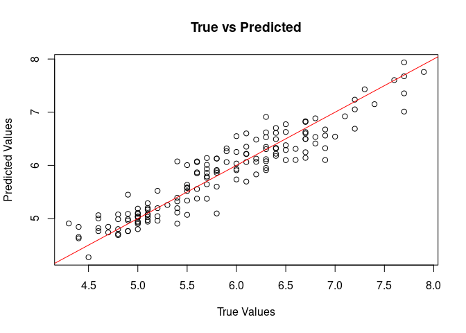

<!-- README.md is generated from README.Rmd. Please edit that file -->

# bnns <a href="https://swarnendu-stat.github.io/bnns/"></a>

<!-- badges: start -->

[](https://lifecycle.r-lib.org/articles/stages.html#experimental)
[](https://github.com/swarnendu-stat/bnns/actions/workflows/R-CMD-check.yaml)
[](https://app.codecov.io/gh/swarnendu-stat/bnns)
<!-- badges: end -->

The `bnns` package provides tools to fit Bayesian Neural Networks (BNNs)
for regression and classification problems. It is designed to be
flexible, supporting various network architectures, activation
functions, and output types, making it suitable for both simple and
complex data analysis tasks.

## Features

- Support for multi-layer neural networks with customizable
  architecture.
- Choice of activation functions (e.g., sigmoid, ReLU, tanh).
- Outputs for regression (continuous response) and classification
  (binary and multiclass).
- Bayesian inference, providing posterior distributions for predictions
  and parameters.
- Applications in domains such as clinical trials, predictive modeling,
  and more.

## Installation (stable CRAN version)

To install the `bnns` package from CRAN, use the following:

``` r
install.packages("bnns")
```

## Installation (development version)

To install the `bnns` package from GitHub, use the following:

``` r
# Install devtools if not already installed
if (!requireNamespace("devtools", quietly = TRUE)) {
  install.packages("devtools")
}

# Install bnns
devtools::install_github("swarnendu-stat/bnns")
```

## Getting Started

### 1. Simulate Data

Below is an example of how to simulate data for regression:

``` r
set.seed(123)
df <- data.frame(x1 = runif(10), x2 = runif(10), y = rnorm(10))
```

### 2. Fit a BNN Model

To fit a Bayesian Neural Network:

``` r
library(bnns)

model <- bnns(y ~ -1 + x1 + x2,
  data = df, L = 2, nodes = c(10, 8), act_fn = c(2, 3), out_act_fn = 1,
  iter = 1e2, warmup = 5e1, chains = 1, seed = 123
)
```

### 3. Model Summary

Summarize the fitted model:

``` r
summary(model)
#> Call:
#> bnns.default(formula = y ~ -1 + x1 + x2, data = df, L = 2, nodes = c(10, 
#>     8), act_fn = c(2, 3), out_act_fn = 1, iter = 100, warmup = 50, 
#>     chains = 1, seed = 123)
#> 
#> Data Summary:
#> Number of observations: 10 
#> Number of features: 2 
#> 
#> Network Architecture:
#> Number of hidden layers: 2 
#> Nodes per layer: 10, 8 
#> Activation functions: 2, 3 
#> Output activation function: 1 
#> 
#> Posterior Summary (Key Parameters):
#>                  mean    se_mean        sd       2.5%        25%         50%
#> w_out[1]  0.046800977 0.10811114 0.8557186 -1.4270932 -0.4344960 -0.06862144
#> w_out[2]  0.115880441 0.13319242 0.9380149 -1.5099093 -0.4571497  0.07552893
#> w_out[3] -0.066245807 0.13469714 0.9291137 -1.6212377 -0.8311266 -0.12900962
#> w_out[4] -0.103740675 0.09216505 0.7583326 -1.2582963 -0.6014192 -0.19034730
#> w_out[5] -0.136488041 0.18784111 0.9671970 -1.8916180 -0.9706804  0.03012556
#> w_out[6]  0.017294924 0.12168441 0.8081913 -1.3438848 -0.6034305 -0.08493691
#> w_out[7]  0.135528160 0.12928282 0.9187944 -1.6799768 -0.4365047  0.12827137
#> w_out[8] -0.005637373 0.13525773 0.8900234 -1.1675289 -0.6722286 -0.16385458
#> b_out     0.046645154 0.12189640 0.9242511 -1.5332072 -0.4610939  0.10835165
#> sigma     0.878312806 0.03548238 0.2349594  0.5149699  0.7192499  0.86315178
#>                75%    97.5%    n_eff      Rhat
#> w_out[1] 0.4759225 1.902804 62.64999 0.9982886
#> w_out[2] 0.7984308 1.885203 49.59758 0.9804256
#> w_out[3] 0.6134859 1.725527 47.57962 0.9826598
#> w_out[4] 0.3863629 1.198198 67.69972 0.9997155
#> w_out[5] 0.5359341 1.490437 26.51237 0.9805991
#> w_out[6] 0.6106351 1.368162 44.11218 0.9848957
#> w_out[7] 0.6400878 1.549369 50.50740 0.9820679
#> w_out[8] 0.6303301 1.985030 43.29908 1.0042768
#> b_out    0.6232685 1.547132 57.49078 0.9800999
#> sigma    1.0105743 1.324582 43.84903 0.9809578
#> 
#> Model Fit Information:
#> Iterations: 100 
#> Warmup: 50 
#> Thinning: 1 
#> Chains: 1 
#> 
#> Predictive Performance:
#> RMSE (training): 0.6676959 
#> MAE (training): 0.5158743 
#> 
#> Notes:
#> Check convergence diagnostics for parameters with high R-hat values.
```

### 4. Predictions

Make predictions using the trained model:

``` r
pred <- predict(model)
```

### 5. Visualization

Visualize true vs predicted values for regression:

``` r
plot(df$y, rowMeans(pred), main = "True vs Predicted", xlab = "True Values", ylab = "Predicted Values")
abline(0, 1, col = "red")
```



## Applications

### Regression Example (with custom priors)

Use `bnns` for regression analysis to model continuous outcomes, such as
predicting patient biomarkers in clinical trials.

``` r
model <- bnns(y ~ -1 + x1 + x2,
  data = df, L = 2, nodes = c(10, 8), act_fn = c(2, 3), out_act_fn = 1,
  iter = 1e2, warmup = 5e1, chains = 1, seed = 123,
  prior_weights = list(dist = "uniform", params = list(alpha = -1, beta = 1)),
  prior_sigma = list(dist = "inv_gamma", params = list(alpha = 1, beta = 1))
)
```

### Classification Example

For binary or multiclass classification, set the `out_act_fn` to `2`
(binary) or `3` (multiclass). For example:

``` r
# Simulate binary classification data
df <- data.frame(x1 = runif(10), x2 = runif(10), y = sample(0:1, 10, replace = TRUE))

# Fit a binary classification BNN
model <- bnns(y ~ -1 + x1 + x2, data = df, L = 2, nodes = c(16, 8), act_fn = c(3, 2), out_act_fn = 2, iter = 1e2, warmup = 5e1, chains = 1)
```

### Clinical Trial Applications

Explore posterior probabilities to estimate treatment effects or success
probabilities in clinical trials. For example, calculate the posterior
probability of achieving a clinically meaningful outcome in a given
population.

## Documentation

- Detailed vignettes are available to guide through various applications
  of the package.
- See `help(bnns)` for more information about the `bnns` function and
  its arguments.

## Contributing

Contributions are welcome! Please raise issues or submit pull requests
on [GitHub](https://github.com/swarnendu-stat/bnns).

## License

This package is licensed under the Apache License. See `LICENSE` for
details.
