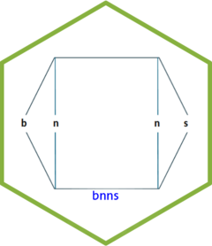

<!-- README.md is generated from README.Rmd. Please edit that file -->

# bnns <a href="https://swarnendu-stat.github.io/bnns/"></a>

<!-- badges: start -->

[](https://lifecycle.r-lib.org/articles/stages.html#stable)
[](https://github.com/swarnendu-stat/bnns/actions/workflows/R-CMD-check.yaml)
[](https://app.codecov.io/gh/swarnendu-stat/bnns)
<!-- badges: end -->

The **`bnns`** package brings the predictive power of deep learning to the rigorous probabilistic framework of Bayesian inference. By fitting Bayesian Neural Networks (BNNs) using Stan, `bnns` allows you to automatically capture complex, non-linear patterns in your data while seamlessly quantifying predictive uncertainty.

Whether you are working on regression, binary classification, or multi-class problems, `bnns` provides a flexible, easy-to-use interface to build customizable network architectures that output full posterior predictive distributions. This makes it ideal for high-stakes domains—like clinical trials, predictive modeling, or finance—where knowing what your model *doesn't* know is just as important as the prediction itself.

## Features

- Support for multi-layer neural networks with customizable
  architecture.
- Choice of activation functions (e.g., sigmoid, ReLU, tanh).
- Outputs for regression (continuous response) and classification
  (binary and multiclass).
- Choice of prior distributions for weights, biases and sigma (for
  regression).
- Bayesian inference, providing posterior distributions for predictions
  and parameters.
- GPU acceleration support for heavy network architectures via OpenCL.
- Applications in domains such as clinical trials, predictive modeling,
  and more.

## Why `bnns`? (vs. `brms`)

While `brms` is the gold standard for traditional Bayesian statistical modeling in R, **`bnns`** serves a highly complementary purpose: **combining the predictive power of deep learning with the rigorous uncertainty quantification of Bayesian inference.**

* **Purpose-Built for Neural Networks:** Automatically learns complex, high-dimensional interactions and non-linearities without manually specifying splines or Gaussian processes.
* **Native Machine Learning Integration:** Built with modern ML pipelines in mind, featuring a fully integrated `parsnip` engine (`set_engine("bnns")`) for seamless use within `tidymodels`.
* **GPU Acceleration:** Neural networks are computationally expensive. `bnns` exposes OpenCL GPU acceleration out-of-the-box (`use_gpu = TRUE`) for drastically faster training.
* **Streamlined Classification:** Built-in output activations (softmax, logistic sigmoid) and evaluation metrics make probabilistic multi-class and binary boundaries straightforward.

**When to Choose Which?**
* Choose **`brms`** for **inference and interpretability** (e.g., understanding specific predictor effect sizes or hierarchical random effects).
* Choose **`bnns`** for **predictive accuracy with uncertainty** (e.g., complex data with unknown non-linear interactions in high-stakes domains like clinical trials or finance).

## Installation (stable CRAN version)

To install the `bnns` package from CRAN, use the following:

``` r
install.packages("bnns")
```

## Installation (development version)

To install the `bnns` package from GitHub, use the following:

``` r
# Install devtools if not already installed
if (!requireNamespace("devtools", quietly = TRUE)) {
  install.packages("devtools")
}

# Install bnns
devtools::install_github("swarnendu-stat/bnns")
```

## Getting Started

### 1. Iris Data

We use the `iris` data for regression:

``` r
head(iris)
#>   Sepal.Length Sepal.Width Petal.Length Petal.Width Species
#> 1          5.1         3.5          1.4         0.2  setosa
#> 2          4.9         3.0          1.4         0.2  setosa
#> 3          4.7         3.2          1.3         0.2  setosa
#> 4          4.6         3.1          1.5         0.2  setosa
#> 5          5.0         3.6          1.4         0.2  setosa
#> 6          5.4         3.9          1.7         0.4  setosa
```

### 2. Fit a BNN Model

To fit a Bayesian Neural Network:

``` r
library(bnns)

iris_bnn <- bnns(Sepal.Length ~ -1 + ., data = iris, L = 1, act_fn = 3, nodes = 4, out_act_fn = 1, chains = 1)
```

### 3. Model Summary

Summarize the fitted model:

``` r
summary(iris_bnn)
#> Call:
#> bnns.default(formula = Sepal.Length ~ -1 + ., data = iris, L = 1, 
#>     nodes = 4, act_fn = 3, out_act_fn = 1, chains = 1)
#> 
#> Data Summary:
#> Number of observations: 150 
#> Number of features: 6 
#> 
#> Network Architecture:
#> Number of hidden layers: 1 
#> Nodes per layer: 4 
#> Activation functions: 3 
#> Output activation function: 1 
#> 
#> Posterior Summary (Key Parameters):
#>                mean      se_mean         sd       2.5%         25%        50%
#> w_out[1]  0.8345667 0.0728930420 0.65030179 -0.4150176  0.38054488  0.7769148
#> w_out[2] -0.3719132 0.4067431773 0.96605220 -1.7062097 -1.03225732 -0.7365945
#> w_out[3]  0.4783495 0.1965466796 0.86504113 -1.2350476  0.02944919  0.5634587
#> w_out[4]  0.4537029 0.3334670001 0.89069977 -1.3791675  0.09313077  0.5518418
#> b_out     2.2082591 0.0614548175 1.18859472 -0.1036760  1.38416657  2.2072194
#> sigma     0.3015085 0.0004831093 0.01804107  0.2693205  0.28895030  0.3013415
#>                75%     97.5%       n_eff      Rhat
#> w_out[1] 1.2478028 2.1730066   79.589862 1.0254227
#> w_out[2] 0.4680286 1.7548944    5.641059 1.3136052
#> w_out[3] 1.0454306 2.0448172   19.370556 1.1335888
#> w_out[4] 1.0281249 2.0733860    7.134392 1.1997484
#> b_out    3.1573563 4.2214829  374.072451 1.0016806
#> sigma    0.3128869 0.3386066 1394.549362 0.9988699
#> 
#> Model Fit Information:
#> Iterations: 1000 
#> Warmup: 200 
#> Thinning: 1 
#> Chains: 1 
#> 
#> Predictive Performance:
#> RMSE (training): 0.2821305 
#> MAE (training): 0.2234606 
#> 
#> Notes:
#> Check convergence diagnostics for parameters with high R-hat values.
```

### 4. Predictions

Make predictions using the trained model:

``` r
pred <- predict(iris_bnn)
```

### 5. Visualization

Visualize true vs predicted values for regression:

``` r
plot(iris$Sepal.Length, rowMeans(pred), main = "True vs Predicted", xlab = "True Values", ylab = "Predicted Values")
abline(0, 1, col = "red")
```


## GPU Acceleration

The `bnns` package natively supports GPU acceleration for Bayesian sampling using OpenCL. This can significantly reduce training time for deep or wide network architectures.

To use your GPU, ensure you have the appropriate OpenCL drivers installed, then set `use_gpu = TRUE` and use the `cmdstanr` backend. You may also need to specify the `opencl_ids` for your hardware.

You can check your system's available OpenCL platforms and device IDs by running:
```r
opencl_diagnostics()
```

```r
# Fit a Bayesian Neural Network on the GPU
model_gpu <- bnns(y ~ ., 
  data = your_data, 
  backend = "cmdstanr",
  use_gpu = TRUE,
  opencl_ids = c(0, 0) # Format is c(platform_id, device_id)
)
```

## Applications

### Regression Example (with custom priors)

Use `bnns` for regression analysis to model continuous outcomes, such as
predicting patient biomarkers in clinical trials.

``` r
model <- bnns(Sepal.Length ~ -1 + .,
  data = iris, L = 1, act_fn = 3, nodes = 4,
  out_act_fn = 1, chains = 1,
  prior_weights = list(dist = "uniform", params = list(alpha = -1, beta = 1)),
  prior_bias = list(dist = "cauchy", params = list(mu = 0, sigma = 2.5)),
  prior_sigma = list(dist = "inv_gamma", params = list(alpha = 1, beta = 1))
)
```

### Classification Example

For binary or multiclass classification, set the `out_act_fn` to `2`
(binary) or `3` (multiclass). For example:

``` r
# Simulate binary classification data
df <- data.frame(
  x1 = runif(10), x2 = runif(10),
  y = sample(0:1, 10, replace = TRUE)
)

# Fit a binary classification BNN
model <- bnns(y ~ -1 + x1 + x2,
  data = df, L = 2, nodes = c(16, 8),
  act_fn = c(3, 2), out_act_fn = 2, iter = 1e2,
  warmup = 5e1, chains = 1
)
```

### Clinical Trial Applications

Explore posterior probabilities to estimate treatment effects or success
probabilities in clinical trials. For example, calculate the posterior
probability of achieving a clinically meaningful outcome in a given
population.

## Documentation

- Detailed [vignettes](https://swarnendu-stat.github.io/bnns/articles/)
  are available to guide through various applications of the package.
- See `help(bnns)` for more information about the `bnns` function and
  its arguments.

## Contributing

Contributions are welcome! Please raise issues or submit pull requests
on [GitHub](https://github.com/swarnendu-stat/bnns).

## License

This package is licensed under the MIT License. See `LICENSE` for
details.
