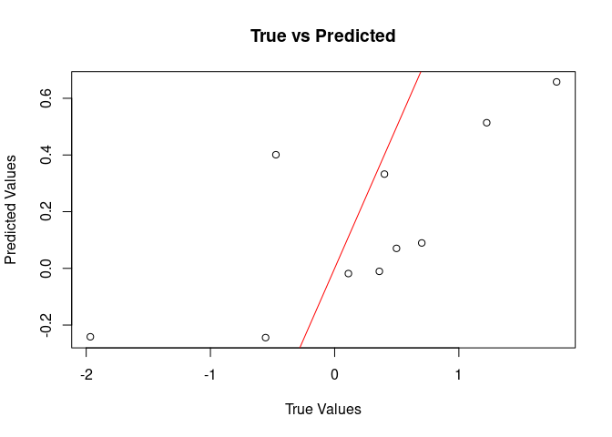

<!-- README.md is generated from README.Rmd. Please edit that file -->

# bnns: Bayesian Neural Networks for Regression and Classification

<!-- badges: start -->

[](https://lifecycle.r-lib.org/articles/stages.html#experimental)
[](https://app.codecov.io/gh/swarnendu-stat/bnns)
<!-- badges: end -->

The `bnns` package provides tools to fit Bayesian Neural Networks (BNNs)
for regression and classification problems. It is designed to be
flexible, supporting various network architectures, activation
functions, and output types, making it suitable for both simple and
complex data analysis tasks.

## Features

- Support for multi-layer neural networks with customizable
  architecture.
- Choice of activation functions (e.g., sigmoid, ReLU, tanh).
- Outputs for regression (continuous response) and classification
  (binary and multiclass).
- Bayesian inference, providing posterior distributions for predictions
  and parameters.
- Applications in domains such as clinical trials, predictive modeling,
  and more.

## Installation

To install the `bnns` package from GitHub, use the following:

``` r
# Install devtools if not already installed
if (!requireNamespace("devtools", quietly = TRUE)) {
  install.packages("devtools")
}

# Install bnns
devtools::install_github("swarnendu-stat/bnns")
#> Downloading GitHub repo swarnendu-stat/bnns@HEAD
#> matrixStats (1.2.0 -> 1.4.1) [CRAN]
#> checkmate   (2.3.1 -> 2.3.2) [CRAN]
#> loo         (2.6.0 -> 2.8.0) [CRAN]
#> Installing 3 packages: matrixStats, checkmate, loo
#> Installing packages into '/tmp/Rtmp5836Jm/temp_libpath33801598971d'
#> (as 'lib' is unspecified)
#> ── R CMD build ─────────────────────────────────────────────────────────────────
#> * checking for file ‘/tmp/Rtmp7GbjPv/remotes5adf77e05dd2/swarnendu-stat-bnns-af87442/DESCRIPTION’ ... OK
#> * preparing ‘bnns’:
#> * checking DESCRIPTION meta-information ... OK
#> * checking for LF line-endings in source and make files and shell scripts
#> * checking for empty or unneeded directories
#> * building ‘bnns_0.0.0.9000.tar.gz’
#> Installing package into '/tmp/Rtmp5836Jm/temp_libpath33801598971d'
#> (as 'lib' is unspecified)
```

## Getting Started

### 1. Simulate Data

Below is an example of how to simulate data for regression:

``` r
set.seed(123)
n <- 100
x <- matrix(runif(n * 2), ncol = 2)
y <- x[, 1] + x[, 2]^2 + rnorm(n, sd = 0.1)
```

### 2. Fit a BNN Model

To fit a Bayesian Neural Network:

``` r
library(bnns)

model <- bnns(x, y, L = 2, nodes = c(10, 8), act_fn = c(2, 3), out_act_fn = 1,
              iter = 2000, warmup = 500, thin = 2, chains = 2, seed = 123)
#> 
#> TRANSLATING MODEL '' FROM Stan CODE TO C++ CODE NOW.
#> OS: x86_64, linux-gnu; rstan: 2.32.6; Rcpp: 1.0.13.1; inline: 0.3.20 
#>  >> setting environment variables: 
#> PKG_LIBS =  '/home/antpc/R/x86_64-pc-linux-gnu-library/4.4/rstan/lib//libStanServices.a' -L'/home/antpc/R/x86_64-pc-linux-gnu-library/4.4/StanHeaders/lib/' -lStanHeaders -L'/home/antpc/R/x86_64-pc-linux-gnu-library/4.4/RcppParallel/lib/' -ltbb 
#> PKG_CPPFLAGS =   -I"/home/antpc/R/x86_64-pc-linux-gnu-library/4.4/Rcpp/include/"  -I"/home/antpc/R/x86_64-pc-linux-gnu-library/4.4/RcppEigen/include/"  -I"/home/antpc/R/x86_64-pc-linux-gnu-library/4.4/RcppEigen/include/unsupported"  -I"/home/antpc/R/x86_64-pc-linux-gnu-library/4.4/BH/include" -I"/home/antpc/R/x86_64-pc-linux-gnu-library/4.4/StanHeaders/include/src/"  -I"/home/antpc/R/x86_64-pc-linux-gnu-library/4.4/StanHeaders/include/"  -I"/home/antpc/R/x86_64-pc-linux-gnu-library/4.4/RcppParallel/include/"  -I"/home/antpc/R/x86_64-pc-linux-gnu-library/4.4/rstan/include" -DEIGEN_NO_DEBUG  -DBOOST_DISABLE_ASSERTS  -DBOOST_PENDING_INTEGER_LOG2_HPP  -DSTAN_THREADS  -DUSE_STANC3 -DSTRICT_R_HEADERS  -DBOOST_PHOENIX_NO_VARIADIC_EXPRESSION  -D_HAS_AUTO_PTR_ETC=0  -include '/home/antpc/R/x86_64-pc-linux-gnu-library/4.4/StanHeaders/include/stan/math/prim/fun/Eigen.hpp'  -D_REENTRANT -DRCPP_PARALLEL_USE_TBB=1 
#>  >> Program source :
#> 
#>    1 : 
#>    2 : // includes from the plugin
#>    3 : // [[Rcpp::plugins(cpp14)]]
#>    4 : 
#>    5 : 
#>    6 : // user includes
#>    7 : #include <Rcpp.h>
#>    8 : using namespace Rcpp;
#>    9 : #ifndef MODELS_HPP
#>   10 : #define MODELS_HPP
#>   11 : #define STAN__SERVICES__COMMAND_HPP
#>   12 : #include <rstan/rstaninc.hpp>
#>   13 : #ifndef USE_STANC3
#>   14 : #define USE_STANC3
#>   15 : #endif
#>   16 : // Code generated by stanc v2.32.2
#>   17 : #include <stan/model/model_header.hpp>
#>   18 : namespace model5adf76affdf0__namespace {
#>   19 : using stan::model::model_base_crtp;
#>   20 : using namespace stan::math;
#>   21 : stan::math::profile_map profiles__;
#>   22 : static constexpr std::array<const char*, 66> locations_array__ =
#>   23 :   {" (found before start of program)",
#>   24 :   " (in 'anon_model', line 11, column 2 to column 25)",
#>   25 :   " (in 'anon_model', line 12, column 2 to column 22)",
#>   26 :   " (in 'anon_model', line 13, column 2 to column 32)",
#>   27 :   " (in 'anon_model', line 14, column 2 to column 22)",
#>   28 :   " (in 'anon_model', line 15, column 2 to column 25)",
#>   29 :   " (in 'anon_model', line 16, column 2 to column 13)",
#>   30 :   " (in 'anon_model', line 17, column 2 to column 22)",
#>   31 :   " (in 'anon_model', line 20, column 2 to column 25)",
#>   32 :   " (in 'anon_model', line 21, column 2 to column 25)",
#>   33 :   " (in 'anon_model', line 22, column 2 to column 25)",
#>   34 :   " (in 'anon_model', line 23, column 2 to column 25)",
#>   35 :   " (in 'anon_model', line 24, column 2 to column 18)",
#>   36 :   " (in 'anon_model', line 25, column 2 to column 35)",
#>   37 :   " (in 'anon_model', line 29, column 7 to column 49)",
#>   38 :   " (in 'anon_model', line 28, column 27 to column 49)",
#>   39 :   " (in 'anon_model', line 28, column 7 to line 29, column 49)",
#>   40 :   " (in 'anon_model', line 27, column 27 to column 46)",
#>   41 :   " (in 'anon_model', line 27, column 7 to line 29, column 49)",
#>   42 :   " (in 'anon_model', line 26, column 22 to column 36)",
#>   43 :   " (in 'anon_model', line 26, column 2 to line 29, column 49)",
#>   44 :   " (in 'anon_model', line 30, column 2 to column 36)",
#>   45 :   " (in 'anon_model', line 34, column 7 to column 49)",
#>   46 :   " (in 'anon_model', line 33, column 27 to column 49)",
#>   47 :   " (in 'anon_model', line 33, column 7 to line 34, column 49)",
#>   48 :   " (in 'anon_model', line 32, column 27 to column 46)",
#>   49 :   " (in 'anon_model', line 32, column 7 to line 34, column 49)",
#>   50 :   " (in 'anon_model', line 31, column 22 to column 36)",
#>   51 :   " (in 'anon_model', line 31, column 2 to line 34, column 49)",
#>   52 :   " (in 'anon_model', line 35, column 2 to column 29)",
#>   53 :   " (in 'anon_model', line 38, column 2 to column 31)",
#>   54 :   " (in 'anon_model', line 39, column 2 to column 20)",
#>   55 :   " (in 'anon_model', line 40, column 2 to column 31)",
#>   56 :   " (in 'anon_model', line 41, column 2 to column 20)",
#>   57 :   " (in 'anon_model', line 42, column 2 to column 23)",
#>   58 :   " (in 'anon_model', line 43, column 2 to column 23)",
#>   59 :   " (in 'anon_model', line 44, column 2 to column 23)",
#>   60 :   " (in 'anon_model', line 45, column 2 to column 27)",
#>   61 :   " (in 'anon_model', line 2, column 2 to column 17)",
#>   62 :   " (in 'anon_model', line 3, column 2 to column 17)",
#>   63 :   " (in 'anon_model', line 4, column 2 to column 17)",
#>   64 :   " (in 'anon_model', line 5, column 21 to column 22)",
#>   65 :   " (in 'anon_model', line 5, column 2 to column 24)",
#>   66 :   " (in 'anon_model', line 6, column 9 to column 10)",
#>   67 :   " (in 'anon_model', line 6, column 12 to column 13)",
#>   68 :   " (in 'anon_model', line 6, column 2 to column 17)",
#>   69 :   " (in 'anon_model', line 7, column 9 to column 10)",
#>   70 :   " (in 'anon_model', line 7, column 2 to column 14)",
#>   71 :   " (in 'anon_model', line 8, column 22 to column 23)",
#>   72 :   " (in 'anon_model', line 8, column 2 to column 25)",
#>   73 :   " (in 'anon_model', line 11, column 9 to column 10)",
#>   74 :   " (in 'anon_model', line 11, column 12 to column 20)",
#>   75 :   " (in 'anon_model', line 12, column 9 to column 17)",
#>   76 :   " (in 'anon_model', line 13, column 9 to column 17)",
#>   77 :   " (in 'anon_model', line 13, column 19 to column 27)",
#>   78 :   " (in 'anon_model', line 14, column 9 to column 17)",
#>   79 :   " (in 'anon_model', line 15, column 9 to column 17)",
#>   80 :   " (in 'anon_model', line 20, column 9 to column 10)",
#>   81 :   " (in 'anon_model', line 20, column 12 to column 20)",
#>   82 :   " (in 'anon_model', line 21, column 9 to column 10)",
#>   83 :   " (in 'anon_model', line 21, column 12 to column 20)",
#>   84 :   " (in 'anon_model', line 22, column 9 to column 10)",
#>   85 :   " (in 'anon_model', line 22, column 12 to column 20)",
#>   86 :   " (in 'anon_model', line 23, column 9 to column 10)",
#>   87 :   " (in 'anon_model', line 23, column 12 to column 20)",
#>   88 :   " (in 'anon_model', line 24, column 9 to column 10)"};
#>   89 : class model5adf76affdf0_ final : public model_base_crtp<model5adf76affdf0_> {
#>   90 : private:
#>   91 :   int n;
#>   92 :   int m;
#>   93 :   int L;
#>   94 :   std::vector<int> nodes;
#>   95 :   Eigen::Matrix<double,-1,-1> X_data__;
#>   96 :   Eigen::Matrix<double,-1,1> y_data__;
#>   97 :   std::vector<int> act_fn;
#>   98 :   int w1_2dim__;
#>   99 :   int b1_1dim__;
#>  100 :   int w2_1dim__;
#>  101 :   int w2_2dim__;
#>  102 :   int b2_1dim__;
#>  103 :   int w_out_1dim__;
#>  104 :   int z1_2dim__;
#>  105 :   int a1_2dim__;
#>  106 :   int z2_2dim__;
#>  107 :   int a2_2dim__;
#>  108 :   Eigen::Map<Eigen::Matrix<double,-1,-1>> X{nullptr, 0, 0};
#>  109 :   Eigen::Map<Eigen::Matrix<double,-1,1>> y{nullptr, 0};
#>  110 : public:
#>  111 :   ~model5adf76affdf0_() {}
#>  112 :   model5adf76affdf0_(stan::io::var_context& context__, unsigned int
#>  113 :                      random_seed__ = 0, std::ostream* pstream__ = nullptr)
#>  114 :       : model_base_crtp(0) {
#>  115 :     int current_statement__ = 0;
#>  116 :     using local_scalar_t__ = double;
#>  117 :     boost::ecuyer1988 base_rng__ =
#>  118 :       stan::services::util::create_rng(random_seed__, 0);
#>  119 :     // suppress unused var warning
#>  120 :     (void) base_rng__;
#>  121 :     static constexpr const char* function__ =
#>  122 :       "model5adf76affdf0__namespace::model5adf76affdf0_";
#>  123 :     // suppress unused var warning
#>  124 :     (void) function__;
#>  125 :     local_scalar_t__ DUMMY_VAR__(std::numeric_limits<double>::quiet_NaN());
#>  126 :     // suppress unused var warning
#>  127 :     (void) DUMMY_VAR__;
#>  128 :     try {
#>  129 :       int pos__ = std::numeric_limits<int>::min();
#>  130 :       pos__ = 1;
#>  131 :       current_statement__ = 38;
#>  132 :       context__.validate_dims("data initialization", "n", "int",
#>  133 :         std::vector<size_t>{});
#>  134 :       n = std::numeric_limits<int>::min();
#>  135 :       current_statement__ = 38;
#>  136 :       n = context__.vals_i("n")[(1 - 1)];
#>  137 :       current_statement__ = 38;
#>  138 :       stan::math::check_greater_or_equal(function__, "n", n, 1);
#>  139 :       current_statement__ = 39;
#>  140 :       context__.validate_dims("data initialization", "m", "int",
#>  141 :         std::vector<size_t>{});
#>  142 :       m = std::numeric_limits<int>::min();
#>  143 :       current_statement__ = 39;
#>  144 :       m = context__.vals_i("m")[(1 - 1)];
#>  145 :       current_statement__ = 39;
#>  146 :       stan::math::check_greater_or_equal(function__, "m", m, 1);
#>  147 :       current_statement__ = 40;
#>  148 :       context__.validate_dims("data initialization", "L", "int",
#>  149 :         std::vector<size_t>{});
#>  150 :       L = std::numeric_limits<int>::min();
#>  151 :       current_statement__ = 40;
#>  152 :       L = context__.vals_i("L")[(1 - 1)];
#>  153 :       current_statement__ = 40;
#>  154 :       stan::math::check_greater_or_equal(function__, "L", L, 1);
#>  155 :       current_statement__ = 41;
#>  156 :       stan::math::validate_non_negative_index("nodes", "L", L);
#>  157 :       current_statement__ = 42;
#>  158 :       context__.validate_dims("data initialization", "nodes", "int",
#>  159 :         std::vector<size_t>{static_cast<size_t>(L)});
#>  160 :       nodes = std::vector<int>(L, std::numeric_limits<int>::min());
#>  161 :       current_statement__ = 42;
#>  162 :       nodes = context__.vals_i("nodes");
#>  163 :       current_statement__ = 42;
#>  164 :       stan::math::check_greater_or_equal(function__, "nodes", nodes, 1);
#>  165 :       current_statement__ = 43;
#>  166 :       stan::math::validate_non_negative_index("X", "n", n);
#>  167 :       current_statement__ = 44;
#>  168 :       stan::math::validate_non_negative_index("X", "m", m);
#>  169 :       current_statement__ = 45;
#>  170 :       context__.validate_dims("data initialization", "X", "double",
#>  171 :         std::vector<size_t>{static_cast<size_t>(n), static_cast<size_t>(m)});
#>  172 :       X_data__ = Eigen::Matrix<double,-1,-1>::Constant(n, m,
#>  173 :                    std::numeric_limits<double>::quiet_NaN());
#>  174 :       new (&X) Eigen::Map<Eigen::Matrix<double,-1,-1>>(X_data__.data(), n, m);
#>  175 :       {
#>  176 :         std::vector<local_scalar_t__> X_flat__;
#>  177 :         current_statement__ = 45;
#>  178 :         X_flat__ = context__.vals_r("X");
#>  179 :         current_statement__ = 45;
#>  180 :         pos__ = 1;
#>  181 :         current_statement__ = 45;
#>  182 :         for (int sym1__ = 1; sym1__ <= m; ++sym1__) {
#>  183 :           current_statement__ = 45;
#>  184 :           for (int sym2__ = 1; sym2__ <= n; ++sym2__) {
#>  185 :             current_statement__ = 45;
#>  186 :             stan::model::assign(X, X_flat__[(pos__ - 1)],
#>  187 :               "assigning variable X", stan::model::index_uni(sym2__),
#>  188 :               stan::model::index_uni(sym1__));
#>  189 :             current_statement__ = 45;
#>  190 :             pos__ = (pos__ + 1);
#>  191 :           }
#>  192 :         }
#>  193 :       }
#>  194 :       current_statement__ = 46;
#>  195 :       stan::math::validate_non_negative_index("y", "n", n);
#>  196 :       current_statement__ = 47;
#>  197 :       context__.validate_dims("data initialization", "y", "double",
#>  198 :         std::vector<size_t>{static_cast<size_t>(n)});
#>  199 :       y_data__ = Eigen::Matrix<double,-1,1>::Constant(n,
#>  200 :                    std::numeric_limits<double>::quiet_NaN());
#>  201 :       new (&y) Eigen::Map<Eigen::Matrix<double,-1,1>>(y_data__.data(), n);
#>  202 :       {
#>  203 :         std::vector<local_scalar_t__> y_flat__;
#>  204 :         current_statement__ = 47;
#>  205 :         y_flat__ = context__.vals_r("y");
#>  206 :         current_statement__ = 47;
#>  207 :         pos__ = 1;
#>  208 :         current_statement__ = 47;
#>  209 :         for (int sym1__ = 1; sym1__ <= n; ++sym1__) {
#>  210 :           current_statement__ = 47;
#>  211 :           stan::model::assign(y, y_flat__[(pos__ - 1)],
#>  212 :             "assigning variable y", stan::model::index_uni(sym1__));
#>  213 :           current_statement__ = 47;
#>  214 :           pos__ = (pos__ + 1);
#>  215 :         }
#>  216 :       }
#>  217 :       current_statement__ = 48;
#>  218 :       stan::math::validate_non_negative_index("act_fn", "L", L);
#>  219 :       current_statement__ = 49;
#>  220 :       context__.validate_dims("data initialization", "act_fn", "int",
#>  221 :         std::vector<size_t>{static_cast<size_t>(L)});
#>  222 :       act_fn = std::vector<int>(L, std::numeric_limits<int>::min());
#>  223 :       current_statement__ = 49;
#>  224 :       act_fn = context__.vals_i("act_fn");
#>  225 :       current_statement__ = 49;
#>  226 :       stan::math::check_greater_or_equal(function__, "act_fn", act_fn, 1);
#>  227 :       current_statement__ = 50;
#>  228 :       stan::math::validate_non_negative_index("w1", "m", m);
#>  229 :       current_statement__ = 51;
#>  230 :       w1_2dim__ = std::numeric_limits<int>::min();
#>  231 :       current_statement__ = 51;
#>  232 :       w1_2dim__ = stan::model::rvalue(nodes, "nodes",
#>  233 :                     stan::model::index_uni(1));
#>  234 :       current_statement__ = 51;
#>  235 :       stan::math::validate_non_negative_index("w1", "nodes[1]", w1_2dim__);
#>  236 :       current_statement__ = 52;
#>  237 :       b1_1dim__ = std::numeric_limits<int>::min();
#>  238 :       current_statement__ = 52;
#>  239 :       b1_1dim__ = stan::model::rvalue(nodes, "nodes",
#>  240 :                     stan::model::index_uni(1));
#>  241 :       current_statement__ = 52;
#>  242 :       stan::math::validate_non_negative_index("b1", "nodes[1]", b1_1dim__);
#>  243 :       current_statement__ = 53;
#>  244 :       w2_1dim__ = std::numeric_limits<int>::min();
#>  245 :       current_statement__ = 53;
#>  246 :       w2_1dim__ = stan::model::rvalue(nodes, "nodes",
#>  247 :                     stan::model::index_uni(1));
#>  248 :       current_statement__ = 53;
#>  249 :       stan::math::validate_non_negative_index("w2", "nodes[1]", w2_1dim__);
#>  250 :       current_statement__ = 54;
#>  251 :       w2_2dim__ = std::numeric_limits<int>::min();
#>  252 :       current_statement__ = 54;
#>  253 :       w2_2dim__ = stan::model::rvalue(nodes, "nodes",
#>  254 :                     stan::model::index_uni(2));
#>  255 :       current_statement__ = 54;
#>  256 :       stan::math::validate_non_negative_index("w2", "nodes[2]", w2_2dim__);
#>  257 :       current_statement__ = 55;
#>  258 :       b2_1dim__ = std::numeric_limits<int>::min();
#>  259 :       current_statement__ = 55;
#>  260 :       b2_1dim__ = stan::model::rvalue(nodes, "nodes",
#>  261 :                     stan::model::index_uni(2));
#>  262 :       current_statement__ = 55;
#>  263 :       stan::math::validate_non_negative_index("b2", "nodes[2]", b2_1dim__);
#>  264 :       current_statement__ = 56;
#>  265 :       w_out_1dim__ = std::numeric_limits<int>::min();
#>  266 :       current_statement__ = 56;
#>  267 :       w_out_1dim__ = stan::model::rvalue(nodes, "nodes",
#>  268 :                        stan::model::index_uni(L));
#>  269 :       current_statement__ = 56;
#>  270 :       stan::math::validate_non_negative_index("w_out", "nodes[L]",
#>  271 :         w_out_1dim__);
#>  272 :       current_statement__ = 57;
#>  273 :       stan::math::validate_non_negative_index("z1", "n", n);
#>  274 :       current_statement__ = 58;
#>  275 :       z1_2dim__ = std::numeric_limits<int>::min();
#>  276 :       current_statement__ = 58;
#>  277 :       z1_2dim__ = stan::model::rvalue(nodes, "nodes",
#>  278 :                     stan::model::index_uni(1));
#>  279 :       current_statement__ = 58;
#>  280 :       stan::math::validate_non_negative_index("z1", "nodes[1]", z1_2dim__);
#>  281 :       current_statement__ = 59;
#>  282 :       stan::math::validate_non_negative_index("a1", "n", n);
#>  283 :       current_statement__ = 60;
#>  284 :       a1_2dim__ = std::numeric_limits<int>::min();
#>  285 :       current_statement__ = 60;
#>  286 :       a1_2dim__ = stan::model::rvalue(nodes, "nodes",
#>  287 :                     stan::model::index_uni(1));
#>  288 :       current_statement__ = 60;
#>  289 :       stan::math::validate_non_negative_index("a1", "nodes[1]", a1_2dim__);
#>  290 :       current_statement__ = 61;
#>  291 :       stan::math::validate_non_negative_index("z2", "n", n);
#>  292 :       current_statement__ = 62;
#>  293 :       z2_2dim__ = std::numeric_limits<int>::min();
#>  294 :       current_statement__ = 62;
#>  295 :       z2_2dim__ = stan::model::rvalue(nodes, "nodes",
#>  296 :                     stan::model::index_uni(2));
#>  297 :       current_statement__ = 62;
#>  298 :       stan::math::validate_non_negative_index("z2", "nodes[2]", z2_2dim__);
#>  299 :       current_statement__ = 63;
#>  300 :       stan::math::validate_non_negative_index("a2", "n", n);
#>  301 :       current_statement__ = 64;
#>  302 :       a2_2dim__ = std::numeric_limits<int>::min();
#>  303 :       current_statement__ = 64;
#>  304 :       a2_2dim__ = stan::model::rvalue(nodes, "nodes",
#>  305 :                     stan::model::index_uni(2));
#>  306 :       current_statement__ = 64;
#>  307 :       stan::math::validate_non_negative_index("a2", "nodes[2]", a2_2dim__);
#>  308 :       current_statement__ = 65;
#>  309 :       stan::math::validate_non_negative_index("y_hat", "n", n);
#>  310 :     } catch (const std::exception& e) {
#>  311 :       stan::lang::rethrow_located(e, locations_array__[current_statement__]);
#>  312 :     }
#>  313 :     num_params_r__ = (m * w1_2dim__) + b1_1dim__ + (w2_1dim__ * w2_2dim__) +
#>  314 :       b2_1dim__ + w_out_1dim__ + 1 + 1;
#>  315 :   }
#>  316 :   inline std::string model_name() const final {
#>  317 :     return "model5adf76affdf0_";
#>  318 :   }
#>  319 :   inline std::vector<std::string> model_compile_info() const noexcept {
#>  320 :     return std::vector<std::string>{"stanc_version = stanc3 v2.32.2",
#>  321 :              "stancflags = --"};
#>  322 :   }
#>  323 :   template <bool propto__, bool jacobian__, typename VecR, typename VecI,
#>  324 :             stan::require_vector_like_t<VecR>* = nullptr,
#>  325 :             stan::require_vector_like_vt<std::is_integral, VecI>* = nullptr>
#>  326 :   inline stan::scalar_type_t<VecR>
#>  327 :   log_prob_impl(VecR& params_r__, VecI& params_i__, std::ostream*
#>  328 :                 pstream__ = nullptr) const {
#>  329 :     using T__ = stan::scalar_type_t<VecR>;
#>  330 :     using local_scalar_t__ = T__;
#>  331 :     T__ lp__(0.0);
#>  332 :     stan::math::accumulator<T__> lp_accum__;
#>  333 :     stan::io::deserializer<local_scalar_t__> in__(params_r__, params_i__);
#>  334 :     int current_statement__ = 0;
#>  335 :     local_scalar_t__ DUMMY_VAR__(std::numeric_limits<double>::quiet_NaN());
#>  336 :     // suppress unused var warning
#>  337 :     (void) DUMMY_VAR__;
#>  338 :     static constexpr const char* function__ =
#>  339 :       "model5adf76affdf0__namespace::log_prob";
#>  340 :     // suppress unused var warning
#>  341 :     (void) function__;
#>  342 :     try {
#>  343 :       Eigen::Matrix<local_scalar_t__,-1,-1> w1 =
#>  344 :         Eigen::Matrix<local_scalar_t__,-1,-1>::Constant(m, w1_2dim__,
#>  345 :           DUMMY_VAR__);
#>  346 :       current_statement__ = 1;
#>  347 :       w1 = in__.template read<Eigen::Matrix<local_scalar_t__,-1,-1>>(m,
#>  348 :              w1_2dim__);
#>  349 :       Eigen::Matrix<local_scalar_t__,-1,1> b1 =
#>  350 :         Eigen::Matrix<local_scalar_t__,-1,1>::Constant(b1_1dim__,
#>  351 :           DUMMY_VAR__);
#>  352 :       current_statement__ = 2;
#>  353 :       b1 = in__.template read<
#>  354 :              Eigen::Matrix<local_scalar_t__,-1,1>>(b1_1dim__);
#>  355 :       Eigen::Matrix<local_scalar_t__,-1,-1> w2 =
#>  356 :         Eigen::Matrix<local_scalar_t__,-1,-1>::Constant(w2_1dim__, w2_2dim__,
#>  357 :           DUMMY_VAR__);
#>  358 :       current_statement__ = 3;
#>  359 :       w2 = in__.template read<
#>  360 :              Eigen::Matrix<local_scalar_t__,-1,-1>>(w2_1dim__, w2_2dim__);
#>  361 :       Eigen::Matrix<local_scalar_t__,-1,1> b2 =
#>  362 :         Eigen::Matrix<local_scalar_t__,-1,1>::Constant(b2_1dim__,
#>  363 :           DUMMY_VAR__);
#>  364 :       current_statement__ = 4;
#>  365 :       b2 = in__.template read<
#>  366 :              Eigen::Matrix<local_scalar_t__,-1,1>>(b2_1dim__);
#>  367 :       Eigen::Matrix<local_scalar_t__,-1,1> w_out =
#>  368 :         Eigen::Matrix<local_scalar_t__,-1,1>::Constant(w_out_1dim__,
#>  369 :           DUMMY_VAR__);
#>  370 :       current_statement__ = 5;
#>  371 :       w_out = in__.template read<
#>  372 :                 Eigen::Matrix<local_scalar_t__,-1,1>>(w_out_1dim__);
#>  373 :       local_scalar_t__ b_out = DUMMY_VAR__;
#>  374 :       current_statement__ = 6;
#>  375 :       b_out = in__.template read<local_scalar_t__>();
#>  376 :       local_scalar_t__ sigma = DUMMY_VAR__;
#>  377 :       current_statement__ = 7;
#>  378 :       sigma = in__.template read_constrain_lb<local_scalar_t__,
#>  379 :                 jacobian__>(0, lp__);
#>  380 :       Eigen::Matrix<local_scalar_t__,-1,-1> z1 =
#>  381 :         Eigen::Matrix<local_scalar_t__,-1,-1>::Constant(n, z1_2dim__,
#>  382 :           DUMMY_VAR__);
#>  383 :       Eigen::Matrix<local_scalar_t__,-1,-1> a1 =
#>  384 :         Eigen::Matrix<local_scalar_t__,-1,-1>::Constant(n, a1_2dim__,
#>  385 :           DUMMY_VAR__);
#>  386 :       Eigen::Matrix<local_scalar_t__,-1,-1> z2 =
#>  387 :         Eigen::Matrix<local_scalar_t__,-1,-1>::Constant(n, z2_2dim__,
#>  388 :           DUMMY_VAR__);
#>  389 :       Eigen::Matrix<local_scalar_t__,-1,-1> a2 =
#>  390 :         Eigen::Matrix<local_scalar_t__,-1,-1>::Constant(n, a2_2dim__,
#>  391 :           DUMMY_VAR__);
#>  392 :       Eigen::Matrix<local_scalar_t__,-1,1> y_hat =
#>  393 :         Eigen::Matrix<local_scalar_t__,-1,1>::Constant(n, DUMMY_VAR__);
#>  394 :       current_statement__ = 13;
#>  395 :       stan::model::assign(z1,
#>  396 :         stan::math::add(stan::math::multiply(X, w1),
#>  397 :           stan::math::rep_matrix(stan::math::transpose(b1), n)),
#>  398 :         "assigning variable z1");
#>  399 :       current_statement__ = 20;
#>  400 :       if (stan::math::logical_eq(
#>  401 :             stan::model::rvalue(act_fn, "act_fn", stan::model::index_uni(1)),
#>  402 :             1)) {
#>  403 :         current_statement__ = 19;
#>  404 :         stan::model::assign(a1, stan::math::tanh(z1), "assigning variable a1");
#>  405 :       } else {
#>  406 :         current_statement__ = 18;
#>  407 :         if (stan::math::logical_eq(
#>  408 :               stan::model::rvalue(act_fn, "act_fn", stan::model::index_uni(1)),
#>  409 :               2)) {
#>  410 :           current_statement__ = 17;
#>  411 :           stan::model::assign(a1, stan::math::inv_logit(z1),
#>  412 :             "assigning variable a1");
#>  413 :         } else {
#>  414 :           current_statement__ = 16;
#>  415 :           if (stan::math::logical_eq(
#>  416 :                 stan::model::rvalue(act_fn, "act_fn",
#>  417 :                   stan::model::index_uni(1)), 3)) {
#>  418 :             current_statement__ = 15;
#>  419 :             stan::model::assign(a1,
#>  420 :               stan::math::log(stan::math::add(1, stan::math::exp(z1))),
#>  421 :               "assigning variable a1");
#>  422 :           } else {
#>  423 :             current_statement__ = 14;
#>  424 :             stan::model::assign(a1,
#>  425 :               stan::math::fmax(
#>  426 :                 stan::math::rep_matrix(0, n,
#>  427 :                   stan::model::rvalue(nodes, "nodes",
#>  428 :                     stan::model::index_uni(1))), z1), "assigning variable a1");
#>  429 :           }
#>  430 :         }
#>  431 :       }
#>  432 :       current_statement__ = 21;
#>  433 :       stan::model::assign(z2,
#>  434 :         stan::math::add(stan::math::multiply(a1, w2),
#>  435 :           stan::math::rep_matrix(stan::math::transpose(b2), n)),
#>  436 :         "assigning variable z2");
#>  437 :       current_statement__ = 28;
#>  438 :       if (stan::math::logical_eq(
#>  439 :             stan::model::rvalue(act_fn, "act_fn", stan::model::index_uni(2)),
#>  440 :             1)) {
#>  441 :         current_statement__ = 27;
#>  442 :         stan::model::assign(a2, stan::math::tanh(z2), "assigning variable a2");
#>  443 :       } else {
#>  444 :         current_statement__ = 26;
#>  445 :         if (stan::math::logical_eq(
#>  446 :               stan::model::rvalue(act_fn, "act_fn", stan::model::index_uni(2)),
#>  447 :               2)) {
#>  448 :           current_statement__ = 25;
#>  449 :           stan::model::assign(a2, stan::math::inv_logit(z2),
#>  450 :             "assigning variable a2");
#>  451 :         } else {
#>  452 :           current_statement__ = 24;
#>  453 :           if (stan::math::logical_eq(
#>  454 :                 stan::model::rvalue(act_fn, "act_fn",
#>  455 :                   stan::model::index_uni(2)), 3)) {
#>  456 :             current_statement__ = 23;
#>  457 :             stan::model::assign(a2,
#>  458 :               stan::math::log(stan::math::add(1, stan::math::exp(z2))),
#>  459 :               "assigning variable a2");
#>  460 :           } else {
#>  461 :             current_statement__ = 22;
#>  462 :             stan::model::assign(a2,
#>  463 :               stan::math::fmax(
#>  464 :                 stan::math::rep_matrix(0, n,
#>  465 :                   stan::model::rvalue(nodes, "nodes",
#>  466 :                     stan::model::index_uni(2))), z2), "assigning variable a2");
#>  467 :           }
#>  468 :         }
#>  469 :       }
#>  470 :       current_statement__ = 29;
#>  471 :       stan::model::assign(y_hat,
#>  472 :         stan::math::add(stan::math::multiply(a2, w_out), b_out),
#>  473 :         "assigning variable y_hat");
#>  474 :       {
#>  475 :         current_statement__ = 30;
#>  476 :         lp_accum__.add(stan::math::normal_lpdf<propto__>(
#>  477 :                          stan::math::to_vector(w1), 0, 1));
#>  478 :         current_statement__ = 31;
#>  479 :         lp_accum__.add(stan::math::normal_lpdf<propto__>(b1, 0, 1));
#>  480 :         current_statement__ = 32;
#>  481 :         lp_accum__.add(stan::math::normal_lpdf<propto__>(
#>  482 :                          stan::math::to_vector(w2), 0, 1));
#>  483 :         current_statement__ = 33;
#>  484 :         lp_accum__.add(stan::math::normal_lpdf<propto__>(b2, 0, 1));
#>  485 :         current_statement__ = 34;
#>  486 :         lp_accum__.add(stan::math::normal_lpdf<propto__>(w_out, 0, 1));
#>  487 :         current_statement__ = 35;
#>  488 :         lp_accum__.add(stan::math::normal_lpdf<propto__>(b_out, 0, 1));
#>  489 :         current_statement__ = 36;
#>  490 :         lp_accum__.add(stan::math::normal_lpdf<propto__>(sigma, 0, 1));
#>  491 :         current_statement__ = 37;
#>  492 :         lp_accum__.add(stan::math::normal_lpdf<propto__>(y, y_hat, sigma));
#>  493 :       }
#>  494 :     } catch (const std::exception& e) {
#>  495 :       stan::lang::rethrow_located(e, locations_array__[current_statement__]);
#>  496 :     }
#>  497 :     lp_accum__.add(lp__);
#>  498 :     return lp_accum__.sum();
#>  499 :   }
#>  500 :   template <typename RNG, typename VecR, typename VecI, typename VecVar,
#>  501 :             stan::require_vector_like_vt<std::is_floating_point,
#>  502 :             VecR>* = nullptr, stan::require_vector_like_vt<std::is_integral,
#>  503 :             VecI>* = nullptr, stan::require_vector_vt<std::is_floating_point,
#>  504 :             VecVar>* = nullptr>
#>  505 :   inline void
#>  506 :   write_array_impl(RNG& base_rng__, VecR& params_r__, VecI& params_i__,
#>  507 :                    VecVar& vars__, const bool
#>  508 :                    emit_transformed_parameters__ = true, const bool
#>  509 :                    emit_generated_quantities__ = true, std::ostream*
#>  510 :                    pstream__ = nullptr) const {
#>  511 :     using local_scalar_t__ = double;
#>  512 :     stan::io::deserializer<local_scalar_t__> in__(params_r__, params_i__);
#>  513 :     stan::io::serializer<local_scalar_t__> out__(vars__);
#>  514 :     static constexpr bool propto__ = true;
#>  515 :     // suppress unused var warning
#>  516 :     (void) propto__;
#>  517 :     double lp__ = 0.0;
#>  518 :     // suppress unused var warning
#>  519 :     (void) lp__;
#>  520 :     int current_statement__ = 0;
#>  521 :     stan::math::accumulator<double> lp_accum__;
#>  522 :     local_scalar_t__ DUMMY_VAR__(std::numeric_limits<double>::quiet_NaN());
#>  523 :     // suppress unused var warning
#>  524 :     (void) DUMMY_VAR__;
#>  525 :     constexpr bool jacobian__ = false;
#>  526 :     static constexpr const char* function__ =
#>  527 :       "model5adf76affdf0__namespace::write_array";
#>  528 :     // suppress unused var warning
#>  529 :     (void) function__;
#>  530 :     try {
#>  531 :       Eigen::Matrix<double,-1,-1> w1 =
#>  532 :         Eigen::Matrix<double,-1,-1>::Constant(m, w1_2dim__,
#>  533 :           std::numeric_limits<double>::quiet_NaN());
#>  534 :       current_statement__ = 1;
#>  535 :       w1 = in__.template read<Eigen::Matrix<local_scalar_t__,-1,-1>>(m,
#>  536 :              w1_2dim__);
#>  537 :       Eigen::Matrix<double,-1,1> b1 =
#>  538 :         Eigen::Matrix<double,-1,1>::Constant(b1_1dim__,
#>  539 :           std::numeric_limits<double>::quiet_NaN());
#>  540 :       current_statement__ = 2;
#>  541 :       b1 = in__.template read<
#>  542 :              Eigen::Matrix<local_scalar_t__,-1,1>>(b1_1dim__);
#>  543 :       Eigen::Matrix<double,-1,-1> w2 =
#>  544 :         Eigen::Matrix<double,-1,-1>::Constant(w2_1dim__, w2_2dim__,
#>  545 :           std::numeric_limits<double>::quiet_NaN());
#>  546 :       current_statement__ = 3;
#>  547 :       w2 = in__.template read<
#>  548 :              Eigen::Matrix<local_scalar_t__,-1,-1>>(w2_1dim__, w2_2dim__);
#>  549 :       Eigen::Matrix<double,-1,1> b2 =
#>  550 :         Eigen::Matrix<double,-1,1>::Constant(b2_1dim__,
#>  551 :           std::numeric_limits<double>::quiet_NaN());
#>  552 :       current_statement__ = 4;
#>  553 :       b2 = in__.template read<
#>  554 :              Eigen::Matrix<local_scalar_t__,-1,1>>(b2_1dim__);
#>  555 :       Eigen::Matrix<double,-1,1> w_out =
#>  556 :         Eigen::Matrix<double,-1,1>::Constant(w_out_1dim__,
#>  557 :           std::numeric_limits<double>::quiet_NaN());
#>  558 :       current_statement__ = 5;
#>  559 :       w_out = in__.template read<
#>  560 :                 Eigen::Matrix<local_scalar_t__,-1,1>>(w_out_1dim__);
#>  561 :       double b_out = std::numeric_limits<double>::quiet_NaN();
#>  562 :       current_statement__ = 6;
#>  563 :       b_out = in__.template read<local_scalar_t__>();
#>  564 :       double sigma = std::numeric_limits<double>::quiet_NaN();
#>  565 :       current_statement__ = 7;
#>  566 :       sigma = in__.template read_constrain_lb<local_scalar_t__,
#>  567 :                 jacobian__>(0, lp__);
#>  568 :       Eigen::Matrix<double,-1,-1> z1 =
#>  569 :         Eigen::Matrix<double,-1,-1>::Constant(n, z1_2dim__,
#>  570 :           std::numeric_limits<double>::quiet_NaN());
#>  571 :       Eigen::Matrix<double,-1,-1> a1 =
#>  572 :         Eigen::Matrix<double,-1,-1>::Constant(n, a1_2dim__,
#>  573 :           std::numeric_limits<double>::quiet_NaN());
#>  574 :       Eigen::Matrix<double,-1,-1> z2 =
#>  575 :         Eigen::Matrix<double,-1,-1>::Constant(n, z2_2dim__,
#>  576 :           std::numeric_limits<double>::quiet_NaN());
#>  577 :       Eigen::Matrix<double,-1,-1> a2 =
#>  578 :         Eigen::Matrix<double,-1,-1>::Constant(n, a2_2dim__,
#>  579 :           std::numeric_limits<double>::quiet_NaN());
#>  580 :       Eigen::Matrix<double,-1,1> y_hat =
#>  581 :         Eigen::Matrix<double,-1,1>::Constant(n,
#>  582 :           std::numeric_limits<double>::quiet_NaN());
#>  583 :       out__.write(w1);
#>  584 :       out__.write(b1);
#>  585 :       out__.write(w2);
#>  586 :       out__.write(b2);
#>  587 :       out__.write(w_out);
#>  588 :       out__.write(b_out);
#>  589 :       out__.write(sigma);
#>  590 :       if (stan::math::logical_negation(
#>  591 :             (stan::math::primitive_value(emit_transformed_parameters__) ||
#>  592 :             stan::math::primitive_value(emit_generated_quantities__)))) {
#>  593 :         return ;
#>  594 :       }
#>  595 :       current_statement__ = 13;
#>  596 :       stan::model::assign(z1,
#>  597 :         stan::math::add(stan::math::multiply(X, w1),
#>  598 :           stan::math::rep_matrix(stan::math::transpose(b1), n)),
#>  599 :         "assigning variable z1");
#>  600 :       current_statement__ = 20;
#>  601 :       if (stan::math::logical_eq(
#>  602 :             stan::model::rvalue(act_fn, "act_fn", stan::model::index_uni(1)),
#>  603 :             1)) {
#>  604 :         current_statement__ = 19;
#>  605 :         stan::model::assign(a1, stan::math::tanh(z1), "assigning variable a1");
#>  606 :       } else {
#>  607 :         current_statement__ = 18;
#>  608 :         if (stan::math::logical_eq(
#>  609 :               stan::model::rvalue(act_fn, "act_fn", stan::model::index_uni(1)),
#>  610 :               2)) {
#>  611 :           current_statement__ = 17;
#>  612 :           stan::model::assign(a1, stan::math::inv_logit(z1),
#>  613 :             "assigning variable a1");
#>  614 :         } else {
#>  615 :           current_statement__ = 16;
#>  616 :           if (stan::math::logical_eq(
#>  617 :                 stan::model::rvalue(act_fn, "act_fn",
#>  618 :                   stan::model::index_uni(1)), 3)) {
#>  619 :             current_statement__ = 15;
#>  620 :             stan::model::assign(a1,
#>  621 :               stan::math::log(stan::math::add(1, stan::math::exp(z1))),
#>  622 :               "assigning variable a1");
#>  623 :           } else {
#>  624 :             current_statement__ = 14;
#>  625 :             stan::model::assign(a1,
#>  626 :               stan::math::fmax(
#>  627 :                 stan::math::rep_matrix(0, n,
#>  628 :                   stan::model::rvalue(nodes, "nodes",
#>  629 :                     stan::model::index_uni(1))), z1), "assigning variable a1");
#>  630 :           }
#>  631 :         }
#>  632 :       }
#>  633 :       current_statement__ = 21;
#>  634 :       stan::model::assign(z2,
#>  635 :         stan::math::add(stan::math::multiply(a1, w2),
#>  636 :           stan::math::rep_matrix(stan::math::transpose(b2), n)),
#>  637 :         "assigning variable z2");
#>  638 :       current_statement__ = 28;
#>  639 :       if (stan::math::logical_eq(
#>  640 :             stan::model::rvalue(act_fn, "act_fn", stan::model::index_uni(2)),
#>  641 :             1)) {
#>  642 :         current_statement__ = 27;
#>  643 :         stan::model::assign(a2, stan::math::tanh(z2), "assigning variable a2");
#>  644 :       } else {
#>  645 :         current_statement__ = 26;
#>  646 :         if (stan::math::logical_eq(
#>  647 :               stan::model::rvalue(act_fn, "act_fn", stan::model::index_uni(2)),
#>  648 :               2)) {
#>  649 :           current_statement__ = 25;
#>  650 :           stan::model::assign(a2, stan::math::inv_logit(z2),
#>  651 :             "assigning variable a2");
#>  652 :         } else {
#>  653 :           current_statement__ = 24;
#>  654 :           if (stan::math::logical_eq(
#>  655 :                 stan::model::rvalue(act_fn, "act_fn",
#>  656 :                   stan::model::index_uni(2)), 3)) {
#>  657 :             current_statement__ = 23;
#>  658 :             stan::model::assign(a2,
#>  659 :               stan::math::log(stan::math::add(1, stan::math::exp(z2))),
#>  660 :               "assigning variable a2");
#>  661 :           } else {
#>  662 :             current_statement__ = 22;
#>  663 :             stan::model::assign(a2,
#>  664 :               stan::math::fmax(
#>  665 :                 stan::math::rep_matrix(0, n,
#>  666 :                   stan::model::rvalue(nodes, "nodes",
#>  667 :                     stan::model::index_uni(2))), z2), "assigning variable a2");
#>  668 :           }
#>  669 :         }
#>  670 :       }
#>  671 :       current_statement__ = 29;
#>  672 :       stan::model::assign(y_hat,
#>  673 :         stan::math::add(stan::math::multiply(a2, w_out), b_out),
#>  674 :         "assigning variable y_hat");
#>  675 :       if (emit_transformed_parameters__) {
#>  676 :         out__.write(z1);
#>  677 :         out__.write(a1);
#>  678 :         out__.write(z2);
#>  679 :         out__.write(a2);
#>  680 :         out__.write(y_hat);
#>  681 :       }
#>  682 :       if (stan::math::logical_negation(emit_generated_quantities__)) {
#>  683 :         return ;
#>  684 :       }
#>  685 :     } catch (const std::exception& e) {
#>  686 :       stan::lang::rethrow_located(e, locations_array__[current_statement__]);
#>  687 :     }
#>  688 :   }
#>  689 :   template <typename VecVar, typename VecI,
#>  690 :             stan::require_vector_t<VecVar>* = nullptr,
#>  691 :             stan::require_vector_like_vt<std::is_integral, VecI>* = nullptr>
#>  692 :   inline void
#>  693 :   unconstrain_array_impl(const VecVar& params_r__, const VecI& params_i__,
#>  694 :                          VecVar& vars__, std::ostream* pstream__ = nullptr) const {
#>  695 :     using local_scalar_t__ = double;
#>  696 :     stan::io::deserializer<local_scalar_t__> in__(params_r__, params_i__);
#>  697 :     stan::io::serializer<local_scalar_t__> out__(vars__);
#>  698 :     int current_statement__ = 0;
#>  699 :     local_scalar_t__ DUMMY_VAR__(std::numeric_limits<double>::quiet_NaN());
#>  700 :     // suppress unused var warning
#>  701 :     (void) DUMMY_VAR__;
#>  702 :     try {
#>  703 :       int pos__ = std::numeric_limits<int>::min();
#>  704 :       pos__ = 1;
#>  705 :       Eigen::Matrix<local_scalar_t__,-1,-1> w1 =
#>  706 :         Eigen::Matrix<local_scalar_t__,-1,-1>::Constant(m, w1_2dim__,
#>  707 :           DUMMY_VAR__);
#>  708 :       current_statement__ = 1;
#>  709 :       stan::model::assign(w1,
#>  710 :         in__.read<Eigen::Matrix<local_scalar_t__,-1,-1>>(m, w1_2dim__),
#>  711 :         "assigning variable w1");
#>  712 :       out__.write(w1);
#>  713 :       Eigen::Matrix<local_scalar_t__,-1,1> b1 =
#>  714 :         Eigen::Matrix<local_scalar_t__,-1,1>::Constant(b1_1dim__,
#>  715 :           DUMMY_VAR__);
#>  716 :       current_statement__ = 2;
#>  717 :       stan::model::assign(b1,
#>  718 :         in__.read<Eigen::Matrix<local_scalar_t__,-1,1>>(b1_1dim__),
#>  719 :         "assigning variable b1");
#>  720 :       out__.write(b1);
#>  721 :       Eigen::Matrix<local_scalar_t__,-1,-1> w2 =
#>  722 :         Eigen::Matrix<local_scalar_t__,-1,-1>::Constant(w2_1dim__, w2_2dim__,
#>  723 :           DUMMY_VAR__);
#>  724 :       current_statement__ = 3;
#>  725 :       stan::model::assign(w2,
#>  726 :         in__.read<Eigen::Matrix<local_scalar_t__,-1,-1>>(w2_1dim__,
#>  727 :           w2_2dim__), "assigning variable w2");
#>  728 :       out__.write(w2);
#>  729 :       Eigen::Matrix<local_scalar_t__,-1,1> b2 =
#>  730 :         Eigen::Matrix<local_scalar_t__,-1,1>::Constant(b2_1dim__,
#>  731 :           DUMMY_VAR__);
#>  732 :       current_statement__ = 4;
#>  733 :       stan::model::assign(b2,
#>  734 :         in__.read<Eigen::Matrix<local_scalar_t__,-1,1>>(b2_1dim__),
#>  735 :         "assigning variable b2");
#>  736 :       out__.write(b2);
#>  737 :       Eigen::Matrix<local_scalar_t__,-1,1> w_out =
#>  738 :         Eigen::Matrix<local_scalar_t__,-1,1>::Constant(w_out_1dim__,
#>  739 :           DUMMY_VAR__);
#>  740 :       current_statement__ = 5;
#>  741 :       stan::model::assign(w_out,
#>  742 :         in__.read<Eigen::Matrix<local_scalar_t__,-1,1>>(w_out_1dim__),
#>  743 :         "assigning variable w_out");
#>  744 :       out__.write(w_out);
#>  745 :       local_scalar_t__ b_out = DUMMY_VAR__;
#>  746 :       current_statement__ = 6;
#>  747 :       b_out = in__.read<local_scalar_t__>();
#>  748 :       out__.write(b_out);
#>  749 :       local_scalar_t__ sigma = DUMMY_VAR__;
#>  750 :       current_statement__ = 7;
#>  751 :       sigma = in__.read<local_scalar_t__>();
#>  752 :       out__.write_free_lb(0, sigma);
#>  753 :     } catch (const std::exception& e) {
#>  754 :       stan::lang::rethrow_located(e, locations_array__[current_statement__]);
#>  755 :     }
#>  756 :   }
#>  757 :   template <typename VecVar, stan::require_vector_t<VecVar>* = nullptr>
#>  758 :   inline void
#>  759 :   transform_inits_impl(const stan::io::var_context& context__, VecVar&
#>  760 :                        vars__, std::ostream* pstream__ = nullptr) const {
#>  761 :     using local_scalar_t__ = double;
#>  762 :     stan::io::serializer<local_scalar_t__> out__(vars__);
#>  763 :     int current_statement__ = 0;
#>  764 :     local_scalar_t__ DUMMY_VAR__(std::numeric_limits<double>::quiet_NaN());
#>  765 :     // suppress unused var warning
#>  766 :     (void) DUMMY_VAR__;
#>  767 :     try {
#>  768 :       current_statement__ = 1;
#>  769 :       context__.validate_dims("parameter initialization", "w1", "double",
#>  770 :         std::vector<size_t>{static_cast<size_t>(m),
#>  771 :           static_cast<size_t>(w1_2dim__)});
#>  772 :       current_statement__ = 2;
#>  773 :       context__.validate_dims("parameter initialization", "b1", "double",
#>  774 :         std::vector<size_t>{static_cast<size_t>(b1_1dim__)});
#>  775 :       current_statement__ = 3;
#>  776 :       context__.validate_dims("parameter initialization", "w2", "double",
#>  777 :         std::vector<size_t>{static_cast<size_t>(w2_1dim__),
#>  778 :           static_cast<size_t>(w2_2dim__)});
#>  779 :       current_statement__ = 4;
#>  780 :       context__.validate_dims("parameter initialization", "b2", "double",
#>  781 :         std::vector<size_t>{static_cast<size_t>(b2_1dim__)});
#>  782 :       current_statement__ = 5;
#>  783 :       context__.validate_dims("parameter initialization", "w_out", "double",
#>  784 :         std::vector<size_t>{static_cast<size_t>(w_out_1dim__)});
#>  785 :       current_statement__ = 6;
#>  786 :       context__.validate_dims("parameter initialization", "b_out", "double",
#>  787 :         std::vector<size_t>{});
#>  788 :       current_statement__ = 7;
#>  789 :       context__.validate_dims("parameter initialization", "sigma", "double",
#>  790 :         std::vector<size_t>{});
#>  791 :       int pos__ = std::numeric_limits<int>::min();
#>  792 :       pos__ = 1;
#>  793 :       Eigen::Matrix<local_scalar_t__,-1,-1> w1 =
#>  794 :         Eigen::Matrix<local_scalar_t__,-1,-1>::Constant(m, w1_2dim__,
#>  795 :           DUMMY_VAR__);
#>  796 :       {
#>  797 :         std::vector<local_scalar_t__> w1_flat__;
#>  798 :         current_statement__ = 1;
#>  799 :         w1_flat__ = context__.vals_r("w1");
#>  800 :         current_statement__ = 1;
#>  801 :         pos__ = 1;
#>  802 :         current_statement__ = 1;
#>  803 :         for (int sym1__ = 1; sym1__ <= w1_2dim__; ++sym1__) {
#>  804 :           current_statement__ = 1;
#>  805 :           for (int sym2__ = 1; sym2__ <= m; ++sym2__) {
#>  806 :             current_statement__ = 1;
#>  807 :             stan::model::assign(w1, w1_flat__[(pos__ - 1)],
#>  808 :               "assigning variable w1", stan::model::index_uni(sym2__),
#>  809 :               stan::model::index_uni(sym1__));
#>  810 :             current_statement__ = 1;
#>  811 :             pos__ = (pos__ + 1);
#>  812 :           }
#>  813 :         }
#>  814 :       }
#>  815 :       out__.write(w1);
#>  816 :       Eigen::Matrix<local_scalar_t__,-1,1> b1 =
#>  817 :         Eigen::Matrix<local_scalar_t__,-1,1>::Constant(b1_1dim__,
#>  818 :           DUMMY_VAR__);
#>  819 :       {
#>  820 :         std::vector<local_scalar_t__> b1_flat__;
#>  821 :         current_statement__ = 2;
#>  822 :         b1_flat__ = context__.vals_r("b1");
#>  823 :         current_statement__ = 2;
#>  824 :         pos__ = 1;
#>  825 :         current_statement__ = 2;
#>  826 :         for (int sym1__ = 1; sym1__ <= b1_1dim__; ++sym1__) {
#>  827 :           current_statement__ = 2;
#>  828 :           stan::model::assign(b1, b1_flat__[(pos__ - 1)],
#>  829 :             "assigning variable b1", stan::model::index_uni(sym1__));
#>  830 :           current_statement__ = 2;
#>  831 :           pos__ = (pos__ + 1);
#>  832 :         }
#>  833 :       }
#>  834 :       out__.write(b1);
#>  835 :       Eigen::Matrix<local_scalar_t__,-1,-1> w2 =
#>  836 :         Eigen::Matrix<local_scalar_t__,-1,-1>::Constant(w2_1dim__, w2_2dim__,
#>  837 :           DUMMY_VAR__);
#>  838 :       {
#>  839 :         std::vector<local_scalar_t__> w2_flat__;
#>  840 :         current_statement__ = 3;
#>  841 :         w2_flat__ = context__.vals_r("w2");
#>  842 :         current_statement__ = 3;
#>  843 :         pos__ = 1;
#>  844 :         current_statement__ = 3;
#>  845 :         for (int sym1__ = 1; sym1__ <= w2_2dim__; ++sym1__) {
#>  846 :           current_statement__ = 3;
#>  847 :           for (int sym2__ = 1; sym2__ <= w2_1dim__; ++sym2__) {
#>  848 :             current_statement__ = 3;
#>  849 :             stan::model::assign(w2, w2_flat__[(pos__ - 1)],
#>  850 :               "assigning variable w2", stan::model::index_uni(sym2__),
#>  851 :               stan::model::index_uni(sym1__));
#>  852 :             current_statement__ = 3;
#>  853 :             pos__ = (pos__ + 1);
#>  854 :           }
#>  855 :         }
#>  856 :       }
#>  857 :       out__.write(w2);
#>  858 :       Eigen::Matrix<local_scalar_t__,-1,1> b2 =
#>  859 :         Eigen::Matrix<local_scalar_t__,-1,1>::Constant(b2_1dim__,
#>  860 :           DUMMY_VAR__);
#>  861 :       {
#>  862 :         std::vector<local_scalar_t__> b2_flat__;
#>  863 :         current_statement__ = 4;
#>  864 :         b2_flat__ = context__.vals_r("b2");
#>  865 :         current_statement__ = 4;
#>  866 :         pos__ = 1;
#>  867 :         current_statement__ = 4;
#>  868 :         for (int sym1__ = 1; sym1__ <= b2_1dim__; ++sym1__) {
#>  869 :           current_statement__ = 4;
#>  870 :           stan::model::assign(b2, b2_flat__[(pos__ - 1)],
#>  871 :             "assigning variable b2", stan::model::index_uni(sym1__));
#>  872 :           current_statement__ = 4;
#>  873 :           pos__ = (pos__ + 1);
#>  874 :         }
#>  875 :       }
#>  876 :       out__.write(b2);
#>  877 :       Eigen::Matrix<local_scalar_t__,-1,1> w_out =
#>  878 :         Eigen::Matrix<local_scalar_t__,-1,1>::Constant(w_out_1dim__,
#>  879 :           DUMMY_VAR__);
#>  880 :       {
#>  881 :         std::vector<local_scalar_t__> w_out_flat__;
#>  882 :         current_statement__ = 5;
#>  883 :         w_out_flat__ = context__.vals_r("w_out");
#>  884 :         current_statement__ = 5;
#>  885 :         pos__ = 1;
#>  886 :         current_statement__ = 5;
#>  887 :         for (int sym1__ = 1; sym1__ <= w_out_1dim__; ++sym1__) {
#>  888 :           current_statement__ = 5;
#>  889 :           stan::model::assign(w_out, w_out_flat__[(pos__ - 1)],
#>  890 :             "assigning variable w_out", stan::model::index_uni(sym1__));
#>  891 :           current_statement__ = 5;
#>  892 :           pos__ = (pos__ + 1);
#>  893 :         }
#>  894 :       }
#>  895 :       out__.write(w_out);
#>  896 :       local_scalar_t__ b_out = DUMMY_VAR__;
#>  897 :       current_statement__ = 6;
#>  898 :       b_out = context__.vals_r("b_out")[(1 - 1)];
#>  899 :       out__.write(b_out);
#>  900 :       local_scalar_t__ sigma = DUMMY_VAR__;
#>  901 :       current_statement__ = 7;
#>  902 :       sigma = context__.vals_r("sigma")[(1 - 1)];
#>  903 :       out__.write_free_lb(0, sigma);
#>  904 :     } catch (const std::exception& e) {
#>  905 :       stan::lang::rethrow_located(e, locations_array__[current_statement__]);
#>  906 :     }
#>  907 :   }
#>  908 :   inline void
#>  909 :   get_param_names(std::vector<std::string>& names__, const bool
#>  910 :                   emit_transformed_parameters__ = true, const bool
#>  911 :                   emit_generated_quantities__ = true) const {
#>  912 :     names__ = std::vector<std::string>{"w1", "b1", "w2", "b2", "w_out",
#>  913 :                 "b_out", "sigma"};
#>  914 :     if (emit_transformed_parameters__) {
#>  915 :       std::vector<std::string> temp{"z1", "a1", "z2", "a2", "y_hat"};
#>  916 :       names__.reserve(names__.size() + temp.size());
#>  917 :       names__.insert(names__.end(), temp.begin(), temp.end());
#>  918 :     }
#>  919 :     if (emit_generated_quantities__) {}
#>  920 :   }
#>  921 :   inline void
#>  922 :   get_dims(std::vector<std::vector<size_t>>& dimss__, const bool
#>  923 :            emit_transformed_parameters__ = true, const bool
#>  924 :            emit_generated_quantities__ = true) const {
#>  925 :     dimss__ = std::vector<std::vector<size_t>>{std::vector<size_t>{static_cast<
#>  926 :                                                                     size_t>(m),
#>  927 :                                                  static_cast<size_t>(
#>  928 :                                                    w1_2dim__)},
#>  929 :                 std::vector<size_t>{static_cast<size_t>(b1_1dim__)},
#>  930 :                 std::vector<size_t>{static_cast<size_t>(w2_1dim__),
#>  931 :                   static_cast<size_t>(w2_2dim__)},
#>  932 :                 std::vector<size_t>{static_cast<size_t>(b2_1dim__)},
#>  933 :                 std::vector<size_t>{static_cast<size_t>(w_out_1dim__)},
#>  934 :                 std::vector<size_t>{}, std::vector<size_t>{}};
#>  935 :     if (emit_transformed_parameters__) {
#>  936 :       std::vector<std::vector<size_t>>
#>  937 :         temp{std::vector<size_t>{static_cast<size_t>(n),
#>  938 :                static_cast<size_t>(z1_2dim__)},
#>  939 :              std::vector<size_t>{static_cast<size_t>(n),
#>  940 :                static_cast<size_t>(a1_2dim__)},
#>  941 :              std::vector<size_t>{static_cast<size_t>(n),
#>  942 :                static_cast<size_t>(z2_2dim__)},
#>  943 :              std::vector<size_t>{static_cast<size_t>(n),
#>  944 :                static_cast<size_t>(a2_2dim__)},
#>  945 :              std::vector<size_t>{static_cast<size_t>(n)}};
#>  946 :       dimss__.reserve(dimss__.size() + temp.size());
#>  947 :       dimss__.insert(dimss__.end(), temp.begin(), temp.end());
#>  948 :     }
#>  949 :     if (emit_generated_quantities__) {}
#>  950 :   }
#>  951 :   inline void
#>  952 :   constrained_param_names(std::vector<std::string>& param_names__, bool
#>  953 :                           emit_transformed_parameters__ = true, bool
#>  954 :                           emit_generated_quantities__ = true) const final {
#>  955 :     for (int sym1__ = 1; sym1__ <= w1_2dim__; ++sym1__) {
#>  956 :       for (int sym2__ = 1; sym2__ <= m; ++sym2__) {
#>  957 :         param_names__.emplace_back(std::string() + "w1" + '.' +
#>  958 :           std::to_string(sym2__) + '.' + std::to_string(sym1__));
#>  959 :       }
#>  960 :     }
#>  961 :     for (int sym1__ = 1; sym1__ <= b1_1dim__; ++sym1__) {
#>  962 :       param_names__.emplace_back(std::string() + "b1" + '.' +
#>  963 :         std::to_string(sym1__));
#>  964 :     }
#>  965 :     for (int sym1__ = 1; sym1__ <= w2_2dim__; ++sym1__) {
#>  966 :       for (int sym2__ = 1; sym2__ <= w2_1dim__; ++sym2__) {
#>  967 :         param_names__.emplace_back(std::string() + "w2" + '.' +
#>  968 :           std::to_string(sym2__) + '.' + std::to_string(sym1__));
#>  969 :       }
#>  970 :     }
#>  971 :     for (int sym1__ = 1; sym1__ <= b2_1dim__; ++sym1__) {
#>  972 :       param_names__.emplace_back(std::string() + "b2" + '.' +
#>  973 :         std::to_string(sym1__));
#>  974 :     }
#>  975 :     for (int sym1__ = 1; sym1__ <= w_out_1dim__; ++sym1__) {
#>  976 :       param_names__.emplace_back(std::string() + "w_out" + '.' +
#>  977 :         std::to_string(sym1__));
#>  978 :     }
#>  979 :     param_names__.emplace_back(std::string() + "b_out");
#>  980 :     param_names__.emplace_back(std::string() + "sigma");
#>  981 :     if (emit_transformed_parameters__) {
#>  982 :       for (int sym1__ = 1; sym1__ <= z1_2dim__; ++sym1__) {
#>  983 :         for (int sym2__ = 1; sym2__ <= n; ++sym2__) {
#>  984 :           param_names__.emplace_back(std::string() + "z1" + '.' +
#>  985 :             std::to_string(sym2__) + '.' + std::to_string(sym1__));
#>  986 :         }
#>  987 :       }
#>  988 :       for (int sym1__ = 1; sym1__ <= a1_2dim__; ++sym1__) {
#>  989 :         for (int sym2__ = 1; sym2__ <= n; ++sym2__) {
#>  990 :           param_names__.emplace_back(std::string() + "a1" + '.' +
#>  991 :             std::to_string(sym2__) + '.' + std::to_string(sym1__));
#>  992 :         }
#>  993 :       }
#>  994 :       for (int sym1__ = 1; sym1__ <= z2_2dim__; ++sym1__) {
#>  995 :         for (int sym2__ = 1; sym2__ <= n; ++sym2__) {
#>  996 :           param_names__.emplace_back(std::string() + "z2" + '.' +
#>  997 :             std::to_string(sym2__) + '.' + std::to_string(sym1__));
#>  998 :         }
#>  999 :       }
#> 1000 :       for (int sym1__ = 1; sym1__ <= a2_2dim__; ++sym1__) {
#> 1001 :         for (int sym2__ = 1; sym2__ <= n; ++sym2__) {
#> 1002 :           param_names__.emplace_back(std::string() + "a2" + '.' +
#> 1003 :             std::to_string(sym2__) + '.' + std::to_string(sym1__));
#> 1004 :         }
#> 1005 :       }
#> 1006 :       for (int sym1__ = 1; sym1__ <= n; ++sym1__) {
#> 1007 :         param_names__.emplace_back(std::string() + "y_hat" + '.' +
#> 1008 :           std::to_string(sym1__));
#> 1009 :       }
#> 1010 :     }
#> 1011 :     if (emit_generated_quantities__) {}
#> 1012 :   }
#> 1013 :   inline void
#> 1014 :   unconstrained_param_names(std::vector<std::string>& param_names__, bool
#> 1015 :                             emit_transformed_parameters__ = true, bool
#> 1016 :                             emit_generated_quantities__ = true) const final {
#> 1017 :     for (int sym1__ = 1; sym1__ <= w1_2dim__; ++sym1__) {
#> 1018 :       for (int sym2__ = 1; sym2__ <= m; ++sym2__) {
#> 1019 :         param_names__.emplace_back(std::string() + "w1" + '.' +
#> 1020 :           std::to_string(sym2__) + '.' + std::to_string(sym1__));
#> 1021 :       }
#> 1022 :     }
#> 1023 :     for (int sym1__ = 1; sym1__ <= b1_1dim__; ++sym1__) {
#> 1024 :       param_names__.emplace_back(std::string() + "b1" + '.' +
#> 1025 :         std::to_string(sym1__));
#> 1026 :     }
#> 1027 :     for (int sym1__ = 1; sym1__ <= w2_2dim__; ++sym1__) {
#> 1028 :       for (int sym2__ = 1; sym2__ <= w2_1dim__; ++sym2__) {
#> 1029 :         param_names__.emplace_back(std::string() + "w2" + '.' +
#> 1030 :           std::to_string(sym2__) + '.' + std::to_string(sym1__));
#> 1031 :       }
#> 1032 :     }
#> 1033 :     for (int sym1__ = 1; sym1__ <= b2_1dim__; ++sym1__) {
#> 1034 :       param_names__.emplace_back(std::string() + "b2" + '.' +
#> 1035 :         std::to_string(sym1__));
#> 1036 :     }
#> 1037 :     for (int sym1__ = 1; sym1__ <= w_out_1dim__; ++sym1__) {
#> 1038 :       param_names__.emplace_back(std::string() + "w_out" + '.' +
#> 1039 :         std::to_string(sym1__));
#> 1040 :     }
#> 1041 :     param_names__.emplace_back(std::string() + "b_out");
#> 1042 :     param_names__.emplace_back(std::string() + "sigma");
#> 1043 :     if (emit_transformed_parameters__) {
#> 1044 :       for (int sym1__ = 1; sym1__ <= z1_2dim__; ++sym1__) {
#> 1045 :         for (int sym2__ = 1; sym2__ <= n; ++sym2__) {
#> 1046 :           param_names__.emplace_back(std::string() + "z1" + '.' +
#> 1047 :             std::to_string(sym2__) + '.' + std::to_string(sym1__));
#> 1048 :         }
#> 1049 :       }
#> 1050 :       for (int sym1__ = 1; sym1__ <= a1_2dim__; ++sym1__) {
#> 1051 :         for (int sym2__ = 1; sym2__ <= n; ++sym2__) {
#> 1052 :           param_names__.emplace_back(std::string() + "a1" + '.' +
#> 1053 :             std::to_string(sym2__) + '.' + std::to_string(sym1__));
#> 1054 :         }
#> 1055 :       }
#> 1056 :       for (int sym1__ = 1; sym1__ <= z2_2dim__; ++sym1__) {
#> 1057 :         for (int sym2__ = 1; sym2__ <= n; ++sym2__) {
#> 1058 :           param_names__.emplace_back(std::string() + "z2" + '.' +
#> 1059 :             std::to_string(sym2__) + '.' + std::to_string(sym1__));
#> 1060 :         }
#> 1061 :       }
#> 1062 :       for (int sym1__ = 1; sym1__ <= a2_2dim__; ++sym1__) {
#> 1063 :         for (int sym2__ = 1; sym2__ <= n; ++sym2__) {
#> 1064 :           param_names__.emplace_back(std::string() + "a2" + '.' +
#> 1065 :             std::to_string(sym2__) + '.' + std::to_string(sym1__));
#> 1066 :         }
#> 1067 :       }
#> 1068 :       for (int sym1__ = 1; sym1__ <= n; ++sym1__) {
#> 1069 :         param_names__.emplace_back(std::string() + "y_hat" + '.' +
#> 1070 :           std::to_string(sym1__));
#> 1071 :       }
#> 1072 :     }
#> 1073 :     if (emit_generated_quantities__) {}
#> 1074 :   }
#> 1075 :   inline std::string get_constrained_sizedtypes() const {
#> 1076 :     return std::string("[{\"name\":\"w1\",\"type\":{\"name\":\"matrix\",\"rows\":" + std::to_string(m) + ",\"cols\":" + std::to_string(w1_2dim__) + "},\"block\":\"parameters\"},{\"name\":\"b1\",\"type\":{\"name\":\"vector\",\"length\":" + std::to_string(b1_1dim__) + "},\"block\":\"parameters\"},{\"name\":\"w2\",\"type\":{\"name\":\"matrix\",\"rows\":" + std::to_string(w2_1dim__) + ",\"cols\":" + std::to_string(w2_2dim__) + "},\"block\":\"parameters\"},{\"name\":\"b2\",\"type\":{\"name\":\"vector\",\"length\":" + std::to_string(b2_1dim__) + "},\"block\":\"parameters\"},{\"name\":\"w_out\",\"type\":{\"name\":\"vector\",\"length\":" + std::to_string(w_out_1dim__) + "},\"block\":\"parameters\"},{\"name\":\"b_out\",\"type\":{\"name\":\"real\"},\"block\":\"parameters\"},{\"name\":\"sigma\",\"type\":{\"name\":\"real\"},\"block\":\"parameters\"},{\"name\":\"z1\",\"type\":{\"name\":\"matrix\",\"rows\":" + std::to_string(n) + ",\"cols\":" + std::to_string(z1_2dim__) + "},\"block\":\"transformed_parameters\"},{\"name\":\"a1\",\"type\":{\"name\":\"matrix\",\"rows\":" + std::to_string(n) + ",\"cols\":" + std::to_string(a1_2dim__) + "},\"block\":\"transformed_parameters\"},{\"name\":\"z2\",\"type\":{\"name\":\"matrix\",\"rows\":" + std::to_string(n) + ",\"cols\":" + std::to_string(z2_2dim__) + "},\"block\":\"transformed_parameters\"},{\"name\":\"a2\",\"type\":{\"name\":\"matrix\",\"rows\":" + std::to_string(n) + ",\"cols\":" + std::to_string(a2_2dim__) + "},\"block\":\"transformed_parameters\"},{\"name\":\"y_hat\",\"type\":{\"name\":\"vector\",\"length\":" + std::to_string(n) + "},\"block\":\"transformed_parameters\"}]");
#> 1077 :   }
#> 1078 :   inline std::string get_unconstrained_sizedtypes() const {
#> 1079 :     return std::string("[{\"name\":\"w1\",\"type\":{\"name\":\"matrix\",\"rows\":" + std::to_string(m) + ",\"cols\":" + std::to_string(w1_2dim__) + "},\"block\":\"parameters\"},{\"name\":\"b1\",\"type\":{\"name\":\"vector\",\"length\":" + std::to_string(b1_1dim__) + "},\"block\":\"parameters\"},{\"name\":\"w2\",\"type\":{\"name\":\"matrix\",\"rows\":" + std::to_string(w2_1dim__) + ",\"cols\":" + std::to_string(w2_2dim__) + "},\"block\":\"parameters\"},{\"name\":\"b2\",\"type\":{\"name\":\"vector\",\"length\":" + std::to_string(b2_1dim__) + "},\"block\":\"parameters\"},{\"name\":\"w_out\",\"type\":{\"name\":\"vector\",\"length\":" + std::to_string(w_out_1dim__) + "},\"block\":\"parameters\"},{\"name\":\"b_out\",\"type\":{\"name\":\"real\"},\"block\":\"parameters\"},{\"name\":\"sigma\",\"type\":{\"name\":\"real\"},\"block\":\"parameters\"},{\"name\":\"z1\",\"type\":{\"name\":\"matrix\",\"rows\":" + std::to_string(n) + ",\"cols\":" + std::to_string(z1_2dim__) + "},\"block\":\"transformed_parameters\"},{\"name\":\"a1\",\"type\":{\"name\":\"matrix\",\"rows\":" + std::to_string(n) + ",\"cols\":" + std::to_string(a1_2dim__) + "},\"block\":\"transformed_parameters\"},{\"name\":\"z2\",\"type\":{\"name\":\"matrix\",\"rows\":" + std::to_string(n) + ",\"cols\":" + std::to_string(z2_2dim__) + "},\"block\":\"transformed_parameters\"},{\"name\":\"a2\",\"type\":{\"name\":\"matrix\",\"rows\":" + std::to_string(n) + ",\"cols\":" + std::to_string(a2_2dim__) + "},\"block\":\"transformed_parameters\"},{\"name\":\"y_hat\",\"type\":{\"name\":\"vector\",\"length\":" + std::to_string(n) + "},\"block\":\"transformed_parameters\"}]");
#> 1080 :   }
#> 1081 :   // Begin method overload boilerplate
#> 1082 :   template <typename RNG> inline void
#> 1083 :   write_array(RNG& base_rng, Eigen::Matrix<double,-1,1>& params_r,
#> 1084 :               Eigen::Matrix<double,-1,1>& vars, const bool
#> 1085 :               emit_transformed_parameters = true, const bool
#> 1086 :               emit_generated_quantities = true, std::ostream*
#> 1087 :               pstream = nullptr) const {
#> 1088 :     const size_t num_params__ = (((((((m * w1_2dim__) + b1_1dim__) +
#> 1089 :       (w2_1dim__ * w2_2dim__)) + b2_1dim__) + w_out_1dim__) + 1) + 1);
#> 1090 :     const size_t num_transformed = emit_transformed_parameters * ((((((n *
#> 1091 :       z1_2dim__) + (n * a1_2dim__)) + (n * z2_2dim__)) + (n * a2_2dim__)) +
#> 1092 :       n));
#> 1093 :     const size_t num_gen_quantities = emit_generated_quantities * (0);
#> 1094 :     const size_t num_to_write = num_params__ + num_transformed +
#> 1095 :       num_gen_quantities;
#> 1096 :     std::vector<int> params_i;
#> 1097 :     vars = Eigen::Matrix<double,-1,1>::Constant(num_to_write,
#> 1098 :              std::numeric_limits<double>::quiet_NaN());
#> 1099 :     write_array_impl(base_rng, params_r, params_i, vars,
#> 1100 :       emit_transformed_parameters, emit_generated_quantities, pstream);
#> 1101 :   }
#> 1102 :   template <typename RNG> inline void
#> 1103 :   write_array(RNG& base_rng, std::vector<double>& params_r, std::vector<int>&
#> 1104 :               params_i, std::vector<double>& vars, bool
#> 1105 :               emit_transformed_parameters = true, bool
#> 1106 :               emit_generated_quantities = true, std::ostream*
#> 1107 :               pstream = nullptr) const {
#> 1108 :     const size_t num_params__ = (((((((m * w1_2dim__) + b1_1dim__) +
#> 1109 :       (w2_1dim__ * w2_2dim__)) + b2_1dim__) + w_out_1dim__) + 1) + 1);
#> 1110 :     const size_t num_transformed = emit_transformed_parameters * ((((((n *
#> 1111 :       z1_2dim__) + (n * a1_2dim__)) + (n * z2_2dim__)) + (n * a2_2dim__)) +
#> 1112 :       n));
#> 1113 :     const size_t num_gen_quantities = emit_generated_quantities * (0);
#> 1114 :     const size_t num_to_write = num_params__ + num_transformed +
#> 1115 :       num_gen_quantities;
#> 1116 :     vars = std::vector<double>(num_to_write,
#> 1117 :              std::numeric_limits<double>::quiet_NaN());
#> 1118 :     write_array_impl(base_rng, params_r, params_i, vars,
#> 1119 :       emit_transformed_parameters, emit_generated_quantities, pstream);
#> 1120 :   }
#> 1121 :   template <bool propto__, bool jacobian__, typename T_> inline T_
#> 1122 :   log_prob(Eigen::Matrix<T_,-1,1>& params_r, std::ostream* pstream = nullptr) const {
#> 1123 :     Eigen::Matrix<int,-1,1> params_i;
#> 1124 :     return log_prob_impl<propto__, jacobian__>(params_r, params_i, pstream);
#> 1125 :   }
#> 1126 :   template <bool propto__, bool jacobian__, typename T_> inline T_
#> 1127 :   log_prob(std::vector<T_>& params_r, std::vector<int>& params_i,
#> 1128 :            std::ostream* pstream = nullptr) const {
#> 1129 :     return log_prob_impl<propto__, jacobian__>(params_r, params_i, pstream);
#> 1130 :   }
#> 1131 :   inline void
#> 1132 :   transform_inits(const stan::io::var_context& context,
#> 1133 :                   Eigen::Matrix<double,-1,1>& params_r, std::ostream*
#> 1134 :                   pstream = nullptr) const final {
#> 1135 :     std::vector<double> params_r_vec(params_r.size());
#> 1136 :     std::vector<int> params_i;
#> 1137 :     transform_inits(context, params_i, params_r_vec, pstream);
#> 1138 :     params_r = Eigen::Map<Eigen::Matrix<double,-1,1>>(params_r_vec.data(),
#> 1139 :                  params_r_vec.size());
#> 1140 :   }
#> 1141 :   inline void
#> 1142 :   transform_inits(const stan::io::var_context& context, std::vector<int>&
#> 1143 :                   params_i, std::vector<double>& vars, std::ostream*
#> 1144 :                   pstream__ = nullptr) const {
#> 1145 :     vars.resize(num_params_r__);
#> 1146 :     transform_inits_impl(context, vars, pstream__);
#> 1147 :   }
#> 1148 :   inline void
#> 1149 :   unconstrain_array(const std::vector<double>& params_constrained,
#> 1150 :                     std::vector<double>& params_unconstrained, std::ostream*
#> 1151 :                     pstream = nullptr) const {
#> 1152 :     const std::vector<int> params_i;
#> 1153 :     params_unconstrained = std::vector<double>(num_params_r__,
#> 1154 :                              std::numeric_limits<double>::quiet_NaN());
#> 1155 :     unconstrain_array_impl(params_constrained, params_i,
#> 1156 :       params_unconstrained, pstream);
#> 1157 :   }
#> 1158 :   inline void
#> 1159 :   unconstrain_array(const Eigen::Matrix<double,-1,1>& params_constrained,
#> 1160 :                     Eigen::Matrix<double,-1,1>& params_unconstrained,
#> 1161 :                     std::ostream* pstream = nullptr) const {
#> 1162 :     const std::vector<int> params_i;
#> 1163 :     params_unconstrained = Eigen::Matrix<double,-1,1>::Constant(num_params_r__,
#> 1164 :                              std::numeric_limits<double>::quiet_NaN());
#> 1165 :     unconstrain_array_impl(params_constrained, params_i,
#> 1166 :       params_unconstrained, pstream);
#> 1167 :   }
#> 1168 : };
#> 1169 : }
#> 1170 : using stan_model = model5adf76affdf0__namespace::model5adf76affdf0_;
#> 1171 : #ifndef USING_R
#> 1172 : // Boilerplate
#> 1173 : stan::model::model_base&
#> 1174 : new_model(stan::io::var_context& data_context, unsigned int seed,
#> 1175 :           std::ostream* msg_stream) {
#> 1176 :   stan_model* m = new stan_model(data_context, seed, msg_stream);
#> 1177 :   return *m;
#> 1178 : }
#> 1179 : stan::math::profile_map& get_stan_profile_data() {
#> 1180 :   return model5adf76affdf0__namespace::profiles__;
#> 1181 : }
#> 1182 : #endif
#> 1183 : #endif
#> 1184 : 
#> 1185 : RCPP_MODULE(stan_fit4model5adf76affdf0__mod) {
#> 1186 :   class_<rstan::stan_fit<stan_model, boost::random::ecuyer1988> >(
#> 1187 :       "stan_fit4model5adf76affdf0_")
#> 1188 : 
#> 1189 :       .constructor<SEXP, SEXP, SEXP>()
#> 1190 : 
#> 1191 :       .method(
#> 1192 :           "call_sampler",
#> 1193 :           &rstan::stan_fit<stan_model, boost::random::ecuyer1988>::call_sampler)
#> 1194 :       .method(
#> 1195 :           "param_names",
#> 1196 :           &rstan::stan_fit<stan_model, boost::random::ecuyer1988>::param_names)
#> 1197 :       .method("param_names_oi",
#> 1198 :               &rstan::stan_fit<stan_model,
#> 1199 :                                boost::random::ecuyer1988>::param_names_oi)
#> 1200 :       .method("param_fnames_oi",
#> 1201 :               &rstan::stan_fit<stan_model,
#> 1202 :                                boost::random::ecuyer1988>::param_fnames_oi)
#> 1203 :       .method(
#> 1204 :           "param_dims",
#> 1205 :           &rstan::stan_fit<stan_model, boost::random::ecuyer1988>::param_dims)
#> 1206 :       .method("param_dims_oi",
#> 1207 :               &rstan::stan_fit<stan_model,
#> 1208 :                                boost::random::ecuyer1988>::param_dims_oi)
#> 1209 :       .method("update_param_oi",
#> 1210 :               &rstan::stan_fit<stan_model,
#> 1211 :                                boost::random::ecuyer1988>::update_param_oi)
#> 1212 :       .method("param_oi_tidx",
#> 1213 :               &rstan::stan_fit<stan_model,
#> 1214 :                                boost::random::ecuyer1988>::param_oi_tidx)
#> 1215 :       .method("grad_log_prob",
#> 1216 :               &rstan::stan_fit<stan_model,
#> 1217 :                                boost::random::ecuyer1988>::grad_log_prob)
#> 1218 :       .method("log_prob",
#> 1219 :               &rstan::stan_fit<stan_model, boost::random::ecuyer1988>::log_prob)
#> 1220 :       .method("unconstrain_pars",
#> 1221 :               &rstan::stan_fit<stan_model,
#> 1222 :                                boost::random::ecuyer1988>::unconstrain_pars)
#> 1223 :       .method("constrain_pars",
#> 1224 :               &rstan::stan_fit<stan_model,
#> 1225 :                                boost::random::ecuyer1988>::constrain_pars)
#> 1226 :       .method(
#> 1227 :           "num_pars_unconstrained",
#> 1228 :           &rstan::stan_fit<stan_model,
#> 1229 :                            boost::random::ecuyer1988>::num_pars_unconstrained)
#> 1230 :       .method(
#> 1231 :           "unconstrained_param_names",
#> 1232 :           &rstan::stan_fit<
#> 1233 :               stan_model, boost::random::ecuyer1988>::unconstrained_param_names)
#> 1234 :       .method(
#> 1235 :           "constrained_param_names",
#> 1236 :           &rstan::stan_fit<stan_model,
#> 1237 :                            boost::random::ecuyer1988>::constrained_param_names)
#> 1238 :       .method("standalone_gqs",
#> 1239 :               &rstan::stan_fit<stan_model,
#> 1240 :                                boost::random::ecuyer1988>::standalone_gqs);
#> 1241 : }
#> 1242 : 
#> 1243 : 
#> 1244 : // declarations
#> 1245 : extern "C" {
#> 1246 : SEXP file5adf6c6567ea( ) ;
#> 1247 : }
#> 1248 : 
#> 1249 : // definition
#> 1250 : SEXP file5adf6c6567ea() {
#> 1251 :  return Rcpp::wrap("anon_model");
#> 1252 : }
#> 
#> CHECKING DATA AND PREPROCESSING FOR MODEL 'anon_model' NOW.
#> 
#> COMPILING MODEL 'anon_model' NOW.
#> 
#> STARTING SAMPLER FOR MODEL 'anon_model' NOW.
#> 
#> CHECKING DATA AND PREPROCESSING FOR MODEL 'anon_model' NOW.
#> 
#> COMPILING MODEL 'anon_model' NOW.
#> 
#> STARTING SAMPLER FOR MODEL 'anon_model' NOW.
#> 
#> CHECKING DATA AND PREPROCESSING FOR MODEL 'anon_model' NOW.
#> 
#> COMPILING MODEL 'anon_model' NOW.
#> 
#> STARTING SAMPLER FOR MODEL 'anon_model' NOW.
```

### 3. Model Summary

Summarize the fitted model:

``` r
summary(model)
#> Call:
#> bnns.default(train_x = x, train_y = y, L = 2, nodes = c(10, 8), 
#>     act_fn = c(2, 3), out_act_fn = 1, iter = 2000, warmup = 500, 
#>     thin = 2, chains = 2, seed = 123)
#> 
#> Data Summary:
#> Number of observations: 100 
#> Number of features: 2 
#> 
#> Network Architecture:
#> Number of hidden layers: 2 
#> Nodes per layer: 10, 8 
#> Activation functions: 2, 3 
#> Output activation function: 1 
#> 
#> Posterior Summary (Key Parameters):
#>                mean      se_mean          sd        2.5%         25%        50%
#> w_out[1] 0.16369640 0.0559873926 1.045182186 -1.81055721 -0.57313089 0.12949900
#> w_out[2] 0.09867386 0.0687668958 1.072101655 -1.91563644 -0.65468628 0.10740574
#> w_out[3] 0.14812857 0.0705399395 1.064292172 -1.83387186 -0.62734508 0.12822503
#> w_out[4] 0.21570555 0.0696386817 1.109233170 -1.93643342 -0.53134826 0.21866180
#> w_out[5] 0.25514920 0.0811022262 1.084018529 -1.80320664 -0.54034475 0.28074977
#> w_out[6] 0.20690835 0.0664668536 1.104898760 -1.82829135 -0.63268508 0.23360381
#> w_out[7] 0.18277292 0.0766566404 1.122754301 -1.92309261 -0.62598628 0.17237874
#> w_out[8] 0.15254388 0.0787167486 1.133041225 -2.02430101 -0.63816560 0.16005581
#> b_out    0.09049000 0.0550823761 1.030232642 -1.87280640 -0.66453092 0.03782221
#> sigma    0.10090372 0.0003613676 0.007786356  0.08744712  0.09526055 0.10035097
#>                75%     97.5%    n_eff     Rhat
#> w_out[1] 0.9156138 2.1408308 348.5006 1.002138
#> w_out[2] 0.8124740 2.2111805 243.0598 1.005845
#> w_out[3] 0.9183307 2.2300361 227.6416 1.018479
#> w_out[4] 1.0203713 2.3043365 253.7141 1.005436
#> w_out[5] 1.0232616 2.3227328 178.6520 1.028468
#> w_out[6] 0.9824380 2.3451923 276.3343 1.003133
#> w_out[7] 0.9862218 2.3473415 214.5210 1.008222
#> w_out[8] 0.9489171 2.2797616 207.1844 1.009869
#> b_out    0.8307725 2.0407691 349.8205 1.005341
#> sigma    0.1057902 0.1177353 464.2693 1.002747
#> 
#> Model Fit Information:
#> Iterations: 2000 
#> Warmup: 500 
#> Thinning: 2 
#> Chains: 2 
#> 
#> Predictive Performance:
#> RMSE (training): 0.09627297 
#> MAE (training): 0.07552622 
#> 
#> Notes:
#> Check convergence diagnostics for parameters with high R-hat values.
```

### 4. Predictions

Make predictions using the trained model:

``` r
pred <- predict(model, newdata = x)
```

### 5. Visualization

Visualize true vs predicted values for regression:

``` r
plot(y, rowMeans(pred), main = "True vs Predicted", xlab = "True Values", ylab = "Predicted Values")
abline(0, 1, col = "red")
```



## Applications

### Regression Example

Use `bnns` for regression analysis to model continuous outcomes, such as
predicting patient biomarkers in clinical trials.

### Classification Example

For binary or multiclass classification, set the `out_act_fn` to `2`
(binary) or `3` (multiclass). For example:

``` r
# Simulate binary classification data
train_x <- matrix(runif(200), ncol = 2)
train_y <- ifelse(train_x[, 1] + train_x[, 2] > 1, 1, 0)

# Fit a binary classification BNN
model <- bnns(train_x, train_y, L = 2, nodes = c(16, 8), act_fn = c(3, 2), out_act_fn = 2)
#> 
#> TRANSLATING MODEL '' FROM Stan CODE TO C++ CODE NOW.
#> OS: x86_64, linux-gnu; rstan: 2.32.6; Rcpp: 1.0.13.1; inline: 0.3.20 
#>  >> setting environment variables: 
#> PKG_LIBS =  '/home/antpc/R/x86_64-pc-linux-gnu-library/4.4/rstan/lib//libStanServices.a' -L'/home/antpc/R/x86_64-pc-linux-gnu-library/4.4/StanHeaders/lib/' -lStanHeaders -L'/home/antpc/R/x86_64-pc-linux-gnu-library/4.4/RcppParallel/lib/' -ltbb 
#> PKG_CPPFLAGS =   -I"/home/antpc/R/x86_64-pc-linux-gnu-library/4.4/Rcpp/include/"  -I"/home/antpc/R/x86_64-pc-linux-gnu-library/4.4/RcppEigen/include/"  -I"/home/antpc/R/x86_64-pc-linux-gnu-library/4.4/RcppEigen/include/unsupported"  -I"/home/antpc/R/x86_64-pc-linux-gnu-library/4.4/BH/include" -I"/home/antpc/R/x86_64-pc-linux-gnu-library/4.4/StanHeaders/include/src/"  -I"/home/antpc/R/x86_64-pc-linux-gnu-library/4.4/StanHeaders/include/"  -I"/home/antpc/R/x86_64-pc-linux-gnu-library/4.4/RcppParallel/include/"  -I"/home/antpc/R/x86_64-pc-linux-gnu-library/4.4/rstan/include" -DEIGEN_NO_DEBUG  -DBOOST_DISABLE_ASSERTS  -DBOOST_PENDING_INTEGER_LOG2_HPP  -DSTAN_THREADS  -DUSE_STANC3 -DSTRICT_R_HEADERS  -DBOOST_PHOENIX_NO_VARIADIC_EXPRESSION  -D_HAS_AUTO_PTR_ETC=0  -include '/home/antpc/R/x86_64-pc-linux-gnu-library/4.4/StanHeaders/include/stan/math/prim/fun/Eigen.hpp'  -D_REENTRANT -DRCPP_PARALLEL_USE_TBB=1 
#>  >> Program source :
#> 
#>    1 : 
#>    2 : // includes from the plugin
#>    3 : // [[Rcpp::plugins(cpp14)]]
#>    4 : 
#>    5 : 
#>    6 : // user includes
#>    7 : #include <Rcpp.h>
#>    8 : using namespace Rcpp;
#>    9 : #ifndef MODELS_HPP
#>   10 : #define MODELS_HPP
#>   11 : #define STAN__SERVICES__COMMAND_HPP
#>   12 : #include <rstan/rstaninc.hpp>
#>   13 : #ifndef USE_STANC3
#>   14 : #define USE_STANC3
#>   15 : #endif
#>   16 : // Code generated by stanc v2.32.2
#>   17 : #include <stan/model/model_header.hpp>
#>   18 : namespace model5adf514d8a69__namespace {
#>   19 : using stan::model::model_base_crtp;
#>   20 : using namespace stan::math;
#>   21 : stan::math::profile_map profiles__;
#>   22 : static constexpr std::array<const char*, 64> locations_array__ =
#>   23 :   {" (found before start of program)",
#>   24 :   " (in 'anon_model', line 11, column 2 to column 25)",
#>   25 :   " (in 'anon_model', line 12, column 2 to column 22)",
#>   26 :   " (in 'anon_model', line 13, column 2 to column 32)",
#>   27 :   " (in 'anon_model', line 14, column 2 to column 22)",
#>   28 :   " (in 'anon_model', line 15, column 2 to column 25)",
#>   29 :   " (in 'anon_model', line 16, column 2 to column 13)",
#>   30 :   " (in 'anon_model', line 19, column 2 to column 25)",
#>   31 :   " (in 'anon_model', line 20, column 2 to column 25)",
#>   32 :   " (in 'anon_model', line 21, column 2 to column 25)",
#>   33 :   " (in 'anon_model', line 22, column 2 to column 25)",
#>   34 :   " (in 'anon_model', line 23, column 2 to column 18)",
#>   35 :   " (in 'anon_model', line 24, column 2 to column 35)",
#>   36 :   " (in 'anon_model', line 28, column 7 to column 49)",
#>   37 :   " (in 'anon_model', line 27, column 27 to column 49)",
#>   38 :   " (in 'anon_model', line 27, column 7 to line 28, column 49)",
#>   39 :   " (in 'anon_model', line 26, column 27 to column 46)",
#>   40 :   " (in 'anon_model', line 26, column 7 to line 28, column 49)",
#>   41 :   " (in 'anon_model', line 25, column 22 to column 36)",
#>   42 :   " (in 'anon_model', line 25, column 2 to line 28, column 49)",
#>   43 :   " (in 'anon_model', line 29, column 2 to column 36)",
#>   44 :   " (in 'anon_model', line 33, column 7 to column 49)",
#>   45 :   " (in 'anon_model', line 32, column 27 to column 49)",
#>   46 :   " (in 'anon_model', line 32, column 7 to line 33, column 49)",
#>   47 :   " (in 'anon_model', line 31, column 27 to column 46)",
#>   48 :   " (in 'anon_model', line 31, column 7 to line 33, column 49)",
#>   49 :   " (in 'anon_model', line 30, column 22 to column 36)",
#>   50 :   " (in 'anon_model', line 30, column 2 to line 33, column 49)",
#>   51 :   " (in 'anon_model', line 34, column 2 to column 29)",
#>   52 :   " (in 'anon_model', line 37, column 2 to column 31)",
#>   53 :   " (in 'anon_model', line 38, column 2 to column 20)",
#>   54 :   " (in 'anon_model', line 39, column 2 to column 31)",
#>   55 :   " (in 'anon_model', line 40, column 2 to column 20)",
#>   56 :   " (in 'anon_model', line 41, column 2 to column 23)",
#>   57 :   " (in 'anon_model', line 42, column 2 to column 23)",
#>   58 :   " (in 'anon_model', line 43, column 2 to column 29)",
#>   59 :   " (in 'anon_model', line 2, column 2 to column 17)",
#>   60 :   " (in 'anon_model', line 3, column 2 to column 17)",
#>   61 :   " (in 'anon_model', line 4, column 2 to column 17)",
#>   62 :   " (in 'anon_model', line 5, column 21 to column 22)",
#>   63 :   " (in 'anon_model', line 5, column 2 to column 24)",
#>   64 :   " (in 'anon_model', line 6, column 9 to column 10)",
#>   65 :   " (in 'anon_model', line 6, column 12 to column 13)",
#>   66 :   " (in 'anon_model', line 6, column 2 to column 17)",
#>   67 :   " (in 'anon_model', line 7, column 8 to column 9)",
#>   68 :   " (in 'anon_model', line 7, column 2 to column 35)",
#>   69 :   " (in 'anon_model', line 8, column 22 to column 23)",
#>   70 :   " (in 'anon_model', line 8, column 2 to column 25)",
#>   71 :   " (in 'anon_model', line 11, column 9 to column 10)",
#>   72 :   " (in 'anon_model', line 11, column 12 to column 20)",
#>   73 :   " (in 'anon_model', line 12, column 9 to column 17)",
#>   74 :   " (in 'anon_model', line 13, column 9 to column 17)",
#>   75 :   " (in 'anon_model', line 13, column 19 to column 27)",
#>   76 :   " (in 'anon_model', line 14, column 9 to column 17)",
#>   77 :   " (in 'anon_model', line 15, column 9 to column 17)",
#>   78 :   " (in 'anon_model', line 19, column 9 to column 10)",
#>   79 :   " (in 'anon_model', line 19, column 12 to column 20)",
#>   80 :   " (in 'anon_model', line 20, column 9 to column 10)",
#>   81 :   " (in 'anon_model', line 20, column 12 to column 20)",
#>   82 :   " (in 'anon_model', line 21, column 9 to column 10)",
#>   83 :   " (in 'anon_model', line 21, column 12 to column 20)",
#>   84 :   " (in 'anon_model', line 22, column 9 to column 10)",
#>   85 :   " (in 'anon_model', line 22, column 12 to column 20)",
#>   86 :   " (in 'anon_model', line 23, column 9 to column 10)"};
#>   87 : class model5adf514d8a69_ final : public model_base_crtp<model5adf514d8a69_> {
#>   88 : private:
#>   89 :   int n;
#>   90 :   int m;
#>   91 :   int L;
#>   92 :   std::vector<int> nodes;
#>   93 :   Eigen::Matrix<double,-1,-1> X_data__;
#>   94 :   std::vector<int> y;
#>   95 :   std::vector<int> act_fn;
#>   96 :   int w1_2dim__;
#>   97 :   int b1_1dim__;
#>   98 :   int w2_1dim__;
#>   99 :   int w2_2dim__;
#>  100 :   int b2_1dim__;
#>  101 :   int w_out_1dim__;
#>  102 :   int z1_2dim__;
#>  103 :   int a1_2dim__;
#>  104 :   int z2_2dim__;
#>  105 :   int a2_2dim__;
#>  106 :   Eigen::Map<Eigen::Matrix<double,-1,-1>> X{nullptr, 0, 0};
#>  107 : public:
#>  108 :   ~model5adf514d8a69_() {}
#>  109 :   model5adf514d8a69_(stan::io::var_context& context__, unsigned int
#>  110 :                      random_seed__ = 0, std::ostream* pstream__ = nullptr)
#>  111 :       : model_base_crtp(0) {
#>  112 :     int current_statement__ = 0;
#>  113 :     using local_scalar_t__ = double;
#>  114 :     boost::ecuyer1988 base_rng__ =
#>  115 :       stan::services::util::create_rng(random_seed__, 0);
#>  116 :     // suppress unused var warning
#>  117 :     (void) base_rng__;
#>  118 :     static constexpr const char* function__ =
#>  119 :       "model5adf514d8a69__namespace::model5adf514d8a69_";
#>  120 :     // suppress unused var warning
#>  121 :     (void) function__;
#>  122 :     local_scalar_t__ DUMMY_VAR__(std::numeric_limits<double>::quiet_NaN());
#>  123 :     // suppress unused var warning
#>  124 :     (void) DUMMY_VAR__;
#>  125 :     try {
#>  126 :       int pos__ = std::numeric_limits<int>::min();
#>  127 :       pos__ = 1;
#>  128 :       current_statement__ = 36;
#>  129 :       context__.validate_dims("data initialization", "n", "int",
#>  130 :         std::vector<size_t>{});
#>  131 :       n = std::numeric_limits<int>::min();
#>  132 :       current_statement__ = 36;
#>  133 :       n = context__.vals_i("n")[(1 - 1)];
#>  134 :       current_statement__ = 36;
#>  135 :       stan::math::check_greater_or_equal(function__, "n", n, 1);
#>  136 :       current_statement__ = 37;
#>  137 :       context__.validate_dims("data initialization", "m", "int",
#>  138 :         std::vector<size_t>{});
#>  139 :       m = std::numeric_limits<int>::min();
#>  140 :       current_statement__ = 37;
#>  141 :       m = context__.vals_i("m")[(1 - 1)];
#>  142 :       current_statement__ = 37;
#>  143 :       stan::math::check_greater_or_equal(function__, "m", m, 1);
#>  144 :       current_statement__ = 38;
#>  145 :       context__.validate_dims("data initialization", "L", "int",
#>  146 :         std::vector<size_t>{});
#>  147 :       L = std::numeric_limits<int>::min();
#>  148 :       current_statement__ = 38;
#>  149 :       L = context__.vals_i("L")[(1 - 1)];
#>  150 :       current_statement__ = 38;
#>  151 :       stan::math::check_greater_or_equal(function__, "L", L, 1);
#>  152 :       current_statement__ = 39;
#>  153 :       stan::math::validate_non_negative_index("nodes", "L", L);
#>  154 :       current_statement__ = 40;
#>  155 :       context__.validate_dims("data initialization", "nodes", "int",
#>  156 :         std::vector<size_t>{static_cast<size_t>(L)});
#>  157 :       nodes = std::vector<int>(L, std::numeric_limits<int>::min());
#>  158 :       current_statement__ = 40;
#>  159 :       nodes = context__.vals_i("nodes");
#>  160 :       current_statement__ = 40;
#>  161 :       stan::math::check_greater_or_equal(function__, "nodes", nodes, 1);
#>  162 :       current_statement__ = 41;
#>  163 :       stan::math::validate_non_negative_index("X", "n", n);
#>  164 :       current_statement__ = 42;
#>  165 :       stan::math::validate_non_negative_index("X", "m", m);
#>  166 :       current_statement__ = 43;
#>  167 :       context__.validate_dims("data initialization", "X", "double",
#>  168 :         std::vector<size_t>{static_cast<size_t>(n), static_cast<size_t>(m)});
#>  169 :       X_data__ = Eigen::Matrix<double,-1,-1>::Constant(n, m,
#>  170 :                    std::numeric_limits<double>::quiet_NaN());
#>  171 :       new (&X) Eigen::Map<Eigen::Matrix<double,-1,-1>>(X_data__.data(), n, m);
#>  172 :       {
#>  173 :         std::vector<local_scalar_t__> X_flat__;
#>  174 :         current_statement__ = 43;
#>  175 :         X_flat__ = context__.vals_r("X");
#>  176 :         current_statement__ = 43;
#>  177 :         pos__ = 1;
#>  178 :         current_statement__ = 43;
#>  179 :         for (int sym1__ = 1; sym1__ <= m; ++sym1__) {
#>  180 :           current_statement__ = 43;
#>  181 :           for (int sym2__ = 1; sym2__ <= n; ++sym2__) {
#>  182 :             current_statement__ = 43;
#>  183 :             stan::model::assign(X, X_flat__[(pos__ - 1)],
#>  184 :               "assigning variable X", stan::model::index_uni(sym2__),
#>  185 :               stan::model::index_uni(sym1__));
#>  186 :             current_statement__ = 43;
#>  187 :             pos__ = (pos__ + 1);
#>  188 :           }
#>  189 :         }
#>  190 :       }
#>  191 :       current_statement__ = 44;
#>  192 :       stan::math::validate_non_negative_index("y", "n", n);
#>  193 :       current_statement__ = 45;
#>  194 :       context__.validate_dims("data initialization", "y", "int",
#>  195 :         std::vector<size_t>{static_cast<size_t>(n)});
#>  196 :       y = std::vector<int>(n, std::numeric_limits<int>::min());
#>  197 :       current_statement__ = 45;
#>  198 :       y = context__.vals_i("y");
#>  199 :       current_statement__ = 45;
#>  200 :       stan::math::check_greater_or_equal(function__, "y", y, 0);
#>  201 :       current_statement__ = 45;
#>  202 :       stan::math::check_less_or_equal(function__, "y", y, 1);
#>  203 :       current_statement__ = 46;
#>  204 :       stan::math::validate_non_negative_index("act_fn", "L", L);
#>  205 :       current_statement__ = 47;
#>  206 :       context__.validate_dims("data initialization", "act_fn", "int",
#>  207 :         std::vector<size_t>{static_cast<size_t>(L)});
#>  208 :       act_fn = std::vector<int>(L, std::numeric_limits<int>::min());
#>  209 :       current_statement__ = 47;
#>  210 :       act_fn = context__.vals_i("act_fn");
#>  211 :       current_statement__ = 47;
#>  212 :       stan::math::check_greater_or_equal(function__, "act_fn", act_fn, 1);
#>  213 :       current_statement__ = 48;
#>  214 :       stan::math::validate_non_negative_index("w1", "m", m);
#>  215 :       current_statement__ = 49;
#>  216 :       w1_2dim__ = std::numeric_limits<int>::min();
#>  217 :       current_statement__ = 49;
#>  218 :       w1_2dim__ = stan::model::rvalue(nodes, "nodes",
#>  219 :                     stan::model::index_uni(1));
#>  220 :       current_statement__ = 49;
#>  221 :       stan::math::validate_non_negative_index("w1", "nodes[1]", w1_2dim__);
#>  222 :       current_statement__ = 50;
#>  223 :       b1_1dim__ = std::numeric_limits<int>::min();
#>  224 :       current_statement__ = 50;
#>  225 :       b1_1dim__ = stan::model::rvalue(nodes, "nodes",
#>  226 :                     stan::model::index_uni(1));
#>  227 :       current_statement__ = 50;
#>  228 :       stan::math::validate_non_negative_index("b1", "nodes[1]", b1_1dim__);
#>  229 :       current_statement__ = 51;
#>  230 :       w2_1dim__ = std::numeric_limits<int>::min();
#>  231 :       current_statement__ = 51;
#>  232 :       w2_1dim__ = stan::model::rvalue(nodes, "nodes",
#>  233 :                     stan::model::index_uni(1));
#>  234 :       current_statement__ = 51;
#>  235 :       stan::math::validate_non_negative_index("w2", "nodes[1]", w2_1dim__);
#>  236 :       current_statement__ = 52;
#>  237 :       w2_2dim__ = std::numeric_limits<int>::min();
#>  238 :       current_statement__ = 52;
#>  239 :       w2_2dim__ = stan::model::rvalue(nodes, "nodes",
#>  240 :                     stan::model::index_uni(2));
#>  241 :       current_statement__ = 52;
#>  242 :       stan::math::validate_non_negative_index("w2", "nodes[2]", w2_2dim__);
#>  243 :       current_statement__ = 53;
#>  244 :       b2_1dim__ = std::numeric_limits<int>::min();
#>  245 :       current_statement__ = 53;
#>  246 :       b2_1dim__ = stan::model::rvalue(nodes, "nodes",
#>  247 :                     stan::model::index_uni(2));
#>  248 :       current_statement__ = 53;
#>  249 :       stan::math::validate_non_negative_index("b2", "nodes[2]", b2_1dim__);
#>  250 :       current_statement__ = 54;
#>  251 :       w_out_1dim__ = std::numeric_limits<int>::min();
#>  252 :       current_statement__ = 54;
#>  253 :       w_out_1dim__ = stan::model::rvalue(nodes, "nodes",
#>  254 :                        stan::model::index_uni(L));
#>  255 :       current_statement__ = 54;
#>  256 :       stan::math::validate_non_negative_index("w_out", "nodes[L]",
#>  257 :         w_out_1dim__);
#>  258 :       current_statement__ = 55;
#>  259 :       stan::math::validate_non_negative_index("z1", "n", n);
#>  260 :       current_statement__ = 56;
#>  261 :       z1_2dim__ = std::numeric_limits<int>::min();
#>  262 :       current_statement__ = 56;
#>  263 :       z1_2dim__ = stan::model::rvalue(nodes, "nodes",
#>  264 :                     stan::model::index_uni(1));
#>  265 :       current_statement__ = 56;
#>  266 :       stan::math::validate_non_negative_index("z1", "nodes[1]", z1_2dim__);
#>  267 :       current_statement__ = 57;
#>  268 :       stan::math::validate_non_negative_index("a1", "n", n);
#>  269 :       current_statement__ = 58;
#>  270 :       a1_2dim__ = std::numeric_limits<int>::min();
#>  271 :       current_statement__ = 58;
#>  272 :       a1_2dim__ = stan::model::rvalue(nodes, "nodes",
#>  273 :                     stan::model::index_uni(1));
#>  274 :       current_statement__ = 58;
#>  275 :       stan::math::validate_non_negative_index("a1", "nodes[1]", a1_2dim__);
#>  276 :       current_statement__ = 59;
#>  277 :       stan::math::validate_non_negative_index("z2", "n", n);
#>  278 :       current_statement__ = 60;
#>  279 :       z2_2dim__ = std::numeric_limits<int>::min();
#>  280 :       current_statement__ = 60;
#>  281 :       z2_2dim__ = stan::model::rvalue(nodes, "nodes",
#>  282 :                     stan::model::index_uni(2));
#>  283 :       current_statement__ = 60;
#>  284 :       stan::math::validate_non_negative_index("z2", "nodes[2]", z2_2dim__);
#>  285 :       current_statement__ = 61;
#>  286 :       stan::math::validate_non_negative_index("a2", "n", n);
#>  287 :       current_statement__ = 62;
#>  288 :       a2_2dim__ = std::numeric_limits<int>::min();
#>  289 :       current_statement__ = 62;
#>  290 :       a2_2dim__ = stan::model::rvalue(nodes, "nodes",
#>  291 :                     stan::model::index_uni(2));
#>  292 :       current_statement__ = 62;
#>  293 :       stan::math::validate_non_negative_index("a2", "nodes[2]", a2_2dim__);
#>  294 :       current_statement__ = 63;
#>  295 :       stan::math::validate_non_negative_index("y_hat", "n", n);
#>  296 :     } catch (const std::exception& e) {
#>  297 :       stan::lang::rethrow_located(e, locations_array__[current_statement__]);
#>  298 :     }
#>  299 :     num_params_r__ = (m * w1_2dim__) + b1_1dim__ + (w2_1dim__ * w2_2dim__) +
#>  300 :       b2_1dim__ + w_out_1dim__ + 1;
#>  301 :   }
#>  302 :   inline std::string model_name() const final {
#>  303 :     return "model5adf514d8a69_";
#>  304 :   }
#>  305 :   inline std::vector<std::string> model_compile_info() const noexcept {
#>  306 :     return std::vector<std::string>{"stanc_version = stanc3 v2.32.2",
#>  307 :              "stancflags = --"};
#>  308 :   }
#>  309 :   template <bool propto__, bool jacobian__, typename VecR, typename VecI,
#>  310 :             stan::require_vector_like_t<VecR>* = nullptr,
#>  311 :             stan::require_vector_like_vt<std::is_integral, VecI>* = nullptr>
#>  312 :   inline stan::scalar_type_t<VecR>
#>  313 :   log_prob_impl(VecR& params_r__, VecI& params_i__, std::ostream*
#>  314 :                 pstream__ = nullptr) const {
#>  315 :     using T__ = stan::scalar_type_t<VecR>;
#>  316 :     using local_scalar_t__ = T__;
#>  317 :     T__ lp__(0.0);
#>  318 :     stan::math::accumulator<T__> lp_accum__;
#>  319 :     stan::io::deserializer<local_scalar_t__> in__(params_r__, params_i__);
#>  320 :     int current_statement__ = 0;
#>  321 :     local_scalar_t__ DUMMY_VAR__(std::numeric_limits<double>::quiet_NaN());
#>  322 :     // suppress unused var warning
#>  323 :     (void) DUMMY_VAR__;
#>  324 :     static constexpr const char* function__ =
#>  325 :       "model5adf514d8a69__namespace::log_prob";
#>  326 :     // suppress unused var warning
#>  327 :     (void) function__;
#>  328 :     try {
#>  329 :       Eigen::Matrix<local_scalar_t__,-1,-1> w1 =
#>  330 :         Eigen::Matrix<local_scalar_t__,-1,-1>::Constant(m, w1_2dim__,
#>  331 :           DUMMY_VAR__);
#>  332 :       current_statement__ = 1;
#>  333 :       w1 = in__.template read<Eigen::Matrix<local_scalar_t__,-1,-1>>(m,
#>  334 :              w1_2dim__);
#>  335 :       Eigen::Matrix<local_scalar_t__,-1,1> b1 =
#>  336 :         Eigen::Matrix<local_scalar_t__,-1,1>::Constant(b1_1dim__,
#>  337 :           DUMMY_VAR__);
#>  338 :       current_statement__ = 2;
#>  339 :       b1 = in__.template read<
#>  340 :              Eigen::Matrix<local_scalar_t__,-1,1>>(b1_1dim__);
#>  341 :       Eigen::Matrix<local_scalar_t__,-1,-1> w2 =
#>  342 :         Eigen::Matrix<local_scalar_t__,-1,-1>::Constant(w2_1dim__, w2_2dim__,
#>  343 :           DUMMY_VAR__);
#>  344 :       current_statement__ = 3;
#>  345 :       w2 = in__.template read<
#>  346 :              Eigen::Matrix<local_scalar_t__,-1,-1>>(w2_1dim__, w2_2dim__);
#>  347 :       Eigen::Matrix<local_scalar_t__,-1,1> b2 =
#>  348 :         Eigen::Matrix<local_scalar_t__,-1,1>::Constant(b2_1dim__,
#>  349 :           DUMMY_VAR__);
#>  350 :       current_statement__ = 4;
#>  351 :       b2 = in__.template read<
#>  352 :              Eigen::Matrix<local_scalar_t__,-1,1>>(b2_1dim__);
#>  353 :       Eigen::Matrix<local_scalar_t__,-1,1> w_out =
#>  354 :         Eigen::Matrix<local_scalar_t__,-1,1>::Constant(w_out_1dim__,
#>  355 :           DUMMY_VAR__);
#>  356 :       current_statement__ = 5;
#>  357 :       w_out = in__.template read<
#>  358 :                 Eigen::Matrix<local_scalar_t__,-1,1>>(w_out_1dim__);
#>  359 :       local_scalar_t__ b_out = DUMMY_VAR__;
#>  360 :       current_statement__ = 6;
#>  361 :       b_out = in__.template read<local_scalar_t__>();
#>  362 :       Eigen::Matrix<local_scalar_t__,-1,-1> z1 =
#>  363 :         Eigen::Matrix<local_scalar_t__,-1,-1>::Constant(n, z1_2dim__,
#>  364 :           DUMMY_VAR__);
#>  365 :       Eigen::Matrix<local_scalar_t__,-1,-1> a1 =
#>  366 :         Eigen::Matrix<local_scalar_t__,-1,-1>::Constant(n, a1_2dim__,
#>  367 :           DUMMY_VAR__);
#>  368 :       Eigen::Matrix<local_scalar_t__,-1,-1> z2 =
#>  369 :         Eigen::Matrix<local_scalar_t__,-1,-1>::Constant(n, z2_2dim__,
#>  370 :           DUMMY_VAR__);
#>  371 :       Eigen::Matrix<local_scalar_t__,-1,-1> a2 =
#>  372 :         Eigen::Matrix<local_scalar_t__,-1,-1>::Constant(n, a2_2dim__,
#>  373 :           DUMMY_VAR__);
#>  374 :       Eigen::Matrix<local_scalar_t__,-1,1> y_hat =
#>  375 :         Eigen::Matrix<local_scalar_t__,-1,1>::Constant(n, DUMMY_VAR__);
#>  376 :       current_statement__ = 12;
#>  377 :       stan::model::assign(z1,
#>  378 :         stan::math::add(stan::math::multiply(X, w1),
#>  379 :           stan::math::rep_matrix(stan::math::transpose(b1), n)),
#>  380 :         "assigning variable z1");
#>  381 :       current_statement__ = 19;
#>  382 :       if (stan::math::logical_eq(
#>  383 :             stan::model::rvalue(act_fn, "act_fn", stan::model::index_uni(1)),
#>  384 :             1)) {
#>  385 :         current_statement__ = 18;
#>  386 :         stan::model::assign(a1, stan::math::tanh(z1), "assigning variable a1");
#>  387 :       } else {
#>  388 :         current_statement__ = 17;
#>  389 :         if (stan::math::logical_eq(
#>  390 :               stan::model::rvalue(act_fn, "act_fn", stan::model::index_uni(1)),
#>  391 :               2)) {
#>  392 :           current_statement__ = 16;
#>  393 :           stan::model::assign(a1, stan::math::inv_logit(z1),
#>  394 :             "assigning variable a1");
#>  395 :         } else {
#>  396 :           current_statement__ = 15;
#>  397 :           if (stan::math::logical_eq(
#>  398 :                 stan::model::rvalue(act_fn, "act_fn",
#>  399 :                   stan::model::index_uni(1)), 3)) {
#>  400 :             current_statement__ = 14;
#>  401 :             stan::model::assign(a1,
#>  402 :               stan::math::log(stan::math::add(1, stan::math::exp(z1))),
#>  403 :               "assigning variable a1");
#>  404 :           } else {
#>  405 :             current_statement__ = 13;
#>  406 :             stan::model::assign(a1,
#>  407 :               stan::math::fmax(
#>  408 :                 stan::math::rep_matrix(0, n,
#>  409 :                   stan::model::rvalue(nodes, "nodes",
#>  410 :                     stan::model::index_uni(1))), z1), "assigning variable a1");
#>  411 :           }
#>  412 :         }
#>  413 :       }
#>  414 :       current_statement__ = 20;
#>  415 :       stan::model::assign(z2,
#>  416 :         stan::math::add(stan::math::multiply(a1, w2),
#>  417 :           stan::math::rep_matrix(stan::math::transpose(b2), n)),
#>  418 :         "assigning variable z2");
#>  419 :       current_statement__ = 27;
#>  420 :       if (stan::math::logical_eq(
#>  421 :             stan::model::rvalue(act_fn, "act_fn", stan::model::index_uni(2)),
#>  422 :             1)) {
#>  423 :         current_statement__ = 26;
#>  424 :         stan::model::assign(a2, stan::math::tanh(z2), "assigning variable a2");
#>  425 :       } else {
#>  426 :         current_statement__ = 25;
#>  427 :         if (stan::math::logical_eq(
#>  428 :               stan::model::rvalue(act_fn, "act_fn", stan::model::index_uni(2)),
#>  429 :               2)) {
#>  430 :           current_statement__ = 24;
#>  431 :           stan::model::assign(a2, stan::math::inv_logit(z2),
#>  432 :             "assigning variable a2");
#>  433 :         } else {
#>  434 :           current_statement__ = 23;
#>  435 :           if (stan::math::logical_eq(
#>  436 :                 stan::model::rvalue(act_fn, "act_fn",
#>  437 :                   stan::model::index_uni(2)), 3)) {
#>  438 :             current_statement__ = 22;
#>  439 :             stan::model::assign(a2,
#>  440 :               stan::math::log(stan::math::add(1, stan::math::exp(z2))),
#>  441 :               "assigning variable a2");
#>  442 :           } else {
#>  443 :             current_statement__ = 21;
#>  444 :             stan::model::assign(a2,
#>  445 :               stan::math::fmax(
#>  446 :                 stan::math::rep_matrix(0, n,
#>  447 :                   stan::model::rvalue(nodes, "nodes",
#>  448 :                     stan::model::index_uni(2))), z2), "assigning variable a2");
#>  449 :           }
#>  450 :         }
#>  451 :       }
#>  452 :       current_statement__ = 28;
#>  453 :       stan::model::assign(y_hat,
#>  454 :         stan::math::add(stan::math::multiply(a2, w_out), b_out),
#>  455 :         "assigning variable y_hat");
#>  456 :       {
#>  457 :         current_statement__ = 29;
#>  458 :         lp_accum__.add(stan::math::normal_lpdf<propto__>(
#>  459 :                          stan::math::to_vector(w1), 0, 1));
#>  460 :         current_statement__ = 30;
#>  461 :         lp_accum__.add(stan::math::normal_lpdf<propto__>(b1, 0, 1));
#>  462 :         current_statement__ = 31;
#>  463 :         lp_accum__.add(stan::math::normal_lpdf<propto__>(
#>  464 :                          stan::math::to_vector(w2), 0, 1));
#>  465 :         current_statement__ = 32;
#>  466 :         lp_accum__.add(stan::math::normal_lpdf<propto__>(b2, 0, 1));
#>  467 :         current_statement__ = 33;
#>  468 :         lp_accum__.add(stan::math::normal_lpdf<propto__>(w_out, 0, 1));
#>  469 :         current_statement__ = 34;
#>  470 :         lp_accum__.add(stan::math::normal_lpdf<propto__>(b_out, 0, 1));
#>  471 :         current_statement__ = 35;
#>  472 :         lp_accum__.add(stan::math::bernoulli_logit_lpmf<propto__>(y, y_hat));
#>  473 :       }
#>  474 :     } catch (const std::exception& e) {
#>  475 :       stan::lang::rethrow_located(e, locations_array__[current_statement__]);
#>  476 :     }
#>  477 :     lp_accum__.add(lp__);
#>  478 :     return lp_accum__.sum();
#>  479 :   }
#>  480 :   template <typename RNG, typename VecR, typename VecI, typename VecVar,
#>  481 :             stan::require_vector_like_vt<std::is_floating_point,
#>  482 :             VecR>* = nullptr, stan::require_vector_like_vt<std::is_integral,
#>  483 :             VecI>* = nullptr, stan::require_vector_vt<std::is_floating_point,
#>  484 :             VecVar>* = nullptr>
#>  485 :   inline void
#>  486 :   write_array_impl(RNG& base_rng__, VecR& params_r__, VecI& params_i__,
#>  487 :                    VecVar& vars__, const bool
#>  488 :                    emit_transformed_parameters__ = true, const bool
#>  489 :                    emit_generated_quantities__ = true, std::ostream*
#>  490 :                    pstream__ = nullptr) const {
#>  491 :     using local_scalar_t__ = double;
#>  492 :     stan::io::deserializer<local_scalar_t__> in__(params_r__, params_i__);
#>  493 :     stan::io::serializer<local_scalar_t__> out__(vars__);
#>  494 :     static constexpr bool propto__ = true;
#>  495 :     // suppress unused var warning
#>  496 :     (void) propto__;
#>  497 :     double lp__ = 0.0;
#>  498 :     // suppress unused var warning
#>  499 :     (void) lp__;
#>  500 :     int current_statement__ = 0;
#>  501 :     stan::math::accumulator<double> lp_accum__;
#>  502 :     local_scalar_t__ DUMMY_VAR__(std::numeric_limits<double>::quiet_NaN());
#>  503 :     // suppress unused var warning
#>  504 :     (void) DUMMY_VAR__;
#>  505 :     constexpr bool jacobian__ = false;
#>  506 :     static constexpr const char* function__ =
#>  507 :       "model5adf514d8a69__namespace::write_array";
#>  508 :     // suppress unused var warning
#>  509 :     (void) function__;
#>  510 :     try {
#>  511 :       Eigen::Matrix<double,-1,-1> w1 =
#>  512 :         Eigen::Matrix<double,-1,-1>::Constant(m, w1_2dim__,
#>  513 :           std::numeric_limits<double>::quiet_NaN());
#>  514 :       current_statement__ = 1;
#>  515 :       w1 = in__.template read<Eigen::Matrix<local_scalar_t__,-1,-1>>(m,
#>  516 :              w1_2dim__);
#>  517 :       Eigen::Matrix<double,-1,1> b1 =
#>  518 :         Eigen::Matrix<double,-1,1>::Constant(b1_1dim__,
#>  519 :           std::numeric_limits<double>::quiet_NaN());
#>  520 :       current_statement__ = 2;
#>  521 :       b1 = in__.template read<
#>  522 :              Eigen::Matrix<local_scalar_t__,-1,1>>(b1_1dim__);
#>  523 :       Eigen::Matrix<double,-1,-1> w2 =
#>  524 :         Eigen::Matrix<double,-1,-1>::Constant(w2_1dim__, w2_2dim__,
#>  525 :           std::numeric_limits<double>::quiet_NaN());
#>  526 :       current_statement__ = 3;
#>  527 :       w2 = in__.template read<
#>  528 :              Eigen::Matrix<local_scalar_t__,-1,-1>>(w2_1dim__, w2_2dim__);
#>  529 :       Eigen::Matrix<double,-1,1> b2 =
#>  530 :         Eigen::Matrix<double,-1,1>::Constant(b2_1dim__,
#>  531 :           std::numeric_limits<double>::quiet_NaN());
#>  532 :       current_statement__ = 4;
#>  533 :       b2 = in__.template read<
#>  534 :              Eigen::Matrix<local_scalar_t__,-1,1>>(b2_1dim__);
#>  535 :       Eigen::Matrix<double,-1,1> w_out =
#>  536 :         Eigen::Matrix<double,-1,1>::Constant(w_out_1dim__,
#>  537 :           std::numeric_limits<double>::quiet_NaN());
#>  538 :       current_statement__ = 5;
#>  539 :       w_out = in__.template read<
#>  540 :                 Eigen::Matrix<local_scalar_t__,-1,1>>(w_out_1dim__);
#>  541 :       double b_out = std::numeric_limits<double>::quiet_NaN();
#>  542 :       current_statement__ = 6;
#>  543 :       b_out = in__.template read<local_scalar_t__>();
#>  544 :       Eigen::Matrix<double,-1,-1> z1 =
#>  545 :         Eigen::Matrix<double,-1,-1>::Constant(n, z1_2dim__,
#>  546 :           std::numeric_limits<double>::quiet_NaN());
#>  547 :       Eigen::Matrix<double,-1,-1> a1 =
#>  548 :         Eigen::Matrix<double,-1,-1>::Constant(n, a1_2dim__,
#>  549 :           std::numeric_limits<double>::quiet_NaN());
#>  550 :       Eigen::Matrix<double,-1,-1> z2 =
#>  551 :         Eigen::Matrix<double,-1,-1>::Constant(n, z2_2dim__,
#>  552 :           std::numeric_limits<double>::quiet_NaN());
#>  553 :       Eigen::Matrix<double,-1,-1> a2 =
#>  554 :         Eigen::Matrix<double,-1,-1>::Constant(n, a2_2dim__,
#>  555 :           std::numeric_limits<double>::quiet_NaN());
#>  556 :       Eigen::Matrix<double,-1,1> y_hat =
#>  557 :         Eigen::Matrix<double,-1,1>::Constant(n,
#>  558 :           std::numeric_limits<double>::quiet_NaN());
#>  559 :       out__.write(w1);
#>  560 :       out__.write(b1);
#>  561 :       out__.write(w2);
#>  562 :       out__.write(b2);
#>  563 :       out__.write(w_out);
#>  564 :       out__.write(b_out);
#>  565 :       if (stan::math::logical_negation(
#>  566 :             (stan::math::primitive_value(emit_transformed_parameters__) ||
#>  567 :             stan::math::primitive_value(emit_generated_quantities__)))) {
#>  568 :         return ;
#>  569 :       }
#>  570 :       current_statement__ = 12;
#>  571 :       stan::model::assign(z1,
#>  572 :         stan::math::add(stan::math::multiply(X, w1),
#>  573 :           stan::math::rep_matrix(stan::math::transpose(b1), n)),
#>  574 :         "assigning variable z1");
#>  575 :       current_statement__ = 19;
#>  576 :       if (stan::math::logical_eq(
#>  577 :             stan::model::rvalue(act_fn, "act_fn", stan::model::index_uni(1)),
#>  578 :             1)) {
#>  579 :         current_statement__ = 18;
#>  580 :         stan::model::assign(a1, stan::math::tanh(z1), "assigning variable a1");
#>  581 :       } else {
#>  582 :         current_statement__ = 17;
#>  583 :         if (stan::math::logical_eq(
#>  584 :               stan::model::rvalue(act_fn, "act_fn", stan::model::index_uni(1)),
#>  585 :               2)) {
#>  586 :           current_statement__ = 16;
#>  587 :           stan::model::assign(a1, stan::math::inv_logit(z1),
#>  588 :             "assigning variable a1");
#>  589 :         } else {
#>  590 :           current_statement__ = 15;
#>  591 :           if (stan::math::logical_eq(
#>  592 :                 stan::model::rvalue(act_fn, "act_fn",
#>  593 :                   stan::model::index_uni(1)), 3)) {
#>  594 :             current_statement__ = 14;
#>  595 :             stan::model::assign(a1,
#>  596 :               stan::math::log(stan::math::add(1, stan::math::exp(z1))),
#>  597 :               "assigning variable a1");
#>  598 :           } else {
#>  599 :             current_statement__ = 13;
#>  600 :             stan::model::assign(a1,
#>  601 :               stan::math::fmax(
#>  602 :                 stan::math::rep_matrix(0, n,
#>  603 :                   stan::model::rvalue(nodes, "nodes",
#>  604 :                     stan::model::index_uni(1))), z1), "assigning variable a1");
#>  605 :           }
#>  606 :         }
#>  607 :       }
#>  608 :       current_statement__ = 20;
#>  609 :       stan::model::assign(z2,
#>  610 :         stan::math::add(stan::math::multiply(a1, w2),
#>  611 :           stan::math::rep_matrix(stan::math::transpose(b2), n)),
#>  612 :         "assigning variable z2");
#>  613 :       current_statement__ = 27;
#>  614 :       if (stan::math::logical_eq(
#>  615 :             stan::model::rvalue(act_fn, "act_fn", stan::model::index_uni(2)),
#>  616 :             1)) {
#>  617 :         current_statement__ = 26;
#>  618 :         stan::model::assign(a2, stan::math::tanh(z2), "assigning variable a2");
#>  619 :       } else {
#>  620 :         current_statement__ = 25;
#>  621 :         if (stan::math::logical_eq(
#>  622 :               stan::model::rvalue(act_fn, "act_fn", stan::model::index_uni(2)),
#>  623 :               2)) {
#>  624 :           current_statement__ = 24;
#>  625 :           stan::model::assign(a2, stan::math::inv_logit(z2),
#>  626 :             "assigning variable a2");
#>  627 :         } else {
#>  628 :           current_statement__ = 23;
#>  629 :           if (stan::math::logical_eq(
#>  630 :                 stan::model::rvalue(act_fn, "act_fn",
#>  631 :                   stan::model::index_uni(2)), 3)) {
#>  632 :             current_statement__ = 22;
#>  633 :             stan::model::assign(a2,
#>  634 :               stan::math::log(stan::math::add(1, stan::math::exp(z2))),
#>  635 :               "assigning variable a2");
#>  636 :           } else {
#>  637 :             current_statement__ = 21;
#>  638 :             stan::model::assign(a2,
#>  639 :               stan::math::fmax(
#>  640 :                 stan::math::rep_matrix(0, n,
#>  641 :                   stan::model::rvalue(nodes, "nodes",
#>  642 :                     stan::model::index_uni(2))), z2), "assigning variable a2");
#>  643 :           }
#>  644 :         }
#>  645 :       }
#>  646 :       current_statement__ = 28;
#>  647 :       stan::model::assign(y_hat,
#>  648 :         stan::math::add(stan::math::multiply(a2, w_out), b_out),
#>  649 :         "assigning variable y_hat");
#>  650 :       if (emit_transformed_parameters__) {
#>  651 :         out__.write(z1);
#>  652 :         out__.write(a1);
#>  653 :         out__.write(z2);
#>  654 :         out__.write(a2);
#>  655 :         out__.write(y_hat);
#>  656 :       }
#>  657 :       if (stan::math::logical_negation(emit_generated_quantities__)) {
#>  658 :         return ;
#>  659 :       }
#>  660 :     } catch (const std::exception& e) {
#>  661 :       stan::lang::rethrow_located(e, locations_array__[current_statement__]);
#>  662 :     }
#>  663 :   }
#>  664 :   template <typename VecVar, typename VecI,
#>  665 :             stan::require_vector_t<VecVar>* = nullptr,
#>  666 :             stan::require_vector_like_vt<std::is_integral, VecI>* = nullptr>
#>  667 :   inline void
#>  668 :   unconstrain_array_impl(const VecVar& params_r__, const VecI& params_i__,
#>  669 :                          VecVar& vars__, std::ostream* pstream__ = nullptr) const {
#>  670 :     using local_scalar_t__ = double;
#>  671 :     stan::io::deserializer<local_scalar_t__> in__(params_r__, params_i__);
#>  672 :     stan::io::serializer<local_scalar_t__> out__(vars__);
#>  673 :     int current_statement__ = 0;
#>  674 :     local_scalar_t__ DUMMY_VAR__(std::numeric_limits<double>::quiet_NaN());
#>  675 :     // suppress unused var warning
#>  676 :     (void) DUMMY_VAR__;
#>  677 :     try {
#>  678 :       int pos__ = std::numeric_limits<int>::min();
#>  679 :       pos__ = 1;
#>  680 :       Eigen::Matrix<local_scalar_t__,-1,-1> w1 =
#>  681 :         Eigen::Matrix<local_scalar_t__,-1,-1>::Constant(m, w1_2dim__,
#>  682 :           DUMMY_VAR__);
#>  683 :       current_statement__ = 1;
#>  684 :       stan::model::assign(w1,
#>  685 :         in__.read<Eigen::Matrix<local_scalar_t__,-1,-1>>(m, w1_2dim__),
#>  686 :         "assigning variable w1");
#>  687 :       out__.write(w1);
#>  688 :       Eigen::Matrix<local_scalar_t__,-1,1> b1 =
#>  689 :         Eigen::Matrix<local_scalar_t__,-1,1>::Constant(b1_1dim__,
#>  690 :           DUMMY_VAR__);
#>  691 :       current_statement__ = 2;
#>  692 :       stan::model::assign(b1,
#>  693 :         in__.read<Eigen::Matrix<local_scalar_t__,-1,1>>(b1_1dim__),
#>  694 :         "assigning variable b1");
#>  695 :       out__.write(b1);
#>  696 :       Eigen::Matrix<local_scalar_t__,-1,-1> w2 =
#>  697 :         Eigen::Matrix<local_scalar_t__,-1,-1>::Constant(w2_1dim__, w2_2dim__,
#>  698 :           DUMMY_VAR__);
#>  699 :       current_statement__ = 3;
#>  700 :       stan::model::assign(w2,
#>  701 :         in__.read<Eigen::Matrix<local_scalar_t__,-1,-1>>(w2_1dim__,
#>  702 :           w2_2dim__), "assigning variable w2");
#>  703 :       out__.write(w2);
#>  704 :       Eigen::Matrix<local_scalar_t__,-1,1> b2 =
#>  705 :         Eigen::Matrix<local_scalar_t__,-1,1>::Constant(b2_1dim__,
#>  706 :           DUMMY_VAR__);
#>  707 :       current_statement__ = 4;
#>  708 :       stan::model::assign(b2,
#>  709 :         in__.read<Eigen::Matrix<local_scalar_t__,-1,1>>(b2_1dim__),
#>  710 :         "assigning variable b2");
#>  711 :       out__.write(b2);
#>  712 :       Eigen::Matrix<local_scalar_t__,-1,1> w_out =
#>  713 :         Eigen::Matrix<local_scalar_t__,-1,1>::Constant(w_out_1dim__,
#>  714 :           DUMMY_VAR__);
#>  715 :       current_statement__ = 5;
#>  716 :       stan::model::assign(w_out,
#>  717 :         in__.read<Eigen::Matrix<local_scalar_t__,-1,1>>(w_out_1dim__),
#>  718 :         "assigning variable w_out");
#>  719 :       out__.write(w_out);
#>  720 :       local_scalar_t__ b_out = DUMMY_VAR__;
#>  721 :       current_statement__ = 6;
#>  722 :       b_out = in__.read<local_scalar_t__>();
#>  723 :       out__.write(b_out);
#>  724 :     } catch (const std::exception& e) {
#>  725 :       stan::lang::rethrow_located(e, locations_array__[current_statement__]);
#>  726 :     }
#>  727 :   }
#>  728 :   template <typename VecVar, stan::require_vector_t<VecVar>* = nullptr>
#>  729 :   inline void
#>  730 :   transform_inits_impl(const stan::io::var_context& context__, VecVar&
#>  731 :                        vars__, std::ostream* pstream__ = nullptr) const {
#>  732 :     using local_scalar_t__ = double;
#>  733 :     stan::io::serializer<local_scalar_t__> out__(vars__);
#>  734 :     int current_statement__ = 0;
#>  735 :     local_scalar_t__ DUMMY_VAR__(std::numeric_limits<double>::quiet_NaN());
#>  736 :     // suppress unused var warning
#>  737 :     (void) DUMMY_VAR__;
#>  738 :     try {
#>  739 :       current_statement__ = 1;
#>  740 :       context__.validate_dims("parameter initialization", "w1", "double",
#>  741 :         std::vector<size_t>{static_cast<size_t>(m),
#>  742 :           static_cast<size_t>(w1_2dim__)});
#>  743 :       current_statement__ = 2;
#>  744 :       context__.validate_dims("parameter initialization", "b1", "double",
#>  745 :         std::vector<size_t>{static_cast<size_t>(b1_1dim__)});
#>  746 :       current_statement__ = 3;
#>  747 :       context__.validate_dims("parameter initialization", "w2", "double",
#>  748 :         std::vector<size_t>{static_cast<size_t>(w2_1dim__),
#>  749 :           static_cast<size_t>(w2_2dim__)});
#>  750 :       current_statement__ = 4;
#>  751 :       context__.validate_dims("parameter initialization", "b2", "double",
#>  752 :         std::vector<size_t>{static_cast<size_t>(b2_1dim__)});
#>  753 :       current_statement__ = 5;
#>  754 :       context__.validate_dims("parameter initialization", "w_out", "double",
#>  755 :         std::vector<size_t>{static_cast<size_t>(w_out_1dim__)});
#>  756 :       current_statement__ = 6;
#>  757 :       context__.validate_dims("parameter initialization", "b_out", "double",
#>  758 :         std::vector<size_t>{});
#>  759 :       int pos__ = std::numeric_limits<int>::min();
#>  760 :       pos__ = 1;
#>  761 :       Eigen::Matrix<local_scalar_t__,-1,-1> w1 =
#>  762 :         Eigen::Matrix<local_scalar_t__,-1,-1>::Constant(m, w1_2dim__,
#>  763 :           DUMMY_VAR__);
#>  764 :       {
#>  765 :         std::vector<local_scalar_t__> w1_flat__;
#>  766 :         current_statement__ = 1;
#>  767 :         w1_flat__ = context__.vals_r("w1");
#>  768 :         current_statement__ = 1;
#>  769 :         pos__ = 1;
#>  770 :         current_statement__ = 1;
#>  771 :         for (int sym1__ = 1; sym1__ <= w1_2dim__; ++sym1__) {
#>  772 :           current_statement__ = 1;
#>  773 :           for (int sym2__ = 1; sym2__ <= m; ++sym2__) {
#>  774 :             current_statement__ = 1;
#>  775 :             stan::model::assign(w1, w1_flat__[(pos__ - 1)],
#>  776 :               "assigning variable w1", stan::model::index_uni(sym2__),
#>  777 :               stan::model::index_uni(sym1__));
#>  778 :             current_statement__ = 1;
#>  779 :             pos__ = (pos__ + 1);
#>  780 :           }
#>  781 :         }
#>  782 :       }
#>  783 :       out__.write(w1);
#>  784 :       Eigen::Matrix<local_scalar_t__,-1,1> b1 =
#>  785 :         Eigen::Matrix<local_scalar_t__,-1,1>::Constant(b1_1dim__,
#>  786 :           DUMMY_VAR__);
#>  787 :       {
#>  788 :         std::vector<local_scalar_t__> b1_flat__;
#>  789 :         current_statement__ = 2;
#>  790 :         b1_flat__ = context__.vals_r("b1");
#>  791 :         current_statement__ = 2;
#>  792 :         pos__ = 1;
#>  793 :         current_statement__ = 2;
#>  794 :         for (int sym1__ = 1; sym1__ <= b1_1dim__; ++sym1__) {
#>  795 :           current_statement__ = 2;
#>  796 :           stan::model::assign(b1, b1_flat__[(pos__ - 1)],
#>  797 :             "assigning variable b1", stan::model::index_uni(sym1__));
#>  798 :           current_statement__ = 2;
#>  799 :           pos__ = (pos__ + 1);
#>  800 :         }
#>  801 :       }
#>  802 :       out__.write(b1);
#>  803 :       Eigen::Matrix<local_scalar_t__,-1,-1> w2 =
#>  804 :         Eigen::Matrix<local_scalar_t__,-1,-1>::Constant(w2_1dim__, w2_2dim__,
#>  805 :           DUMMY_VAR__);
#>  806 :       {
#>  807 :         std::vector<local_scalar_t__> w2_flat__;
#>  808 :         current_statement__ = 3;
#>  809 :         w2_flat__ = context__.vals_r("w2");
#>  810 :         current_statement__ = 3;
#>  811 :         pos__ = 1;
#>  812 :         current_statement__ = 3;
#>  813 :         for (int sym1__ = 1; sym1__ <= w2_2dim__; ++sym1__) {
#>  814 :           current_statement__ = 3;
#>  815 :           for (int sym2__ = 1; sym2__ <= w2_1dim__; ++sym2__) {
#>  816 :             current_statement__ = 3;
#>  817 :             stan::model::assign(w2, w2_flat__[(pos__ - 1)],
#>  818 :               "assigning variable w2", stan::model::index_uni(sym2__),
#>  819 :               stan::model::index_uni(sym1__));
#>  820 :             current_statement__ = 3;
#>  821 :             pos__ = (pos__ + 1);
#>  822 :           }
#>  823 :         }
#>  824 :       }
#>  825 :       out__.write(w2);
#>  826 :       Eigen::Matrix<local_scalar_t__,-1,1> b2 =
#>  827 :         Eigen::Matrix<local_scalar_t__,-1,1>::Constant(b2_1dim__,
#>  828 :           DUMMY_VAR__);
#>  829 :       {
#>  830 :         std::vector<local_scalar_t__> b2_flat__;
#>  831 :         current_statement__ = 4;
#>  832 :         b2_flat__ = context__.vals_r("b2");
#>  833 :         current_statement__ = 4;
#>  834 :         pos__ = 1;
#>  835 :         current_statement__ = 4;
#>  836 :         for (int sym1__ = 1; sym1__ <= b2_1dim__; ++sym1__) {
#>  837 :           current_statement__ = 4;
#>  838 :           stan::model::assign(b2, b2_flat__[(pos__ - 1)],
#>  839 :             "assigning variable b2", stan::model::index_uni(sym1__));
#>  840 :           current_statement__ = 4;
#>  841 :           pos__ = (pos__ + 1);
#>  842 :         }
#>  843 :       }
#>  844 :       out__.write(b2);
#>  845 :       Eigen::Matrix<local_scalar_t__,-1,1> w_out =
#>  846 :         Eigen::Matrix<local_scalar_t__,-1,1>::Constant(w_out_1dim__,
#>  847 :           DUMMY_VAR__);
#>  848 :       {
#>  849 :         std::vector<local_scalar_t__> w_out_flat__;
#>  850 :         current_statement__ = 5;
#>  851 :         w_out_flat__ = context__.vals_r("w_out");
#>  852 :         current_statement__ = 5;
#>  853 :         pos__ = 1;
#>  854 :         current_statement__ = 5;
#>  855 :         for (int sym1__ = 1; sym1__ <= w_out_1dim__; ++sym1__) {
#>  856 :           current_statement__ = 5;
#>  857 :           stan::model::assign(w_out, w_out_flat__[(pos__ - 1)],
#>  858 :             "assigning variable w_out", stan::model::index_uni(sym1__));
#>  859 :           current_statement__ = 5;
#>  860 :           pos__ = (pos__ + 1);
#>  861 :         }
#>  862 :       }
#>  863 :       out__.write(w_out);
#>  864 :       local_scalar_t__ b_out = DUMMY_VAR__;
#>  865 :       current_statement__ = 6;
#>  866 :       b_out = context__.vals_r("b_out")[(1 - 1)];
#>  867 :       out__.write(b_out);
#>  868 :     } catch (const std::exception& e) {
#>  869 :       stan::lang::rethrow_located(e, locations_array__[current_statement__]);
#>  870 :     }
#>  871 :   }
#>  872 :   inline void
#>  873 :   get_param_names(std::vector<std::string>& names__, const bool
#>  874 :                   emit_transformed_parameters__ = true, const bool
#>  875 :                   emit_generated_quantities__ = true) const {
#>  876 :     names__ = std::vector<std::string>{"w1", "b1", "w2", "b2", "w_out",
#>  877 :                 "b_out"};
#>  878 :     if (emit_transformed_parameters__) {
#>  879 :       std::vector<std::string> temp{"z1", "a1", "z2", "a2", "y_hat"};
#>  880 :       names__.reserve(names__.size() + temp.size());
#>  881 :       names__.insert(names__.end(), temp.begin(), temp.end());
#>  882 :     }
#>  883 :     if (emit_generated_quantities__) {}
#>  884 :   }
#>  885 :   inline void
#>  886 :   get_dims(std::vector<std::vector<size_t>>& dimss__, const bool
#>  887 :            emit_transformed_parameters__ = true, const bool
#>  888 :            emit_generated_quantities__ = true) const {
#>  889 :     dimss__ = std::vector<std::vector<size_t>>{std::vector<size_t>{static_cast<
#>  890 :                                                                     size_t>(m),
#>  891 :                                                  static_cast<size_t>(
#>  892 :                                                    w1_2dim__)},
#>  893 :                 std::vector<size_t>{static_cast<size_t>(b1_1dim__)},
#>  894 :                 std::vector<size_t>{static_cast<size_t>(w2_1dim__),
#>  895 :                   static_cast<size_t>(w2_2dim__)},
#>  896 :                 std::vector<size_t>{static_cast<size_t>(b2_1dim__)},
#>  897 :                 std::vector<size_t>{static_cast<size_t>(w_out_1dim__)},
#>  898 :                 std::vector<size_t>{}};
#>  899 :     if (emit_transformed_parameters__) {
#>  900 :       std::vector<std::vector<size_t>>
#>  901 :         temp{std::vector<size_t>{static_cast<size_t>(n),
#>  902 :                static_cast<size_t>(z1_2dim__)},
#>  903 :              std::vector<size_t>{static_cast<size_t>(n),
#>  904 :                static_cast<size_t>(a1_2dim__)},
#>  905 :              std::vector<size_t>{static_cast<size_t>(n),
#>  906 :                static_cast<size_t>(z2_2dim__)},
#>  907 :              std::vector<size_t>{static_cast<size_t>(n),
#>  908 :                static_cast<size_t>(a2_2dim__)},
#>  909 :              std::vector<size_t>{static_cast<size_t>(n)}};
#>  910 :       dimss__.reserve(dimss__.size() + temp.size());
#>  911 :       dimss__.insert(dimss__.end(), temp.begin(), temp.end());
#>  912 :     }
#>  913 :     if (emit_generated_quantities__) {}
#>  914 :   }
#>  915 :   inline void
#>  916 :   constrained_param_names(std::vector<std::string>& param_names__, bool
#>  917 :                           emit_transformed_parameters__ = true, bool
#>  918 :                           emit_generated_quantities__ = true) const final {
#>  919 :     for (int sym1__ = 1; sym1__ <= w1_2dim__; ++sym1__) {
#>  920 :       for (int sym2__ = 1; sym2__ <= m; ++sym2__) {
#>  921 :         param_names__.emplace_back(std::string() + "w1" + '.' +
#>  922 :           std::to_string(sym2__) + '.' + std::to_string(sym1__));
#>  923 :       }
#>  924 :     }
#>  925 :     for (int sym1__ = 1; sym1__ <= b1_1dim__; ++sym1__) {
#>  926 :       param_names__.emplace_back(std::string() + "b1" + '.' +
#>  927 :         std::to_string(sym1__));
#>  928 :     }
#>  929 :     for (int sym1__ = 1; sym1__ <= w2_2dim__; ++sym1__) {
#>  930 :       for (int sym2__ = 1; sym2__ <= w2_1dim__; ++sym2__) {
#>  931 :         param_names__.emplace_back(std::string() + "w2" + '.' +
#>  932 :           std::to_string(sym2__) + '.' + std::to_string(sym1__));
#>  933 :       }
#>  934 :     }
#>  935 :     for (int sym1__ = 1; sym1__ <= b2_1dim__; ++sym1__) {
#>  936 :       param_names__.emplace_back(std::string() + "b2" + '.' +
#>  937 :         std::to_string(sym1__));
#>  938 :     }
#>  939 :     for (int sym1__ = 1; sym1__ <= w_out_1dim__; ++sym1__) {
#>  940 :       param_names__.emplace_back(std::string() + "w_out" + '.' +
#>  941 :         std::to_string(sym1__));
#>  942 :     }
#>  943 :     param_names__.emplace_back(std::string() + "b_out");
#>  944 :     if (emit_transformed_parameters__) {
#>  945 :       for (int sym1__ = 1; sym1__ <= z1_2dim__; ++sym1__) {
#>  946 :         for (int sym2__ = 1; sym2__ <= n; ++sym2__) {
#>  947 :           param_names__.emplace_back(std::string() + "z1" + '.' +
#>  948 :             std::to_string(sym2__) + '.' + std::to_string(sym1__));
#>  949 :         }
#>  950 :       }
#>  951 :       for (int sym1__ = 1; sym1__ <= a1_2dim__; ++sym1__) {
#>  952 :         for (int sym2__ = 1; sym2__ <= n; ++sym2__) {
#>  953 :           param_names__.emplace_back(std::string() + "a1" + '.' +
#>  954 :             std::to_string(sym2__) + '.' + std::to_string(sym1__));
#>  955 :         }
#>  956 :       }
#>  957 :       for (int sym1__ = 1; sym1__ <= z2_2dim__; ++sym1__) {
#>  958 :         for (int sym2__ = 1; sym2__ <= n; ++sym2__) {
#>  959 :           param_names__.emplace_back(std::string() + "z2" + '.' +
#>  960 :             std::to_string(sym2__) + '.' + std::to_string(sym1__));
#>  961 :         }
#>  962 :       }
#>  963 :       for (int sym1__ = 1; sym1__ <= a2_2dim__; ++sym1__) {
#>  964 :         for (int sym2__ = 1; sym2__ <= n; ++sym2__) {
#>  965 :           param_names__.emplace_back(std::string() + "a2" + '.' +
#>  966 :             std::to_string(sym2__) + '.' + std::to_string(sym1__));
#>  967 :         }
#>  968 :       }
#>  969 :       for (int sym1__ = 1; sym1__ <= n; ++sym1__) {
#>  970 :         param_names__.emplace_back(std::string() + "y_hat" + '.' +
#>  971 :           std::to_string(sym1__));
#>  972 :       }
#>  973 :     }
#>  974 :     if (emit_generated_quantities__) {}
#>  975 :   }
#>  976 :   inline void
#>  977 :   unconstrained_param_names(std::vector<std::string>& param_names__, bool
#>  978 :                             emit_transformed_parameters__ = true, bool
#>  979 :                             emit_generated_quantities__ = true) const final {
#>  980 :     for (int sym1__ = 1; sym1__ <= w1_2dim__; ++sym1__) {
#>  981 :       for (int sym2__ = 1; sym2__ <= m; ++sym2__) {
#>  982 :         param_names__.emplace_back(std::string() + "w1" + '.' +
#>  983 :           std::to_string(sym2__) + '.' + std::to_string(sym1__));
#>  984 :       }
#>  985 :     }
#>  986 :     for (int sym1__ = 1; sym1__ <= b1_1dim__; ++sym1__) {
#>  987 :       param_names__.emplace_back(std::string() + "b1" + '.' +
#>  988 :         std::to_string(sym1__));
#>  989 :     }
#>  990 :     for (int sym1__ = 1; sym1__ <= w2_2dim__; ++sym1__) {
#>  991 :       for (int sym2__ = 1; sym2__ <= w2_1dim__; ++sym2__) {
#>  992 :         param_names__.emplace_back(std::string() + "w2" + '.' +
#>  993 :           std::to_string(sym2__) + '.' + std::to_string(sym1__));
#>  994 :       }
#>  995 :     }
#>  996 :     for (int sym1__ = 1; sym1__ <= b2_1dim__; ++sym1__) {
#>  997 :       param_names__.emplace_back(std::string() + "b2" + '.' +
#>  998 :         std::to_string(sym1__));
#>  999 :     }
#> 1000 :     for (int sym1__ = 1; sym1__ <= w_out_1dim__; ++sym1__) {
#> 1001 :       param_names__.emplace_back(std::string() + "w_out" + '.' +
#> 1002 :         std::to_string(sym1__));
#> 1003 :     }
#> 1004 :     param_names__.emplace_back(std::string() + "b_out");
#> 1005 :     if (emit_transformed_parameters__) {
#> 1006 :       for (int sym1__ = 1; sym1__ <= z1_2dim__; ++sym1__) {
#> 1007 :         for (int sym2__ = 1; sym2__ <= n; ++sym2__) {
#> 1008 :           param_names__.emplace_back(std::string() + "z1" + '.' +
#> 1009 :             std::to_string(sym2__) + '.' + std::to_string(sym1__));
#> 1010 :         }
#> 1011 :       }
#> 1012 :       for (int sym1__ = 1; sym1__ <= a1_2dim__; ++sym1__) {
#> 1013 :         for (int sym2__ = 1; sym2__ <= n; ++sym2__) {
#> 1014 :           param_names__.emplace_back(std::string() + "a1" + '.' +
#> 1015 :             std::to_string(sym2__) + '.' + std::to_string(sym1__));
#> 1016 :         }
#> 1017 :       }
#> 1018 :       for (int sym1__ = 1; sym1__ <= z2_2dim__; ++sym1__) {
#> 1019 :         for (int sym2__ = 1; sym2__ <= n; ++sym2__) {
#> 1020 :           param_names__.emplace_back(std::string() + "z2" + '.' +
#> 1021 :             std::to_string(sym2__) + '.' + std::to_string(sym1__));
#> 1022 :         }
#> 1023 :       }
#> 1024 :       for (int sym1__ = 1; sym1__ <= a2_2dim__; ++sym1__) {
#> 1025 :         for (int sym2__ = 1; sym2__ <= n; ++sym2__) {
#> 1026 :           param_names__.emplace_back(std::string() + "a2" + '.' +
#> 1027 :             std::to_string(sym2__) + '.' + std::to_string(sym1__));
#> 1028 :         }
#> 1029 :       }
#> 1030 :       for (int sym1__ = 1; sym1__ <= n; ++sym1__) {
#> 1031 :         param_names__.emplace_back(std::string() + "y_hat" + '.' +
#> 1032 :           std::to_string(sym1__));
#> 1033 :       }
#> 1034 :     }
#> 1035 :     if (emit_generated_quantities__) {}
#> 1036 :   }
#> 1037 :   inline std::string get_constrained_sizedtypes() const {
#> 1038 :     return std::string("[{\"name\":\"w1\",\"type\":{\"name\":\"matrix\",\"rows\":" + std::to_string(m) + ",\"cols\":" + std::to_string(w1_2dim__) + "},\"block\":\"parameters\"},{\"name\":\"b1\",\"type\":{\"name\":\"vector\",\"length\":" + std::to_string(b1_1dim__) + "},\"block\":\"parameters\"},{\"name\":\"w2\",\"type\":{\"name\":\"matrix\",\"rows\":" + std::to_string(w2_1dim__) + ",\"cols\":" + std::to_string(w2_2dim__) + "},\"block\":\"parameters\"},{\"name\":\"b2\",\"type\":{\"name\":\"vector\",\"length\":" + std::to_string(b2_1dim__) + "},\"block\":\"parameters\"},{\"name\":\"w_out\",\"type\":{\"name\":\"vector\",\"length\":" + std::to_string(w_out_1dim__) + "},\"block\":\"parameters\"},{\"name\":\"b_out\",\"type\":{\"name\":\"real\"},\"block\":\"parameters\"},{\"name\":\"z1\",\"type\":{\"name\":\"matrix\",\"rows\":" + std::to_string(n) + ",\"cols\":" + std::to_string(z1_2dim__) + "},\"block\":\"transformed_parameters\"},{\"name\":\"a1\",\"type\":{\"name\":\"matrix\",\"rows\":" + std::to_string(n) + ",\"cols\":" + std::to_string(a1_2dim__) + "},\"block\":\"transformed_parameters\"},{\"name\":\"z2\",\"type\":{\"name\":\"matrix\",\"rows\":" + std::to_string(n) + ",\"cols\":" + std::to_string(z2_2dim__) + "},\"block\":\"transformed_parameters\"},{\"name\":\"a2\",\"type\":{\"name\":\"matrix\",\"rows\":" + std::to_string(n) + ",\"cols\":" + std::to_string(a2_2dim__) + "},\"block\":\"transformed_parameters\"},{\"name\":\"y_hat\",\"type\":{\"name\":\"vector\",\"length\":" + std::to_string(n) + "},\"block\":\"transformed_parameters\"}]");
#> 1039 :   }
#> 1040 :   inline std::string get_unconstrained_sizedtypes() const {
#> 1041 :     return std::string("[{\"name\":\"w1\",\"type\":{\"name\":\"matrix\",\"rows\":" + std::to_string(m) + ",\"cols\":" + std::to_string(w1_2dim__) + "},\"block\":\"parameters\"},{\"name\":\"b1\",\"type\":{\"name\":\"vector\",\"length\":" + std::to_string(b1_1dim__) + "},\"block\":\"parameters\"},{\"name\":\"w2\",\"type\":{\"name\":\"matrix\",\"rows\":" + std::to_string(w2_1dim__) + ",\"cols\":" + std::to_string(w2_2dim__) + "},\"block\":\"parameters\"},{\"name\":\"b2\",\"type\":{\"name\":\"vector\",\"length\":" + std::to_string(b2_1dim__) + "},\"block\":\"parameters\"},{\"name\":\"w_out\",\"type\":{\"name\":\"vector\",\"length\":" + std::to_string(w_out_1dim__) + "},\"block\":\"parameters\"},{\"name\":\"b_out\",\"type\":{\"name\":\"real\"},\"block\":\"parameters\"},{\"name\":\"z1\",\"type\":{\"name\":\"matrix\",\"rows\":" + std::to_string(n) + ",\"cols\":" + std::to_string(z1_2dim__) + "},\"block\":\"transformed_parameters\"},{\"name\":\"a1\",\"type\":{\"name\":\"matrix\",\"rows\":" + std::to_string(n) + ",\"cols\":" + std::to_string(a1_2dim__) + "},\"block\":\"transformed_parameters\"},{\"name\":\"z2\",\"type\":{\"name\":\"matrix\",\"rows\":" + std::to_string(n) + ",\"cols\":" + std::to_string(z2_2dim__) + "},\"block\":\"transformed_parameters\"},{\"name\":\"a2\",\"type\":{\"name\":\"matrix\",\"rows\":" + std::to_string(n) + ",\"cols\":" + std::to_string(a2_2dim__) + "},\"block\":\"transformed_parameters\"},{\"name\":\"y_hat\",\"type\":{\"name\":\"vector\",\"length\":" + std::to_string(n) + "},\"block\":\"transformed_parameters\"}]");
#> 1042 :   }
#> 1043 :   // Begin method overload boilerplate
#> 1044 :   template <typename RNG> inline void
#> 1045 :   write_array(RNG& base_rng, Eigen::Matrix<double,-1,1>& params_r,
#> 1046 :               Eigen::Matrix<double,-1,1>& vars, const bool
#> 1047 :               emit_transformed_parameters = true, const bool
#> 1048 :               emit_generated_quantities = true, std::ostream*
#> 1049 :               pstream = nullptr) const {
#> 1050 :     const size_t num_params__ = ((((((m * w1_2dim__) + b1_1dim__) +
#> 1051 :       (w2_1dim__ * w2_2dim__)) + b2_1dim__) + w_out_1dim__) + 1);
#> 1052 :     const size_t num_transformed = emit_transformed_parameters * ((((((n *
#> 1053 :       z1_2dim__) + (n * a1_2dim__)) + (n * z2_2dim__)) + (n * a2_2dim__)) +
#> 1054 :       n));
#> 1055 :     const size_t num_gen_quantities = emit_generated_quantities * (0);
#> 1056 :     const size_t num_to_write = num_params__ + num_transformed +
#> 1057 :       num_gen_quantities;
#> 1058 :     std::vector<int> params_i;
#> 1059 :     vars = Eigen::Matrix<double,-1,1>::Constant(num_to_write,
#> 1060 :              std::numeric_limits<double>::quiet_NaN());
#> 1061 :     write_array_impl(base_rng, params_r, params_i, vars,
#> 1062 :       emit_transformed_parameters, emit_generated_quantities, pstream);
#> 1063 :   }
#> 1064 :   template <typename RNG> inline void
#> 1065 :   write_array(RNG& base_rng, std::vector<double>& params_r, std::vector<int>&
#> 1066 :               params_i, std::vector<double>& vars, bool
#> 1067 :               emit_transformed_parameters = true, bool
#> 1068 :               emit_generated_quantities = true, std::ostream*
#> 1069 :               pstream = nullptr) const {
#> 1070 :     const size_t num_params__ = ((((((m * w1_2dim__) + b1_1dim__) +
#> 1071 :       (w2_1dim__ * w2_2dim__)) + b2_1dim__) + w_out_1dim__) + 1);
#> 1072 :     const size_t num_transformed = emit_transformed_parameters * ((((((n *
#> 1073 :       z1_2dim__) + (n * a1_2dim__)) + (n * z2_2dim__)) + (n * a2_2dim__)) +
#> 1074 :       n));
#> 1075 :     const size_t num_gen_quantities = emit_generated_quantities * (0);
#> 1076 :     const size_t num_to_write = num_params__ + num_transformed +
#> 1077 :       num_gen_quantities;
#> 1078 :     vars = std::vector<double>(num_to_write,
#> 1079 :              std::numeric_limits<double>::quiet_NaN());
#> 1080 :     write_array_impl(base_rng, params_r, params_i, vars,
#> 1081 :       emit_transformed_parameters, emit_generated_quantities, pstream);
#> 1082 :   }
#> 1083 :   template <bool propto__, bool jacobian__, typename T_> inline T_
#> 1084 :   log_prob(Eigen::Matrix<T_,-1,1>& params_r, std::ostream* pstream = nullptr) const {
#> 1085 :     Eigen::Matrix<int,-1,1> params_i;
#> 1086 :     return log_prob_impl<propto__, jacobian__>(params_r, params_i, pstream);
#> 1087 :   }
#> 1088 :   template <bool propto__, bool jacobian__, typename T_> inline T_
#> 1089 :   log_prob(std::vector<T_>& params_r, std::vector<int>& params_i,
#> 1090 :            std::ostream* pstream = nullptr) const {
#> 1091 :     return log_prob_impl<propto__, jacobian__>(params_r, params_i, pstream);
#> 1092 :   }
#> 1093 :   inline void
#> 1094 :   transform_inits(const stan::io::var_context& context,
#> 1095 :                   Eigen::Matrix<double,-1,1>& params_r, std::ostream*
#> 1096 :                   pstream = nullptr) const final {
#> 1097 :     std::vector<double> params_r_vec(params_r.size());
#> 1098 :     std::vector<int> params_i;
#> 1099 :     transform_inits(context, params_i, params_r_vec, pstream);
#> 1100 :     params_r = Eigen::Map<Eigen::Matrix<double,-1,1>>(params_r_vec.data(),
#> 1101 :                  params_r_vec.size());
#> 1102 :   }
#> 1103 :   inline void
#> 1104 :   transform_inits(const stan::io::var_context& context, std::vector<int>&
#> 1105 :                   params_i, std::vector<double>& vars, std::ostream*
#> 1106 :                   pstream__ = nullptr) const {
#> 1107 :     vars.resize(num_params_r__);
#> 1108 :     transform_inits_impl(context, vars, pstream__);
#> 1109 :   }
#> 1110 :   inline void
#> 1111 :   unconstrain_array(const std::vector<double>& params_constrained,
#> 1112 :                     std::vector<double>& params_unconstrained, std::ostream*
#> 1113 :                     pstream = nullptr) const {
#> 1114 :     const std::vector<int> params_i;
#> 1115 :     params_unconstrained = std::vector<double>(num_params_r__,
#> 1116 :                              std::numeric_limits<double>::quiet_NaN());
#> 1117 :     unconstrain_array_impl(params_constrained, params_i,
#> 1118 :       params_unconstrained, pstream);
#> 1119 :   }
#> 1120 :   inline void
#> 1121 :   unconstrain_array(const Eigen::Matrix<double,-1,1>& params_constrained,
#> 1122 :                     Eigen::Matrix<double,-1,1>& params_unconstrained,
#> 1123 :                     std::ostream* pstream = nullptr) const {
#> 1124 :     const std::vector<int> params_i;
#> 1125 :     params_unconstrained = Eigen::Matrix<double,-1,1>::Constant(num_params_r__,
#> 1126 :                              std::numeric_limits<double>::quiet_NaN());
#> 1127 :     unconstrain_array_impl(params_constrained, params_i,
#> 1128 :       params_unconstrained, pstream);
#> 1129 :   }
#> 1130 : };
#> 1131 : }
#> 1132 : using stan_model = model5adf514d8a69__namespace::model5adf514d8a69_;
#> 1133 : #ifndef USING_R
#> 1134 : // Boilerplate
#> 1135 : stan::model::model_base&
#> 1136 : new_model(stan::io::var_context& data_context, unsigned int seed,
#> 1137 :           std::ostream* msg_stream) {
#> 1138 :   stan_model* m = new stan_model(data_context, seed, msg_stream);
#> 1139 :   return *m;
#> 1140 : }
#> 1141 : stan::math::profile_map& get_stan_profile_data() {
#> 1142 :   return model5adf514d8a69__namespace::profiles__;
#> 1143 : }
#> 1144 : #endif
#> 1145 : #endif
#> 1146 : 
#> 1147 : RCPP_MODULE(stan_fit4model5adf514d8a69__mod) {
#> 1148 :   class_<rstan::stan_fit<stan_model, boost::random::ecuyer1988> >(
#> 1149 :       "stan_fit4model5adf514d8a69_")
#> 1150 : 
#> 1151 :       .constructor<SEXP, SEXP, SEXP>()
#> 1152 : 
#> 1153 :       .method(
#> 1154 :           "call_sampler",
#> 1155 :           &rstan::stan_fit<stan_model, boost::random::ecuyer1988>::call_sampler)
#> 1156 :       .method(
#> 1157 :           "param_names",
#> 1158 :           &rstan::stan_fit<stan_model, boost::random::ecuyer1988>::param_names)
#> 1159 :       .method("param_names_oi",
#> 1160 :               &rstan::stan_fit<stan_model,
#> 1161 :                                boost::random::ecuyer1988>::param_names_oi)
#> 1162 :       .method("param_fnames_oi",
#> 1163 :               &rstan::stan_fit<stan_model,
#> 1164 :                                boost::random::ecuyer1988>::param_fnames_oi)
#> 1165 :       .method(
#> 1166 :           "param_dims",
#> 1167 :           &rstan::stan_fit<stan_model, boost::random::ecuyer1988>::param_dims)
#> 1168 :       .method("param_dims_oi",
#> 1169 :               &rstan::stan_fit<stan_model,
#> 1170 :                                boost::random::ecuyer1988>::param_dims_oi)
#> 1171 :       .method("update_param_oi",
#> 1172 :               &rstan::stan_fit<stan_model,
#> 1173 :                                boost::random::ecuyer1988>::update_param_oi)
#> 1174 :       .method("param_oi_tidx",
#> 1175 :               &rstan::stan_fit<stan_model,
#> 1176 :                                boost::random::ecuyer1988>::param_oi_tidx)
#> 1177 :       .method("grad_log_prob",
#> 1178 :               &rstan::stan_fit<stan_model,
#> 1179 :                                boost::random::ecuyer1988>::grad_log_prob)
#> 1180 :       .method("log_prob",
#> 1181 :               &rstan::stan_fit<stan_model, boost::random::ecuyer1988>::log_prob)
#> 1182 :       .method("unconstrain_pars",
#> 1183 :               &rstan::stan_fit<stan_model,
#> 1184 :                                boost::random::ecuyer1988>::unconstrain_pars)
#> 1185 :       .method("constrain_pars",
#> 1186 :               &rstan::stan_fit<stan_model,
#> 1187 :                                boost::random::ecuyer1988>::constrain_pars)
#> 1188 :       .method(
#> 1189 :           "num_pars_unconstrained",
#> 1190 :           &rstan::stan_fit<stan_model,
#> 1191 :                            boost::random::ecuyer1988>::num_pars_unconstrained)
#> 1192 :       .method(
#> 1193 :           "unconstrained_param_names",
#> 1194 :           &rstan::stan_fit<
#> 1195 :               stan_model, boost::random::ecuyer1988>::unconstrained_param_names)
#> 1196 :       .method(
#> 1197 :           "constrained_param_names",
#> 1198 :           &rstan::stan_fit<stan_model,
#> 1199 :                            boost::random::ecuyer1988>::constrained_param_names)
#> 1200 :       .method("standalone_gqs",
#> 1201 :               &rstan::stan_fit<stan_model,
#> 1202 :                                boost::random::ecuyer1988>::standalone_gqs);
#> 1203 : }
#> 1204 : 
#> 1205 : 
#> 1206 : // declarations
#> 1207 : extern "C" {
#> 1208 : SEXP file5adf5aabe0( ) ;
#> 1209 : }
#> 1210 : 
#> 1211 : // definition
#> 1212 : SEXP file5adf5aabe0() {
#> 1213 :  return Rcpp::wrap("anon_model");
#> 1214 : }
#> 
#> CHECKING DATA AND PREPROCESSING FOR MODEL 'anon_model' NOW.
#> 
#> COMPILING MODEL 'anon_model' NOW.
#> 
#> STARTING SAMPLER FOR MODEL 'anon_model' NOW.
#> 
#> CHECKING DATA AND PREPROCESSING FOR MODEL 'anon_model' NOW.
#> 
#> COMPILING MODEL 'anon_model' NOW.
#> 
#> STARTING SAMPLER FOR MODEL 'anon_model' NOW.
#> 
#> CHECKING DATA AND PREPROCESSING FOR MODEL 'anon_model' NOW.
#> 
#> COMPILING MODEL 'anon_model' NOW.
#> 
#> STARTING SAMPLER FOR MODEL 'anon_model' NOW.
```

### Clinical Trial Applications

Explore posterior probabilities to estimate treatment effects or success
probabilities in clinical trials. For example, calculate the posterior
probability of achieving a clinically meaningful outcome in a given
population.

## Documentation

- Detailed vignettes are available to guide through various applications
  of the package.
- See `help(bnns)` for more information about the `bnns` function and
  its arguments.

## Contributing

Contributions are welcome! Please raise issues or submit pull requests
on [GitHub](https://github.com/swarnendu-stat/bnns).

## License

This package is licensed under the Apache License. See `LICENSE` for
details.
