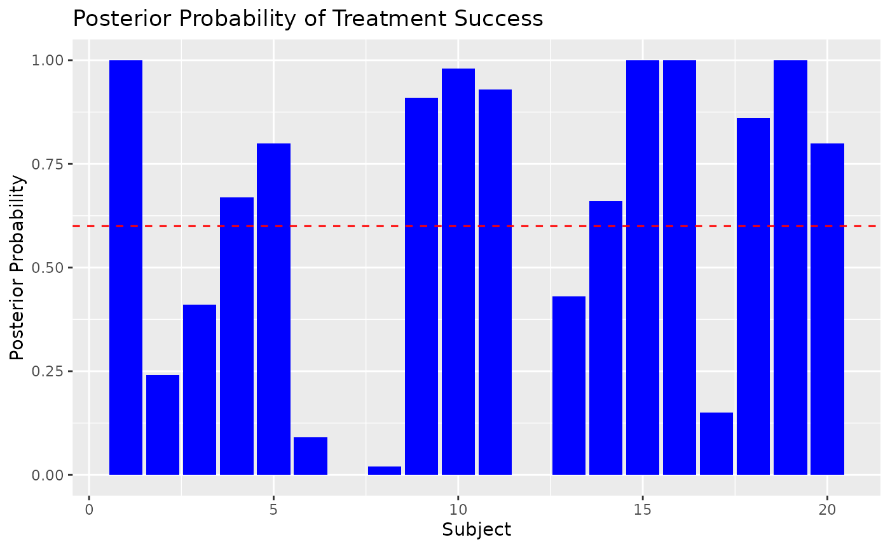
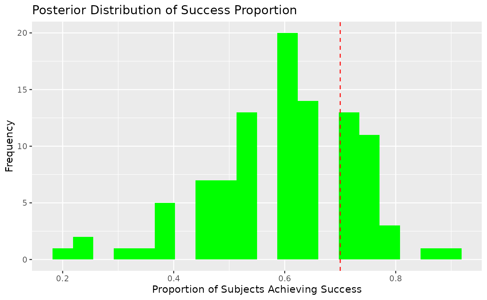

# Using Bayesian Neural Networks in Clinical Trials

``` r

library(bnns)
```

## Introduction

Bayesian Neural Networks (BNNs) offer a robust framework for prediction
in clinical trials by providing posterior distributions of predictions.
This allows for probabilistic reasoning, such as computing the
probability that a treatment achieves a certain efficacy threshold or
proportion of success.

In this vignette, we: 1. Illustrate data preparation for a clinical
trial setting. 2. Fit a BNN to simulate clinical trial outcomes. 3.
Leverage posterior distributions for decision-making, such as
calculating posterior probabilities of treatment success.

------------------------------------------------------------------------

## 1. Data Preparation

Consider a hypothetical clinical trial comparing the efficacy of a new
treatment against a placebo. The response variable is binary,
representing treatment success (1) or failure (0).

### Simulating Data

``` r

set.seed(123)

# Simulate predictor variables (e.g., patient covariates)
n_subjects <- 100
Age <- runif(n_subjects, 18, 50) # Age in years
Dose <- runif(n_subjects, 10, 100) # Dose levels
Severity <- runif(n_subjects, 1, 10) # Baseline severity (arbitrary scale)

# Define true probabilities using a nonlinear function
beta_0 <- 1
beta_1 <- 0.3
beta_2 <- -0.1
beta_3 <- -0.02
beta_4 <- 0.005

logit_p <- beta_0 + beta_1 * Dose + beta_2 * log(Severity) +
  beta_3 * Age^2 + beta_4 * (Age * Dose)
p_success <- 1 / (1 + exp(-logit_p)) # Sigmoid transformation

# Simulate binary outcomes
Success <- rbinom(n_subjects, size = 1, prob = p_success)

trial_data <- cbind.data.frame(Success, Age, Dose, Severity)

# Split into training and testing
train_idx <- sample(seq_len(n_subjects), size = 0.8 * n_subjects)
training_data <- trial_data[train_idx, ]
test_data <- trial_data[-train_idx, ]
```

------------------------------------------------------------------------

## 2. Fitting a Bayesian Neural Network

Fit a BNN to the simulated data. We use a binary classification model
with a logistic sigmoid activation for the output layer.

``` r

# Fit a BNN
model <- bnns(
  formula = Success ~ -1 + .,
  data = training_data,
  L = 2, # Number of hidden layers
  nodes = c(16, 8), # Nodes per layer
  act_fn = c(2, 2), # Activation functions for hidden layers
  out_act_fn = 2, # Output activation: logistic sigmoid
  iter = 2e2, # Bayesian sampling iterations
  warmup = 1e2, # Warmup iterations
  chains = 1 # Number of MCMC chains
)
```

------------------------------------------------------------------------

## 3. Posterior Predictions

### Generating Predictions with Uncertainty

The posterior distribution of predictions allows us to compute not just
point estimates but also probabilistic metrics.

``` r

# Generate posterior predictions for the test set
posterior_preds <- predict(model, subset(test_data, select = -Success))
head(posterior_preds) # Each row corresponds to a subject, and columns are MCMC samples
#>           [,1]      [,2]      [,3]      [,4]      [,5]      [,6]      [,7]
#> [1,] 0.7272909 0.7518644 0.9439193 0.7882232 0.8077181 0.8305749 0.9078663
#> [2,] 0.2965894 0.3969487 0.8315811 0.6616976 0.6212099 0.3262781 0.3235314
#> [3,] 0.4513777 0.5177821 0.6575826 0.5268693 0.4195625 0.6093852 0.5490330
#> [4,] 0.3564331 0.5863357 0.8486905 0.6175256 0.6655929 0.7263383 0.7894195
#> [5,] 0.5758108 0.6484667 0.8358441 0.7075258 0.5369793 0.7247066 0.7270283
#> [6,] 0.2876572 0.4198185 0.4239309 0.3128882 0.2188223 0.4894968 0.4142543
#>           [,8]      [,9]     [,10]     [,11]     [,12]     [,13]     [,14]
#> [1,] 0.7932691 0.8027909 0.8151475 0.9246312 0.8722435 0.8830815 0.7214970
#> [2,] 0.4712627 0.2967126 0.4316004 0.4453170 0.2959571 0.6587787 0.3968408
#> [3,] 0.6907452 0.6218484 0.5561824 0.6102139 0.3689997 0.4394404 0.5271285
#> [4,] 0.4509806 0.6560088 0.4883892 0.8568527 0.6001039 0.8780005 0.5878956
#> [5,] 0.8056864 0.8788389 0.7757274 0.7790980 0.4996764 0.6253292 0.6684007
#> [6,] 0.5300823 0.3560045 0.3642173 0.4849684 0.3074152 0.3512122 0.3866942
#>          [,15]     [,16]     [,17]     [,18]     [,19]     [,20]     [,21]
#> [1,] 0.7712970 0.8106280 0.8509937 0.8259428 0.9184994 0.8963444 0.8346368
#> [2,] 0.5816779 0.7180284 0.5448436 0.5218518 0.4297584 0.4010381 0.6825908
#> [3,] 0.6528866 0.3627227 0.5314594 0.3883158 0.4571591 0.6938885 0.7260388
#> [4,] 0.5413540 0.7311678 0.7038811 0.5258953 0.7454636 0.7251777 0.7564251
#> [5,] 0.8297950 0.6017157 0.6606171 0.5925568 0.6727950 0.8427680 0.7770970
#> [6,] 0.4405018 0.1758860 0.3818106 0.2169358 0.3262186 0.3827620 0.6436388
#>          [,22]     [,23]     [,24]     [,25]     [,26]     [,27]     [,28]
#> [1,] 0.9628796 0.7806419 0.8826876 0.8267825 0.8508257 0.8716777 0.9275934
#> [2,] 0.3176826 0.5045912 0.1629393 0.5588393 0.7017164 0.5096819 0.7155127
#> [3,] 0.5391418 0.3349301 0.6437467 0.5446599 0.7014116 0.4187018 0.6834563
#> [4,] 0.7265741 0.5671023 0.5069043 0.6978801 0.6781062 0.8232682 0.8025926
#> [5,] 0.7749246 0.4536644 0.7364133 0.7055661 0.8324766 0.6318500 0.8093917
#> [6,] 0.2675688 0.2879253 0.5073514 0.3907197 0.4429872 0.4089637 0.5629615
#>          [,29]     [,30]     [,31]     [,32]     [,33]     [,34]     [,35]
#> [1,] 0.8917045 0.9087639 0.7911718 0.9430601 0.8171561 0.9669066 0.8587525
#> [2,] 0.2720072 0.7859031 0.1510712 0.7299232 0.3231595 0.4568673 0.3745140
#> [3,] 0.3719945 0.5971976 0.5380073 0.7333158 0.6414778 0.8846470 0.4066638
#> [4,] 0.5927290 0.7711153 0.6967655 0.7870267 0.5222142 0.8605817 0.4924819
#> [5,] 0.5994564 0.7942606 0.7662874 0.8483973 0.7795734 0.9528963 0.6005948
#> [6,] 0.4299237 0.3439524 0.2917674 0.4519135 0.4556559 0.6225155 0.2378631
#>          [,36]     [,37]     [,38]     [,39]     [,40]     [,41]     [,42]
#> [1,] 0.9205499 0.8494474 0.9556990 0.8440181 0.9439943 0.8068756 0.9142392
#> [2,] 0.6173277 0.6284849 0.5165096 0.4703823 0.7721330 0.4361047 0.5563884
#> [3,] 0.5333539 0.4503479 0.5690495 0.5397336 0.3178759 0.7725911 0.3697208
#> [4,] 0.8006237 0.7030641 0.8711399 0.5402401 0.8787003 0.5948111 0.8636195
#> [5,] 0.8168047 0.6130718 0.7685513 0.7713834 0.4707582 0.8702045 0.5129345
#> [6,] 0.2106123 0.3511744 0.4234125 0.3276744 0.1647991 0.5935424 0.3041272
#>          [,43]     [,44]     [,45]     [,46]     [,47]     [,48]     [,49]
#> [1,] 0.7698978 0.8747073 0.9406976 0.8364228 0.8703764 0.8509803 0.8057028
#> [2,] 0.4724797 0.3733074 0.7244515 0.4060767 0.2251850 0.4724582 0.4628077
#> [3,] 0.5773776 0.3072256 0.7347808 0.2893697 0.5381030 0.4852250 0.4516799
#> [4,] 0.6911076 0.6700926 0.7685203 0.7268936 0.8138802 0.8021757 0.5565249
#> [5,] 0.6875519 0.4902048 0.8587230 0.5912361 0.7118130 0.5419332 0.6363693
#> [6,] 0.4512040 0.2195057 0.4378037 0.1937975 0.4856346 0.4705198 0.4368974
#>          [,50]     [,51]     [,52]     [,53]     [,54]     [,55]     [,56]
#> [1,] 0.9560956 0.7167266 0.8339517 0.9068231 0.8770180 0.9139164 0.9176816
#> [2,] 0.4822297 0.3046221 0.3499424 0.1726735 0.3809838 0.4194880 0.2617261
#> [3,] 0.8067172 0.5722833 0.5704062 0.6016616 0.5485763 0.6498876 0.7940812
#> [4,] 0.7683757 0.5012970 0.5029021 0.7366915 0.7958434 0.5847763 0.7195748
#> [5,] 0.9241746 0.7598559 0.7952495 0.7916911 0.7029452 0.8685002 0.8688948
#> [6,] 0.6227328 0.5111257 0.2440933 0.3287400 0.4630639 0.4094832 0.7697947
#>          [,57]     [,58]     [,59]     [,60]     [,61]     [,62]     [,63]
#> [1,] 0.6693978 0.7338937 0.7614932 0.6766460 0.8286424 0.8840113 0.9420950
#> [2,] 0.3466372 0.2326809 0.4314242 0.6741681 0.4632388 0.5671441 0.7302531
#> [3,] 0.4770888 0.5414504 0.4852346 0.8498874 0.3058609 0.3438583 0.6536898
#> [4,] 0.6022575 0.5223638 0.5412537 0.4890198 0.7560081 0.8412048 0.7288460
#> [5,] 0.5750603 0.6796975 0.6837081 0.9056751 0.4038090 0.5048497 0.7722091
#> [6,] 0.4032652 0.4328412 0.3934210 0.4908881 0.2328653 0.1362354 0.3641308
#>          [,64]     [,65]     [,66]     [,67]     [,68]     [,69]     [,70]
#> [1,] 0.8843731 0.6976094 0.8361938 0.9130486 0.7863411 0.8378342 0.8565784
#> [2,] 0.4655142 0.1979526 0.7117310 0.2886555 0.3434813 0.2632827 0.6422422
#> [3,] 0.3777718 0.4212301 0.6047124 0.4003465 0.3959801 0.5551374 0.8010629
#> [4,] 0.8078271 0.4974996 0.5685637 0.8003595 0.6745509 0.6669674 0.6518987
#> [5,] 0.5845749 0.6160790 0.7082857 0.6474374 0.5867758 0.7086814 0.9105764
#> [6,] 0.2405014 0.3292998 0.4194173 0.2704419 0.3679046 0.4298324 0.5218502
#>          [,71]     [,72]     [,73]     [,74]     [,75]     [,76]     [,77]
#> [1,] 0.8716386 0.9004279 0.8257306 0.8078937 0.9008449 0.8815534 0.8324610
#> [2,] 0.3785538 0.3567638 0.5177755 0.4814035 0.2736434 0.6557555 0.4316318
#> [3,] 0.2991225 0.3585923 0.6354922 0.5355985 0.7628538 0.7306910 0.7863357
#> [4,] 0.7925911 0.6939740 0.6221503 0.6737572 0.3237426 0.5959338 0.6837187
#> [5,] 0.4656002 0.7591786 0.7559344 0.7258711 0.8767900 0.8892024 0.8149894
#> [6,] 0.3327521 0.2519354 0.5136390 0.4036946 0.4649219 0.4458213 0.7599548
#>          [,78]     [,79]     [,80]     [,81]     [,82]     [,83]     [,84]
#> [1,] 0.7965706 0.8957260 0.8267244 0.8382637 0.8169115 0.9483976 0.7802134
#> [2,] 0.3676839 0.4204458 0.6198049 0.3992445 0.5520058 0.3146333 0.5005330
#> [3,] 0.6126379 0.5840098 0.7044663 0.4612143 0.6090250 0.7146206 0.5286444
#> [4,] 0.6080069 0.6164586 0.6666089 0.6408881 0.7351828 0.8116680 0.6337794
#> [5,] 0.7385725 0.8884046 0.7952457 0.6083829 0.6820588 0.8903001 0.6365483
#> [6,] 0.4033584 0.3611067 0.5502679 0.2764728 0.4886187 0.6460070 0.3757077
#>          [,85]     [,86]     [,87]     [,88]     [,89]     [,90]     [,91]
#> [1,] 0.8287619 0.9598766 0.9228394 0.8263373 0.7878821 0.8347286 0.9000602
#> [2,] 0.3054515 0.6105529 0.5035864 0.3474198 0.4101426 0.3825078 0.5296753
#> [3,] 0.5630616 0.8952022 0.7552092 0.6089948 0.4840147 0.4076362 0.5130584
#> [4,] 0.5460318 0.6929947 0.4720572 0.7932409 0.5662900 0.4065314 0.7832115
#> [5,] 0.7275286 0.9481640 0.9040680 0.7842106 0.6011158 0.4826509 0.7308847
#> [6,] 0.4395623 0.6271126 0.4294523 0.5681108 0.4059082 0.3075898 0.3299622
#>          [,92]     [,93]     [,94]     [,95]     [,96]     [,97]     [,98]
#> [1,] 0.7435695 0.7490667 0.8938304 0.8394341 0.8906569 0.8266964 0.7282787
#> [2,] 0.2743341 0.4581355 0.7141708 0.7571635 0.3199092 0.3752678 0.5742660
#> [3,] 0.7769535 0.6669473 0.6699861 0.5839250 0.7900606 0.6359334 0.4052314
#> [4,] 0.5338161 0.2743652 0.7425984 0.6509929 0.6972455 0.6477472 0.5370569
#> [5,] 0.8961311 0.8483303 0.8091957 0.7141352 0.8597291 0.7142949 0.5176839
#> [6,] 0.6026079 0.2864157 0.2468037 0.2151265 0.7868481 0.5372379 0.2946922
#>          [,99]    [,100]
#> [1,] 0.7469261 0.8525105
#> [2,] 0.2823548 0.6450443
#> [3,] 0.7829374 0.3405006
#> [4,] 0.3336379 0.7428094
#> [5,] 0.8850529 0.4659463
#> [6,] 0.3355370 0.2050983
```

Each entry in `posterior_preds` represents the predicted probability of
success from a single posterior sample.

------------------------------------------------------------------------

## 4. Posterior Probability of Treatment Success

### Threshold-Based Decision-Making

Suppose we define treatment success as a predicted probability ≥ 0.6. We
can compute the posterior probability that this threshold is met for
each subject.

``` r

# Compute posterior probabilities of success (p_hat ≥ 0.6)
success_threshold <- 0.6
posterior_probs_success <- rowMeans(posterior_preds >= success_threshold)
head(posterior_probs_success)
#> [1] 1.00 0.24 0.41 0.67 0.80 0.09
```

### Proportion of Subjects Likely to Achieve Success

Next, we calculate the posterior probability that a certain proportion
of subjects in the treatment group achieve success.

``` r

# Define success proportion threshold
prop_success_threshold <- 0.7

# Simulate posterior proportion of success
posterior_success_proportion <- colMeans(posterior_preds >= success_threshold)

# Posterior probability that ≥ 70% of subjects achieve success
posterior_prob_high_success <- mean(posterior_success_proportion >= prop_success_threshold)
posterior_prob_high_success
#> [1] 0.29
```

------------------------------------------------------------------------

## 5. Visualizing Posterior Insights

### Posterior Predictive Distribution

``` r

library(ggplot2)

# Plot posterior probabilities of success for individual subjects
ggplot(data.frame(Subject = seq_len(nrow(test_data)), Prob = posterior_probs_success), aes(x = Subject, y = Prob)) +
  geom_bar(stat = "identity", fill = "blue") +
  geom_hline(yintercept = success_threshold, color = "red", linetype = "dashed") +
  labs(
    title = "Posterior Probability of Treatment Success",
    x = "Subject",
    y = "Posterior Probability"
  )
```



### Distribution of Success Proportion

``` r

# Histogram of posterior success proportions
ggplot(data.frame(SuccessProp = posterior_success_proportion), aes(x = SuccessProp)) +
  geom_histogram(fill = "green", bins = 20) +
  geom_vline(xintercept = prop_success_threshold, color = "red", linetype = "dashed") +
  labs(
    title = "Posterior Distribution of Success Proportion",
    x = "Proportion of Subjects Achieving Success",
    y = "Frequency"
  )
```



------------------------------------------------------------------------

## 6. Clinical Trial Decision-Making

### Bayesian Probability Threshold

The posterior probability can guide decision-making. For example: - If
`posterior_prob_high_success > 0.9`, consider the treatment effective. -
If `posterior_prob_high_success < 0.1`, consider the treatment
ineffective. - Otherwise, collect more data or refine the model.

------------------------------------------------------------------------

## 7. Conclusion

The `bnns` package empowers clinical trial analysts to leverage Bayesian
Neural Networks for predictive modeling and decision-making. By
utilizing posterior distributions, we can: - Quantify uncertainty in
predictions. - Make informed decisions about treatment efficacy. -
Evaluate trial outcomes based on predefined success criteria.

This probabilistic framework is particularly valuable in scenarios where
uncertainty plays a critical role in decision-making, such as
early-phase clinical trials.
