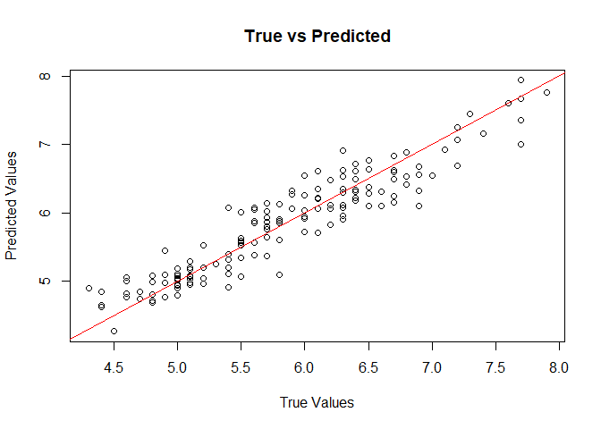

# bnns

The `bnns` package provides tools to fit Bayesian Neural Networks (BNNs)
for regression and classification problems. It is designed to be
flexible, supporting various network architectures, activation
functions, and output types, making it suitable for both simple and
complex data analysis tasks.

## Features

- Support for multi-layer neural networks with customizable
  architecture.
- Choice of activation functions (e.g., sigmoid, ReLU, tanh) and output
  types for regression (continuous) and classification (binary and
  multiclass).
- Choice of prior distributions for weights, biases and sigma (for
  regression).
- Seamless integration with the `tidymodels` ecosystem (`parsnip`,
  `recipes`, `workflows`, `tune`).
- GPU acceleration support via OpenCL for significantly faster model
  training.
- Built-in functions for model evaluation
  ([`loo.bnns()`](https://swarnendu-stat.github.io/bnns/reference/loo.bnns.md),
  [`waic.bnns()`](https://swarnendu-stat.github.io/bnns/reference/waic.bnns.md)),
  plotting
  ([`plot.bnns()`](https://swarnendu-stat.github.io/bnns/reference/plot.bnns.md)),
  and saving/loading
  ([`save_bnns()`](https://swarnendu-stat.github.io/bnns/reference/save_bnns.md),
  [`load_bnns()`](https://swarnendu-stat.github.io/bnns/reference/load_bnns.md)).
- Bayesian inference, providing rigorous uncertainty quantification via
  posterior distributions for predictions and parameters.
- Applications in domains such as clinical trials, predictive modeling,
  and more.

## Why `bnns` instead of `brms`?

While `brms` is an exceptionally powerful tool for general Bayesian
regression and mixed-effects models, `bnns` is purpose-built
specifically for Bayesian Neural Networks (BNNs). Here is why you might
choose `bnns` for these specific tasks:

- **Simplified Architecture Setup:** `bnns` allows you to define
  complex, multi-layer neural networks intuitively using straightforward
  arguments (`L` for number of layers, `nodes` for nodes per layer,
  `act_fn` for activation functions). Implementing a multi-layer
  feed-forward neural network in `brms` requires writing extremely
  complex, custom non-linear formulas.
- **Native `tidymodels` Integration:** `bnns` provides first-class
  support for the `tidymodels` ecosystem (`parsnip`, `recipes`, `tune`,
  `workflows`). This makes it seamless to incorporate Bayesian Neural
  Networks into standard R machine learning pipelines, cross-validation,
  and hyperparameter tuning workflows.
- **Purpose-Built Stan Code:** The underlying Stan code generated by
  `bnns` is tailored explicitly for neural network matrix
  multiplications and feed-forward passes, keeping model compilation and
  execution efficient for deep learning structures.
- **Out-of-the-Box Classification:** Easily handle continuous
  regression, binary classification, and multi-class classification
  natively with built-in output activation functions (`out_act_fn`).

## Installation (stable CRAN version)

To install the `bnns` package from CRAN, use the following:

``` r

install.packages("bnns")
```

## Installation (development version)

To install the `bnns` package from GitHub, use the following:

``` r

# Install devtools if not already installed
if (!requireNamespace("devtools", quietly = TRUE)) {
  install.packages("devtools")
}

# Install bnns
devtools::install_github("swarnendu-stat/bnns")
```

## Getting Started

### 1. Iris Data

We use the `iris` data for regression:

``` r

head(iris)
#>   Sepal.Length Sepal.Width Petal.Length Petal.Width Species
#> 1          5.1         3.5          1.4         0.2  setosa
#> 2          4.9         3.0          1.4         0.2  setosa
#> 3          4.7         3.2          1.3         0.2  setosa
#> 4          4.6         3.1          1.5         0.2  setosa
#> 5          5.0         3.6          1.4         0.2  setosa
#> 6          5.4         3.9          1.7         0.4  setosa
```

### 2. Fit a BNN Model

To fit a Bayesian Neural Network:

``` r

library(bnns)

iris_bnn <- bnns(Sepal.Length ~ -1 + ., data = iris, L = 1, act_fn = "softplus", nodes = 4, out_act_fn = "linear", chains = 1)
```

### 3. Model Summary

Summarize the fitted model:

``` r

summary(iris_bnn)
#> Call:
#> bnns.default(formula = Sepal.Length ~ -1 + ., data = iris, L = 1, 
#>     nodes = 4, act_fn = "softplus", out_act_fn = "linear", chains = 1)
#> 
#> Data Summary:
#> Number of observations: 150 
#> Number of features: 6 
#> 
#> Network Architecture:
#> Number of hidden layers: 1 
#> Nodes per layer: 4 
#> Activation functions: 3 
#> Output activation function: 1 
#> 
#> Posterior Summary (Key Parameters):
#>                mean      se_mean         sd        2.5%         25%        50%
#> w_out[1] -0.5942278 0.2183999192 0.79456857 -1.86701355 -1.09251619 -0.8169628
#> w_out[2]  0.8336814 0.1038869956 0.73827166 -0.51846423  0.33211823  0.7957336
#> w_out[3]  0.4338102 0.2921135070 0.86147575 -1.36143601  0.04394916  0.5954254
#> w_out[4]  0.6850131 0.1360689685 0.76972857 -1.04704293  0.29744188  0.7507712
#> b_out[1]  2.2618133 0.0769776211 1.17876734 -0.02391873  1.42283776  2.2881991
#> sigma     0.3020955 0.0005477896 0.01953213  0.26715455  0.28850768  0.3012247
#>                  75%     97.5%       n_eff      Rhat
#> w_out[1] -0.01503725 1.2874762   13.236032 1.0106679
#> w_out[2]  1.24910581 2.3385023   50.502168 0.9987815
#> w_out[3]  1.00906365 1.8752488    8.697268 1.1745061
#> w_out[4]  1.21289586 1.9468606   32.000519 1.0439056
#> b_out[1]  3.13716320 4.3023801  234.491563 1.0087978
#> sigma     0.31349020 0.3406216 1271.368723 0.9999925
#> 
#> Model Fit Information:
#> Iterations: 1000 
#> Warmup: 200 
#> Thinning: 1 
#> Chains: 1 
#> 
#> Predictive Performance:
#> RMSE (training): 0.2820529 
#> MAE (training): 0.2234438 
#> 
#> Notes:
#> Check convergence diagnostics for parameters with high R-hat values.
```

### 4. Predictions

Make predictions using the trained model:

``` r

pred <- predict(iris_bnn)
```

### 5. Visualization

Visualize true vs predicted values for regression:

``` r

plot(iris$Sepal.Length, rowMeans(pred), main = "True vs Predicted", xlab = "True Values", ylab = "Predicted Values")
abline(0, 1, col = "red")
```



## Applications

### Regression Example (with custom priors)

Use `bnns` for regression analysis to model continuous outcomes, such as
predicting patient biomarkers in clinical trials.

``` r

model <- bnns(Sepal.Length ~ -1 + .,
  data = iris, L = 1, act_fn = "softplus", nodes = 4,
  out_act_fn = "linear", chains = 1,
  prior_weights = list(dist = "uniform", params = list(alpha = -1, beta = 1)),
  prior_bias = list(dist = "cauchy", params = list(mu = 0, sigma = 2.5)),
  prior_sigma = list(dist = "inv_gamma", params = list(alpha = 1, beta = 1))
)
```

### Classification Example

For binary or multiclass classification, set the `out_act_fn` to `2`
(binary) or `3` (multiclass). For example:

``` r

# Simulate binary classification data
df <- data.frame(
  x1 = runif(10), x2 = runif(10),
  y = sample(0:1, 10, replace = TRUE)
)

# Fit a binary classification BNN
model <- bnns(y ~ -1 + x1 + x2,
  data = df, L = 2, nodes = c(16, 8),
  act_fn = c("softplus", "sigmoid"), out_act_fn = "sigmoid", iter = 1e2,
  warmup = 5e1, chains = 1
)
```

### Clinical Trial Applications

Explore posterior probabilities to estimate treatment effects or success
probabilities in clinical trials. For example, calculate the posterior
probability of achieving a clinically meaningful outcome in a given
population.

## Documentation

- Detailed [vignettes](https://swarnendu-stat.github.io/bnns/articles/)
  are available to guide through various applications of the package.
- See
  [`help(bnns)`](https://swarnendu-stat.github.io/bnns/reference/bnns.md)
  for more information about the `bnns` function and its arguments.

## Contributing

Contributions are welcome! Please raise issues or submit pull requests
on [GitHub](https://github.com/swarnendu-stat/bnns).

## License

This package is licensed under the MIT License. See `LICENSE` for
details. tails.
